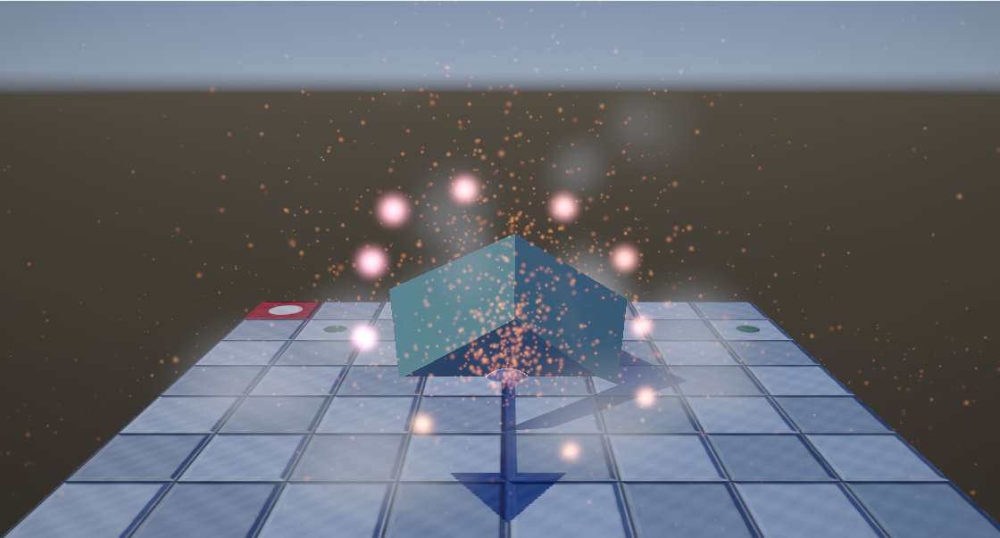
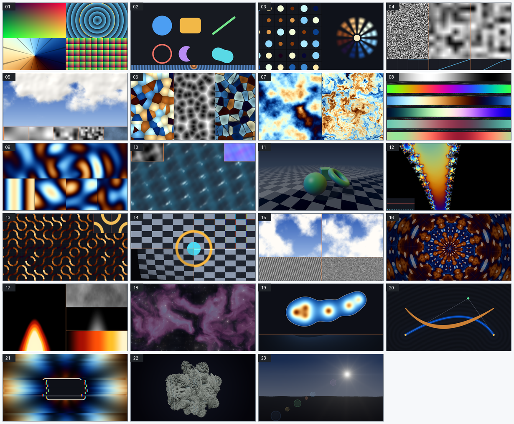

# DirectX 12 Dev — DirectX 12 学習プロジェクト

DirectX 12 を **一歩ずつ積み上げて理解する** ための学習用リポジトリです。
DirectXTK12 や `d3dx12.h` を使わず、**生の DirectX 12 API だけ**で書いています。
ヘルパーが隠してしまう手順そのものが学習の対象だからです。

「動くサンプル」ではなく「**なぜそう書くのかが分かるサンプル**」を目指し、
コードは読みやすさを優先し、仕組みの解説は `docs/tutorial/`（全 29 章）に
まとめています。性能や見た目の主張は、必ず**測ってから**書いています。

現在の到達点：**モデルを読み込み、影・映り込み・凹凸・後処理・VFX を載せて自由に見回せる**



- **形と材質** … `assets/models/scene.glb` から読み込み。材質ごとに描画を区切る
- **陰影** … 物理ベース (PBR)。金属度と粗さの 2 つで表す
- **影** … 光源から見た深度をシャドウマップに記録する 1 パス目を挟む
- **映り込み** … IBL（環境マップ）。背景にも同じ空を描いている
- **凹凸** … 法線マップ。床のタイルは平らな板 2 枚だが、目地がへこんで見える
- **色** … リニア空間で計算し、HDR の中間バッファへ描いてから後処理で圧縮
- **後処理** … 明るい所のにじみ（ブルーム）と周辺減光（ビネット）
- **VFX** … ディゾルブ（`clip` と燃え際）、半透明のビルボード（アルファ合成と加算合成）、
  ソフトパーティクル（深度を読んで交差の線を消す）、
  GPU パーティクル（コンピュートシェーダーで更新し、構造化バッファから描く）

**操作**: 左ドラッグで回転、右ドラッグで平行移動、ホイールで寄り引き、
`W`/`S`/`A`/`D` でも回転、`R` で初期位置へ、`ESC` で終了。
`L` で**シェーダー習作集**（後述）、`F` でディゾルブ、`V` で半透明の入り切り。
`G` で GPU パーティクル、`H` でその個数（1024〜262144）。
`B`（並べ替え）・`N`（ソフトパーティクル）・`P`（動きを止める）・
`T`（垂直同期）は対照実験と速度計測用。

---

## クイックスタート

### VSCode

1. 拡張機能 **C/C++** (`ms-vscode.cpptools`) をインストール
2. このフォルダを開く
3. `F5` を押す（ビルドは自動で行われます）

### Visual Studio 2026

1. `DirectX12Dev.slnx` を開く
2. 構成を **Debug / x64** にする
3. `F5` を押す

詳細・トラブルシューティングは [ビルドと実行方法](docs/misc/setup/ビルドと実行方法.md) を参照してください。

---

## 環境

| 項目 | 内容 |
|------|------|
| OS | Windows 11 |
| IDE | Visual Studio 2026 Community / Visual Studio Code |
| ビルド | MSBuild（`DirectX12Dev.vcxproj`） |
| 言語 | C++20 |
| API | Direct3D 12 / DXGI 1.6 |
| 依存ライブラリ | なし（Windows SDK のみ。外部ライブラリは意図的に不使用） |

> **なぜ外部ライブラリを使わないのか**
> DirectXTK12 や `d3dx12.h` はコードを短くしてくれますが、
> 隠している処理こそが学習で理解すべき対象です。
> そのため本プロジェクトでは生の DirectX 12 API を直接呼んでいます。

---

## ドキュメント

まずは **[解説](docs/tutorial/)** から読んでください。
「起動してから画面に絵が出るまで」を最初から順番に説明しています。

| 区分 | 内容 |
|------|------|
| [解説](docs/tutorial/) | 仕組みの解説。main 関数・ウィンドウ生成から 1 トピック 1 ファイルで |
| [設計](docs/design/) | クラス構成と描画フロー |
| [その他](docs/misc/) | 用語集・ビルド手順・逆引き・規約・参考文献 |

インデックスは [docs/README.md](docs/README.md) です。

---

## プロジェクト構成

```
DirectX12Dev/
├── src/
│   ├── main.cpp                      エントリポイント・メインループ
│   ├── App/Camera.*                  ビュー行列・透視投影（DirectX を知らない）
│   ├── App/CameraController.*        入力を受けてカメラを動かす軌道カメラ
│   ├── App/Input.*                   キーボードとマウスの状態
│   ├── App/Window.*                  Win32 ウィンドウ（DirectX を知らない）
│   ├── Assets/ModelLoader.*          拡張子で振り分けるモデル読み込みの入口
│   ├── Assets/ObjLoader.*            Wavefront OBJ の解析
│   ├── Assets/GltfLoader.*           glTF 2.0（.gltf / .glb）の解析
│   ├── Assets/Json.*                 最小限の JSON パーサ
│   ├── Assets/ImageLoader.*          WIC による画像のデコード
│   ├── Common/ComInitializer.*       COM の初期化と後始末（WIC 用）
│   ├── Graphics/MaterialSet.*        材質ごとの基本色とテクスチャ
│   ├── Common/FrameTimer.*           フレーム時間の計測・FPS 表示
│   ├── Common/GraphicsCommon.*       ComPtr / DX_CHECK / ログ / パス解決
│   └── Graphics/
│       ├── GraphicsDevice.*          デバイス・GPU 選択・デバッグレイヤー
│       ├── CommandQueue.*            コマンドキュー・フェンス（同期）
│       ├── ConstantBuffer.*          定数バッファ（フレーム別・256B アライン）
│       ├── DepthBuffer.*             深度バッファ・DSV
│       ├── DescriptorHeap.*          シェーダー可視ディスクリプタヒープ
│       ├── Texture2D.*               テクスチャ・GPU 転送・SRV
│       ├── UploadHelper.*            DEFAULT ヒープへの転送（共通処理）
│       ├── SwapChain.*               スワップチェーン・RTV
│       ├── Geometry.*               頂点の形式と形状データの生成（DirectX を知らない）
│       ├── Mesh.*                   1 形状ぶんの頂点/インデックスバッファ
│       ├── MeshPipeline.*            ルートシグネチャ・PSO・定数バッファ・テクスチャ
│       ├── ShadowMap.*              光源から見た深度・影用の DSV と SRV
│       └── Renderer.*                上記を束ねて 1 フレーム描く
├── shaders/Mesh.hlsl                 頂点シェーダー・ピクセルシェーダー
├── assets/models/                    サンプルモデル（本リポジトリで作成）
├── assets/textures/                  サンプルテクスチャ（本リポジトリで作成）
├── tools/                            ビルド・撮影・検査のスクリプト
│   ├── build.ps1                     MSBuild 呼び出し
│   ├── check-docs.ps1                資料の検査をまとめて実行
│   ├── AppLauncher.ps1               撮影用にアプリを起動する共通部品
│   ├── capture-shader-lab.ps1        習作の画像を一括で撮り直す
│   ├── capture-gif.ps1               動きのある表現を GIF で撮る
│   └── checks/                       リンク・コントラスト・行幅などの検査
├── docs/                             学習資料（tutorial / design / misc）
└── .vscode/                          VSCode のビルド・デバッグ設定
```

---

## 進捗

- [x] **Step 1**: Win32 ウィンドウ表示
- [x] **Step 2**: DirectX 12 初期化（デバイス・キュー・スワップチェーン）
- [x] **Step 3**: 画面クリア
- [x] **Step 4**: 三角形の描画（頂点バッファ・PSO・シェーダー）
- [x] **Step 5**: フレームバッファリングによる CPU/GPU 並列化 ＋ FPS 計測
- [x] **Step 6**: 定数バッファと座標変換（回転する三角形）
- [x] **Step 7**: 深度バッファ（奥行き判定）
- [x] **Step 8**: テクスチャマッピング（ディスクリプタテーブル・ステージング転送）
- [x] **Step 9**: 頂点バッファを DEFAULT ヒープへ転送（転送処理の共通化）
- [x] **Step 10**: 3D 化（ビュー行列・透視投影・立方体・インデックスバッファ）
- [x] **Step 11**: ライティング（法線・拡散反射・鏡面反射・環境光）
- [x] **Step 12**: 複数のモデルの描画（メッシュの分離・オブジェクト別定数バッファ）
- [x] **Step 13**: 影（シャドウマップ・2 パス描画・PCF）
- [x] **Step 14**: 入力とカメラ操作（マウス・キーボード・軌道カメラ）
- [x] **Step 15**: OBJ モデルの読み込み（テキスト解析・右手系変換・法線生成）
- [x] **Step 16**: glTF 2.0 の読み込み（JSON パーサ・アクセサ・ノード変換・GLB）
- [x] **Step 17**: 画像ファイルの読み込み（WIC・PNG / JPEG・COM 初期化）
- [x] **Step 18**: マテリアル（サブメッシュ・glTF の materials・OBJ の .mtl）
- [x] **Step 19**: 色空間（sRGB とリニア空間・トーンマッピング）
- [x] **Step 20**: PBR（金属度と粗さ・マイクロファセット BRDF）
- [x] **Step 21**: IBL（環境マップ・イラディアンス マップ・ミップ列）
- [x] **Step 22**: 法線マップ（接線空間・TBN・接線の生成）
- [x] **Step 23**: スカイボックス（SV_VertexID・深度テスト・視線の組み立て）
- [x] **Step 24**: ミップマップ（エイリアシング・平均の取り方・異方性フィルタ）
- [x] **Step 25**: ポストプロセス（中間バッファ・HDR・ブルーム・ビネット）
- [x] **Step 26**: ディゾルブ（`clip`・3 次元ノイズ・燃え際・影のパス）
- [x] **Step 27**: 半透明とブレンディング（アルファ・加算・深度書き込み・ビルボード）
- [x] **Step 28**: ソフトパーティクル（TYPELESS 深度・読み取り専用 DSV・深度の線形化）
- [x] **Step 29**: GPU パーティクル（構造化バッファ・コンピュートシェーダー・UAV バリア）
- [x] **Step 30**: GPU の時間を測る（タイムスタンプクエリ・READBACK ヒープ・Resolve）
- [x] **Step 31**: DXC とシェーダーモデル 6（DXIL・HLSL 2021・dxil.dll による署名）

---

## シェーダー習作集

3D モデルの描画とは別に、**シェーダーそのものを学ぶための習作**が 33 本あります。
画面いっぱいの三角形 1 枚に、ピクセルシェーダーだけを差し替えて絵を描きます。

アプリを起動して `L` を押すと切り替わります（`→` `←` で前後、数字キーで直接選択）。



1 本につき 1 ページの解説を [docs/shader-lab/](docs/shader-lab/) に置いています。
「どういう計算でその表現になるのか」を、式とコードと画像で追えるようにしました。

各ステップで「なぜ現在の実装が単純化されているか」「どう改善するか」は
コード内コメントと [描画フロー](docs/design/描画フロー.md) に記載しています。

---

## 検査

`tools/check-render.ps1` は **3D シーンの見た目**が壊れていないかを見ます。
実際に起動して撮り、`tools/reference/scene.png` と比べます。

```powershell
.	ools\check-render.ps1               # 基準と比べる
.	ools\check-render.ps1 -UpdateBaseline   # 意図して変えたとき
```

64 x 36 まで縮めてから比べるので、パーティクルの粒の位置は影響しません。
シェーダーの設定を取り違えて絵が静かに変わるような壊れ方を捕まえます
（[31 章](docs/tutorial/31_DXCとシェーダーモデル6.md)で実際に起きました）。
GPU が要るので CI では動かしません。手元で実行してください。

資料もコードと同じ成果物として扱うため、機械で検査しています。
[GitHub Actions](.github/workflows/ci.yml) が push のたびに、
Debug / Release の両方のビルドとあわせて実行します。

```powershell
.	ools\check-docs.ps1
```

| 検査 | 内容 |
|------|------|
| 図の配色 | Mermaid の `style` に `color:` があるか。SVG の文字色 |
| 相対リンク | Markdown のリンク切れ |
| コントラスト | SVG の文字と背景が 7:1 以上か |
| 行幅 | コメントを含む 1 行が表示幅 96 桁以内か |
| 文字の混入 | キリル文字などが紛れていないか |
| 文字コード | `.ps1` が UTF-8 BOM 付きか |
| Mermaid 構文 | `mermaid.parse` が通るか |

Python 3 が要ります。Mermaid の検証だけ Node.js を使い、
入っていなければ自動で飛ばします（初回のみ
`cd tools\checks\mermaid; npm install`）。

---

## ブランチ運用

git-flow に従います。詳細は [Git 運用ルール](docs/misc/conventions/Git運用ルール.md)。

- `main` … リリース可能な状態
- `develop` … 開発の統合先
- `feature/*` … 機能単位の作業ブランチ（**マージ後に必ず削除**）

---

## ライセンス

[MIT License](LICENSE)。

同梱のモデルとテクスチャも**すべて本リポジトリで生成したもの**で、
外部から取り込んだ素材は含まれていません
（[assets/models/](assets/models/) と [assets/textures/](assets/textures/) の
それぞれの README を参照）。
