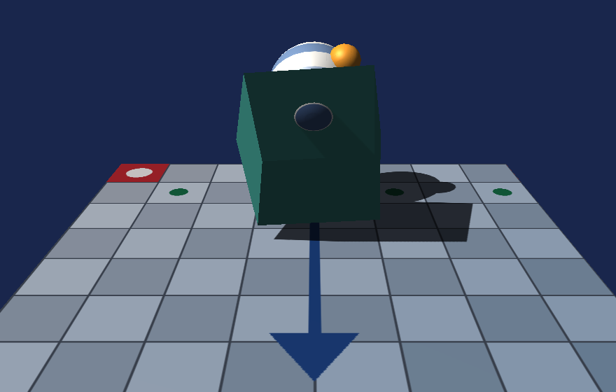

# DirectX 12 Dev — DirectX 12 学習プロジェクト

DirectX 12 を **初期化から画面表示まで一歩ずつ理解する** ための学習用リポジトリです。
「動くサンプル」ではなく「**なぜそう書くのかが分かるサンプル**」を目指し、
コードは読みやすさを優先し、仕組みの解説は `docs/tutorial/` にまとめています。

現在の到達点：**モデルの形・色・テクスチャをファイルから読み込み、陰影と影付きで自由に見回せる**



カメラ（ビュー行列）と透視投影で 3D にしたうえで、平行光源による
拡散反射・鏡面反射・環境光を計算しています。
さらに、光源から見た深度をシャドウマップに記録する 1 パス目を挟むことで、
モデルが床に影を落としています。
画面に出ている形・色・テクスチャは、すべて `assets/models/scene.glb` に
書かれたものです。材質ごとに描画を区切り、基本色とテクスチャを差し替えています。
球に貼られている縞模様は、GLB ファイルの中に埋め込まれた PNG です。

**操作**: 左ドラッグで回転、右ドラッグで平行移動、ホイールで寄り引き、
`W`/`S`/`A`/`D` でも回転、`R` で初期位置へ、`ESC` で終了。

---

## クイックスタート

### VSCode

1. 拡張機能 **C/C++** (`ms-vscode.cpptools`) をインストール
2. このフォルダを開く
3. `F5` を押す（ビルドは自動で行われます）

### Visual Studio 2026

1. `DirectX12Dev.slnx` を開く
2. 構成を **Debug / x64** にする
3. `F5` を押す

詳細・トラブルシューティングは [ビルドと実行方法](docs/misc/setup/ビルドと実行方法.md) を参照してください。

---

## 環境

| 項目 | 内容 |
|------|------|
| OS | Windows 11 |
| IDE | Visual Studio 2026 Community / Visual Studio Code |
| ビルド | MSBuild（`DirectX12Dev.vcxproj`） |
| 言語 | C++20 |
| API | Direct3D 12 / DXGI 1.6 |
| 依存ライブラリ | なし（Windows SDK のみ。外部ライブラリは意図的に不使用） |

> **なぜ外部ライブラリを使わないのか**
> DirectXTK12 や `d3dx12.h` はコードを短くしてくれますが、
> 隠している処理こそが学習で理解すべき対象です。
> そのため本プロジェクトでは生の DirectX 12 API を直接呼んでいます。

---

## ドキュメント

まずは **[解説](docs/tutorial/)** から読んでください。
「起動してから画面に絵が出るまで」を最初から順番に説明しています。

| 区分 | 内容 |
|------|------|
| [解説](docs/tutorial/) | 仕組みの解説。main 関数・ウィンドウ生成から 1 トピック 1 ファイルで |
| [設計](docs/design/) | クラス構成と描画フロー |
| [その他](docs/misc/) | 用語集・ビルド手順・逆引き・規約・参考文献 |

インデックスは [docs/README.md](docs/README.md) です。

---

## プロジェクト構成

```
DirectX12Dev/
├── src/
│   ├── main.cpp                      エントリポイント・メインループ
│   ├── App/Camera.*                  ビュー行列・透視投影（DirectX を知らない）
│   ├── App/CameraController.*        入力を受けてカメラを動かす軌道カメラ
│   ├── App/Input.*                   キーボードとマウスの状態
│   ├── App/Window.*                  Win32 ウィンドウ（DirectX を知らない）
│   ├── Assets/ModelLoader.*          拡張子で振り分けるモデル読み込みの入口
│   ├── Assets/ObjLoader.*            Wavefront OBJ の解析
│   ├── Assets/GltfLoader.*           glTF 2.0（.gltf / .glb）の解析
│   ├── Assets/Json.*                 最小限の JSON パーサ
│   ├── Assets/ImageLoader.*          WIC による画像のデコード
│   ├── Common/ComInitializer.*       COM の初期化と後始末（WIC 用）
│   ├── Graphics/MaterialSet.*        材質ごとの基本色とテクスチャ
│   ├── Common/FrameTimer.*           フレーム時間の計測・FPS 表示
│   ├── Common/GraphicsCommon.*       ComPtr / DX_CHECK / ログ / パス解決
│   └── Graphics/
│       ├── GraphicsDevice.*          デバイス・GPU 選択・デバッグレイヤー
│       ├── CommandQueue.*            コマンドキュー・フェンス（同期）
│       ├── ConstantBuffer.*          定数バッファ（フレーム別・256B アライン）
│       ├── DepthBuffer.*             深度バッファ・DSV
│       ├── DescriptorHeap.*          シェーダー可視ディスクリプタヒープ
│       ├── Texture2D.*               テクスチャ・GPU 転送・SRV
│       ├── UploadHelper.*            DEFAULT ヒープへの転送（共通処理）
│       ├── SwapChain.*               スワップチェーン・RTV
│       ├── Geometry.*               頂点の形式と形状データの生成（DirectX を知らない）
│       ├── Mesh.*                   1 形状ぶんの頂点/インデックスバッファ
│       ├── MeshPipeline.*            ルートシグネチャ・PSO・定数バッファ・テクスチャ
│       ├── ShadowMap.*              光源から見た深度・影用の DSV と SRV
│       └── Renderer.*                上記を束ねて 1 フレーム描く
├── shaders/Mesh.hlsl                 頂点シェーダー・ピクセルシェーダー
├── assets/models/                    サンプルモデル（本リポジトリで作成）
├── assets/textures/                  サンプルテクスチャ（本リポジトリで作成）
├── tools/build.ps1                   MSBuild 呼び出しスクリプト
├── docs/                             学習資料（tutorial / design / misc）
└── .vscode/                          VSCode のビルド・デバッグ設定
```

---

## 進捗

- [x] **Step 1**: Win32 ウィンドウ表示
- [x] **Step 2**: DirectX 12 初期化（デバイス・キュー・スワップチェーン）
- [x] **Step 3**: 画面クリア
- [x] **Step 4**: 三角形の描画（頂点バッファ・PSO・シェーダー）
- [x] **Step 5**: フレームバッファリングによる CPU/GPU 並列化 ＋ FPS 計測
- [x] **Step 6**: 定数バッファと座標変換（回転する三角形）
- [x] **Step 7**: 深度バッファ（奥行き判定）
- [x] **Step 8**: テクスチャマッピング（ディスクリプタテーブル・ステージング転送）
- [x] **Step 9**: 頂点バッファを DEFAULT ヒープへ転送（転送処理の共通化）
- [x] **Step 10**: 3D 化（ビュー行列・透視投影・立方体・インデックスバッファ）
- [x] **Step 11**: ライティング（法線・拡散反射・鏡面反射・環境光）
- [x] **Step 12**: 複数のモデルの描画（メッシュの分離・オブジェクト別定数バッファ）
- [x] **Step 13**: 影（シャドウマップ・2 パス描画・PCF）
- [x] **Step 14**: 入力とカメラ操作（マウス・キーボード・軌道カメラ）
- [x] **Step 15**: OBJ モデルの読み込み（テキスト解析・右手系変換・法線生成）
- [x] **Step 16**: glTF 2.0 の読み込み（JSON パーサ・アクセサ・ノード変換・GLB）
- [x] **Step 17**: 画像ファイルの読み込み（WIC・PNG / JPEG・COM 初期化）
- [x] **Step 18**: マテリアル（サブメッシュ・glTF の materials・OBJ の .mtl）

各ステップで「なぜ現在の実装が単純化されているか」「どう改善するか」は
コード内コメントと [描画フロー](docs/design/描画フロー.md) に記載しています。

---

## ブランチ運用

git-flow に従います。詳細は [Git 運用ルール](docs/misc/conventions/Git運用ルール.md)。

- `main` … リリース可能な状態
- `develop` … 開発の統合先
- `feature/*` … 機能単位の作業ブランチ（**マージ後に必ず削除**）
