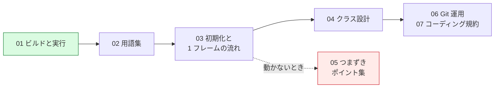

# 学習資料インデックス

DirectX 12 を理解するための資料をまとめています。
番号順に読むことを想定していますが、詰まったときに必要な章だけ開いても構いません。

## フォルダ構成

```
docs/
├── setup/           環境構築と実行手順
├── concepts/        DirectX 12 そのものの概念
├── architecture/    本プロジェクトの設計
├── troubleshooting/ 症状別の原因逆引き
├── conventions/     開発ルール
└── assets/          図（SVG）
```

## 資料一覧

| # | ドキュメント | 内容 |
|---|-------------|------|
| 01 | [ビルドと実行方法](setup/01_ビルドと実行方法.md) | VSCode / Visual Studio 2026 それぞれでの実行手順、トラブルシューティング |
| 02 | [DirectX 12 の用語集](concepts/02_DirectX12の用語集.md) | デバイス、コマンドリスト、ディスクリプタ、深度バッファなど中核概念 |
| 03 | [初期化と1フレームの流れ](architecture/03_初期化と1フレームの流れ.md) | 起動から描画までの処理順序と、なぜその順序なのか |
| 04 | [クラス設計](architecture/04_クラス設計.md) | クラス構成と責務分担、設計判断の理由 |
| 05 | [つまずきポイント集](troubleshooting/05_つまずきポイント集.md) | 「三角形が出ない」等の症状別・原因逆引き表 |
| 06 | [Git 運用ルール](conventions/06_Git運用ルール.md) | git-flow ブランチ運用とコミットメッセージ規約 |
| 07 | [コーディング規約](conventions/07_コーディング規約.md) | Doxygen コメントの書き方、命名規則、文字コード |

## 読む順番の目安



---

## この学習プロジェクトの方針

### 1. 「動くコード」より「分かるコード」

最短でコードを短くすることより、処理の意味が追えることを優先しています。
そのため、ライブラリ（DirectXTK12、d3dx12.h など）を意図的に使わず、
生の DirectX 12 API を直接呼んでいます。
ヘルパーが隠している処理こそ、学習で理解すべき対象だからです。

### 2. 段階的に高度化する

第 1 段階では、あえて非効率でも単純な実装を選んでいます。

| 項目 | 現在の実装 | 今後の改善 |
|------|-----------|-----------|
| GPU 同期 | フレームバッファリング（Step 5 で改善済み） | バッファ 3 枚化 |
| 頂点バッファ | UPLOAD ヒープに直接配置 | DEFAULT ヒープへ転送 |
| 定数バッファの渡し方 | ルートディスクリプタ (CBV) | ディスクリプタテーブル |
| 座標変換 | Z 軸回転＋アスペクト比補正のみ | ビュー行列・透視投影 |
| シェーダー | 実行時コンパイル（FXC） | 事前コンパイル / DXC |
| 深度バッファ | あり（Step 7 で追加） | MSAA との併用 |

「なぜ非効率なのか」「どう直すのか」もコメントと資料に書いてあるので、
先に単純版で全体像をつかんでから改善に進めます。

### 3. 最適化は「測ってから」判断する

Step 5 のフレームバッファリングは、**この段階では速くなりませんでした**。
三角形 1 枚では GPU の仕事が軽すぎて、待ち時間がそもそも存在しないためです。

その計測結果もそのまま
[03 章](architecture/03_初期化と1フレームの流れ.md#実測結果この段階では速くなりません)
に記載しています。「効くはずだ」で終わらせず、
**測って確かめる習慣**そのものを学習対象としています。

### 4. コメントは資料の一部

ソースコードのコメントは、この `docs/` と同じ密度で書かれています。
資料とコードを行き来しながら読むことを想定しています。

### 5. 図は SVG か Mermaid で描く

図はアスキーアートではなく、
[assets/](assets/) の SVG か、Markdown 内の Mermaid で記述します。

| 用途 | 使うもの |
|------|---------|
| 処理の流れ・依存関係・状態遷移 | Mermaid（`flowchart` / `sequenceDiagram` / `gitGraph`） |
| メモリ配置・座標系・タイムラインなど、位置関係が意味を持つ図 | SVG |
| ディレクトリ構成・コンソール出力 | コードブロック（そのままで読めるため） |

Mermaid は GitHub と VSCode のプレビューがそのまま描画します。
SVG はテキストなので差分が追え、拡大しても劣化しません。
