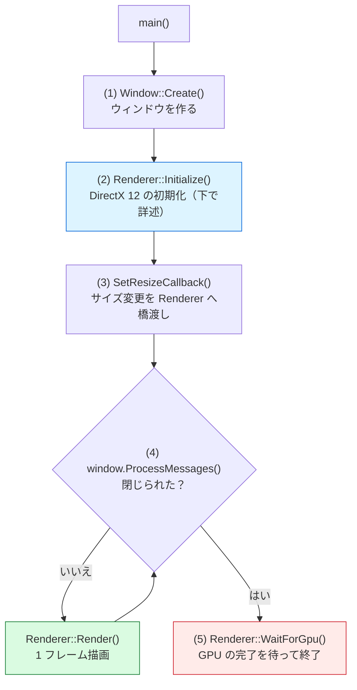
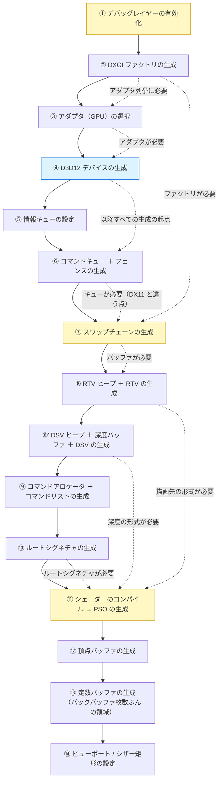
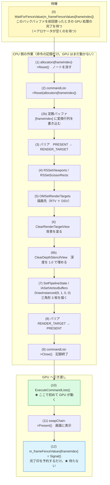
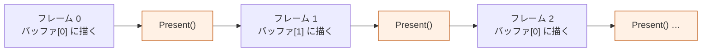

# 03. 初期化と 1 フレームの流れ

このプロジェクトが起動してから三角形が表示されるまで、何がどの順番で起きているかを追います。

---

## 1. 全体像



---

## 2. 初期化の順序（Renderer::Initialize）

**この順序には必然性があります。** 依存関係を矢印で示します。

実線は「作る順番」、破線は「何を必要としているか（依存）」を表します。



> 黄色は **順序を間違えやすい箇所**、青は **すべての起点となるデバイス**です。

### 順序を間違えるとどうなるか

| 誤り | 結果 |
|------|------|
| デバッグレイヤーをデバイスの後に有効化 | 検証が一切効かない（エラーが出ないので気付きにくい） |
| スワップチェーン生成にデバイスを渡す | コンパイルは通らない（引数の型が違う） |
| PSO の RTVFormat とバックバッファの形式が不一致 | PSO 生成が失敗する |
| コマンドリストを Close せずに Reset | 最初のフレームでエラー |

---

## 3. コード上の対応

| 段階 | 実装場所 |
|------|---------|
| ①〜⑤ | [`GraphicsDevice::Initialize`](../../src/Graphics/GraphicsDevice.cpp) |
| ⑥ | [`CommandQueue::Initialize`](../../src/Graphics/CommandQueue.cpp) |
| ⑦⑧ | [`SwapChain::Initialize`](../../src/Graphics/SwapChain.cpp) |
| ⑧' | [`DepthBuffer::Initialize`](../../src/Graphics/DepthBuffer.cpp) |
| ⑨ | [`Renderer::CreateCommandObjects`](../../src/Graphics/Renderer.cpp) |
| ⑩〜⑬ | [`TrianglePipeline::Initialize`](../../src/Graphics/TrianglePipeline.cpp) |
| ⑭ | [`Renderer::UpdateViewportAndScissor`](../../src/Graphics/Renderer.cpp) |

> ⑨ではコマンドアロケータを **バックバッファの枚数ぶん** 作ります。
> 理由は [6 章](#6-同期方式フレームバッファリング) を参照してください。

---

## 4. 1 フレームの流れ（Renderer::Render）



### ポイント 1: (1)〜(9) の間、GPU は何もしていない

`DrawInstanced` を呼んだ時点では、GPU は 1 ミリも動きません。
これが DirectX 11 との最大の感覚の違いです。

### ポイント 2: 毎フレーム設定し直す必要があるもの

コマンドリストは `Reset` するたびに **設定が全て初期状態に戻ります**。
「初期化時に一度設定すれば OK」ではありません。

- ビューポート / シザー矩形
- レンダーターゲット
- パイプラインステート
- ルートシグネチャ
- 頂点バッファ
- プリミティブトポロジ

### ポイント 3: 定数バッファを書き換えてよいタイミング

(2b) で定数バッファに書き込めるのは、**(0) でそのフレームのフェンスを待った後だから**です。

```
(0) WaitForFenceValue(m_frameFenceValues[frameIndex])
       ↓  GPU はもう frameIndex 番の領域を読み終えている
(2b) 定数バッファ[frameIndex] に書き込む   ← 安全
```

待たずに書き換えると、GPU が描画中に値が変わって絵が壊れます。
コマンドアロケータとまったく同じ理屈です。
**「フレームごとに分ける」対象は、アロケータだけではない**という点が重要です。

### ポイント 4: 深度バッファのクリアを忘れない

色のクリアと同じくらい重要です。忘れると前フレームの深度が残り、
2 フレーム目以降で「何も描かれない」「ちらつく」といった症状になります。

```cpp
m_commandList->ClearDepthStencilView(dsvHandle, D3D12_CLEAR_FLAG_DEPTH,
                                     DepthBuffer::kClearDepth, 0, 0, nullptr);
```

一番奥の値 (1.0) で埋めることで、これから描くものが必ず
「記録済みより手前」と判定されて描画されます。

### ポイント 5: 深度バッファにリソースバリアが要らない理由

深度バッファは常に `D3D12_RESOURCE_STATE_DEPTH_WRITE` のまま使い続けるため、
状態遷移が発生せず、バリアが不要です。
バックバッファが毎フレーム `PRESENT ⇄ RENDER_TARGET` を往復するのとは対照的です。

（深度を後からテクスチャとして読みたくなったときだけ、
`DEPTH_READ` / `PIXEL_SHADER_RESOURCE` への遷移が必要になります）

### ポイント 6: 深度バッファは 1 枚でよい

バックバッファは 2 枚、コマンドアロケータも 2 個、定数バッファも 2 面ですが、
**深度バッファだけは 1 枚**です。

理由は、深度バッファがフレームをまたいで内容を持ち越さない
（毎フレーム先頭でクリアする）ためです。
コマンドキューは 1 本なので、フレーム N の深度書き込みが完了してから
フレーム N+1 のクリアが実行されます。競合は起きません。

### ポイント 7: バリアは必ず往復させる

```
描く前 : PRESENT       → RENDER_TARGET
描いた後: RENDER_TARGET → PRESENT
```

戻し忘れると、次の `Present` でデバッグレイヤーがエラーを出します。

---

## 5. なぜ 2 枚のバックバッファを交互に使うのか




`SwapChain::CurrentBackBufferIndex()` は毎フレーム変わります。
自分で `(index + 1) % 2` と計算せず、必ず
`swapChain->GetCurrentBackBufferIndex()` に問い合わせてください
（DXGI 側の都合で番号の進み方が変わる場合があります）。

---

## 6. 同期方式：フレームバッファリング


### 出発点（Step 4 まで）の単純な方式

毎フレーム末尾で `Flush()`（GPU の全作業の完了待ち）をしていました。
確実に動きますが、**CPU と GPU が並列に動けません**。

なぜそうしていたかというと、

- コマンドアロケータの `Reset` は「GPU の実行完了後」でなければならない
- 最も単純にこの条件を満たす方法が「毎フレーム全部待つ」だから

です。まず全体像を掴むための単純化でした。

### 現在の方式（Step 5 以降）

上の図の下段が現在の方式です。変更したのは 3 点です。

1. **コマンドアロケータをバックバッファの枚数ぶん用意する**
   ```cpp
   std::array<ComPtr<ID3D12CommandAllocator>, SwapChain::kBackBufferCount> m_commandAllocators;
   ```
   フレーム N ではアロケータ `[N % 2]` を使う。
   GPU がまだ `[0]` を実行中でも、CPU は `[1]` に記録できる。

2. **フレームごとのフェンス値を記録する**
   ```cpp
   std::array<uint64_t, SwapChain::kBackBufferCount> m_frameFenceValues = {};
   ```

3. **「全完了」ではなく「そのアロケータに関係する完了」だけを待つ**
   ```cpp
   // フレーム先頭：これから使うアロケータが空くのを待つ
   const uint32_t frameIndex = m_swapChain.CurrentBackBufferIndex();
   m_commandQueue.WaitForFenceValue(m_frameFenceValues[frameIndex]);

   // ... 記録・実行・Present ...

   // フレーム末尾：完了印を「予約」するだけで待たない
   m_frameFenceValues[frameIndex] = m_commandQueue.Signal();
   ```

**ポイント:** `frameIndex` は `Present()` の前に取得します。
`Present()` を呼ぶとバックバッファ番号が変わるため、
後で取ると「使ったのとは別の欄」にフェンス値を書き込んでしまいます。

**もうひとつ:** `WaitForGpu()` では `m_frameFenceValues` を
全て最新の完了値で埋めます。古い値が残っていると、
リサイズ後などに不要な待機が入る可能性があるためです。

> 該当コード: [`Renderer::Render`](../../src/Graphics/Renderer.cpp)

### 実測結果：この段階では速くなりません

Step 5 の実装前後で FPS を計測した結果です（VSync を切って上限を外して計測）。

| 実装 | 平均フレーム時間 | FPS |
|------|----------------|-----|
| 改善前（毎フレーム全体待ち） | 約 0.26〜0.29 ms | 約 3,500〜4,000 |
| 改善後（フレームバッファリング） | 約 0.27〜0.34 ms | 約 3,000〜3,700 |

**差がありません。むしろ誤差の範囲で改善前の方が僅かに速いことすらあります。**

これは実装の失敗ではなく、当然の結果です。理由は次の通りです。

- 描いているのは **三角形 1 枚とクリアだけ**。GPU の仕事は数マイクロ秒で終わる
- つまり `Flush()` で待っても、**待ち時間がそもそも存在しない**
- 一方、フレームバッファリングには
  フェンス値の記録・比較というわずかな追加処理がある

**では何のためにやったのか:**

フレームバッファリングが効くのは、CPU 側の記録処理と GPU 側の描画処理が
**どちらも十分に重いとき**です。

```
GPU の仕事が重い場合（例: 大量のモデルとシェーダー）

  改善前: CPU [記録 2ms] ......待機 12ms...... → 14 ms/frame
  改善後: CPU [記録 2ms][記録 2ms][記録 2ms]... → GPU の 12ms に隠れる
```

現時点で導入しておく理由は 2 つあります。

1. **後から入れ替えるのが難しい構造だから**
   アロケータの数とフェンスの持ち方は描画ループの土台です。
   モデルやテクスチャを増やしてから直すより、今のうちに正しい形にしておく方が安全です。

2. **「効果が出ない実験」も学習の成果だから**
   最適化は「効くはずだ」ではなく「測って確かめる」ものです。
   このプロジェクトでは Step 7（深度バッファ）や Step 8（テクスチャ）で
   GPU の負荷が上がったときに、同じ計測をやり直して差を確認できます。

計測に使った FPS 表示は [`FrameTimer`](../../src/Common/FrameTimer.h) が出力しています。
VSync を切って上限を外すには、[`Renderer.cpp`](../../src/Graphics/Renderer.cpp) の
`kEnableVSync` を `false` にしてください。

### 次の改善候補：3 枚バッファ + 待機の緩和

さらに CPU を先行させたい場合は `kBackBufferCount` を 3 にします。
CPU が 2 フレーム先行できるようになり、フレーム時間のばらつきを吸収しやすくなります。
代わりに表示遅延（入力してから画面に反映されるまで）が 1 フレーム分増えます。
**性能と遅延はトレードオフ**であることを意識してください。

---

## 7. 終了処理でやるべきこと

```cpp
renderer.WaitForGpu();   // ★ 必須
```

GPU がまだ使用中のリソースを解放すると、

- 終了時のクラッシュ
- デバッグレイヤーの「解放されていないリソースがある」警告

が発生します。

同様に、**スワップチェーンのリサイズ前にも必ず待つ**必要があります。
`Renderer::Resize` の先頭で `WaitForGpu()` を呼んでいるのはこのためです。
