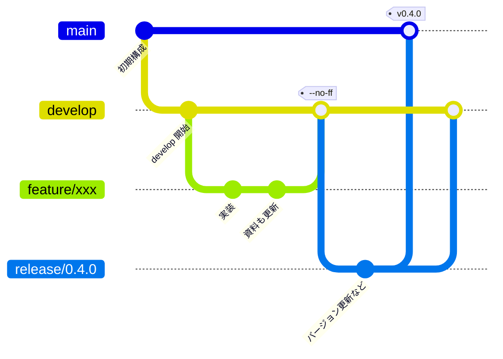
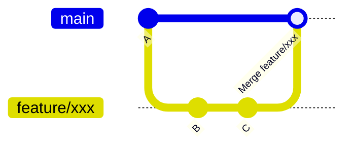
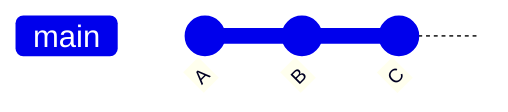

# 06. Git 運用ルール

本プロジェクトは **git-flow** に従って運用します。

リポジトリ: https://github.com/Tomonorarari-Think/DirectX12Dev

---

## 1. ブランチ構成

| ブランチ | 役割 | 直接コミット |
|---------|------|-------------|
| `main` | リリース可能な状態のみ | ✗ 禁止 |
| `develop` | 開発の統合先 | ✗ 原則禁止 |
| `feature/*` | 機能単位の作業 | ○ |
| `release/*` | リリース準備 | ○ |
| `hotfix/*` | `main` の緊急修正 | ○ |



> `feature/xxx` と `release/0.4.0` は、マージが済んだら**必ず削除**します。
> 残しておくと履歴が読めなくなるためです。
>
> なお `release/*` は本来「バージョン番号の更新や最終調整のコミットを載せる場」です。
> 本プロジェクトではまだ載せるものが無いため、実際はコミットを作らずに
> `main` へマージしています。

---

## 2. 基本の作業フロー

### 2-1. 作業開始

```powershell
git checkout develop
git pull origin develop
git checkout -b feature/機能名
```

ブランチ名は英小文字とハイフンで、何をするかが分かるように付けます。

```
feature/dx12-triangle      ← 良い
feature/depth-buffer       ← 良い
feature/texture-mapping    ← 良い
feature/fix                ← 悪い（何の修正か不明）
```

### 2-2. 作業とコミット

```powershell
git add -A
git commit -m "feat: 深度バッファを追加"
```

### 2-3. 完了したらマージしてブランチを削除

```powershell
git checkout develop
git merge --no-ff feature/機能名
git push origin develop

# ローカルとリモートの両方から削除する
git branch -d feature/機能名
git push origin --delete feature/機能名
```

**`--no-ff` を付ける理由:**
Fast-Forward マージだと「どこからどこまでが 1 つの機能だったか」が
履歴から消えてしまいます。`--no-ff` はマージコミットを必ず作るため、
機能の単位が履歴に残ります。

**`--no-ff` あり**（マージコミットが残り、機能の範囲が分かる）



**`--no-ff` なし**（Fast-Forward。どこからどこまでが 1 機能か消える）



---

## 3. コミットメッセージ規約

**Conventional Commits** 形式に従います。

```
<type>: <概要>

<本文（任意・なぜそうしたかを書く）>
```

### type の一覧

| type | 用途 | 例 |
|------|------|-----|
| `feat` | 機能追加 | `feat: 深度バッファを追加` |
| `fix` | バグ修正 | `fix: リサイズ時のクラッシュを修正` |
| `refactor` | 動作を変えない改善 | `refactor: Renderer から同期処理を分離` |
| `docs` | ドキュメント | `docs: 用語集に PSO の説明を追加` |
| `test` | テスト | `test: フェンスの単体テストを追加` |
| `chore` | 雑務（設定、ビルド） | `chore: .gitignore に build/ を追加` |
| `perf` | 性能改善 | `perf: フレームバッファリングを導入` |
| `ci` | CI 設定 | `ci: GitHub Actions でビルド検証` |

### 良いコミットメッセージ

```
perf: フレームバッファリングを導入

毎フレーム GPU の完了を待っていたため、CPU と GPU が交互にしか
動作していなかった。コマンドアロケータをバックバッファ枚数ぶん
用意し、フレームごとのフェンス値を記録することで、CPU が
1 フレーム先行して記録できるようにした。
```

**概要行で「何を」、本文で「なぜ」を書く**のがコツです。
「どうやって」はコードを読めば分かるので、書く必要はありません。

---

## 4. 学習プロジェクトとしての運用指針

このリポジトリは学習ログを兼ねています。以下を心がけます。

### 1 機能 = 1 ブランチ = 1 マージ

「三角形を描く」「深度バッファを足す」「テクスチャを貼る」を
それぞれ独立したブランチで行うと、後から
**「この機能を足すのに何が必要だったか」** を差分で振り返れます。

```powershell
# 特定の機能で何が変わったかを見る
git log --oneline --graph
git show <マージコミットのハッシュ>
```

### 作業後は必ずブランチを削除する

削除しないとブランチが溜まり、履歴が読めなくなります。

```powershell
# マージ済みのローカルブランチを確認
git branch --merged develop

# リモートで消えたブランチの参照を掃除
git fetch --prune
```

### ドキュメントも同じブランチでコミットする

コードと資料を別ブランチにすると、後から対応が取れなくなります。
`feat` のコミットに資料の更新も含めてください。

---

## 5. 公開についての注意

現在このリポジトリは **private** ですが、**public 公開を前提**に運用しています。
そのため以下を守ります。

- ✗ 個人情報、絶対パスに含まれるユーザー名などを新たに書き加えない
- ✗ API キーやトークンをコミットしない（本プロジェクトでは使用していません）
- ○ README とドキュメントは第三者が読んで理解できる粒度で書く
- ○ コミットメッセージは日本語で構わないが、意味の分かる内容にする

Public に切り替える手順:

```
GitHub リポジトリ → Settings → General → 一番下の Danger Zone
  → Change repository visibility → Make public
```

---

## 6. よく使うコマンド

```powershell
# 現在の状態
git status
git log --oneline --graph --all --decorate

# 直前のコミットメッセージを修正（push 前のみ）
git commit --amend -m "新しいメッセージ"

# 変更を一時退避して別ブランチへ
git stash
git checkout develop
git stash pop

# 特定ファイルの変更を取り消す
git restore <ファイル>

# ステージを取り消す（変更は残す）
git restore --staged <ファイル>
```

### push 済みのコミットは書き換えない

`git commit --amend` や `git rebase` は履歴を書き換えます。
**push 前のみ**使ってください。push 後に行うと、
他の環境と履歴が食い違い、`--force` push が必要になります。
