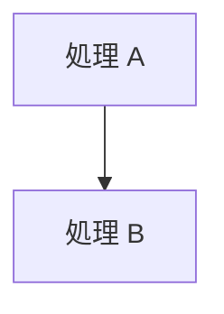

# 07. コーディング規約

本プロジェクトのコードを書くときのルールです。
**学習資料としての読みやすさ**を最優先に決めています。

---

## 1. コメントは Doxygen 形式で書く

### 基本形

宣言（クラス・関数・変数・型エイリアス）には `///` で始まる
**Doxygen 形式**のドキュメントコメントを付けます。

```cpp
/// @brief 指定した番号まで GPU が到達するのを CPU 側で待ちます。
/// @param fenceValue Signal が返した番号。
/// @exception HrException 完了通知の予約に失敗した場合。
///
/// すでに到達済みなら即座に戻ります（無駄な待ちは発生しません）。
void WaitForFenceValue(uint64_t fenceValue);
```

### なぜ XML 形式ではなく Doxygen 形式なのか

**VSCode が XML ドキュメントコメントに対応していないためです。**

当初は `/// <summary>` で始まる XML ドキュメントコメント（Visual Studio 形式）を
使っていましたが、VSCode のツールチップで次のように崩れて表示されました。

```
summary> Win32 のウィンドウを 1 枚作り… summary> remarks> para> b>このクラスの責務</b>
list type="bullet"> item>ウィンドウクラスの登録と…
```

C/C++ 拡張（`ms-vscode.cpptools`）の設定を確認したところ、
コードドキュメント関連の設定は `C_Cpp.doxygen.*` の 4 項目のみで、
対応するタグも Doxygen のもの（`param` / `returns` / `exception` / `tparam` /
`note` / `warning` など）だけでした。
**XML ドキュメントコメントを解釈する機能も設定項目も存在しません。**

一方 Doxygen 形式は、

| エディタ | XML 形式 | Doxygen 形式 |
|---------|---------|-------------|
| VSCode（C/C++ 拡張） | ✗ 生のタグが見える | ○ 整形表示 |
| Visual Studio 2019 16.6 以降 | ○ 整形表示 | ○ 整形表示 |

と、**両方の環境で正しく表示されます**。そのため Doxygen 形式に統一しました。

### 使うコマンド

| コマンド | 用途 | 必須 |
|---------|------|------|
| `@brief` | 何をするものかを 1〜2 文で | ◎ 必須 |
| `@param <名前>` | 引数の説明 | 引数があれば必須 |
| `@returns` | 戻り値の説明 | 戻り値があれば必須 |
| `@exception <型>` | 投げる可能性のある例外 | 投げるなら必須 |
| `@tparam <名前>` | テンプレート引数の説明 | テンプレートなら必須 |
| `@note` | 特に注意してほしい点 | 任意 |
| `@warning` | 間違えると壊れる点 | 任意 |
| `@see` | 関連する要素への参照 | 任意 |

> `@` の代わりに `\` も使えます（`\brief`）が、本プロジェクトは `@` に統一します。

### 詳しい説明は「本文」に書く

`@brief` の後に空行（`///` だけの行）を置くと、そこから先が
**詳細説明**として扱われます。「なぜそうなっているか」はここに書きます。

```cpp
/// @brief デバッグレイヤーを有効化します（Debug ビルドのみ）。
///
/// **なぜデバイス生成より前でなければならないのか**
///
/// デバッグレイヤーは「デバイス生成時に、検証機能付きの実装に差し替える」
/// という仕組みで働きます。デバイスを作った後に有効化しても、
/// そのデバイスは通常版のままなので何も検証されません。
void EnableDebugLayer();
```

### 本文には Markdown がそのまま使える

XML 形式の `<para>` や `<list>` は不要です。Markdown をそのまま書けます。

```cpp
/// @brief 例。
///
/// **見出しは太字で**
///
/// - 箇条書き
/// - 2 つめ
///
/// 1. 番号付き
/// 2. 2 つめ
///
/// `インラインコード` は バッククォートで囲みます。
///
/// ```
/// // アスキー図やコード例はフェンスで囲む
/// CPU: [記録0][記録1]
/// GPU:        [実行0]
/// ```
///
/// | 表も | 書けます |
/// |------|---------|
/// | A    | B       |
```

**見出しの直後には必ず空行（`///` だけの行）を入れてください。**
Markdown は単一の改行を空白として扱うため、空行がないと
見出しと本文が 1 行に繋がって表示されます。

### エスケープが不要になった

XML と違い、`<` `>` `&` をそのまま書けます。

```cpp
/// @returns `&ptr` は ReleaseAndGetAddressOf() と同じです。
/// @tparam T 管理する COM インターフェース（`ID3D12Device` など）。
///
/// `std::vector<int>` のようにそのまま書けます。
```

---

## 2. Doxygen コメントを使わない場所

Doxygen コメントは **宣言に付くもの**です。
次の場所は従来どおり `//` で書きます。

### (1) 関数の内部（処理の途中）

```cpp
void Renderer::Render()
{
    // (0) このフレームで使うアロケータが空くのを待つ
    //   バックバッファが 2 枚なので、フレーム番号は 0, 1, 0, 1 … と循環します。
    const uint32_t frameIndex = m_swapChain.CurrentBackBufferIndex();
```

処理の流れの説明はここが主戦場です。**むしろこちらを厚く書きます。**

### (2) ファイル冒頭のヘッダ

```cpp
//=============================================================================
// Renderer.h
//   デバイス／キュー／スワップチェーン／パイプラインを束ね、1 フレームを描く。
//=============================================================================
#pragma once
```

1〜2 行の要約だけを書き、詳しい説明はクラスの `@brief` と本文に置きます。

### (3) マクロ

```cpp
//-----------------------------------------------------------------------------
// DX_CHECK : DirectX 呼び出しをラップして、失敗時に例外を投げるマクロ
//-----------------------------------------------------------------------------
#define DX_CHECK(expr) ::dx12::ThrowIfFailed((expr), #expr, __FILE__, __LINE__)
```

マクロはプリプロセッサが処理するため、IntelliSense の対象になりません。

### (4) HLSL ファイル

`.hlsl` は C++ とは別のコンパイラ（FXC / DXC）が処理します。
ツールチップの仕組みが無いため `//` で書きます。

---

## 3. ヘッダと実装のどちらに書くか

| 内容 | 置き場所 |
|------|---------|
| `@brief` / `@param` / `@returns` / `@exception` | **ヘッダ**（宣言側） |
| 長い詳細説明（設計の背景・注意点） | **ヘッダ** |
| 処理の流れ・アルゴリズムの説明 | **実装ファイル**（`//` で） |
| `.cpp` の関数定義 | 1 行の `@brief` だけ（ヘッダと重複させない） |

```cpp
// CommandQueue.h — 詳しい説明はこちら
/// @brief GPU の作業が「全部」終わるまで待ちます。
/// @returns 待機に使ったフェンス値。
///
/// 毎フレーム呼ぶと CPU と GPU が完全に直列化し、性能が大きく落ちます。…
uint64_t Flush();
```

```cpp
// CommandQueue.cpp — 定義側は 1 行だけ
/// @brief GPU の作業が「全部」終わるまで待ちます。
uint64_t CommandQueue::Flush()
{
    const uint64_t fenceValue = Signal();
    ...
}
```

**理由:** 同じ長文を 2 か所に書くと、片方だけ直して食い違います。
「詳細はヘッダ 1 か所」を守れば、更新漏れが起きません。

### 匿名 namespace の要素は実装ファイルに書く

`.cpp` の無名 namespace にある定数やヘルパー関数は、ヘッダに宣言がありません。
そのため実装ファイル側にフルのドキュメントコメントを書きます。

```cpp
namespace
{
/// @brief 画面のクリア色（RGBA、各 0.0〜1.0）。
///
/// 三角形が描かれていない部分がこの色になります。…
constexpr float kClearColor[4] = { 0.10f, 0.15f, 0.30f, 1.0f };
} // namespace
```

---

## 4. 行の折り返し

コメント 1 行は **表示幅 96 桁以内**に収めます（全角は 2 桁として数える）。

- 日本語は任意の文字位置で折り返してよい
- ただし行頭に `。、）」` などの終わり括弧・句読点を置かない（行頭禁則）
- 箇条書きの継続行は、記号のぶん字下げして揃える

```cpp
/// - **ディスクリプタ (Descriptor)** : リソース 1 個ぶんの説明書。「どのアドレスに」
///   「どんな形式で」「どういう用途で」使うかが書かれた小さなデータ構造。
```

---

## 5. ドキュメントの図

**アスキーアートで図を描かないでください。** 次のどちらかを使います。

| 用途 | 使うもの |
|------|---------|
| 処理の流れ・依存関係・状態遷移・Git 履歴 | **Mermaid**（`flowchart` / `sequenceDiagram` / `gitGraph`） |
| メモリ配置・座標系・タイムラインなど、位置関係が意味を持つ図 | **SVG**（`docs/assets/` に置く） |
| ディレクトリ構成・コンソール出力 | コードブロック（そのままで読めるため） |

### Mermaid

GitHub と VSCode のプレビューがそのまま描画します。

````markdown

````

日本語ラベルは `[" … "]` のように **必ずダブルクォートで囲みます**。
`()` や `->` を含む場合、囲まないと構文エラーになります。
`<` `>` `&` は `&lt;` `&gt;` `&amp;` と書きます。

### SVG

`docs/assets/` に置き、相対パスで参照します。

```markdown

```

守ること:

- 背景に `#f6f8fa` の矩形を敷く
  （GitHub のダークテーマでも文字が読めるようにするため）
- フォントは
  `"Segoe UI", "Yu Gothic UI", "Hiragino Sans", "Noto Sans JP", sans-serif`
- `viewBox` を必ず指定して拡大縮小できるようにする
- `role="img"` と `aria-label` を付ける
- 図の中で色に意味を持たせるときは、本文でもその意味を書く（色だけに頼らない）

### なぜアスキーアートをやめたのか

- 等幅前提のため、プロポーショナルフォントの環境で崩れる
- 全角・半角が混ざると位置が合わせられない
- 修正するたびに罫線を引き直すことになり、更新されなくなる

Mermaid と SVG はどちらもテキストなので、Git で差分が追えます。

---

## 6. 命名規則

| 対象 | 規則 | 例 |
|------|------|-----|
| クラス・構造体 | PascalCase | `CommandQueue`、`Vertex` |
| メソッド | PascalCase | `WaitForFenceValue()` |
| メンバ変数 | `m_` + camelCase | `m_commandQueue` |
| ローカル変数・引数 | camelCase | `frameIndex`、`fenceValue` |
| 定数（`constexpr`） | `k` + PascalCase | `kBackBufferCount` |
| namespace | 小文字 | `dx12` |
| ファイル | クラス名と一致 | `CommandQueue.h / .cpp` |

DirectX の API 名（`ID3D12Device` など）は当然そのまま使います。

---

## 7. C++ の使い方

| 方針 | 内容 |
|------|------|
| 標準 | C++20（`std::format`、指定初期化など） |
| リソース管理 | RAII。COM は `ComPtr`、`HANDLE` はデストラクタで `CloseHandle` |
| 生ポインタ | 所有しない参照としてのみ使う（`Device()` の戻り値など） |
| `new` / `delete` | 使わない |
| コピー禁止 | GPU / OS リソースを持つクラスは `= delete` を明示 |
| エラー処理 | `HRESULT` は `DX_CHECK` で例外化。`main` で捕捉 |
| 定数 | マジックナンバー禁止。`constexpr` に名前を付ける |

---

## 8. ファイルの大きさ

| 目安 | 値 |
|------|-----|
| 1 ファイル | 400 行前後、最大 800 行 |
| 1 関数 | 50 行以内 |
| ネスト | 4 段まで |

コメントが厚いぶん行数は増えますが、**1 クラス 1 責務**を守れば自然に収まります。
超えたら分割を検討してください（分割の指針は
[04_クラス設計](../architecture/04_クラス設計.md#5-今後の拡張方針) を参照）。

---

## 9. 文字コードと改行

| 項目 | 規則 | 理由 |
|------|------|------|
| `.cpp` / `.h` / `.hlsl` | UTF-8（BOM なし） | `.vcxproj` で `/utf-8` を指定済み |
| `.ps1` | **UTF-8（BOM あり）** | Windows PowerShell 5.1 は BOM が無いと CP932 と誤読して構文エラーになる |
| 改行 | `.gitattributes` に従う | リポジトリ内は LF、Windows 用ファイルは CRLF |

`.ps1` の BOM は特に注意してください。外すと日本語コメントが化けて動かなくなります。

---

## 10. VSCode で快適に書くための設定

C/C++ 拡張には、Doxygen コメントの入力支援があります（いずれも既定で有効）。

| 設定 | 既定値 | 効果 |
|------|-------|------|
| `C_Cpp.doxygen.generateOnType` | `true` | 関数の上で `/**` と打つとテンプレートを自動生成 |
| `C_Cpp.doxygen.generatedStyle` | `///` | 生成するコメントの記号 |

本プロジェクトは `///` を使うため、`generatedStyle` は既定のままで問題ありません。
