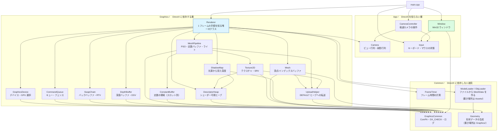

# 04. クラス設計

## 1. ファイル構成

```
DirectX12Dev/
├── src/
│   ├── main.cpp                      エントリポイント・メインループ
│   ├── App/
│   │   ├── Camera.h / .cpp           ビュー行列・透視投影
│   │   ├── CameraController.h / .cpp 入力を受けてカメラを動かす
│   │   ├── Input.h / .cpp            キーボードとマウスの状態
│   │   └── Window.h / .cpp           Win32 ウィンドウ
│   ├── Assets/
│   │   ├── ModelLoader.h / .cpp      拡張子での振り分けと大きさの正規化
│   │   └── ObjLoader.h / .cpp        Wavefront OBJ の解析
│   ├── Common/
│   │   ├── FrameTimer.h / .cpp       フレーム時間の計測と FPS 表示
│   │   ├── GraphicsCommon.h / .cpp   共通ユーティリティ（ComPtr, DX_CHECK, ログ）
│   └── Graphics/
│       ├── GraphicsDevice.h / .cpp   デバイス・アダプタ・デバッグレイヤー
│       ├── CommandQueue.h / .cpp     コマンドキュー・フェンス（同期）
│       ├── ConstantBuffer.h / .cpp   定数バッファ（フレーム別・256B アライン）
│       ├── DepthBuffer.h / .cpp      深度バッファ・DSV
│       ├── DescriptorHeap.h / .cpp   シェーダー可視ディスクリプタヒープ
│       ├── Texture2D.h / .cpp        テクスチャの生成・GPU 転送・SRV
│       ├── UploadHelper.h / .cpp     DEFAULT ヒープへの転送（共通処理）
│       ├── SwapChain.h / .cpp        スワップチェーン・RTV
│       ├── Geometry.h / .cpp       頂点の形式と形状データの生成
│       ├── Mesh.h / .cpp           1 形状ぶんの頂点/インデックスバッファ
│       ├── MeshPipeline.h / .cpp   ルートシグネチャ・PSO・定数バッファ
│       ├── ShadowMap.h / .cpp      光源から見た深度・影用の DSV と SRV
│       └── Renderer.h / .cpp         上記を束ねて 1 フレーム描く
├── shaders/
│   └── Mesh.hlsl                 頂点シェーダー・ピクセルシェーダー
├── tools/
│   └── build.ps1                     MSBuild 呼び出しスクリプト
└── docs/                             この資料
```

---

## 2. 依存関係



**依存は一方向**です。矢印が循環していないことがポイントです。

- `Window` は DirectX を一切知りません（描画側を差し替えても無変更）
- `GraphicsDevice` / `CommandQueue` / `SwapChain` / `DepthBuffer` / `MeshPipeline`
  は互いを知りません
- これらを組み合わせて「1 フレームを描く」責務は `Renderer` だけが持ちます

---

## 3. 各クラスの責務

### Window（App/Window.h）

| 項目 | 内容 |
|------|------|
| 責務 | ウィンドウの生成、Win32 メッセージの処理、閉じる／サイズ変更の通知 |
| **持たない責務** | **DirectX に関すること一切** |

`Renderer` への通知は `std::function` のコールバックで行い、
`Window` が `Renderer` の型を知らずに済むようにしています。

```cpp
// main.cpp — ここで初めて 2 つが結び付く
window.SetResizeCallback([&renderer](uint32_t w, uint32_t h) {
    renderer.Resize(w, h);
});
```

**設計判断:** `Window` に `Renderer*` を持たせる方が短く書けますが、
そうすると両者が相互に依存し、片方だけをテストしたり差し替えたりできなくなります。

---

### GraphicsDevice（Graphics/GraphicsDevice.h）

| 項目 | 内容 |
|------|------|
| 責務 | デバッグレイヤーの有効化、DXGI ファクトリ生成、GPU 選択、デバイス生成、情報キュー設定 |
| 提供するもの | `ID3D12Device*`、`IDXGIFactory6*` |

「DirectX 12 の土台」を作るだけで、描画には関与しません。
**初期化の順序に強い制約がある処理**（デバッグレイヤーはデバイスより前、など）を
1 か所に閉じ込めるのが目的です。

---

### CommandQueue（Graphics/CommandQueue.h）

| 項目 | 内容 |
|------|------|
| 責務 | コマンドキューの保持、コマンドリストの投入、フェンスによる CPU/GPU 同期 |
| 提供するもの | `ExecuteCommandList()` / `Signal()` / `WaitForFenceValue()` / `Flush()` |

**設計判断:** キューとフェンスを 1 クラスにまとめています。
両者は常にセットで使われ（`queue->Signal(fence, value)`）、
分けると呼び出し側で必ず 2 つを持ち回ることになるためです。

`Signal()` と `WaitForFenceValue()` を分けて公開しているのが要点です。
描画ループでは「全部待つ」（`Flush`）のではなく
「これから使うアロケータに関係する分だけ待つ」必要があるためです
（[03 章 6 節](描画フロー.md#6-同期方式フレームバッファリング)）。

`Flush()` が待機に使ったフェンス値を返すのは、
`Renderer` が `m_frameFenceValues` を一括更新できるようにするためです。

---

### SwapChain（Graphics/SwapChain.h）

| 項目 | 内容 |
|------|------|
| 責務 | スワップチェーンの生成、バックバッファの保持、RTV ヒープ管理、Present、リサイズ |
| 提供するもの | `CurrentBackBuffer()` / `CurrentRenderTargetView()` / `Present()` / `Resize()` |

**設計判断:** RTV ディスクリプタヒープをこのクラスが持っています。
RTV はバックバッファと 1 対 1 で対応し、リサイズ時には必ず両方を作り直すため、
別クラスに分けると「必ず一緒に更新する」という制約を守りにくくなるからです。

> 将来テクスチャや深度バッファを追加する際は、SRV/DSV 用の
> 汎用ディスクリプタヒープ管理クラスを別途作るのが定石です。

---

### ConstantBuffer（Graphics/ConstantBuffer.h）

| 項目 | 内容 |
|------|------|
| 責務 | 定数バッファの確保、256 バイト境界への切り上げ、フレーム別領域の管理、書き込み |
| 提供するもの | `Initialize()` / `Update(frameIndex, data, size)` / `GpuAddress(frameIndex)` |

**設計判断 1:** フレーム数ぶんを **1 本のリソース**にまとめ、
アドレスをずらして使い分けています。
リソースを複数作るより「アドレス計算だけで切り替わる」ぶん扱いが単純です。

**設計判断 2:** 生成時に一度 `Map` して、破棄まで解除しません（**永続マップ**）。
UPLOAD ヒープでは推奨される作法で、毎フレームの `Map` / `Unmap` は無駄なコストです。

**設計判断 3:** 型を持たないバイト列として扱っています（`const void*` を受け取る）。
テンプレートにする案もありましたが、今後どんな定数構造体が増えても
このクラスを変更せずに使えるほうが素直だと判断しました。

### DepthBuffer（Graphics/DepthBuffer.h）

| 項目 | 内容 |
|------|------|
| 責務 | 深度バッファの確保、DSV ヒープ管理、リサイズ |
| 提供するもの | `Initialize()` / `Resize()` / `DepthStencilView()` |

**設計判断 1:** `SwapChain` に同居させず独立したクラスにしました。
深度バッファはスワップチェーンが用意してくれるものではなく、
自分で `CreateCommittedResource` して作るものだからです。
また将来 MSAA やシャドウマップを追加する際、深度バッファだけを
複数持ちたくなるため、分けておくほうが素直です。

**設計判断 2:** 深度バッファは **1 枚だけ**です。
バックバッファ（2 枚）やコマンドアロケータ（2 個）と違い、
フレームをまたいで内容を持ち越さないためです
（[03 章 ポイント 6](描画フロー.md#ポイント-6-深度バッファは-1-枚でよい)）。

**設計判断 3:** リソースの状態を `DEPTH_WRITE` から変更しません。
そのためリソースバリアが一切不要で、`Renderer` 側の手順が増えません。

### DescriptorHeap（Graphics/DescriptorHeap.h）

| 項目 | 内容 |
|------|------|
| 責務 | シェーダー可視ディスクリプタヒープの確保と、先頭からの単純な割り当て |
| 提供するもの | `Initialize()` / `Allocate()` / `CpuHandle()` / `GpuHandle()` / `Get()` |

**設計判断 1:** `Renderer` が 1 本だけ持ち、全リソースで共有します。
シェーダー可視ヒープはコマンドリストに同時 1 本しか設定できないためです。

**設計判断 2:** 解放を実装していません。
起動時に確保したディスクリプタを終了まで使い続けるので、
番号を進めるだけのリニアアロケータで足ります。
リソースを動的に生成・破棄するようになったら、フリーリストが必要になります。

### Texture2D（Graphics/Texture2D.h）

| 項目 | 内容 |
|------|------|
| 責務 | DEFAULT ヒープへのテクスチャ生成、ステージング転送、SRV の登録 |
| 提供するもの | `Initialize()` / `ShaderResourceView()` / `Width()` / `Height()` |

**設計判断 1:** 転送用のコマンドアロケータとリストを内部で使い捨てにしています。
描画用のものと混ぜないほうが責務がはっきりするためです。

**設計判断 2:** `Initialize` の中で GPU の完了を待ちます（同期処理）。
待たずに抜けると、ローカル変数の中継バッファが GPU の読み取り中に破棄されるためです。
起動時の 1 回だけなので、素直に待つのが最も単純で安全です。

**設計判断 3:** 画像ファイルの読み込みは実装していません。
デコーダ（PNG / JPEG …）が必要になり、学習の主題から外れるためです。
市松模様をコードで生成すれば、UV のずれや上下反転にすぐ気付けます。

### Camera（App/Camera.h）

| 項目 | 内容 |
|------|------|
| 責務 | 視点・注視点・画角の保持と、ビュー行列／射影行列の組み立て |
| 提供するもの | `SetPosition()` / `SetTarget()` / `SetAspectRatio()` / `ViewProjectionMatrix()` |

**設計判断:** DirectXMath だけで作られており DirectX の API を使わないため、
`Graphics/` ではなく `App/` に置いています。
描画方法を差し替えてもカメラの計算は変わらない、という切り分けです。

### UploadHelper（Graphics/UploadHelper.h）

| 項目 | 内容 |
|------|------|
| 責務 | UPLOAD ヒープを中継した DEFAULT ヒープへの転送 |
| 提供するもの | `ExecuteImmediate()` / `CreateUploadBuffer()` / `CreateBufferWithData()` |

**設計判断 1:** クラスではなく `upload` 名前空間の関数群にしています。
保持する状態が無く、呼ばれるたびに完結するためです。

**設計判断 2:** `ExecuteImmediate` はコマンドの記録処理を
`std::function` で受け取ります。
バッファは `CopyBufferRegion`、テクスチャは `CopyTextureRegion` と
コピー方法が違う一方、「使い捨てのコマンドリストを作り、実行し、完了を待つ」
部分は共通だからです。この抽出で `Texture2D.cpp` は約 100 行短くなりました。

### Input（App/Input.h）

| 項目 | 内容 |
|------|------|
| 責務 | ウィンドウメッセージを受けて、キーとマウスの状態を溜める |
| 提供するもの | `ProcessMessage()` / `NewFrame()` / `IsKeyDown()` / `WasKeyPressed()` / `MouseDeltaX()` ほか |

**設計判断:** ウィンドウプロシージャの中では**記録しかしません**。
メッセージは 1 フレームに何回届くか分からないため、そこで処理を書くと
マウスの動かし方で処理回数が変わってしまいます。

「今押されている」と「今押された」を区別できるよう、前フレームの状態を持ちます。
そのため `NewFrame()` を毎フレームの先頭で呼ぶ必要があります。

---

### CameraController（App/CameraController.h）

| 項目 | 内容 |
|------|------|
| 責務 | 入力を解釈し、注視点まわりの方位角・仰角・距離を更新してカメラへ反映する |
| 提供するもの | `Update(input, camera, deltaSeconds)` / `Reset()` |

**設計判断:** `Camera` が「どこから何を見るか」を持つのに対し、
こちらは「操作でそれをどう変えるか」を持ちます。分けておくと、
一人称視点など別の操作方式を足すときに `Camera` を触らずに済みます。

視点の座標を直接持たないのが要点です。
方位角・仰角・距離から毎フレーム計算するので、どう回しても注視点を見失いません。

---

### MeshPipeline（Graphics/MeshPipeline.h）

| 項目 | 内容 |
|------|------|
| 責務 | ルートシグネチャ、PSO、定数バッファ、テクスチャの生成と、変換行列・ライト情報の計算 |
| 提供するもの | `Initialize()` / `UpdateFrameConstants()` / `UpdateObjectConstants()` / `Bind()` / `BindObject()` |

**設計判断:** このクラスは「**どう描くか**」だけを持ち、「**何を描くか**」は
`Mesh` に分けています。形状を持たないので、同じ設定のまま何個でもメッシュを描けます。

描き方は 2 通りあります。画面用（PSO ＋ ルートシグネチャ）と、
シャドウマップ用（ピクセルシェーダー無し・より狭いルートシグネチャ）です。
**ルートパラメータの番号を両者で揃えている**ので、
オブジェクト別の定数を結び付ける `BindObject()` は 2 つのパスで共用できます。

PSO・ルートシグネチャ・頂点レイアウトは互いに整合していなければならないため、
その 3 つは 1 か所に集めたままです。不整合に気付きやすくするためです。

頂点構造体と入力レイアウトのオフセットは手で数えた値なので、
`static_assert` で検算しています。構造体を変更した瞬間にビルドが失敗するため、
実行して画面を見る前に間違いに気付けます。

定数バッファは書き換わる頻度で 2 つに分けています。

| バッファ | 内容 | スロット数 |
|---------|------|----------|
| フレーム共通 (b0) | ビュー射影行列、ライト、視点 | フレーム数 |
| オブジェクト別 (b1) | ワールド行列、ワールド射影行列 | フレーム数 × オブジェクト数 |

ライトの設定（向き・色・環境光の強さ）は現在このクラスの定数です。
光源が増えたり動かしたくなった時点で、`Scene` のような別クラスへ切り出します。

---

### Geometry（Graphics/Geometry.h）

| 項目 | 内容 |
|------|------|
| 責務 | 頂点の形式 (`Vertex`) の定義と、立方体・床の形状データ生成 |
| 提供するもの | `CreateCube(halfExtent)` / `CreatePlane(halfExtent, height, uvTiling)` |

**設計判断:** DirectX の API を一切呼びません。形状を作るのはただの計算であり、
GPU の都合と混ぜる理由がないためです。`Graphics/` に置いているのは、
`Vertex` の並びが入力レイアウトと表裏一体だからです。

---

### Mesh（Graphics/Mesh.h）

| 項目 | 内容 |
|------|------|
| 責務 | 1 つの形状ぶんの頂点／インデックスバッファの保持と、描画命令の記録 |
| 提供するもの | `Initialize(device, queue, meshData, name)` / `RecordDrawCommands(commandList)` |

**設計判断:** PSO やルートシグネチャを知りません。呼び出し側が先に
`MeshPipeline::Bind()` を済ませている前提で、頂点バッファの設定と
`DrawIndexedInstanced` だけを記録します。

そのおかげで、影のパスと画面のパスで**まったく同じ描画コード**を再利用できます。

---

### ModelLoader / ObjLoader（Assets/）

| 項目 | 内容 |
|------|------|
| 責務 | モデルファイルを解析して `MeshData` を作る。大きさと位置の正規化 |
| 提供するもの | `LoadModel(path, options)` / `LoadObj(path, options)` / `FitToTargetSize()` |

**設計判断:** DirectX の API を一切呼びません。`Geometry` と同じく
「頂点とインデックスの配列を作るだけ」の層で、GPU へ載せるのは `Mesh` の仕事です。

`LoadModel` が拡張子で振り分ける形にしてあるので、
対応形式を増やすときに呼び出し側は変わりません。

読み込みに失敗した場合は例外を投げます。`Renderer` 側で受け止め、
コードで作れる立方体に切り替えて動き続けます。

---

### ShadowMap（Graphics/ShadowMap.h）

| 項目 | 内容 |
|------|------|
| 責務 | 光源から見た深度テクスチャの保持、光源の変換行列の計算、パスの開始と終了 |
| 提供するもの | `Initialize()` / `SetLight()` / `LightViewProjection()` / `BeginRender()` / `EndRender()` |

**設計判断:** リソース本体は `R32_TYPELESS` で作り、DSV は `D32_FLOAT`、
SRV は `R32_FLOAT` と、ビューごとに別の解釈を与えています。
1 枚を「書く」と「読む」の両方に使うためです。

`BeginRender()` / `EndRender()` がリソースバリアを内側に隠しています。
状態を戻し忘れると次のフレームで壊れるため、対で呼ぶ形にして
呼び出し側が片方だけ書くことを起こりにくくしました。

光源の変換行列を計算する `SetLight()` はただの数学ですが、
シャドウマップ以外に使い道がないので同じクラスに置いています。

このクラスは **コマンドリストを受け取って記録するだけ**で、
自分でキューに投入したり Present したりはしません。
そのため「どのタイミングで描くか」は `Renderer` が完全に制御できます。

---

### Renderer（Graphics/Renderer.h）

| 項目 | 内容 |
|------|------|
| 責務 | 上記 4 クラスの生成と所有、コマンドアロケータ／リストの管理、フレーム間の同期、1 フレームの手順の実行 |
| 提供するもの | `Initialize()` / `Render()` / `Resize()` / `WaitForGpu()` |

**このクラスだけが「順序」を知っています。**
初期化の依存順、1 フレームの描画手順（待機 → バリア → クリア → 描画 → バリア → 投入）は
すべてここに集約されています。

フレームバッファリングのための
`m_commandAllocators`（バックバッファ枚数ぶんの配列）と
`m_frameFenceValues`（フレームごとの完了印）もこのクラスが持ちます。
「どのフレームでどのアロケータを使うか」はフレーム進行の知識であり、
`CommandQueue` や `SwapChain` の単体の責務ではないためです。

---

### FrameTimer（Common/FrameTimer.h）

| 項目 | 内容 |
|------|------|
| 責務 | フレーム間の経過時間の計測と、1 秒ごとの FPS ログ出力 |
| 提供するもの | `Tick()` / `DeltaSeconds()` / `FramesPerSecond()` |

**設計判断:** `<chrono>` だけで作られており DirectX に依存しないため、
`Graphics/` ではなく `Common/` に置いています。

性能改善（フレームバッファリングなど）は見た目が変わらないため、
**数値で確認する手段がないと改善したかどうか分かりません。**
そのための最小限の計測手段としてこのクラスを用意しています。

### GraphicsCommon（Common/GraphicsCommon.h）

| 項目 | 内容 |
|------|------|
| 責務 | DirectX ヘッダのインクルード、`ComPtr` 別名、`DX_CHECK`、ログ、アセットパス解決 |

`DX_CHECK` マクロは本プロジェクトのエラー処理の要です。

```cpp
DX_CHECK(device->CreateCommandQueue(&desc, IID_PPV_ARGS(&queue)));
```

失敗すると、式・ファイル名・行番号・HRESULT を含む例外が投げられ、
`main` の `catch` まで一気に抜けます。

**設計判断:** DirectX の初期化は「HRESULT を返す関数を数十回連続で呼ぶ」処理です。
毎回 `if (FAILED(hr)) return false;` と書くと本質的なコードが埋もれるため、
例外に統一しています。

---

## 4. 適用しているコーディング方針

### コピー・ムーブの禁止

```cpp
Window(const Window&) = delete;
Window& operator=(const Window&) = delete;
```

これらのクラスは OS / GPU のリソースを 1 つだけ所有します。
コピーされると同じリソースを二重に破棄して壊れるため、
**コンパイル時点で禁止**しています（バグの芽を型で潰す）。

### RAII（デストラクタでの後始末）

| リソース | 解放方法 |
|---------|---------|
| COM オブジェクト（`ID3D12Device` 等） | `ComPtr` が自動で `Release()` |
| `HANDLE`（フェンスのイベント） | デストラクタで `CloseHandle()` |
| `HWND` | デストラクタで `DestroyWindow()` |

「自動で片付くもの」と「手で片付けるもの」を意識するのが重要です。

### ヘッダの依存を最小に

`Renderer.h` は 4 つのクラスのヘッダを include していますが、
これは値メンバとして保持しているためです（サイズが必要）。

一方 `SwapChain.h` は `class CommandQueue;` と前方宣言だけしています。
実装で使っていない型のヘッダは include しない、という方針です。

---

## 5. 今後の拡張方針

機能を追加するとき、どこに置くべきかの指針です。

| 追加したい機能 | 置き場所 |
|--------------|---------|
| 複数モデルの描画 | `Graphics/Mesh.h` を新設して形状データを分離し、`Renderer` がループで描く |
| 光源やカメラの管理 | `Graphics/Scene.h` を新設し、`MeshPipeline` の定数を移す |
| 影の品質向上 | `ShadowMap` を複数枚持たせる（カスケードシャドウマップ） |

**原則:**

1. `Graphics/` 配下には DirectX に依存するものだけを置く
2. `App/` 配下には DirectX を知らないものを置く
3. 1 ファイル 400 行を超えたら分割を検討する
4. 「順序」を知るのは `Renderer` だけに保つ
