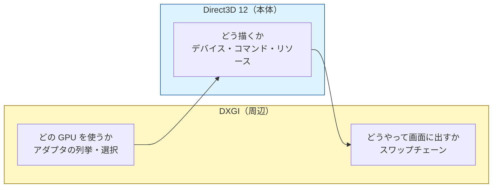
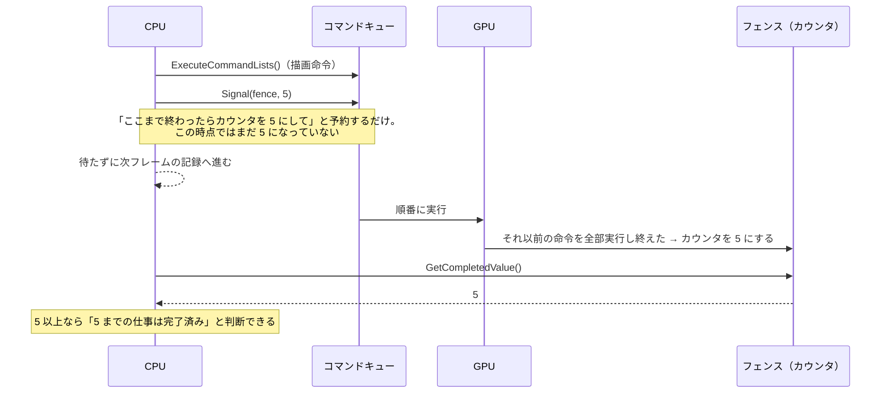
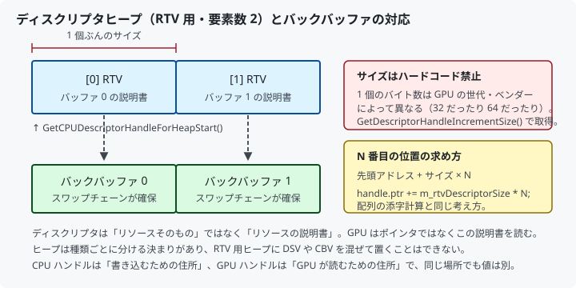
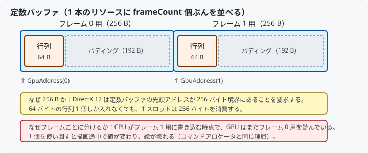
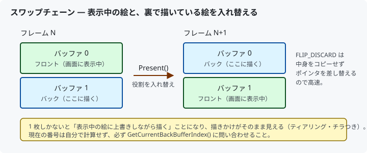
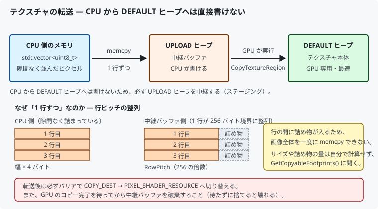
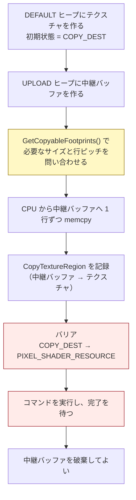
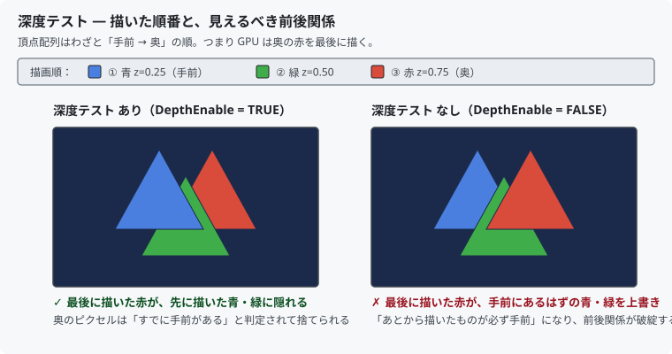
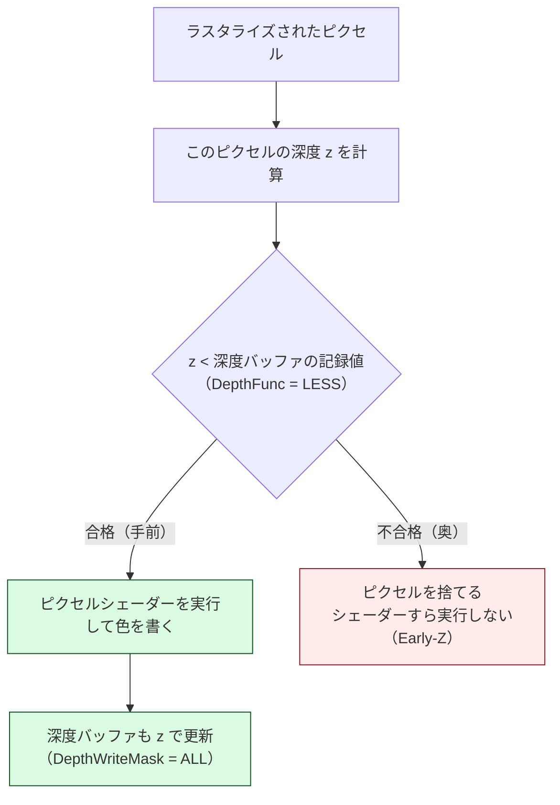
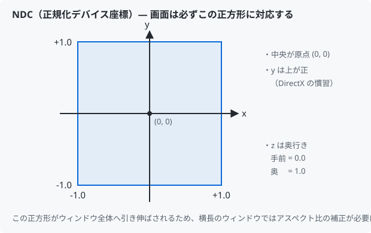

# 02. DirectX 12 の用語集

DirectX 12 は用語が多く、しかも互いに絡み合っているため、
1 つずつ覚えようとすると挫折しやすい API です。

この資料では **「なぜそれが必要なのか」** を軸に整理します。
定義の丸暗記ではなく、必要性から理解するのが近道です。

---

## 0. 大前提：DirectX 11 と 12 の決定的な違い

| | DirectX 11 | DirectX 12 |
|--|-----------|-----------|
| 命令の実行 | 呼んだら即実行（に見える） | 記録してから、まとめて投入 |
| メモリ管理 | ドライバが自動 | 開発者が明示 |
| 同期 | ドライバが自動 | 開発者が明示（フェンス） |
| リソースの状態管理 | ドライバが自動 | 開発者が明示（バリア） |
| CPU 負荷 | 高い（ドライバの判断処理） | 低い |
| 難易度 | 低い | 高い |

DirectX 12 は「速くなった API」ではなく、
**ドライバがやっていた仕事を開発者に移した API** です。
そのぶん無駄な処理を省けるので速くなりますが、間違えると壊れます。

新しく覚える概念のほとんどは「ドライバから引き継いだ仕事」だと考えると腑に落ちます。

---

## 1. デバイスまわり

### DXGI (DirectX Graphics Infrastructure)

Direct3D とは別に存在する、**GPU と画面まわりの共通基盤**。
Direct3D 11 でも 12 でも同じ DXGI を使います。

役割分担のイメージ:



### アダプタ (IDXGIAdapter)

GPU 1 台を表すオブジェクト。
ノート PC には「CPU 内蔵 GPU」と「専用 GPU」が両方あることが多く、
何も指定しないと低性能な方が選ばれる場合があります。

本プロジェクトでは `EnumAdapterByGpuPreference` に
`DXGI_GPU_PREFERENCE_HIGH_PERFORMANCE` を渡し、高性能な GPU から順に試しています。

> 該当コード: [`GraphicsDevice::SelectAdapter`](../../src/Graphics/GraphicsDevice.cpp)

### デバイス (ID3D12Device)

選んだ GPU を操作するための本体。
`CreateXxx` という名前の生成関数はほぼ全てここに集約されています。

```cpp
device->CreateCommandQueue(...);
device->CreateDescriptorHeap(...);
device->CreateCommittedResource(...);
device->CreateGraphicsPipelineState(...);
```

**DirectX 12 のあらゆる処理はデバイスから始まる**、と覚えてください。

### 機能レベル (Feature Level)

GPU が対応している機能の世代。`D3D_FEATURE_LEVEL_11_0` は DirectX 11 世代相当。

「DirectX 12 なのに 11_0 でいいの？」と思うかもしれませんが、
**API のバージョン**と**GPU の機能世代**は別物です。
DirectX 12 は API 設計（仕事の分け方）が新しいのであって、
最新の GPU 機能を必須にしているわけではありません。

### デバッグレイヤー (ID3D12Debug)

API の誤用を検出して詳細なエラーを出してくれる仕組み。

**これを有効にせずに DirectX 12 を書くのは、コンパイラのエラー表示を切って
C++ を書くようなものです。** 必ず有効にしてください。

有効化は **デバイスを作る前** でなければ効きません。
デバイスの生成時に「検証機能つきの実装」に差し替える仕組みだからです。

> 該当コード: [`GraphicsDevice::EnableDebugLayer`](../../src/Graphics/GraphicsDevice.cpp)

---

## 2. 命令の記録と実行

### コマンドリスト (ID3D12GraphicsCommandList)

GPU への命令を **記録** するオブジェクト。
`ClearRenderTargetView` や `DrawInstanced` を呼んでも、その場では何も起きません。
「あとで GPU にやらせること」をメモしているだけです。

```cpp
commandList->Reset(allocator, pso);   // 記録開始
  commandList->ClearRenderTargetView(...);  // ← まだ何も起きない
  commandList->DrawInstanced(...);          // ← まだ何も起きない
commandList->Close();                 // 記録終了
```

### コマンドアロケータ (ID3D12CommandAllocator)

記録した命令が実際に格納される **メモリの持ち主**。

```
コマンドリスト   … 記録するための「ペン」
コマンドアロケータ… 書き込む先の「ノート」
```

**最重要の制約:**
`allocator->Reset()`（ノートを消す）は、
**そのノートの命令を GPU が実行し終えた後** でなければ呼べません。

これがフレーム間の同期（フェンス）が必要になる最大の理由です。

### コマンドキュー (ID3D12CommandQueue)

記録済みのコマンドリストを GPU に投入する待ち行列。

```cpp
commandQueue->ExecuteCommandLists(1, lists);  // ← ここで GPU が動き始める
                                              //   ただし完了は待たない（非同期）
```

キューには 3 種類あり、それぞれ GPU 内の別のハードウェアを使うため並列に動きます。

| 種類 | 用途 |
|------|------|
| `DIRECT` | 描画・計算・コピー すべて可能（万能） |
| `COMPUTE` | 計算シェーダー専用 |
| `COPY` | リソース転送専用 |

本プロジェクトでは `DIRECT` のみ使用しています。

---

## 3. 同期

### フェンス (ID3D12Fence)

CPU と GPU が共有する **64bit のカウンタ**。実体はそれだけです。



**番号札**と考えると分かりやすいです。
GPU の作業に番号を振り、「何番まで終わった？」と確認できるようにする仕組みです。

### イベント待ち

完了を待つ方法は 2 通りあります。

```cpp
// (a) ビジーループ — CPU を 100% 使い切る。絶対にやってはいけない
while (fence->GetCompletedValue() < value) {}

// (b) イベント待ち — OS にスレッドを眠らせてもらう（本実装）
fence->SetEventOnCompletion(value, hEvent);
WaitForSingleObject(hEvent, INFINITE);
```

> 該当コード: [`CommandQueue::WaitForFenceValue`](../../src/Graphics/CommandQueue.cpp)

---

## 4. リソースとメモリ

### リソース (ID3D12Resource)

GPU が扱うデータの入れ物。頂点バッファもテクスチャもレンダーターゲットも、
全てこの型で表されます（用途の違いは「どう見るか」＝ View で表現します）。

### ヒープの種類 (D3D12_HEAP_TYPE)

リソースを置くメモリの種類。**DirectX 12 のメモリ管理で最初に選ぶ項目**です。

| 種類 | CPU から書ける | GPU アクセス速度 | 用途 |
|------|--------------|----------------|------|
| `DEFAULT` | ✗ | 最速 | 変化しないデータ（頂点バッファ、テクスチャ） |
| `UPLOAD` | ○ | やや遅い | 毎フレーム更新するデータ（定数バッファ） |
| `READBACK` | ○（読み） | — | GPU の結果を CPU に戻す |

`DEFAULT` に置くには `UPLOAD` を経由してコピー命令を発行する必要があります。

本プロジェクトの頂点バッファは、学習の初回として手順を減らすため
`UPLOAD` に直接置いています（本来は `DEFAULT` が正しい選択です）。

> 該当コード: [`MeshPipeline::CreateVertexBuffer`](../../src/Graphics/MeshPipeline.cpp)

### リソースバリア (Resource Barrier)

**「このリソースの用途を今から変えます」という GPU への宣言。**

GPU 内部では、同じメモリでも用途によって最適な保持形式が異なります。

```
RENDER_TARGET 状態 … 描画先として書き込むのに最適な形式
PIXEL_SHADER_RESOURCE 状態 … テクスチャとして読むのに最適な形式
PRESENT 状態 … 画面表示に使える形式
```

用途を切り替えるときにバリアを発行することで、GPU は
「形式の変換」と「それ以前の処理の完了待ち」を行います。

DirectX 11 ではドライバが自動でやっていました。
DirectX 12 では明示する代わりに、**不要なバリアを省いて高速化できます**。

```cpp
// 毎フレーム必ず行う 2 つのバリア
PRESENT       → RENDER_TARGET   // 描き始める前
RENDER_TARGET → PRESENT         // 描き終わって表示する前
```

> 該当コード: [`Renderer::RecordResourceBarrier`](../../src/Graphics/Renderer.cpp)

---

## 5. ディスクリプタ

### ディスクリプタ (Descriptor)

**リソース 1 個ぶんの「説明書」。**

GPU に「このメモリをレンダーターゲットとして使え」と伝えるとき、
C++ のポインタを直接渡すことはできません。
GPU が理解できる形式の説明書を作って渡します。それがディスクリプタです。

### ディスクリプタヒープ (Descriptor Heap)

ディスクリプタを並べて置く **配列**。

DirectX 12 では、まずヒープ（配列）を確保し、
「何番目にどのディスクリプタを書くか」を自分で管理します。
DirectX 11 が裏でやっていた仕事が明示的になったものです。



**N 番目の位置の求め方:**

```cpp
handle = heap->GetCPUDescriptorHandleForHeapStart();
handle.ptr += descriptorSize * N;
```

`descriptorSize` は GPU によって異なる（32 だったり 64 だったり）ため、
必ず `GetDescriptorHandleIncrementSize()` で実行時に取得します。
**数値をハードコードすると別の GPU で壊れます。**

### View（〜View という名前のもの）

同じリソースを「どういう用途で見るか」の指定。

| 名前 | 正式名称 | 用途 |
|------|---------|------|
| RTV | Render Target View | 描画先として使う（本プロジェクトで使用） |
| DSV | Depth Stencil View | 深度バッファとして使う（本プロジェクトで使用） |
| SRV | Shader Resource View | シェーダーから読む（テクスチャ） |
| CBV | Constant Buffer View | シェーダーへ定数を渡す |
| UAV | Unordered Access View | シェーダーから書き込む |

本プロジェクトで使うのは **RTV** と **DSV**、そして
ルートディスクリプタ経由の **CBV** です。

### CPU ハンドルと GPU ハンドル

同じディスクリプタを指していても、値は別物です。

| | 用途 |
|--|------|
| `D3D12_CPU_DESCRIPTOR_HANDLE` | CPU がディスクリプタを **書き込む** ための住所 |
| `D3D12_GPU_DESCRIPTOR_HANDLE` | GPU がディスクリプタを **読む** ための住所 |

RTV の設定は CPU 側で行うため、本プロジェクトでは CPU ハンドルのみ使います。

---

## 6. パイプライン

### ルートシグネチャ (Root Signature)

**シェーダーが受け取る外部入力の一覧表。** 関数の引数リストに相当します。

```
「0 番に変換行列（定数バッファ）を渡す」
「1 番にテクスチャを渡す」
```

という取り決めを CPU 側とシェーダー側で共有することで、
GPU はデータの受け渡しを高速に解決できます。

**ルートシグネチャは小さいほど速い** という性質があります。
中身は GPU の高速な専用領域に置かれるため、大きくすると溢れて
メモリ経由になり遅くなります。必要なものだけを並べるのが原則です。

### ルートパラメータの 3 種類

シェーダーへの渡し方は 3 通りあり、用途で使い分けます。

| 種類 | 渡すもの | 容量 | ディスクリプタヒープ | 本プロジェクトでの用途 |
|------|---------|------|-------------------|---------------------|
| ルート定数 | 32bit 値を直接 | 極小 | 不要 | 未使用 |
| **ルートディスクリプタ** | GPU アドレス | バッファ 1 本 | **不要** | 定数バッファ (b0) の変換行列 |
| **ディスクリプタテーブル** | ヒープ上の範囲 | 大量 | **必要** | テクスチャ (t0) |

**なぜ使い分けるのか:**

変換行列はバッファ 1 本を丸ごと渡すだけなので、GPU アドレスを直接渡せる
**ルートディスクリプタ**で足ります。ヒープが要らないぶん手軽です。

一方 **テクスチャ (SRV) はルートディスクリプタでは渡せません。**
ディスクリプタヒープ上の範囲を指す**ディスクリプタテーブル**を使う必要があります。

テーブルの利点は、テクスチャが 1 枚でも 100 枚でも
**ルートシグネチャのサイズが変わらない**ことです
（`NumDescriptors` を増やすだけ）。
ルートシグネチャは小さいほど速いので、数が増えるものはテーブルにまとめます。

### 定数バッファ (Constant Buffer)

シェーダーに「**頂点ごとではなく、その描画全体で共通の値**」を渡す入れ物です。

| | 運ぶもの | 例 |
|--|---------|-----|
| 頂点バッファ | 頂点ごとに違う値 | 座標、色、UV、法線 |
| 定数バッファ | 描画中ずっと同じ値 | 変換行列、時間、ライトの色、カメラ位置 |

**2 つの重要なルール:**

1. **サイズは 256 バイト単位に切り上げる**
   先頭アドレスが 256 バイト境界に揃っている必要があります
   （`D3D12_CONSTANT_BUFFER_DATA_PLACEMENT_ALIGNMENT`）。
   64 バイトの行列 1 個でも、確保するのは 256 バイトです。

2. **フレームごとに別の領域を使う**
   CPU が書き込んでいる間、GPU がまだ前のフレームの描画で同じ場所を
   読んでいる可能性があります。1 個を使い回すと描画途中で値が変わり、絵が壊れます。
   コマンドアロケータと同じく、バックバッファの枚数ぶん用意します。



> 該当コード: [`ConstantBuffer`](../../src/Graphics/ConstantBuffer.h)

### パイプラインステートオブジェクト (PSO)

描画に関わる設定を **1 つに固めたもの**。

- 頂点シェーダー / ピクセルシェーダー
- 入力レイアウト（頂点データのメモリ配置）
- ラスタライザ設定（カリング、塗りつぶし方）
- ブレンド設定（色の合成方法）
- 深度ステンシル設定
- 出力先の形式

**なぜ 1 つに固めるのか（DX12 の重要な設計思想）:**

DirectX 11 では設定を 1 つずつ変えていました。
GPU は組み合わせが確定するまで最適な機械語を生成できず、
描画命令の直前に慌てて変換していました（＝実行中のカクつきの原因）。

DirectX 12 では組み合わせを PSO として事前に確定させるため、
GPU 用コードの生成を **読み込み時**に済ませられます。

### 入力レイアウト (Input Layout)

頂点バッファのバイト列を、どう切り分けてシェーダーに渡すかの定義。

**★ 3 か所を一致させる必要があります。**

```
C++ の struct Vertex           （MeshPipeline.h）
D3D12_INPUT_ELEMENT_DESC       （MeshPipeline.cpp）
HLSL の struct VSInput         （shaders/Mesh.hlsl）
```

どれか 1 つでもずれると、頂点が明後日の方向に飛んだり色が壊れたりします。
**しかもコンパイルエラーにはなりません。** 初学者が最も嵌まる罠です。

### セマンティクス (Semantics)

`POSITION`、`COLOR`、`SV_POSITION` といった文字列の目印。
C++ 側の入力レイアウトと HLSL 側の変数を結び付ける「接着剤」です。

`SV_` は System Value（システム値）の略で、GPU が特別扱いする値を意味します。

| セマンティクス | 意味 |
|--------------|------|
| `SV_POSITION` | ラスタライズに使う座標（頂点シェーダーの出力に必須） |
| `SV_TARGET` | レンダーターゲットへの出力色（ピクセルシェーダー） |
| `SV_VertexID` | 頂点の通し番号（GPU が自動で入れる） |

---

## 7. 画面表示

### スワップチェーン (Swap Chain)

表示用の画像を複数枚持ち、入れ替えながら表示する仕組み。



1 枚しかないと「表示中の絵に上書きしながら描く」ことになり、
描きかけがそのまま見えます（チラつき・裂け目）。

### スワップエフェクト

| 値 | 説明 |
|----|------|
| `FLIP_DISCARD` | ポインタを差し替える。コピー不要で高速。**DX12 の推奨**（本実装） |
| `FLIP_SEQUENTIAL` | 同上だが内容を保持する（部分更新向け） |
| `DISCARD` / `SEQUENTIAL` | DX11 以前の古い方式。**DX12 では使用不可** |

### テクスチャと SRV (Shader Resource View)

シェーダーから読む画像データです。SRV は「このリソースをテクスチャとして読む」
ためのディスクリプタで、**シェーダー可視ヒープ**に置く必要があります。

| ビュー | ヒープの種類 | SHADER_VISIBLE | 誰が読むか |
|--------|------------|----------------|-----------|
| RTV | RTV 用 | 不可 | CPU が描画先を指定するだけ |
| DSV | DSV 用 | 不可 | 同上 |
| **SRV / CBV / UAV** | CBV_SRV_UAV 用 | **必要** | **GPU 自身が読む** |

シェーダー可視ヒープは、コマンドリストに **同時 1 本しか設定できません**
（CBV/SRV/UAV 用と Sampler 用で 1 本ずつ）。
そのため実際のエンジンでは「巨大なヒープを 1 本作り、切り分けて全員で共有する」
設計になります。

> 該当コード: [`DescriptorHeap`](../../src/Graphics/DescriptorHeap.h)

### ステージング転送（UPLOAD → DEFAULT）

**DirectX 12 で最も頻出するパターンのひとつです。**

テクスチャは容量が大きく GPU が何万回も読むため、GPU 専用の高速メモリ
（DEFAULT ヒープ）に置きたい。しかし DEFAULT ヒープは **CPU から直接書けません**。
そこで UPLOAD ヒープの「中継バッファ」を経由します。





**行ピッチ (RowPitch) の落とし穴:**

中継バッファ上では 1 行のバイト数が 256 バイト境界に揃えられます
（`D3D12_TEXTURE_DATA_PITCH_ALIGNMENT`）。
例えば横 100 ピクセル・RGBA なら実データは 400 バイトですが、
中継バッファでは 512 バイトぶんの場所を取り、余りは詰め物になります。

そのため **画像全体を一度に `memcpy` できず、1 行ずつコピー**します。
必要なサイズは自分で計算せず、`GetCopyableFootprints()` に問い合わせるのが正解です。

**なぜ完了を待つ必要があるのか:**

待たずに中継バッファを破棄すると、GPU がまだ読んでいる最中のメモリが消えます。
起動時の 1 回なら素直に待って構いません。

> 該当コード: [`UploadHelper`](../../src/Graphics/UploadHelper.h) /
> [`Texture2D::Initialize`](../../src/Graphics/Texture2D.cpp)

### サンプラー (SamplerState)

テクスチャ（画像データそのもの）とは別に、**「どう読むか」**を決めるものです。

| 設定 | 意味 | 選択肢 |
|------|------|-------|
| Filter | ピクセルとテクセルがずれたときの読み方 | `LINEAR`（なめらか）/ `POINT`（くっきり） |
| AddressU/V/W | UV が 0〜1 の外に出たときの扱い | `WRAP`（繰り返す）/ `CLAMP`（端を伸ばす）/ `MIRROR` |

データと読み方が分離されているので、同じ画像を
「ぼかして読む」「くっきり読む」と使い分けられます。

**静的サンプラー (Static Sampler):**
実行中に変わらないサンプラーは、ヒープに置かずルートシグネチャに直接埋め込めます。
サンプラー用ヒープを作らずに済むため、設定が固定なら常にこちらが有利です。

### UV 座標（テクスチャ座標）

テクスチャ上の位置を **0.0〜1.0** で表したものです。
画像が何ピクセルでも常に 0〜1 なので、テクスチャを差し替えても頂点データを直さずに済みます。

```
(0,0) ┌─────────┐ (1,0)
      │  画像   │
(0,1) └─────────┘ (1,1)
```

**★ V は下向きが正です**（画面の Y が上向きなのと逆）。
画像ファイルが上の行から順に並んでいるためで、
取り違えるとテクスチャが上下逆さまに貼られます。

---

### 深度バッファ（Z バッファ）

画面のピクセル 1 個につき「そこに描かれている物の奥行き」を記録しておく画像です。
色を記録するレンダーターゲットと縦横のサイズが同じで、
中身が「色」ではなく「奥行き」になったもの、と考えると分かりやすいです。

**無いとどうなるか:** **あとから描いたものが必ず手前に見えます。**
奥にあるはずの壁を後から描いただけで、手前のキャラクターが消えてしまいます。

**あるとどうなるか:** GPU がピクセルを塗る直前に、

1. これから塗る点の奥行きを計算する
2. 深度バッファに記録済みの奥行きと比べる
3. 手前なら塗って深度も更新、奥なら**捨てる**

という判定（**深度テスト**）を自動で行い、
**描く順番に関係なく前後関係が正しくなります**。



判定の流れを図にすると次のようになります。



### 深度テストの設定（PSO の DepthStencilState）

| 項目 | 意味 | 本プロジェクト |
|------|------|--------------|
| `DepthEnable` | 深度テストを行うか | `TRUE` |
| `DepthWriteMask` | 合格時に深度を更新するか | `ALL`（更新する） |
| `DepthFunc` | 「合格」の条件 | `LESS`（手前が勝つ） |

深度は **手前が 0.0、奥が 1.0** です。したがって
「値が小さい方が手前」＝ `LESS` で手前が勝つ、という関係になります。

`DepthWriteMask` を `ZERO` にすると「奥行きは見るが記録しない」動作になります。
半透明物体は後ろが透けて見えるため、深度を書き込むと
後から描く物体が消えてしまいます。そのため半透明では `ZERO` を使います。

### DSV (Depth Stencil View)

深度バッファ用のディスクリプタです。RTV と同じ考え方ですが、
**ディスクリプタヒープは種類ごとに分ける決まり**のため、
RTV 用ヒープに混ぜて置くことはできません。専用のヒープを作ります。

### 最適化されたクリア値

深度バッファやレンダーターゲットを作るとき、
「このリソースはほぼ必ずこの値でクリアされます」と事前に宣言できます
（`D3D12_CLEAR_VALUE`）。GPU がその値に特化した高速なクリア処理を使えます。

宣言した値と、実際に `ClearDepthStencilView` へ渡す値が食い違うと
デバッグレイヤーが警告を出し、最適化も効かなくなります。

### Early-Z

奥にあると分かったピクセルは、**ピクセルシェーダーを実行せずに**捨てられます。
手前の物体を先に描くほど無駄な処理が減るため、
実際のゲームでは「おおまかに手前から順に描く」最適化がよく行われます。

深度テストは「正しく見せるため」だけでなく「速くするため」の機能でもあります。

---

### ビューポートとシザー矩形

似ていますが役割が違います。**両方とも設定が必須**です。

| | 役割 |
|--|------|
| ビューポート | 座標**変換**。NDC (-1〜+1) を実際のピクセル座標に変換する |
| シザー矩形 | **切り抜き**。この矩形の外のピクセルを捨てる |

シザー矩形を設定し忘れると（全て 0 のままだと）**1 ピクセルも描画されません**。
「画面が真っ黒」の定番の原因です。

### NDC（正規化デバイス座標）

シェーダーが出力する座標系。



**注意: NDC は正方形ですが、ウィンドウは正方形とは限りません。**
1280x720 のウィンドウでは、この正方形が横に 1.78 倍引き伸ばされて表示されます。
そのため補正しないと、回転させたときに三角形が歪んで見えます。
X 方向をあらかじめ 1/アスペクト比 だけ縮めておくのが対処法です。

---

## 8. 座標変換

### 同次座標と w 成分

3D グラフィックスでは座標を 4 成分 `(x, y, z, w)` で扱います。

**なぜ 4 成分なのか:**

- 3x3 行列では回転と拡大縮小しか表せず、**平行移動が表現できない**
- w を足して 4x4 にすると、平行移動も掛け算だけで書ける
- さらに w は透視投影（遠くを小さく見せる）の割り算の分母にもなる

GPU はラスタライズ前に `x, y, z` を `w` で割ります（**透視除算**）。
今回は透視投影をしないので `w = 1.0` のままです。

### 行列を 1 個にまとめる理由

```
頂点 × ワールド行列 × ビュー行列 × プロジェクション行列
```

を毎頂点で 3 回掛けるのは無駄です。
CPU 側で 1 個の行列に合成しておけば、シェーダーは 1 回掛けるだけで済みます。
頂点が何万個あっても合成の計算は 1 回なので、これが定石です。

| 行列 | 役割 |
|------|------|
| ワールド | 物体そのものを動かす（回転・移動・拡大） |
| ビュー | カメラの位置と向きに合わせて世界を動かす |
| プロジェクション | 遠近感を付け、NDC の範囲に収める |

本プロジェクトはまだ 2D なので、ワールド（Z 軸回転）とアスペクト比補正だけです。

### 行列の転置（初学者が必ず嵌まる罠）

| | メモリ上の並び |
|--|--------------|
| C++ の DirectXMath | **行優先** (row-major) |
| HLSL の定数バッファ（既定） | **列優先** (column-major) |

そのまま渡すと転置された行列として解釈され、絵が壊れます。
**CPU 側で `XMMatrixTranspose` してから書き込む**ことで辻褄を合わせます。

```cpp
XMStoreFloat4x4(&constants.worldViewProjection, XMMatrixTranspose(wvp));
```

> HLSL 側に `row_major float4x4` と書く方法もありますが、
> CPU で 1 回転置する方が GPU の負担が軽く、一般的です。

### mul() の引数の順序

HLSL の `mul` は引数の順序で意味が変わります。

```hlsl
mul(v, M)   // v を「行ベクトル」とみなす（v × M）
mul(M, v)   // v を「列ベクトル」とみなす（M × v）
```

DirectXMath は行ベクトル規約（`v × M`）で行列を組み立てるため、
本プロジェクトでは `mul(位置, 行列)` の順で書きます。
逆にすると結果が変わるので注意してください。

---

## 9. ライティング

### 法線 (Normal)

面がどちらを向いているかを表す、面に垂直で長さ 1 のベクトルです。
光の当たり具合はこれだけで決まります。頂点データの一部として持ちます。

座標が同じでも属する面が違えば法線が違うため、
角ばった形では頂点を面ごとに分けます（立方体なら 8 個ではなく 24 個）。
なめらかに見せたい場合は逆に、頂点を共有して法線を平均化します。

### 拡散反射（ランバート反射）

ざらざらした面の見え方です。明るさは `saturate(dot(N, L))`、
つまり法線と光源方向のなす角の余弦で決まります。
**視点を動かしても明るさは変わりません。**

### 鏡面反射（スペキュラ）

つるつるした面に乗るハイライトです。**視点によって位置が変わります。**
本プロジェクトはブリン・フォンのモデルを使い、
`L` と `V` の中間ベクトル `H` と法線の内積を累乗して求めます。

### ハーフベクトル (Half Vector)

`normalize(L + V)`。光源方向と視点方向のちょうど中間を向くベクトルです。
反射ベクトルを求めるより計算が軽く、見た目もほとんど変わりません。

### 環境光 (Ambient)

周囲からの照り返しをまとめて近似した、方向を持たない一定の明るさです。
これがないと、光の当たらない面が真っ黒に潰れます。

### グーローシェーディングとフォンシェーディング

明るさを**頂点シェーダー**で計算して補間するのがグーロー、
**ピクセルシェーダー**で 1 ピクセルずつ計算するのがフォンです。
本プロジェクトは後者で、ハイライトが頂点に引っかからず滑らかになります。

### 定数バッファのパッキング規則

HLSL の定数バッファは 16 バイト単位で区切られ、
1 つの値が 16 バイト境界をまたぐことは許されません。
`float3` を 2 つ並べると C++ 側と 4 バイトずれますが、
**エラーにならない**ため気付きにくい罠です。
本プロジェクトは定数をすべて `float4` / `float4x4` に揃えて回避しています。

---

### シャドウマップ (Shadow Map)

光源から見た深度を記録したテクスチャです。
画面を描くとき、各ピクセルを光源から見た座標に変換して深度を比べ、
記録より遠ければ「間に何かがある」＝影と判定します。

### TYPELESS 形式

`DXGI_FORMAT_R32_TYPELESS` のように、ビット幅だけ決めて意味を決めない形式です。
1 枚のリソースを「深度バッファとして書く」「テクスチャとして読む」のように
複数の用途で使いたいとき、ビューごとに別の形式を与えるために使います。

### 比較サンプラー (SamplerComparisonState)

読んだ値をそのまま返さず、渡した値と比較して「合格した割合」を返すサンプラーです。
周囲のテクセルを**比較してから補間**するため、影の境目がなめらかになります。
深度そのものを平均しても意味がないので、この順序が重要です。

### PCF (Percentage Closer Filtering)

シャドウマップを 1 点ではなく周囲複数点で比較し、平均して影の濃さを決める手法です。
輪郭のギザギザが減ります。

### シャドウアクネ (Shadow Acne)

影を落とす面が、自分自身を影と判定してしまう縞模様です。
記録された深度が 1 テクセルぶんの代表値であることによる、原理的な誤差が原因です。
第 1 パスで書く深度をわずかに奥へずらす**深度バイアス**で対策します。

### 深度バイアス (Depth Bias)

ラスタライザが深度を書くときに加える下駄です。
一律に加える `DepthBias` と、面の傾きに比例して増える
`SlopeScaledDepthBias` の 2 つがあります。
掛けすぎると影が物体から浮く**ピーターパン現象**が起きます。

---

## 10. モデルの読み込み

### Wavefront OBJ

1980 年代に作られたテキスト形式のモデルファイルです。
座標 (`v`) / UV (`vt`) / 法線 (`vn`) がそれぞれ別の配列として並び、
面 (`f`) がその 3 本への索引の組で書かれます。索引は **1 から始まります**。

アニメーションやシーン階層は表現できませんが、仕様が小さく人間が読めます。

### 右手座標系と左手座標系

親指を +X、人差し指を +Y としたとき、中指が +Z になる向きが手の左右で逆になります。
OBJ をはじめ多くのツールは**右手系（+Z が手前）**、
DirectX の慣習と本プロジェクトは**左手系（+Z が奥）**です。

変換は Z の符号を反転するだけですが、**面の並び順は変えません**。
視線に沿った鏡映は画面上の回り順を変えないためです。

> 変換を忘れてもモデルは消えず、裏返りもしません。**前後が鏡写しになるだけ**です。
> しかも左右対称なモデルではまったく同じ絵になるため、極めて気付きにくい間違いです。

### バウンディングボックス

全頂点を囲む、軸に平行な直方体です。
モデルの大きさや中心を求めるのに使います。
本プロジェクトでは、単位がまちまちなモデルの大きさを揃えるのに使っています。

### ファン分割 (Fan Triangulation)

多角形を、先頭の頂点を軸に扇形へ広げて三角形に割る方法です。
`0-1-2`、`0-2-3`、`0-3-4` … と並べます。実装が簡単ですが、
**凸多角形でしか正しくありません**。

### glTF 2.0

Khronos Group が 2015 年に策定した、3D モデルの配布用フォーマットです。
「3D の JPEG」を目指して作られました。

JSON で構造を書き、頂点などの実データはバイナリで持ちます。
数値が最初からバイト列なので、文字列からの変換が要らず読み込みが速いのが特徴です。

### GLB

glTF の JSON とバイナリを 1 ファイルに詰めた入れ物です。
先頭 4 バイトが `"glTF"`、以降は `[長さ][種類][中身]` のチャンクが並びます。
チャンクは 4 バイト境界に揃えられています。

### アクセサ (Accessor)

glTF で「どのバッファのどこから、どんな型で、いくつ読むか」を示す指示書です。
`accessor → bufferView → buffer` の順に辿って実データに到達します。

### インターリーブ (Interleave)

座標・法線・UV といった複数の属性を、頂点ごとに交互に並べた配置です。
1 つの頂点のデータが近くにまとまるため、GPU が読みやすくなります。
glTF では `bufferView` の `byteStride` で表されます。

### 逆行列の転置 (Inverse Transpose)

法線を変換するための行列です。
軸ごとに違う倍率で拡大縮小すると、位置と同じ行列では法線が面に垂直でなくなります。
そのため、ワールド行列の逆行列を転置したものを使います。
回転と一様な拡大縮小しかしない場合は、元の行列と同じになるので不要です。

### WIC (Windows Imaging Component)

Windows に標準で入っている画像の読み書き機構です。
PNG / JPEG / BMP / GIF / TIFF などに対応し、
デコーダを自分で書かずに済みます。Windows SDK の一部です。

### フォーマットコンバータ (IWICFormatConverter)

元の画像がパレット方式でもグレースケールでも 16 ビットでも、
指定した形式（本プロジェクトでは 32bppRGBA）に揃えてくれる部品です。
これを挟むことで、呼び出し側は元の形式を気にせずに済みます。

### ストライド (Stride)

画像 1 行あたりのバイト数です。
WIC が返すピクセル列では「幅 × 4」で隙間がありませんが、
GPU へ転送する中継バッファでは 256 バイト境界に揃える必要があります。
**同じ「1 行のバイト数」でも値が違う**ので混同しないでください。

### サブメッシュ (SubMesh)

1 つの材質で描ける、インデックスの連続した範囲です。
材質が変わるたびに描画を区切る必要があるため、この単位で分けます。
`DrawIndexedInstanced` の第 3 引数（開始インデックス）で範囲を指定します。

### マテリアル（材質）

物の表面の見え方を決める設定の集まりです。
本プロジェクトが扱うのは**基本色**（色そのものと、掛け合わせるテクスチャ）だけで、
金属度・粗さ・法線マップなどは読み飛ばしています。

### PBR (Physically Based Rendering)

光の振る舞いを物理法則に近づけて計算する考え方です。
glTF はこれを前提に、`baseColor` / `metallic` / `roughness` という
パラメータでマテリアルを表現します。

---

## 11. 色空間

### sRGB

画像に記録する値の決まりです。人間の目が暗い側の変化に敏感なことに合わせ、
限られた 256 段階を暗い側へ厚く配ります。

そのため、**記録された値は明るさそのものではありません**。
`0.5` は明るさで言えば約 `0.21` です。

### リニア空間

明るさをそのまま表す空間です。**光の計算はここで行います**。
足し算・掛け算が物理的な意味を持つのは、この空間でだけです。

### `_SRGB` 形式

`DXGI_FORMAT_R8G8B8A8_UNORM_SRGB` のように末尾に `_SRGB` が付いた形式です。
GPU が読み書きのたびに変換してくれるので、自分で式を書く必要はありません。

- テクスチャに指定 … 読み出し時に sRGB → リニア
- レンダーターゲットに指定 … 書き込み時にリニア → sRGB

**色を表す画像にだけ**使います。法線マップや粗さに付けてはいけません。

### トーンマッピング

リニア空間で計算した明るさは 1.0 を超えます。
そのまま画面へ書くと切り落とされて階調が消えるため、
0〜1 の範囲へなだらかに押し込む処理です。

### 白点 (White Point)

トーンマッピングで「これを白とみなす」明るさです。
これより暗い部分はほとんど変えず、明るい部分だけを圧縮します。

---

## 用語 早見表

| 用語 | ひとことで言うと |
|------|----------------|
| DXGI | GPU 選択と画面表示の担当 |
| デバイス | 何かを「作る」ときの窓口 |
| コマンドリスト | 命令を書くペン |
| コマンドアロケータ | 命令を書くノート |
| コマンドキュー | GPU への投入口 |
| フェンス | GPU 作業の番号札 |
| リソース | GPU 上のデータの入れ物 |
| ディスクリプタ | リソースの説明書 |
| ディスクリプタヒープ | 説明書を並べる配列 |
| バリア | 「用途を変えます」の宣言 |
| ルートシグネチャ | シェーダーの引数リスト |
| 定数バッファ | 描画全体で共通の値の入れ物 |
| 深度バッファ | ピクセルごとの奥行きの記録。描画順に依存しなくなる |
| SRV | テクスチャをシェーダーから読むための説明書 |
| サンプラー | テクスチャの「読み方」（フィルタ・繰り返し方） |
| ステージング転送 | UPLOAD ヒープを中継して DEFAULT ヒープへ書き込む手順 |
| UV 座標 | テクスチャ上の位置を 0〜1 で表したもの |
| 法線 | 面が向いている方向。光の当たり具合はこれで決まる |
| 拡散反射 | ざらざらした面の明るさ。視点によらない |
| 鏡面反射 | つるつるした面のハイライト。視点によって動く |
| 環境光 | 照り返しの近似。真っ黒に潰れるのを防ぐ |
| シャドウマップ | 光源から見た深度の記録。影の判定に使う |
| TYPELESS | ビット幅だけ決め、意味はビューに任せる形式 |
| 比較サンプラー | 比べてから補間するサンプラー。影の境目をなめらかにする |
| シャドウアクネ | 面が自分自身を影と判定する縞模様。深度バイアスで対策 |
| OBJ | テキスト形式のモデルファイル。索引は 1 始まり |
| 右手系 / 左手系 | +Z が手前か奥か。OBJ は右手系、本プロジェクトは左手系 |
| バウンディングボックス | 全頂点を囲む直方体。大きさや中心を求めるのに使う |
| glTF | JSON ＋ バイナリの配布用フォーマット。読み込みが速い |
| GLB | glTF を 1 ファイルに詰めた入れ物 |
| アクセサ | glTF で「どこからどう読むか」を示す指示書 |
| インターリーブ | 複数の属性を頂点ごとに交互に並べた配置 |
| WIC | Windows 標準の画像読み書き機構 |
| ストライド | 画像 1 行あたりのバイト数。転送時は 256 境界に揃える |
| サブメッシュ | 1 つの材質で描けるインデックスの範囲 |
| マテリアル | 表面の見え方の設定。本プロジェクトは基本色のみ |
| sRGB | 画像に記録する値の決まり。明るさそのものではない |
| リニア空間 | 明るさをそのまま表す空間。光の計算はここで行う |
| トーンマッピング | 1.0 を超える明るさを 0〜1 へ押し込む処理 |
| PSO | 描画設定の全部入りパック |
| スワップチェーン | 表と裏の絵を入れ替える仕組み |
| 同次座標 | 平行移動と透視投影を扱うための 4 成分座標 |
