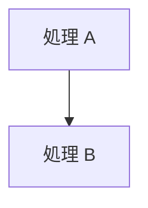

# 07. コーディング規約

本プロジェクトのコードを書くときのルールです。
**学習資料としての読みやすさ**を最優先に決めています。

---

## 1. コメントは XML ドキュメントコメントで書く

宣言（クラス・関数・変数）には `///` で始まる XML ドキュメントコメントを付けます。

```cpp
/// <summary>
/// 指定した番号まで GPU が到達するのを待ちます。
/// </summary>
/// <param name="fenceValue">Signal が返した番号。</param>
/// <exception cref="HrException">完了通知の予約に失敗した場合。</exception>
void WaitForFenceValue(uint64_t fenceValue);
```

### 使うタグ

| タグ | 用途 | 必須 |
|------|------|------|
| `<summary>` | 何をするものかを 1〜2 文で | ◎ 必須 |
| `<param name="x">` | 引数の説明 | 引数があれば |
| `<returns>` | 戻り値の説明 | 戻り値があれば |
| `<exception cref="T">` | 投げる可能性のある例外 | 投げるなら |
| `<typeparam name="T">` | テンプレート引数 | テンプレートなら |
| `<remarks>` | **間違えると壊れる点だけ** 1〜2 行 | 任意 |

### 表示環境について

| エディタ | XML 形式 |
|---------|---------|
| Visual Studio 2019 16.6 以降 | ○ 整形表示 |
| VSCode（C/C++ 拡張） | ✗ タグがそのまま見える |

VSCode の C/C++ 拡張は Doxygen 形式にしか対応していません
（設定は `C_Cpp.doxygen.*` のみで、XML を解釈する項目が存在しない）。

本プロジェクトは **開発は VSCode、コードを読むのは Visual Studio 2026**
という使い分けを前提に、XML 形式を採用しています。

---

## 2. 粒度は一般的な範囲に収める

**長い解説をコメントに書かないでください。** `docs/tutorial/` に書きます。

| 書く場所 | 内容 |
|---------|------|
| `<summary>` | 何をするか。1〜2 文 |
| `<remarks>` | 間違えると壊れる点だけ。1〜2 行 |
| 関数内の `//` | 処理の区切りと、非自明な判断 |
| `docs/tutorial/` | 「なぜそうするのか」「仕組みはどうなっているのか」 |

### 良い例

```cpp
void Renderer::Render()
{
    // (0) このフレームで使うアロケータが空くのを待つ
    const uint32_t frameIndex = m_swapChain.CurrentBackBufferIndex();
    m_commandQueue.WaitForFenceValue(m_frameFenceValues[frameIndex]);

    // (1) コマンドアロケータのリセット
    DX_CHECK(m_commandAllocators[frameIndex]->Reset());
```

区切りが分かり、詳細は解説を読めば分かる、という状態を目指します。

### 避けること

- 自明なコードに逐一コメントを付ける
- `<remarks>` に段落をいくつも書く
- 同じ説明をヘッダと実装の両方に書く（更新漏れの原因）

---

## 3. ヘッダと実装のどちらに書くか

| 内容 | 置き場所 |
|------|---------|
| `<summary>` / `<param>` / `<returns>` / `<exception>` | **ヘッダ**（宣言側） |
| 処理の流れ・非自明な判断 | **実装ファイル**（`//` で） |
| `.cpp` の関数定義 | 1 行の `<summary>` だけ |

```cpp
// CommandQueue.cpp — 定義側は 1 行だけ
/// <summary>
/// GPU の作業が「全部」終わるまで待ちます。
/// </summary>
uint64_t CommandQueue::Flush()
```

`.cpp` の無名 namespace にある定数など、ヘッダに宣言が無いものは
実装ファイル側に `<summary>` を書きます。

---

## 4. 行の折り返し

コメント 1 行は **表示幅 96 桁以内**に収めます（全角は 2 桁として数える）。

- 日本語は任意の文字位置で折り返してよい
- ただし行頭に `。、）」` などの終わり括弧・句読点を置かない（行頭禁則）
- 箇条書きの継続行は、記号のぶん字下げして揃える

```cpp
/// - **ディスクリプタ (Descriptor)** : リソース 1 個ぶんの説明書。「どのアドレスに」
///   「どんな形式で」「どういう用途で」使うかが書かれた小さなデータ構造。
```

---

## 5. ドキュメントの図

**アスキーアートで図を描かないでください。** 次のどちらかを使います。

| 用途 | 使うもの |
|------|---------|
| 処理の流れ・依存関係・状態遷移・Git 履歴 | **Mermaid**（`flowchart` / `sequenceDiagram` / `gitGraph`） |
| メモリ配置・座標系・タイムラインなど、位置関係が意味を持つ図 | **SVG**（`docs/assets/` に置く） |
| ディレクトリ構成・コンソール出力 | コードブロック（そのままで読めるため） |
| 実行結果の証拠（対照実験のスクリーンショットなど） | **PNG**（`docs/assets/` に置く） |

スクリーンショットは「図」ではなく**実測の記録**として扱います。
「わざと壊すとこうなる」という主張は、文章だけでなく実際の画面で示してください。
説明に必要な範囲だけを切り出し、ウィンドウ枠や余白は含めません。

### Mermaid

GitHub と VSCode のプレビューがそのまま描画します。

````markdown

````

日本語ラベルは `[" … "]` のように **必ずダブルクォートで囲みます**。
`()` や `->` を含む場合、囲まないと構文エラーになります。
`<` `>` `&` は `&lt;` `&gt;` `&amp;` と書きます。

### SVG

`docs/assets/` に置き、相対パスで参照します。

```markdown

```

守ること:

- 背景に `#f6f8fa` の矩形を敷く
  （GitHub のダークテーマでも文字が読めるようにするため）
- フォントは
  `"Segoe UI", "Yu Gothic UI", "Hiragino Sans", "Noto Sans JP", sans-serif`
- `viewBox` を必ず指定して拡大縮小できるようにする
- `role="img"` と `aria-label` を付ける
- 図の中で色に意味を持たせるときは、本文でもその意味を書く（色だけに頼らない）

### 配色パレット

守ることは 2 つだけです。

1. **文字は黒（`#1f2328` / 補足は `#3d444d`）だけを使う。**
   色は線・矢印・塗りで示し、**文字そのものに色を持たせない**。
2. **文字と背景のコントラスト比は 7:1 以上**（WCAG AAA）にする。

| 用途 | 線・輪郭・矢印 | 背景（淡色） |
|------|--------------|-------------|
| 通常 | `#1f2328` | `#f6f8fa`（ページ）/ `#ffffff` |
| 補足 | `#3d444d` | 同上 |
| 情報（青） | `#0a4f9e` | `#ddf4ff` |
| 正常（緑） | `#0d4f21` | `#dafbe1` |
| 警告（赤） | `#9a1420` | `#ffebe9` |
| 強調（橙） | `#7a3200` | `#fff1e5` / `#ffd8b5` |
| 注意（黄） | `#8a6d00` | `#fff8c5` |
| 補助の輪郭 | `#6e7781` | `#eaeef2` |

**濃い色を背景にして白抜き文字を置かないこと。**
中間の明度では白文字のコントラストが 3:1 程度まで落ちます。
色で分類を示したいときは、**淡い背景＋黒い文字**にするか、
小さな色見本（14×14 の矩形）を文字の左に置いてください。

### Mermaid で `fill` を指定したら `color` も必ず指定する

```
style A fill:#ddf4ff,stroke:#0a4f9e,color:#1f2328
```

**`color` を省くと GitHub の暗色モードで読めなくなります。**
GitHub は閲覧者のテーマに合わせてラベルの文字色を変えるため、
暗色モードでは文字がほぼ白になります。そこへ `fill` で淡い色だけを
指定すると、**淡い黄色や肌色の背景に白い文字**という組み合わせになります。

SVG は背景を自分で敷いているのでテーマの影響を受けませんが、
Mermaid は GitHub 側が色を決める点が違います。

### コントラストの確認方法

図を追加・変更したら、目視ではなく数値で確認してください。
文字色と、その文字が乗っている図形の塗り色から
[WCAG のコントラスト比](https://www.w3.org/WAI/WCAG21/Understanding/contrast-minimum.html)
を計算します（`fill-opacity` があれば合成後の色で計算する）。

### なぜアスキーアートをやめたのか

- 等幅前提のため、プロポーショナルフォントの環境で崩れる
- 全角・半角が混ざると位置が合わせられない
- 修正するたびに罫線を引き直すことになり、更新されなくなる

Mermaid と SVG はどちらもテキストなので、Git で差分が追えます。

---

## 6. 命名規則

| 対象 | 規則 | 例 |
|------|------|-----|
| クラス・構造体 | PascalCase | `CommandQueue`、`Vertex` |
| メソッド | PascalCase | `WaitForFenceValue()` |
| メンバ変数 | `m_` + camelCase | `m_commandQueue` |
| ローカル変数・引数 | camelCase | `frameIndex`、`fenceValue` |
| 定数（`constexpr`） | `k` + PascalCase | `kBackBufferCount` |
| namespace | 小文字 | `dx12` |
| ファイル | クラス名と一致 | `CommandQueue.h / .cpp` |

DirectX の API 名（`ID3D12Device` など）は当然そのまま使います。

---

## 7. C++ の使い方

| 方針 | 内容 |
|------|------|
| 標準 | C++20（`std::format`、指定初期化など） |
| リソース管理 | RAII。COM は `ComPtr`、`HANDLE` はデストラクタで `CloseHandle` |
| 生ポインタ | 所有しない参照としてのみ使う（`Device()` の戻り値など） |
| `new` / `delete` | 使わない |
| コピー禁止 | GPU / OS リソースを持つクラスは `= delete` を明示 |
| エラー処理 | `HRESULT` は `DX_CHECK` で例外化。`main` で捕捉 |
| 定数 | マジックナンバー禁止。`constexpr` に名前を付ける |

---

## 8. ファイルの大きさ

| 目安 | 値 |
|------|-----|
| 1 ファイル | 400 行前後、最大 800 行 |
| 1 関数 | 50 行以内 |
| ネスト | 4 段まで |

コメントが厚いぶん行数は増えますが、**1 クラス 1 責務**を守れば自然に収まります。
超えたら分割を検討してください（分割の指針は
[04_クラス設計](../../design/クラス設計.md#5-今後の拡張方針) を参照）。

---

## 9. 文字コードと改行

| 項目 | 規則 | 理由 |
|------|------|------|
| `.cpp` / `.h` / `.hlsl` | UTF-8（BOM なし） | `.vcxproj` で `/utf-8` を指定済み |
| `.ps1` | **UTF-8（BOM あり）** | Windows PowerShell 5.1 は BOM が無いと CP932 と誤読して構文エラーになる |
| 改行 | `.gitattributes` に従う | リポジトリ内は LF、Windows 用ファイルは CRLF |

`.ps1` の BOM は特に注意してください。外すと日本語コメントが化けて動かなくなります。

---

## 10. エディタの使い分け

| 用途 | 使うもの | 理由 |
|------|---------|------|
| コードを書く・ビルドする | **VSCode** | 起動が速く、タスクとデバッグを設定済み |
| コードを読む・API を調べる | **Visual Studio 2026** | XML ドキュメントコメントが整形表示される |

VSCode では XML タグがそのまま見えますが、ビルドとデバッグには支障ありません。
`docs/tutorial/` を併読すれば、コメントが短くても仕組みは追えます。
