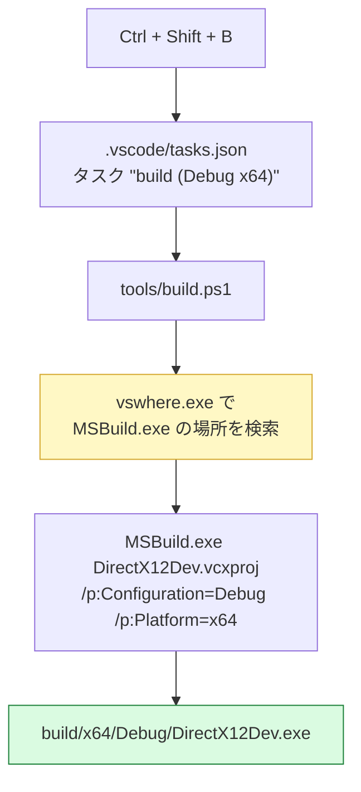

# 01. ビルドと実行方法

## 0. 前提環境

| 項目 | 必要なもの | 確認方法 |
|------|-----------|---------|
| OS | Windows 10 (1903 以降) または Windows 11 | — |
| Visual Studio | 2022 以降（本プロジェクトは 2026 Community で検証） | Visual Studio Installer |
| ワークロード | **C++ によるデスクトップ開発** | Visual Studio Installer で確認 |
| Windows SDK | 10.0.19041 以降（新しければ何でも可） | 上記ワークロードに同梱 |
| GPU | DirectX 12 対応（2013 年以降の GPU はほぼ対応） | `dxdiag` コマンド |

### 推奨: Graphics Tools のインストール

デバッグレイヤー（DirectX の使い方の誤りを検出してくれる機能）を有効にするには、
Windows のオプション機能 **Graphics Tools** が必要です。

```
設定 → システム → オプション機能 → 機能を追加 → "Graphics Tools" を検索してインストール
```

入っていない場合でもアプリは動きますが、起動時のログに次のように出ます。

```
[ERROR] デバッグレイヤーを有効化できませんでした。
```

DirectX 12 の学習では **デバッグレイヤーが最大の味方** なので、必ず入れておくことを勧めます。

---

## 1. VSCode で実行する（推奨）

### 1-1. 必要な拡張機能

VSCode でこのフォルダを開くと「推奨事項」の通知が出ます。以下をインストールしてください。

| 拡張機能 | ID | 役割 |
|---------|-----|------|
| C/C++ | `ms-vscode.cpptools` | **必須**。IntelliSense とデバッガ (`cppvsdbg`) |
| HLSL Tools | `TimGJones.hlsltools` | 任意。`.hlsl` のシンタックスハイライト |

> 注意: 「C/C++ Extension Pack」ではなく単体の「C/C++」で十分です。

### 1-2. ビルド

`Ctrl + Shift + B`

これで `build (Debug x64)` タスクが走ります。裏で行われているのは次のことです。



> `vswhere.exe` で検索しているのは、MSBuild の場所が Visual Studio の
> バージョンやエディションによって変わるためです。
> パスを直接書くと、環境が変わったときに壊れます。

成功すると `build/x64/Debug/DirectX12Dev.exe` が生成されます。

### 1-3. デバッグ実行

`F5`

`.vscode/launch.json` の **Debug (x64)** 構成で起動します。
`preLaunchTask` が設定されているので、ビルドは自動で行われます。

- ブレークポイント … 行番号の左をクリック
- ステップ実行 … `F10`（ステップオーバー）/ `F11`（ステップイン）
- 変数の確認 … 左サイドバーの「変数」パネル
- ログの確認 … 下部ターミナル（`console: integratedTerminal` 指定のため）

### 1-4. ビルドせずに実行だけしたいとき

`Ctrl + Shift + P` → `Tasks: Run Task` → `run (no debug)`

---

## 2. Visual Studio 2026 で実行する

1. `DirectX12Dev.slnx` をダブルクリックして開く
2. 上部のツールバーで構成を **Debug** / **x64** に設定
3. `F5` を押す

作業ディレクトリは `.vcxproj` の `LocalDebuggerWorkingDirectory` で
プロジェクトルートに設定済みなので、シェーダーの読み込みも問題ありません。

### Visual Studio ならではの利点

- **出力ウィンドウ**にデバッグレイヤーのメッセージが表示される
  （`OutputDebugString` 経由。VSCode でも見えますが VS の方が読みやすい）
- **グラフィックスデバッガ**（`Alt + F5`）でフレームをキャプチャし、
  描画命令を 1 つずつ追える

---

## 3. コマンドラインからビルドする

```powershell
# Debug ビルド
.\tools\build.ps1

# Release ビルド
.\tools\build.ps1 -Configuration Release

# 完全に作り直す
.\tools\build.ps1 -Target Rebuild

# 中間ファイルを削除する
.\tools\build.ps1 -Target Clean
```

---

## 4. 実行結果

正しく動作すると、濃紺の背景に **赤・緑・青のグラデーションがかかった三角形** が表示されます。

コンソールには初期化の各段階が出力されます。

```
[INFO ] ===== DirectX 12 Dev : Hello Triangle =====
[INFO ] ウィンドウを生成しました (1280 x 720)
[INFO ] デバッグレイヤーを有効化しました（Debug ビルド）。
[INFO ] DXGI ファクトリを生成しました。
[INFO ] 使用する GPU : NVIDIA GeForce RTX 4070 Ti (VRAM 11994 MB)
[INFO ] D3D12 デバイスを生成しました。
[INFO ] デバッグ情報キューを設定しました（ERROR 以上でブレークします）。
[INFO ] DirectX 12 デバイスの初期化が完了しました。
[INFO ] コマンドキューとフェンスを生成しました。
[INFO ] スワップチェーンを生成しました (1280 x 720, バッファ 2 枚)
[INFO ] コマンドアロケータとコマンドリストを生成しました。
[INFO ] シェーダーを読み込みます: E:\Claude\DirectX12Dev\shaders\Triangle.hlsl
[INFO ] 頂点バッファを作成しました（3 頂点 / 84 バイト）
[INFO ] 三角形描画パイプラインを構築しました。
[INFO ] レンダラの初期化が完了しました。
[INFO ] メインループを開始します。ESC キーまたは × ボタンで終了します。
```

終了は **ESC キー** または **× ボタン**です。

---

## 5. 出力フォルダの構成

```
build/
├─ x64/
│  ├─ Debug/
│  │  ├─ DirectX12Dev.exe   ← 実行ファイル
│  │  └─ DirectX12Dev.pdb   ← デバッグ情報（ブレークポイント等に使用）
│  └─ Release/
└─ intermediate/            ← .obj などの中間ファイル
```

`build/` は `.gitignore` で除外しているため、Git には含まれません。

---

## 6. トラブルシューティング

### ビルド関連

| 症状 | 原因 | 対処 |
|------|------|------|
| `vswhere.exe が見つかりません` | Visual Studio 未インストール | VS 2022 以降をインストール |
| `MSBuild.exe が見つかりません` | C++ ワークロード未導入 | VS Installer で「C++ によるデスクトップ開発」を追加 |
| `d3d12.h が見つかりません` | Windows SDK 未導入 | 同上（ワークロードに含まれる） |
| `LNK2019: 未解決の外部シンボル IID_ID3D12Device` | `dxguid.lib` 未リンク | `.vcxproj` の `AdditionalDependencies` を確認 |
| 警告 C4819（文字コード） | `/utf-8` オプションが効いていない | `.vcxproj` の `AdditionalOptions` を確認 |

### VSCode 関連

| 症状 | 原因 | 対処 |
|------|------|------|
| `#include <d3d12.h>` に赤波線 | IntelliSense の設定 | `.vscode/c_cpp_properties.json` の `compilerPath` を自環境の `cl.exe` に設定（空文字 `""` で自動検出も可） |
| F5 で `type: cppvsdbg が不明` | C/C++ 拡張未導入 | `ms-vscode.cpptools` をインストール |
| タスクが `実行ポリシー` で失敗 | PowerShell の制限 | `tasks.json` は `-ExecutionPolicy Bypass` 済み。それでも出る場合は組織ポリシーを確認 |
| ビルドは通るが F5 で exe が見つからない | 出力先の不一致 | `.vcxproj` の `OutDir` と `launch.json` の `program` を照合 |

### 実行時

| 症状 | 原因 | 対処 |
|------|------|------|
| `アセットファイルが見つかりません` | 作業ディレクトリが違う | `launch.json` の `cwd` を `${workspaceFolder}` に。または `shaders/` の位置を確認 |
| ウィンドウは出るが真っ黒 | 描画されていない | [05_つまずきポイント集](../troubleshooting/05_つまずきポイント集.md) を参照 |
| `D3D12 対応 GPU が見つかりません` | ドライバまたは GPU の問題 | GPU ドライバを更新。WARP で起動はするが非常に低速 |

### PowerShell スクリプトを編集するときの注意

`tools/build.ps1` は **UTF-8 BOM 付き** で保存されています。
Windows PowerShell 5.1 は BOM の無い UTF-8 ファイルをシステムのコードページ（日本語環境では CP932）
として読むため、BOM を外すと日本語コメントが文字化けし、**構文エラーになります**。

エディタで編集する際は「UTF-8 with BOM」を維持してください。
