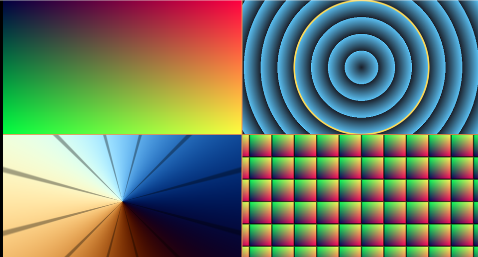

# 01. UV と座標 — すべての出発点



ピクセルシェーダーが知っているのは「**いま塗っているのは画面のどこか**」だけです。
テクスチャも頂点データも無い状態で何が作れるのかを、まず座標そのものを
色にして確かめます。

ソース : [`shaders/lab/01_uv.hlsl`](../../shaders/lab/01_uv.hlsl)

---

## 1. 2 種類の座標を使い分ける

### テクスチャ座標（0〜1）

```hlsl
float2 uv = input.uv;   // 左上が (0,0)、右下が (1,1)
```

画面のどこにいるかを 0〜1 で表したものです。
**画面の縦横比が入っていない**ので、これで円を描くと横に潰れた楕円になります。

### 中心が原点の座標（-1〜1）

```hlsl
float2 p = uv * 2.0f - 1.0f;   // -1〜1（ただし Y は下向き）
p.y = -p.y;                    // 上を +Y にする
p.x *= 幅 / 高さ;               // 縦横比を掛ける
```

図形を扱うときはこちらです。`ToCenteredUv` がこれをやっています。

| | 範囲 | 原点 | 縦横比 | 向いている用途 |
|---|------|------|-------|--------------|
| `uv` | 0〜1 | 左上 | 入っていない | テクスチャを引く、画面を分割する |
| `p` | 縦が -1〜1 | 中心 | 入っている | 円・角度・距離を扱う |

> **`p.x` にだけ縦横比を掛けます。** 縦を基準にするのが慣例です。
> 横を基準にすると、縦長の画面で図形がはみ出します。

---

## 2. 左上 — 座標をそのまま色にする

```hlsl
color = float3(local.x, local.y, 0.25f);
```

U を赤、V を緑に流すだけです。
左上が黒、右上が赤、左下が緑、右下が黄になります。

**これが動けば、シェーダーは正しく動いています。**
何かおかしいときは、まずこれを出して座標系を確かめるのが早道です。

---

## 3. 右上 — 中心からの距離

```hlsl
float r = length(p);
float rings = frac(r * 4.0f);
```

`length()` は原点からの長さです。等しい距離の点が同じ値になるので、
**同心円**ができます。

`frac()` を掛けると 1 ごとに 0 へ折り返すため、等高線のような縞になります。
縞の間隔が「距離 0.25 ごと」であることが目で分かります。

黄色い輪は半径ちょうど 1 の位置です。

```hlsl
StrokeMask(r - 1.0f, 0.012f)
```

`r - 1.0` は「半径 1 の円までの符号付き距離」で、
これが 0 の場所が輪郭になります（[02 章](02_距離関数で図形を描く.md)へ続きます）。

---

## 4. 左下 — 中心から見た角度

```hlsl
float angle = atan2(p.y, p.x) / kTau + 0.5f;
```

`atan2(y, x)` は **-π〜π** を返します。
`2π` で割って `0.5` を足すと **0〜1** になり、そのまま色の帯として使えます。

`atan2` は `atan(y/x)` と違い、**4 象限すべてを区別します**。
`x` が 0 でも壊れません。角度を扱うときは必ずこちらを使います。

放射状の細い線は 12 等分の目盛りです。

```hlsl
float ticks = abs(frac(angle * 12.0f) - 0.5f);
```

`frac(x * n)` は「n 等分したときの、区画の中での位置」になります。
これが [03 章](03_繰り返しと極座標.md)の繰り返しの原理です。

---

## 5. 右下 — `frac` で座標を折り返す

```hlsl
float2 tiled = frac(p * 3.0f);
```

小数部だけを取り出すと、1 ごとに 0 へ戻ります。
**1 マスぶんの計算だけで、無限に並べられる**ことを意味します。

マスの境目は、マスの中の位置が端に近いかどうかで判定しています。

```hlsl
float2 edge = abs(tiled - 0.5f);
smoothstep(0.48f, 0.46f, max(edge.x, edge.y))
```

---

## 6. つまずきやすい点

### V の向き

テクスチャ座標は**上が 0、下が 1** です。
数学の座標（上が +Y）と逆なので、そのまま使うと上下が反転します。

```hlsl
p.y = -p.y;   // これを忘れると、上下が逆さまになる
```

### 縦横比を掛け忘れる

円が楕円になります。「円を描いたのに潰れる」ときは、まずここを疑います。

### `smoothstep` の引数の順序

```hlsl
smoothstep(a, b, x)
```

`x` が `a` のとき 0、`b` のとき 1 を返します。
**`a > b` にすると逆向き**になります。意図的に使うと便利ですが、
うっかり逆にすると「マスクが反転して全面が塗り潰される」という症状になります。

実際この習作集を作る途中で、仕切り線のマスクを反転させてしまい
パネル全体が単色になりました。`DividerMask` として切り出して直しています。

---

## 7. ここから作れるもの

| やりたいこと | 使うもの |
|------------|---------|
| 図形を描く | 距離関数（[02](02_距離関数で図形を描く.md)）|
| 模様を並べる | `frac`（[03](03_繰り返しと極座標.md)）|
| 渦・花を描く | `atan2` と `length`（[03](03_繰り返しと極座標.md)）|
| 色を付ける | cos パレット（[08](08_カラーパレット.md)）|

---

## 参照

- [The Book of Shaders — Algorithmic drawing](https://thebookofshaders.com/05/)
- [atan2 | Microsoft Learn](https://learn.microsoft.com/en-us/windows/win32/direct3dhlsl/dx-graphics-hlsl-atan2)
- [frac | Microsoft Learn](https://learn.microsoft.com/en-us/windows/win32/direct3dhlsl/dx-graphics-hlsl-frac)
- [smoothstep | Microsoft Learn](https://learn.microsoft.com/en-us/windows/win32/direct3dhlsl/dx-graphics-hlsl-smoothstep)
