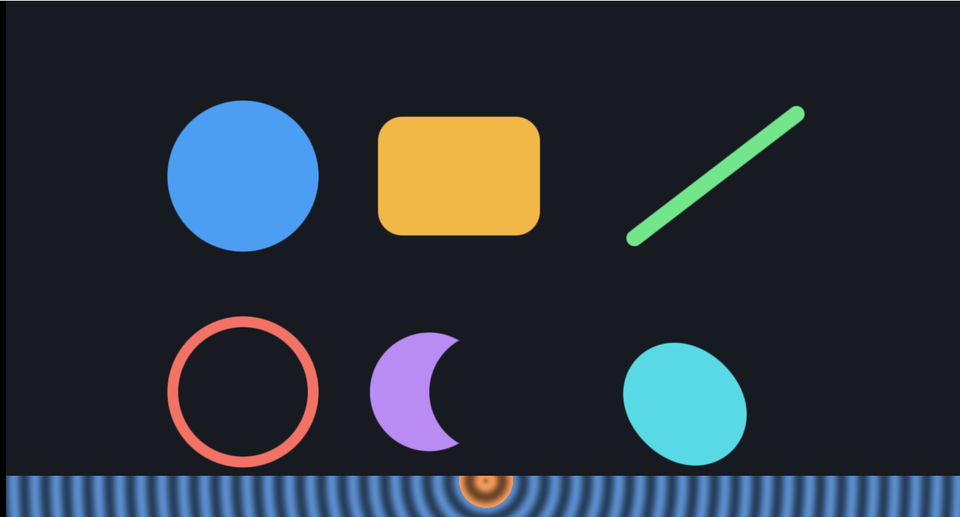

# 02. 距離関数で図形を描く



「その点から図形までの距離」を返す関数さえあれば、
**塗り・輪郭・角の丸め・図形どうしの合成**が、すべて同じ仕組みで作れます。

ソース : [`shaders/lab/02_shapes.hlsl`](../../shaders/lab/02_shapes.hlsl)

---

## 1. 符号付き距離関数（SDF）とは

「図形の**中なら負**、**外なら正**、輪郭でちょうど 0」になる関数です。

いちばん簡単なのは円です。

```hlsl
float SdCircle(float2 p, float radius)
{
    return length(p) - radius;
}
```

中心からの距離が半径より短ければ負、長ければ正。それだけです。

画像のいちばん下の帯は、この距離を縞で可視化したものです。
中心（オレンジ）が図形の内側、外（青）が外側で、
縞の間隔が「距離が一定量進むごと」を表しています。

---

## 2. 距離を「塗り」に変える

```hlsl
float FillMask(float distance)
{
    float width = fwidth(distance);
    return 1.0f - smoothstep(-width, width, distance);
}
```

距離が負（＝内側）なら 1、正なら 0 を返します。
その境目を `smoothstep` でぼかすことで、**輪郭がギザギザになりません**。

### `fwidth` が効いている

```hlsl
float width = fwidth(distance);
```

`fwidth(x)` は「**隣のピクセルとの差**」の目安を返します。
GPU は 2×2 のピクセルをまとめて処理するので、その差から求められます。

これを使うと、図形を拡大しても縮小しても
**ぼかす幅がつねに 1 ピクセルぶん**に保たれます。
固定値（例えば `0.01`）にすると、拡大したときに縁がぼやけ、
縮小したときにギザギザになります。

---

## 3. 距離を「輪郭」に変える

```hlsl
float StrokeMask(float distance, float thickness)
{
    float width = fwidth(distance);
    return 1.0f - smoothstep(thickness - width, thickness + width, abs(distance));
}
```

`abs()` を取ると、内側でも外側でも「輪郭からの距離」になります。
それが `thickness` より小さいところが線です。

画像の左下の赤いリングがこれです。

---

## 4. 角の丸い矩形

```hlsl
float SdRoundedBox(float2 p, float2 halfSize, float radius)
{
    float2 d = abs(p) - halfSize + radius;
    return length(max(d, 0.0f)) + min(max(d.x, d.y), 0.0f) - radius;
}
```

見た目は複雑ですが、やっていることは単純です。

1. `abs(p)` で第 1 象限へ折りたたむ（4 隅を 1 つとして扱える）
2. `length(max(d, 0))` … 外側にいるときの距離
3. `min(max(d.x, d.y), 0)` … 内側にいるときの距離（負の値）
4. 最後に `- radius`

**丸め半径ぶん内側で距離を測り、あとから引く**だけで角が丸くなります。
これは 2D でも 3D でも同じ手が使えます。

---

## 5. 図形どうしの合成

| 演算 | 式 | 意味 |
|------|-----|------|
| 和（合体）| `min(a, b)` | どちらかの中 |
| 積（重なり）| `max(a, b)` | 両方の中 |
| 差（くり抜き）| `max(a, -b)` | a の中で、b の外 |

画像の中央下の三日月が差集合です。

```hlsl
float difference = max(c1, -c2);   // 左の円から右の円をくり抜く
```

### なめらかに繋ぐ（スムーズ和）

`min` をそのまま使うと、繋ぎ目が角張ります。
重なり具合で補間すると、水滴どうしが合わさるような丸みが出ます。

```hlsl
float k = 0.14f;
float h = saturate(0.5f + 0.5f * (d2 - d1) / k);
float smoothUnion = lerp(d2, d1, h) - k * h * (1.0f - h);
```

`k` が大きいほど繋ぎ目が丸くなります。
画像の右下、時間で動く水色の形がこれです。

最後の `- k * h * (1 - h)` が「膨らませる」項です。
これが無いと、ただの線形補間になって丸みが出ません。

---

## 6. つまずきやすい点

### `fwidth` はピクセルシェーダーでしか使えない

隣のピクセルの値が必要なので、頂点シェーダーでは呼べません。
また、`if` の中で呼ぶと結果が不定になることがあります
（分岐で実行されないピクセルがあるため）。**分岐の外で計算**してください。

### 距離が「正確」でなくなる操作がある

- `min` / `max` … 正確なまま
- スムーズ和 … **近似**になる
- 座標のスケーリング … スケール量で割り戻す必要がある

```hlsl
// p を 2 倍したなら、距離も 2 で割る
float d = SdCircle(p * 2.0f, r) / 2.0f;
```

これを忘れると、`FillMask` の境目の太さが狂います。
[11 章](11_レイマーチング.md)のレイマーチングでは、
距離が正確でないと**面を突き抜けます**。

### 内と外を取り違える

`FillMask` は「負を塗る」ので、符号を逆にすると図形の外側が塗られ、
画面全体が単色になります。

---

## 7. ここから作れるもの

| やりたいこと | 使うもの |
|------------|---------|
| 3D の物体を描く | 3D の距離関数（[11](11_レイマーチング.md)）|
| 模様を並べる | 座標を折りたたむ（[03](03_繰り返しと極座標.md)）|
| UI の角丸・影 | `SdRoundedBox` ＋ ぼかし |
| フォントの描画 | 距離場テクスチャ（SDF フォント）|

---

## 参照

- [Inigo Quilez — 2D distance functions](https://iquilezles.org/articles/distfunctions2d/)
  — 本章の距離関数の出典
- [Inigo Quilez — Smooth minimum](https://iquilezles.org/articles/smin/)
  — スムーズ和の解説
- [fwidth | Microsoft Learn](https://learn.microsoft.com/en-us/windows/win32/direct3dhlsl/fwidth)
- Chris Green, "Improved Alpha-Tested Magnification for Vector Textures and
  Special Effects", SIGGRAPH 2007 — SDF フォントの原典
