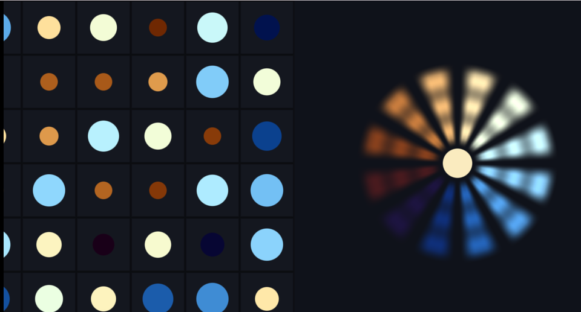

# 03. 繰り返しと極座標 — 座標そのものを作り替える



図形を何個も描くのではなく、**座標を折りたたむ**。
1 個ぶんの計算だけで、無限に並べられます。

ソース : [`shaders/lab/03_tiling.hlsl`](../../shaders/lab/03_tiling.hlsl)

---

## 1. 格子状の繰り返し

```hlsl
float2 scaled = p * 3.0f;
float2 cell   = floor(scaled);          // 何番目のマスか
float2 local  = frac(scaled) - 0.5f;    // マスの中での位置（-0.5〜0.5）
```

この 3 行がすべてです。

- `floor` … **どのマスにいるか**（整数）
- `frac` … **マスの中のどこにいるか**（0〜1）

`- 0.5` するとマスの中心が原点になり、
1 個ぶんの図形を描くコードがそのまま全マスに効きます。

```hlsl
float d = SdCircle(local, radius);   // 円 1 個ぶんの式で、全マスに円が出る
```

### マスごとに違いを出す

全部同じでは面白くありません。**マス番号をハッシュに通す**と、
マスごとに決まった乱数が得られます。

```hlsl
float seed  = Hash21(cell);
float radius = 0.16f + 0.14f * (0.5f + 0.5f * sin(t * 1.4f + seed * kTau));
```

`cell` は整数なので、同じマスなら必ず同じ値になります。
これで「マスごとに大きさと色と位相が違う」模様ができます。

---

## 2. 極座標にしてから繰り返す

直交座標 `(x, y)` を `(角度, 半径)` に置き換えると、
**角度方向の繰り返し＝放射状の模様**になります。

```hlsl
float radius = length(q);
float angle  = atan2(q.y, q.x);

const float kSectors = 12.0f;
float sector = floor((angle + kPi) / kTau * kSectors);   // 何番目の区画か
float local  = frac((angle + kPi) / kTau * kSectors) - 0.5f;
```

`(angle + kPi) / kTau` で角度を **0〜1** に直してから、
格子の繰り返しとまったく同じ手順を踏みます。

### 花びらの形

```hlsl
float petal = abs(local) * 2.0f;
float shape = smoothstep(0.9f, 0.2f, petal)        // 区画の中央ほど太い
            * smoothstep(0.62f, 0.55f, radius)     // 外側の縁
            * smoothstep(0.10f, 0.16f, radius);    // 内側の縁
```

3 つの `smoothstep` を掛け合わせるだけで、花びらの窓ができます。
「**掛ける＝ AND**」と考えると読みやすくなります。

### 半径方向の縞

```hlsl
float rings = 0.5f + 0.5f * cos(radius * 40.0f - t * 3.0f);
```

`cos` の中の `- t` が「外へ流れる」動きを作ります。
符号を逆にすると内へ吸い込まれます。

---

## 3. なぜ「繰り返し」が強力なのか

| 方法 | 100 個並べるとき |
|------|----------------|
| 図形を 100 回描く | 100 回ぶんの計算 |
| 座標を折りたたむ | **1 回ぶんの計算** |

しかも、いくら広げても計算量が増えません。
無限に続く床や壁が、たった数行で書けます。

[11 章](11_レイマーチング.md)では、これを 3D に持ち込みます。

---

## 4. つまずきやすい点

### 距離関数と組み合わせると繋ぎ目が切れる

`frac` でマスを切ると、**隣のマスの図形が見えません**。
図形がマスからはみ出す大きさだと、境目で切れます。

対策は、隣接するマスも調べることです（[06 章](06_ボロノイ.md)の
ボロノイで 3×3 を調べているのは、まさにこれが理由です）。

### 極座標の継ぎ目

`atan2` は -π と π が同じ場所なので、
そこで値が飛びます。区画数が整数でないと、**1 か所だけ幅が違う区画**ができます。

```hlsl
const float kSectors = 12.0f;   // 整数にする
```

### 負の座標で `frac` の挙動が変わる

HLSL の `frac(x)` は「x - floor(x)」なので、負でも 0〜1 を返します
（C の `fmod` とは違います）。ここは HLSL のほうが素直です。

---

## 5. ここから作れるもの

| やりたいこと | 使うもの |
|------------|---------|
| 万華鏡 | 極座標＋鏡映（`abs(local)`）|
| 無限に続く床 | 3D で `frac` を使う（[11](11_レイマーチング.md)）|
| 迷路模様 | マスごとに 2 種類を選ぶ（[13](13_トルシェタイル.md)）|
| セル模様 | マスごとに種を置く（[06](06_ボロノイ.md)）|

---

## 参照

- [The Book of Shaders — Patterns](https://thebookofshaders.com/09/)
- [Inigo Quilez — Domain repetition](https://iquilezles.org/articles/sdfrepetition/)
- [floor / frac | Microsoft Learn](https://learn.microsoft.com/en-us/windows/win32/direct3dhlsl/dx-graphics-hlsl-intrinsic-functions)
