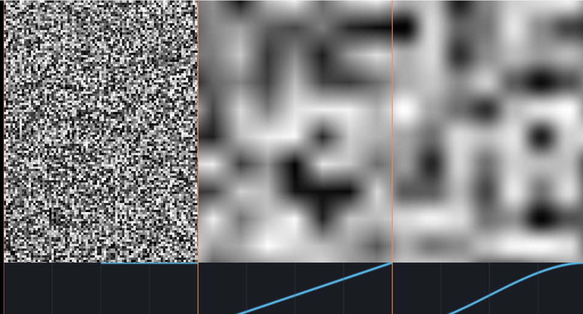

# 04. ノイズ — 乱数となめらかさ



GPU には乱数の種がありません。
「**座標から必ず同じ値を作る関数**」を自分で用意し、
それをなめらかに繋いでノイズにします。

ソース : [`shaders/lab/04_noise.hlsl`](../../shaders/lab/04_noise.hlsl)

画面は左から順に「そのままのハッシュ」「直線で補間」「曲線で補間」。
下の帯は、それぞれで使っている補間の形です。

---

## 1. ハッシュ — 座標から決まった乱数を作る

```hlsl
float Hash21(float2 p)
{
    float3 p3 = frac(p.xyx * 0.1031f);
    p3 += dot(p3, p3.yzx + 33.33f);
    return frac((p3.x + p3.y) * p3.z);
}
```

大事なのは 2 点です。

1. **同じ座標なら必ず同じ値**（毎フレーム変わらない模様が作れる）
2. **途中の値を 0〜1 付近に保つ**（32 bit 浮動小数点で桁が溢れない）

2 点目を守らないと、模様に縞や階段が出ます。
実際にこの習作集を作る途中で嵌まりました
（[15 章](15_ハッシュの精度.md)で並べて見せています）。

画面いちばん左は、ハッシュの値をそのまま描いたものです。
**砂嵐にしかなりません。** 隣どうしがまったく無関係だからです。

---

## 2. 格子の乱数を繋ぐ — 値ノイズ

自然な模様には「近い場所は似た値」という性質が要ります。
そこで、**格子の頂点にだけ乱数を置き、あいだを補間**します。

```hlsl
float2 cell  = floor(p);
float2 local = frac(p);

float a = Hash21(cell + float2(0, 0));   // 左下
float b = Hash21(cell + float2(1, 0));   // 右下
float c = Hash21(cell + float2(0, 1));   // 左上
float d = Hash21(cell + float2(1, 1));   // 右上

return lerp(lerp(a, b, w.x), lerp(c, d, w.x), w.y);
```

横に 2 回、縦に 1 回。合計 3 回の `lerp` で 4 隅を混ぜます（双線形補間）。

---

## 3. 補間の「形」が見た目を決める

画面の真ん中と右の違いは、`w` の作り方だけです。

### 直線で補間（真ん中）

```hlsl
float2 w = local;
```

値は繋がりますが、**傾きが格子の線で急に変わります**。
そのため、格子の線がくっきり見えます。

### 曲線で補間（右）

```hlsl
float2 w = local * local * (3.0f - 2.0f * local);
```

これは `smoothstep` と同じ式（3t² − 2t³）です。

| t | 0 | 0.5 | 1 |
|---|---|-----|---|
| 値 | 0 | 0.5 | 1 |
| 傾き | **0** | 1.5 | **0** |

**両端で傾きが 0** になるのが肝心です。
隣の格子と傾きが揃うので、格子の線が消えます。

下の帯がこの 3 つの形（階段・直線・曲線）を並べたものです。

> **もっとなめらかにしたいなら** 6t⁵ − 15t⁴ + 10t³ を使います。
> こちらは 2 階微分も 0 になるので、法線を計算しても継ぎ目が出ません。
> Ken Perlin が後年に提案した改良版です。

---

## 4. 値ノイズと勾配ノイズ

ここで作ったのは**値ノイズ**（格子に「値」を置く）です。
もう 1 つ、格子に「傾き」を置く**勾配ノイズ**（パーリンノイズ）があります。

| | 置くもの | 特徴 |
|---|---------|------|
| 値ノイズ | 値 | 実装が簡単。格子が見えやすい |
| 勾配ノイズ | 傾き | 格子が目立ちにくい。少し重い |

本習作集では、実装が短く読みやすい値ノイズを使っています。

---

## 5. つまずきやすい点

### `floor` と `frac` は必ず同じ座標から取る

```hlsl
float2 cell  = floor(p);
float2 local = frac(p);   // p を変えてはいけない
```

途中で `p` を書き換えると、セル番号と局所座標がずれて模様が壊れます。

### ハッシュの質を確かめる

「なんとなく乱れていればいい」と思っていると、あとで縞が出ます。
**ハッシュ単体を画面に出して砂嵐になるか**を先に確かめてください。
規則的な模様が見えたら、そのハッシュは使えません。

### 座標が大きいほど壊れやすい

原点から離れた場所ほど、浮動小数点の有効桁が足りなくなります。
広い地形を作るときは要注意です。

---

## 6. ここから作れるもの

| やりたいこと | 使うもの |
|------------|---------|
| 雲・地形・煙 | 細かさを重ねる（[05](05_fBmと雲.md)）|
| 大理石・炎 | 座標を歪ませる（[07](07_ドメインワープ.md)）|
| ざらつき | そのままのハッシュ（[14](14_画面効果.md)）|
| セル模様 | 種を置いて最近傍（[06](06_ボロノイ.md)）|

---

## 参照

- [The Book of Shaders — Noise](https://thebookofshaders.com/11/)
- Ken Perlin, "An Image Synthesizer", SIGGRAPH 1985 — ノイズの原典
- Ken Perlin, "Improving Noise", SIGGRAPH 2002 — 6t⁵−15t⁴+10t³ の提案
- Dave Hoskins, ["Hash without Sine"](https://www.shadertoy.com/view/4djSRW)
- [lerp | Microsoft Learn](https://learn.microsoft.com/en-us/windows/win32/direct3dhlsl/dx-graphics-hlsl-lerp)
