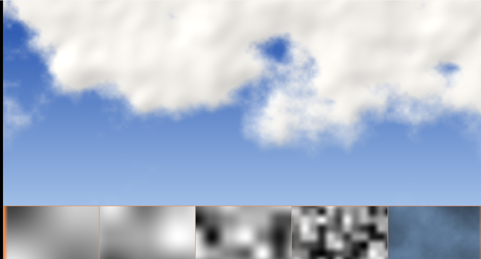

# 05. fBm と雲 — 細かさを重ねる



自然物は「**大きなうねりの上に、細かいざらつきが乗っている**」構造をしています。
2 倍細かく・半分の強さで、を繰り返すだけでそれらしくなります。

ソース : [`shaders/lab/05_fbm.hlsl`](../../shaders/lab/05_fbm.hlsl)

下の帯は、左から順に 1 段目・2 段目・3 段目・4 段目、
そしていちばん右が「全部を足した結果」です。

---

## 1. fBm（fractional Brownian motion）

```hlsl
float Fbm(float2 p, int octaves)
{
    float sum       = 0.0f;
    float amplitude = 0.5f;

    for (int i = 0; i < octaves; ++i)
    {
        sum += ValueNoise(p) * amplitude;
        p *= 2.0f;          // 2 倍細かく
        amplitude *= 0.5f;  // 半分の強さで
    }

    return sum;
}
```

たった 5 行です。1 段ごとの倍率が

- 周波数（細かさ）… **2 倍**
- 振幅（強さ）… **1/2**

なので、合計は `0.5 + 0.25 + 0.125 + … → 1` に収束します。
段数を増やしても値が 1 を超えません。これは扱いやすい性質です。

### 用語

| 呼び方 | 意味 |
|-------|------|
| オクターブ | 段。周波数が 2 倍になるので音楽の 1 オクターブと同じ |
| ラキュナリティ | 周波数の倍率（ここでは 2.0）|
| ゲイン | 振幅の倍率（ここでは 0.5）|

ゲインを 0.5 より大きくすると、細かい成分が強くなって荒れます。
小さくすると、なめらかで平板になります。

---

## 2. 雲にする

### しきい値で切り分ける

```hlsl
float coverage = smoothstep(0.38f, 0.66f, density);
```

「ここから雲」という線を引きます。
`step` ではなく `smoothstep` にすることで、**縁がふわっと**します。

### 高さで重み付け

```hlsl
density *= 0.55f + 0.75f * smoothstep(-0.5f, 0.9f, centered.y);
```

上のほうほど雲が多くなります。
これだけで「地平線が空いている」自然な絵になります。

### 動かす

```hlsl
float2 p = centered * 2.0f + float2(t * 0.05f, 0.0f);
```

**座標をずらすだけ**で流れます。模様そのものは何も変えていません。

---

## 3. 密度の勾配から陰影を作る

雲を立体的に見せるには、光を当てる必要があります。
そこで、**密度の変化の向き**を法線とみなします。

```hlsl
const float e = 0.06f;
float dx = Fbm(p + float2(e, 0.0f), 3) - Fbm(p - float2(e, 0.0f), 3);
float dy = Fbm(p + float2(0.0f, e), 3) - Fbm(p - float2(0.0f, e), 3);

float3 normal = normalize(float3(-dx, -dy, 0.45f));
```

[22 章](../tutorial/22_法線マップ.md)の法線マップとまったく同じ考え方です。
「隣との差が、その向きの傾き」。

### 勾配は段数を減らして取る

```hlsl
Fbm(p + ..., 3)   // 6 ではなく 3
```

**ここが実際に嵌まったところです。**

6 段まで含めて差分を取ると、いちばん細かい段は座標が 32 倍されているため、
`e = 0.06` のずれが「32 × 0.06 = 1.9 マスぶん」になります。
隣のマスどころか 2 マス先を読んでしまい、差分がほとんど乱数になります。

その結果、**雲に細かい筋が出ました**。
段数を減らし、`e` を大きめに取ると消えます。

> **一般則 :** 勾配を取るときの `e` は、
> 「いちばん細かい成分の 1 周期より十分小さく、かつ数値誤差より十分大きく」。
> 両立しないなら、細かい成分を勾配から外します。

---

## 4. つまずきやすい点

### 段数を増やしすぎる

画面 1 ピクセルより細かい成分を足しても、見えないうえに
**ちらつきの原因**になります。目安は「1 ピクセルに 1 周期」まで。

### 値が 0〜1 に収まらない

ゲインが 0.5 なら 1 に収束しますが、変えると収まりません。
しきい値を使う前に、範囲を確かめてください。

### ハッシュが弱いと縞が出る

fBm は同じハッシュを何度も違うスケールで呼ぶので、
ハッシュの欠陥がそのまま増幅されます（[15 章](15_ハッシュの精度.md)）。

---

## 5. ここから作れるもの

| やりたいこと | 変えるところ |
|------------|------------|
| 地形の高さ | `density` をそのまま高さにする |
| 炎・煙 | 座標を上へ流し、色を暖色に |
| 木目・大理石 | `sin(p.x + fbm(p) * k)` |
| 荒れた岩 | ゲインを 0.6 前後に上げる |
| 雲を動かす | 座標に時間を足す（3 次元ノイズならもっと自然）|

---

## 参照

- [Inigo Quilez — fBm](https://iquilezles.org/articles/fbm/)
- [The Book of Shaders — Fractal Brownian Motion](https://thebookofshaders.com/13/)
- Benoit Mandelbrot & John van Ness, "Fractional Brownian Motions,
  Fractional Noises and Applications", SIAM Review 1968 — 名前の由来
- [22 章 法線マップ](../tutorial/22_法線マップ.md) — 勾配から法線を作る話
