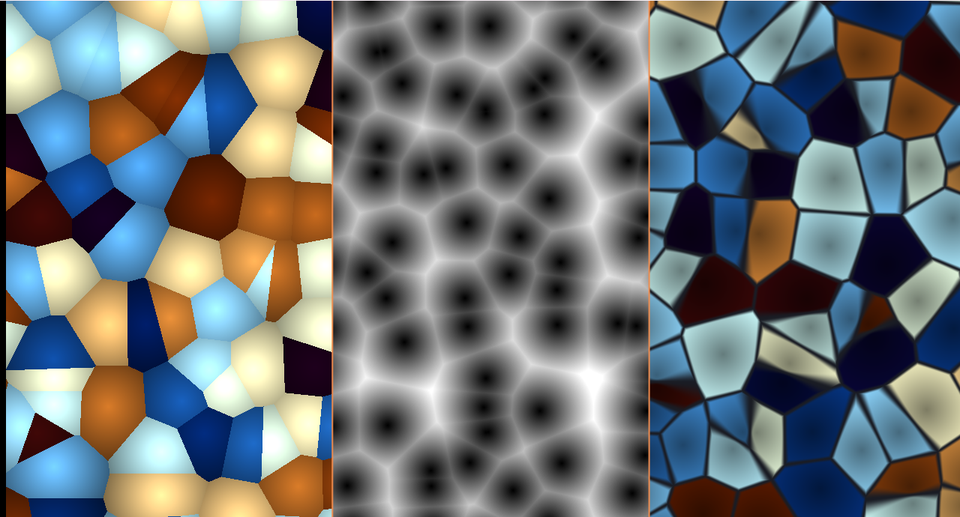

# 06. ボロノイ — いちばん近い種で塗り分ける



細胞、ひび割れ、石畳、鱗、乾いた泥。
自然の「区画」はだいたいこれで作れます。

ソース : [`shaders/lab/06_voronoi.hlsl`](../../shaders/lab/06_voronoi.hlsl)

左から「区画ごとに色を塗る」「最近傍までの距離」「境界線を描く」。

---

## 1. 考え方

平面に種を何個か撒き、**各点をいちばん近い種の色で塗る**。それだけです。

素朴にやると「全部の種との距離を測る」ことになり、種が増えるほど重くなります。
そこで、**マスごとに種を 1 個だけ置く**という制約を入れます。

こうすると、いちばん近い種は必ず**自分のマスか、その隣 8 マス**にいます。
調べるのは 3×3 の 9 マスだけで済みます。

```hlsl
for (int y = -1; y <= 1; ++y)
{
    for (int x = -1; x <= 1; ++x)
    {
        float2 seed = Hash22(cell + float2(x, y));   // そのマスの種
        float d = length(float2(x, y) + seed - local);
        ...
    }
}
```

---

## 2. F1 と F2

```hlsl
float f1 = 8.0f;   // いちばん近い種までの距離
float f2 = 8.0f;   // 2 番目に近い種までの距離
```

この 2 つを持っておくと、表現が一気に広がります。

### F1 だけ — 石のような塊（中央）

```hlsl
color = float3(f1, f1, f1);
```

種のまわりが暗く、境界へ向かって明るくなります。

### F1 の「番号」 — 区画ごとの色（左）

```hlsl
color = PaletteWarm(id);          // id はそのマスのハッシュ
color *= 0.55f + 0.65f * (1.0f - f1);
```

区画ごとにばらばらの色を塗り、中心へ向かって暗くすると立体感が出ます。

### F2 − F1 — 境界線（右）

```hlsl
float edge = smoothstep(0.0f, 0.12f, f2 - f1);
```

**1 番目と 2 番目の距離が近い＝ちょうど 2 つの種の真ん中＝境界**です。
ひび割れや細胞壁はこれで作れます。

この「F2 − F1」は、ボロノイでいちばん使われる形かもしれません。

---

## 3. 種を動かす

```hlsl
seed = 0.5f + jitter * 0.5f * sin(time + kTau * seed);
```

種の位置を時間で振ると、区画がぬるぬる変形します。

`jitter` を 0 にすると種はマスの中心に固定され、**正方形の格子**になります。
1 にするとマス全体に散らばります。

> **`jitter` を 1 より大きくしてはいけません。** 種がマスの外へ出ると、
> 「3×3 を調べれば足りる」という前提が崩れ、区画の形が壊れます。

---

## 4. つまずきやすい点

### 3×3 では足りない場合がある

種がマスの端にあり、かつ隣の隣に近い種があると、まれに取りこぼします。
`jitter` を 1 以下に保てば起きません。厳密さが要るなら 5×5 にします。

### `Hash22` の質

種の位置がハッシュで決まるので、ハッシュに偏りがあると
**区画が直線的に並びます**。x と y に別の係数を使うのはそのためです。

### 距離の測り方を変えると形が変わる

| 距離 | 式 | 区画の形 |
|------|-----|---------|
| ユークリッド | `length(d)` | 多角形（本習作）|
| マンハッタン | `abs(d.x) + abs(d.y)` | 斜めの直線的な区画 |
| チェビシェフ | `max(abs(d.x), abs(d.y))` | 正方形寄り |

用途に応じて選べます。

---

## 5. ここから作れるもの

| やりたいこと | 使うもの |
|------------|---------|
| ひび割れ・乾いた泥 | F2 − F1 を細く |
| 鱗・羽 | 区画ごとに向きを変えた図形 |
| 石畳 | F1 を高さにして法線を作る |
| 水面のコースティクス | 動く種＋ F1 の逆数 |
| セルラーノイズ | F1 を fBm のように重ねる |

---

## 参照

- Steven Worley, "A Cellular Texture Basis Function", SIGGRAPH 1996 — 原典
- [Inigo Quilez — Voronoi edges](https://iquilezles.org/articles/voronoilines/)
- [Inigo Quilez — Smooth Voronoi](https://iquilezles.org/articles/smoothvoronoi/)
- [The Book of Shaders — Cellular Noise](https://thebookofshaders.com/12/)
