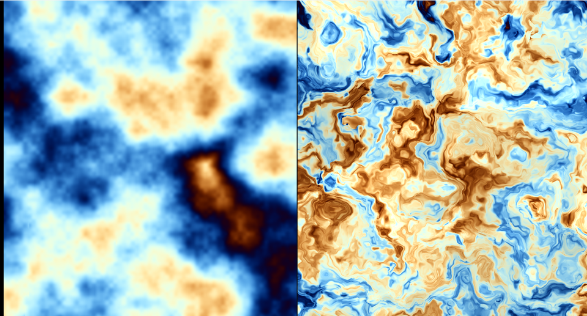

# 07. ドメインワープ — 模様ではなく座標を歪ませる



左が普通の fBm、右がドメインワープをかけたものです。
**同じノイズ関数**を使っているのに、見え方がまったく違います。

ソース : [`shaders/lab/07_domainwarp.hlsl`](../../shaders/lab/07_domainwarp.hlsl)

---

## 1. 発想

普通は `fbm(p)` を計算します。ドメインワープは、
その **`p` そのものをノイズでずらして**から計算します。

```
普通       : fbm(p)
1 段ワープ : fbm(p + fbm(p))
2 段ワープ : fbm(p + fbm(p + fbm(p)))
```

たったこれだけで、渦を巻いた有機的な模様になります。
大理石、煙、雲の乱流、木星の縞。どれもこの手です。

---

## 2. 実装

```hlsl
// 1 段目 : ずらす量そのものをノイズで作る
float2 q = float2(Fbm(p + float2(0.0f, 0.0f) + t, 5),
                  Fbm(p + float2(5.2f, 1.3f) + t, 5));

// 2 段目 : ずらした座標で、さらにずらす量を作る
float2 r = float2(Fbm(p + 4.0f * q + float2(1.7f, 9.2f) + t * 1.4f, 5),
                  Fbm(p + 4.0f * q + float2(8.3f, 2.8f) + t * 1.1f, 5));

// 最後に、2 段ぶんずらした座標でノイズを引く
float value = Fbm(p + 4.0f * r, 5);
```

### 定数の意味

| 場所 | 意味 |
|------|------|
| `float2(5.2f, 1.3f)` | **同じ座標から違う値**を得るためのずらし |
| `4.0f *` | ワープの強さ。大きいほど激しく渦を巻く |
| `+ t` | 時間。流れる |

`x` 成分と `y` 成分で違う定数を足しているのが要点です。
同じ定数だと `q.x == q.y` になり、斜め方向にしか歪みません。

---

## 3. なぜこうなるのか

`fbm(p)` は「なめらかにうねる高さ場」です。
その値で座標をずらすということは、
**平面をゴムのように引き伸ばして、それからノイズを貼る**のと同じです。

引き伸ばし方自体がなめらかなので、模様は破綻せず、
しかし直線的な繰り返しは消え、渦や筋が現れます。

段を重ねるほど「引き伸ばしを引き伸ばす」ことになり、
細部にまで構造が入ります。

### 中間の値も使える

```hlsl
color = lerp(color, color * (0.55f + 0.85f * r.x), 0.55f);
```

`q` や `r` は「どちらへどれだけずらしたか」なので、
色に混ぜると**流れの向き**が見えてきます。

---

## 4. つまずきやすい点

### 重い

段を 1 つ増やすごとに `Fbm` の呼び出しが 2 倍近く増えます。
2 段ワープ・各 5 オクターブなら、`ValueNoise` は
**5 × (1 + 2 + 2) = 25 回**呼ばれます。

高解像度では効きます。実用では段数とオクターブ数を削るか、
テクスチャに焼き込みます。

### ずらしの定数を揃えると平凡になる

```hlsl
// 悪い例 : x と y が同じ値になり、斜め方向にしか歪まない
float2 q = float2(Fbm(p, 5), Fbm(p, 5));
```

### 強さを上げすぎると潰れる

`4.0f` を `20.0f` などにすると、模様が細かくなりすぎて
灰色のもやになります。「渦が見える」範囲に留めるのが肝心です。

---

## 5. ここから作れるもの

| やりたいこと | 変えるところ |
|------------|------------|
| 大理石 | `sin(p.x * k + warp)` で縞を作る |
| 炎 | 座標を上へ流し、暖色のパレット |
| 木星の縞 | 横方向の縞＋弱いワープ |
| 水彩のにじみ | ワープを弱く、パレットを淡く |
| 地形の川 | ワープした fBm を高さにする |

---

## 参照

- [Inigo Quilez — Domain warping](https://iquilezles.org/articles/warp/)
  — 本章の式の出典。木星の絵で有名
- [The Book of Shaders — Fractal Brownian Motion](https://thebookofshaders.com/13/)
- [05 fBm と雲](05_fBmと雲.md) — 土台になっている fBm
