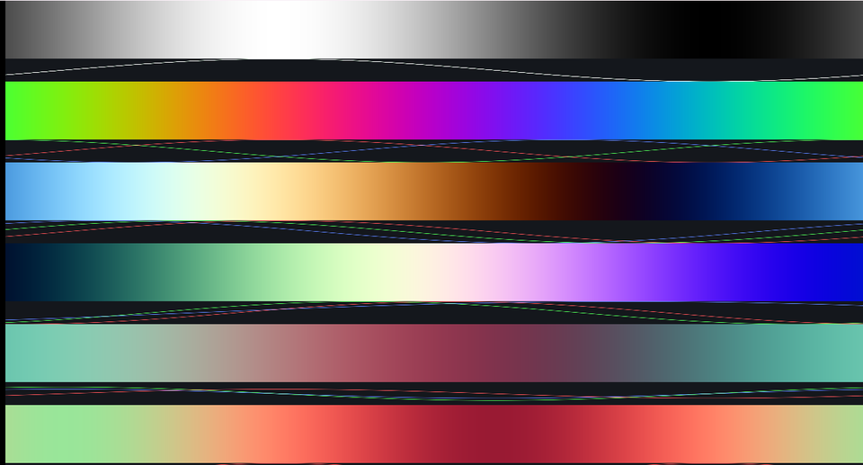

# 08. カラーパレット — cos 4 本で色の帯を作る



```
色(t) = a + b · cos(2π (c·t + d))
```

**4 つのベクトルを選ぶだけ**で、途切れずに繋がる色の帯が作れます。
各帯の下にある 3 本の曲線が、R・G・B それぞれの値です。

ソース : [`shaders/lab/08_palette.hlsl`](../../shaders/lab/08_palette.hlsl)

---

## 1. 4 つのベクトルの意味

```hlsl
float3 Palette(float t, float3 a, float3 b, float3 c, float3 d)
{
    return a + b * cos(kTau * (c * t + d));
}
```

| 記号 | 意味 | 大きくすると |
|------|------|------------|
| `a` | 明るさの中心（オフセット）| 全体が明るくなる |
| `b` | 振れ幅（振幅）| 色の変化が激しくなる |
| `c` | 繰り返しの速さ（周波数）| t の範囲で何度も色が回る |
| `d` | 位相のずれ | 色相が回る |

`a` と `b` はふつう `0.5` にします。
`cos` が -1〜1 なので、`0.5 + 0.5 × cos` で **0〜1** に収まるからです。

---

## 2. 画面の 6 本

| 帯 | 設定 | 見え方 |
|----|------|-------|
| 1 | `d = (0, 0, 0)` | 3 成分が同位相 → **灰色の濃淡** |
| 2 | `d = (0, 0.33, 0.67)` | 1/3 ずつずらす → **虹** |
| 3 | `d = (0, 0.10, 0.20)` | わずかにずらす → 青 → 桃 → 黄 |
| 4 | `c = (1, 1, 0.5)` | 青だけゆっくり → 複雑な色 |
| 5 | `b = (0.2, 0.3, 0.2)` | 振れ幅が小さい → **落ち着いた色** |
| 6 | `a = (0.8, 0.5, 0.4)` | 中心が暖色寄り → 全体が暖かい |

3 番目が本プロジェクトの `PaletteWarm` です。
このリポジトリの図の色味は、ほぼこれで作っています。

---

## 3. なぜ `cos` なのか

### 途切れない

`t` が 1 増えると `cos` は 1 周して元に戻ります。
つまり **0 と 1 が繋がる**ので、`frac` で折り返しても継ぎ目が出ません。

グラデーションを配列で持つと、端の処理を自分で書く必要があります。

### 軽い

テクスチャを引かずに、`cos` 3 回で済みます。
色を「表」ではなく「式」で持てるのが強みです。

### 調整しやすい

4 つのベクトル（12 個の数）を触るだけで、
無限に近い数のパレットが作れます。
`a` と `b` は明るさ、`c` と `d` は色相、と役割が分かれているのも扱いやすい点です。

---

## 4. つまずきやすい点

### 範囲が 0〜1 を外れる

`a + b` が 1 を超えると白飛び、`a - b` が 0 を下回ると黒潰れします。
`saturate` を通すか、`a` と `b` の組み合わせを守ります。

### 位相の単位

```hlsl
cos(kTau * (c * t + d))
```

`kTau = 2π` を掛けているので、`d = 0.5` で**半周**です。
`d` をラジアンだと思って `3.14` を入れると、3 周以上回ります。

### リニア空間かどうか

この式で作った値は「そのまま画面に出したい色」です。
本習作集では `LabOutput` が sRGB → リニアの変換を掛けています
（[19 章](../tutorial/19_色を正しく扱う_sRGB.md)）。

ライティングの計算に混ぜるなら、リニアとして扱うか変換するかを決めておきます。

---

## 5. ここから作れるもの

| やりたいこと | 使い方 |
|------------|-------|
| ノイズに色を付ける | `PaletteWarm(fbm(p))` |
| 高さで色を変える | `Palette(height, ...)` |
| 反復回数を色にする | `Palette(iteration * k, ...)`（[12](12_マンデルブロ集合.md)）|
| 温度・速度の可視化 | `c` を大きくして目盛りを増やす |
| ID ごとの色分け | `Palette(hash(id), ...)`（[06](06_ボロノイ.md)）|

---

## 参照

- [Inigo Quilez — Palettes](https://iquilezles.org/articles/palettes/)
  — この式の出典。パラメータの選び方の作例が豊富
- [cos | Microsoft Learn](https://learn.microsoft.com/en-us/windows/win32/direct3dhlsl/dx-graphics-hlsl-cos)
- [19 章 色を正しく扱う](../tutorial/19_色を正しく扱う_sRGB.md)
