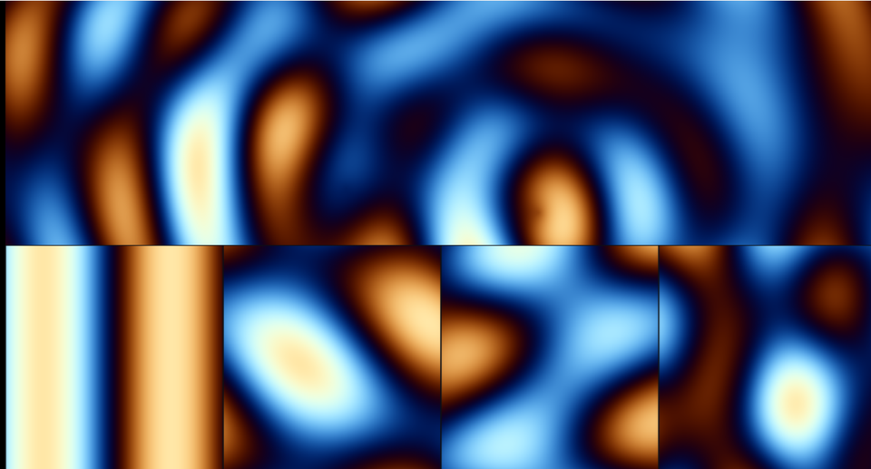

# 09. プラズマ — 波の重ね合わせ



`sin` を、向きと速さを変えて何本か足すだけ。
それだけで複雑に見える模様ができます。
1980 年代のデモシーンから続く、いちばん古典的な手口です。

ソース : [`shaders/lab/09_plasma.hlsl`](../../shaders/lab/09_plasma.hlsl)

上半分は「1 本」「2 本」「3 本」「4 本」を並べたもの、
下半分が 4 本を足した完成形です。

---

## 1. 波の 4 つの形

```hlsl
// ① 横方向の波
float v = sin(p.x * 2.0f + t);

// ② 斜め方向の波
v += sin(dot(p, normalize(float2(0.7f, 0.5f))) * 3.0f - t * 1.3f);

// ③ 同心円の波
v += sin(length(p - float2(1.2f, 0.4f)) * 4.0f - t * 2.0f);

// ④ 中心が動く波
float2 center = float2(cos(t * 0.7f), sin(t * 0.5f)) * 1.2f;
v += sin(length(p - center) * 3.5f + t);
```

### 平面波 — `dot(p, dir)`

`dot(p, dir)` は「**その向きに測った座標**」です。
`dir` が `(1, 0)` なら `p.x` そのもの、`(0, 1)` なら `p.y`。
斜めにすれば斜めの縞になります。

`dir` を正規化しておかないと、周波数が向きによって変わります。

### 円形波 — `length(p - center)`

中心からの距離で振動させると、水面に石を落としたような同心円になります。

### 時間の符号

```hlsl
sin(... - t)   // 外へ進む
sin(... + t)   // 内へ集まる
```

---

## 2. 足したあとの正規化

4 本足すと値は **-4〜4** です。0〜1 に直します。

```hlsl
v = v * 0.125f + 0.5f;   // 1/8 して 0.5 を足す
```

本数が変わったら割る数も変えます。
上半分では本数が違うので、`/ count` で揃えています。

---

## 3. なぜ「複雑に見える」のか

`sin` は 1 本ならただの縞です。
2 本を違う向きで足すと、**周期が最小公倍数**になり、
すぐには繰り返しが見えなくなります。

向きを「割り切れない角度」にすると、繰り返しの周期はさらに長くなります。

```hlsl
float angle = (float)i * 1.1f;   // 1.1 は π の有理数倍ではない
```

上半分の 4 区画を見比べると、本数が増えるほど
「格子」から「渦」へ変わっていくのが分かります。

---

## 4. つまずきやすい点

### 全部同じ向きにすると縞のまま

向きを変えないと、いくら足しても縞にしかなりません。

### 周波数を揃えると干渉縞が強く出る

同じ周波数で向きだけ変えると、モアレのような規則的な模様になります。
それを狙うなら良いのですが、自然な模様が欲しいなら周波数もずらします。

### 値の範囲を忘れる

`sin` を足した合計の範囲を意識しないと、
パレットに渡したときに色が偏ります。

---

## 5. ノイズとの違い

| | プラズマ | ノイズ |
|---|---------|-------|
| 中身 | `sin` を数本 | 乱数を補間 |
| 見え方 | なめらか・規則的 | ざらつき・不規則 |
| 計算 | 軽い | やや重い |
| 用途 | エネルギー・水面・光 | 自然物・地形・雲 |

両方を組み合わせると、
「大きなうねりは波、細部はノイズ」という自然な絵になります
（[10 章](10_水面.md)がそれです）。

---

## 6. ここから作れるもの

| やりたいこと | 使うもの |
|------------|---------|
| 水面 | 波を高さにして法線を作る（[10](10_水面.md)）|
| 波紋・衝撃波 | 円形波の中心を動かす |
| 旗・布のはためき | 波で頂点を動かす（頂点シェーダー）|
| オーロラ | 縦に伸ばした波＋パレット |
| 干渉縞の実験 | 2 本の円形波を近づける |

---

## 参照

- [The Book of Shaders — Shaping functions](https://thebookofshaders.com/05/)
- Jerry Tessendorf, "Simulating Ocean Water", SIGGRAPH 2001
  — 本格的な波の合成（FFT を使う）
- [sin / cos | Microsoft Learn](https://learn.microsoft.com/en-us/windows/win32/direct3dhlsl/dx-graphics-hlsl-intrinsic-functions)
