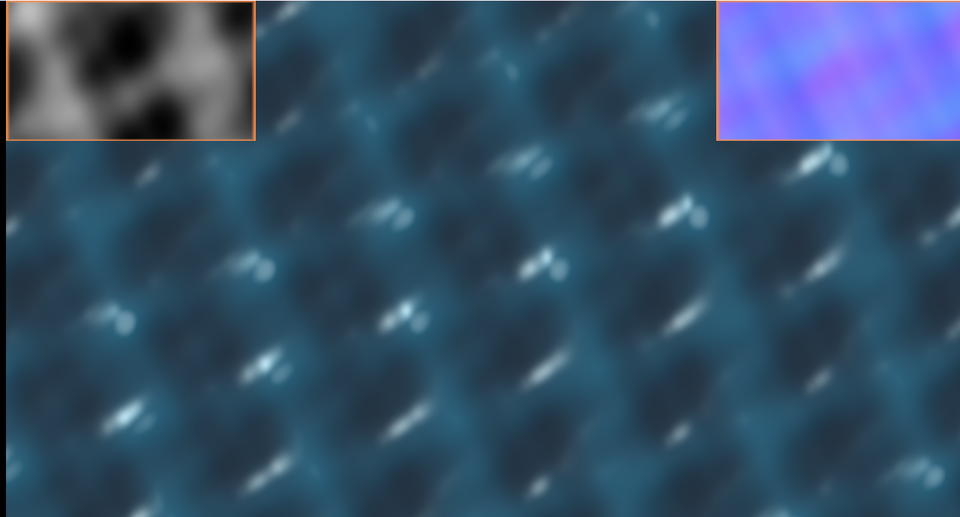

# 10. 水面 — 高さ → 法線 → 反射



[11 章](../tutorial/11_陰影を付ける_法線とライティング.md)でやったライティングを、
モデルではなく「**計算で作った面**」に適用します。

左上の枠が高さそのもの、右上の枠が法線を色にしたものです。

ソース : [`shaders/lab/10_water.hlsl`](../../shaders/lab/10_water.hlsl)

---

## 1. 波の高さを作る

```hlsl
float WaveHeight(float2 p, float2 dir, float frequency, float speed,
                 float amplitude, float sharpness, float time)
{
    float phase = dot(p, dir) * frequency + time * speed;
    float s = sin(phase) * 0.5f + 0.5f;
    return amplitude * pow(s, sharpness);
}
```

`sin` をそのまま使うと**丸い波**になります。
0〜1 に直してから累乗すると、**山が尖り谷が広がり**、実際の水面に近づきます。

これはジェルストナー波（トロコイド波）の簡易版です。
本物は頂点を横方向にも動かしますが、高さだけでも雰囲気は出ます。

### 4 本重ねる

```hlsl
h += WaveHeight(p, normalize(float2( 1.00f,  0.28f)), 2.1f, 1.05f, 0.50f, 2.0f, time);
h += WaveHeight(p, normalize(float2(-0.37f,  1.00f)), 2.9f, 1.35f, 0.30f, 2.0f, time);
h += WaveHeight(p, normalize(float2( 0.72f, -0.61f)), 4.3f, 1.75f, 0.16f, 1.5f, time);
h += WaveHeight(p, normalize(float2(-0.83f, -0.42f)), 6.1f, 2.10f, 0.08f, 1.5f, time);
```

**向きをわざと「割り切れない角度」にします。** 揃えると格子模様が出ます。
振幅は周波数が高いほど小さく。これは [05 章](05_fBmと雲.md)の fBm と同じ考え方です。

---

## 2. 高さから法線を作る

```hlsl
const float e = 0.012f;

float h  = SurfaceHeight(p, t);
float hx = SurfaceHeight(p + float2(e, 0.0f), t);
float hy = SurfaceHeight(p + float2(0.0f, e), t);

float3 normal = normalize(float3(-(hx - h) / e, -(hy - h) / e, 5.0f));
```

隣との高さの差が、その向きの傾きです。
[22 章](../tutorial/22_法線マップ.md)の法線マップとまったく同じ考え方です。

### 符号が負なのはなぜか

高さが右へ**上がって**いくなら、面は左へ傾いています。
つまり法線の x 成分は**負**になります。

### `z` の値が「波の強さ」

```hlsl
float3(dx, dy, 5.0f)
```

`z` を大きくすると法線が真上に近づき、**面が寝ます**（穏やかになる）。
小さくすると険しくなります。ここが唯一の調整点です。

最初は `z = 1.6` にしていたら、法線が暴れてハイライトが画面中に散り、
**ノイズのような見た目**になりました。`5.0` まで上げて落ち着いています。

---

## 3. ライティング

```hlsl
float diffuse  = saturate(dot(normal, toLight));
float specular = pow(saturate(dot(normal, halfVec)), 160.0f);
float fresnel  = pow(1.0f - saturate(dot(normal, toEye)), 5.0f);
```

3 つとも [11 章](../tutorial/11_陰影を付ける_法線とライティング.md)と
[20 章](../tutorial/20_PBR_金属度と粗さ.md)で出てきたものです。

### 水はフレネルが効く

水は屈折率が低く、**浅い角度から見るとほとんど鏡**になります。

```hlsl
color = lerp(color, skyTint, saturate(fresnel) * 0.30f);
```

これがあると「水らしさ」が一気に上がります。
掛ける係数を上げすぎると、全面が空色になって水に見えなくなります。

### 深さで色を変える

```hlsl
float3 color = lerp(deep, shallow, saturate(h * 0.9f));
```

谷を濃く、峰を明るく。実際の水は深いほど青が残るので、それらしく見えます。

---

## 4. つまずきやすい点

### `e` が小さすぎると法線が暴れる

差分を取る間隔が、いちばん細かい波の 1 周期より小さくないと
正しい傾きになりません。逆に小さすぎると、数値誤差を拾います。

**最初は大きめから始めて、少しずつ下げる**のが安全です。

### 鏡面反射の強さ

`pow(x, 160)` のような鋭いハイライトは、
1 ピクセルより細かくなると**ちらつきます**。
実際のゲームでは、法線の分散から粗さを補正します（[24 章](../tutorial/24_ミップマップ.md)）。

### 4 本では繰り返しが見える

画像をよく見ると、規則的な網目が分かります。
本数を増やす、向きをもっとばらす、ノイズを足す、のいずれかで軽減できます。
**この習作では「4 本だとこう見える」ことを見せるため、あえてそのままにしています。**

---

## 5. ここから作れるもの

| やりたいこと | 変えるところ |
|------------|------------|
| 実際の 3D の水面 | 頂点シェーダーで高さを動かす |
| 屈折 | 背景を法線でずらして読む |
| コースティクス | ボロノイの F1（[06](06_ボロノイ.md)）|
| 泡・白波 | 高さのしきい値（本習作にも入っている）|
| 砂丘・雪原 | 波を大きく・遅く、色を変える |

---

## 参照

- Mark Finch, "Effective Water Simulation from Physical Models",
  GPU Gems 1, Chapter 1
- Jerry Tessendorf, "Simulating Ocean Water", SIGGRAPH 2001
- [22 章 法線マップ](../tutorial/22_法線マップ.md) — 高さから法線を作る話
- [11 章 陰影を付ける](../tutorial/11_陰影を付ける_法線とライティング.md)
