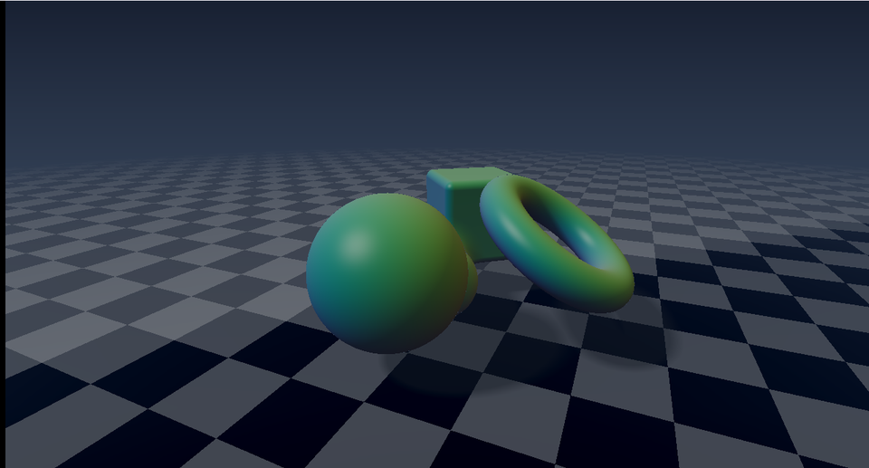
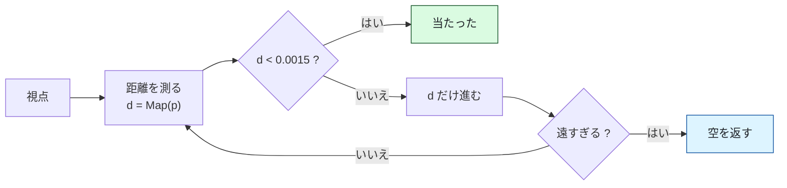

# 11. レイマーチング — 三角形を 1 枚も使わずに 3D を描く



この絵に頂点バッファはありません。**三角形は画面を覆う 1 枚だけ**です。
球も箱もトーラスも床も影も、すべてピクセルシェーダーの中の計算です。

ソース : [`shaders/lab/11_raymarch.hlsl`](../../shaders/lab/11_raymarch.hlsl)

---

## 1. 球トレーシング

視線を少しずつ進めて、物にぶつかったところで止めます。
問題は「**どれだけ進めば安全か**」です。

ここで距離関数が効きます。
`MapScene(p)` は「p から最寄りの面までの距離」を返すので、
**その長さだけ進んでも決して何かを突き抜けません**。

```hlsl
float distance = 0.0f;

for (int i = 0; i < 96; ++i)
{
    float3 position = eye + direction * distance;
    float  d        = MapScene(position, t);

    if (d < 0.0015f) { hit = true; break; }   // 十分近い＝当たった

    distance += d;                            // 安全な距離だけ進む

    if (distance > 24.0f) { break; }          // 遠すぎる＝何も無い
}
```

物から遠いところでは大股で、近づくと小刻みに進みます。
だから「マーチング（行進）」です。



---

## 2. シーンを組み立てる

```hlsl
float MapScene(float3 p, float time)
{
    float ground = p.y + 1.0f;                    // 平面
    float sphere = SdSphere(p - 中心, 0.72f);      // 球
    float box    = SdRoundBox(p - 中心, ..., 0.10f);
    float torus  = SdTorus(p - 中心, ...);

    float shapes = SmoothUnion(sphere, blob, 0.45f);
    shapes = SmoothUnion(shapes, box, 0.35f);
    shapes = min(shapes, torus);

    return min(ground, shapes);
}
```

物を足すのは `min` 1 つです。[02 章](02_距離関数で図形を描く.md)の
2D の集合演算が、そのまま 3D でも通用します。

### 物を動かす・回す

```hlsl
float3 boxP = p - float3(1.15f, 0.05f, 0.0f);   // 平行移動
boxP.xz = mul(Rotate2D(time * 0.6f), boxP.xz);  // 回転
float box = SdRoundBox(boxP, ...);
```

**物ではなく、座標のほうを逆に動かします。**
物を右へ動かしたいなら、座標を左へずらします。

---

## 3. 法線 — 距離関数の勾配

```hlsl
float3 CalcNormal(float3 p, float time)
{
    const float e = 0.0015f;
    float2 k = float2(1.0f, -1.0f);

    return normalize(
        k.xyy * MapScene(p + k.xyy * e, time) +
        k.yyx * MapScene(p + k.yyx * e, time) +
        k.yxy * MapScene(p + k.yxy * e, time) +
        k.xxx * MapScene(p + k.xxx * e, time));
}
```

距離関数の**勾配（いちばん急に増える向き）が、そのまま法線**です。

素直に書くと 6 回（±x, ±y, ±z）呼びますが、
正四面体の 4 方向で済ませる書き方（テトラヘドロン法）なら **4 回**です。
レイマーチングでは `MapScene` の呼び出しが重いので、この差は効きます。

---

## 4. やわらかい影 — 1 本のレイで

```hlsl
float SoftShadow(float3 origin, float3 direction, float time)
{
    float result = 1.0f;
    float t = 0.05f;

    for (int i = 0; i < 40; ++i)
    {
        float d = MapScene(origin + direction * t, time);
        result = min(result, 10.0f * d / t);   // どれだけ掠めたか
        t += clamp(d, 0.02f, 0.30f);
        if (result < 0.005f || t > 8.0f) { break; }
    }

    return saturate(result);
}
```

光へ向かって進み、**途中でどれだけ物に近づいたか**を覚えておきます。
掠めただけなら少しだけ暗く、ぶつかれば真っ暗。

これがレイマーチングの美点です。
[13 章](../tutorial/13_影を落とす_シャドウマップ.md)のシャドウマップでは、
やわらかい影を作るのに何度もサンプリングが要りました。
ここでは **1 本のレイで、距離関数が「近さ」を教えてくれます**。

`d / t` で割っているのは、遠くの遮蔽物ほど影をぼかすためです。

---

## 5. つまずきやすい点

### 距離関数が「正確でない」と突き抜ける

スケーリングや非一様変形をすると、距離が実際より**大きく**なることがあります。
すると安全な距離を超えて進んでしまい、面をすり抜けます。

安全策は、進む量に係数を掛けることです。

```hlsl
distance += d * 0.8f;   // 少し控えめに進む
```

### 面と平行な視線は収束しない

床すれすれの視線は、いくら進んでも距離がなかなか 0 になりません。
反復回数の上限に達して、遠くが変な色になります。

対策は反復回数を増やすか、遠方をフォグで隠すことです
（本習作は後者を使っています）。

### 重い

1 ピクセルあたり `MapScene` が
「マーチングで最大 96 回 ＋ 法線 4 回 ＋ 影 40 回」呼ばれます。
1280 × 720 なら、最悪 **1 億回以上**です。

形を足すほど 1 回の `MapScene` が重くなるので、
物の数を増やすと急に遅くなります。

---

## 6. ここから作れるもの

| やりたいこと | 使うもの |
|------------|---------|
| 無限に並ぶ物 | `frac` で座標を折る（[03](03_繰り返しと極座標.md)）|
| フラクタル | 座標の折り返しを再帰的に |
| 雲・煙 | 密度を積分する（ボリュームレイマーチング）|
| 反射 | 当たった点から新しいレイを飛ばす |
| 環境光遮蔽 | 法線方向へ数点進めて距離を見る |

---

## 参照

- [Inigo Quilez — Raymarching distance fields](https://iquilezles.org/articles/raymarchingdf/)
- [Inigo Quilez — 3D distance functions](https://iquilezles.org/articles/distfunctions/)
- [Inigo Quilez — Soft shadows in raymarched SDFs](https://iquilezles.org/articles/rmshadows/)
- [Inigo Quilez — Normals for an SDF](https://iquilezles.org/articles/normalsSDF/)
  — テトラヘドロン法の出典
- John C. Hart, "Sphere Tracing: A Geometric Method for the Antialiased Ray
  Tracing of Implicit Surfaces", The Visual Computer 1996 — 原典
