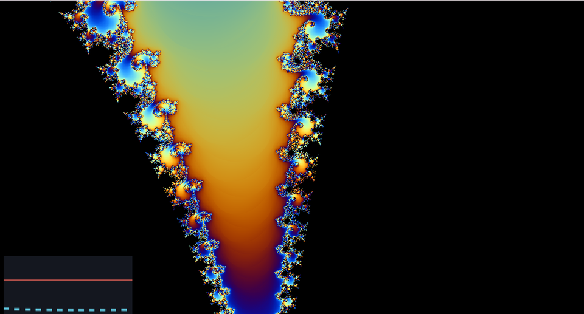

# 12. マンデルブロ集合 — 漸化式を絵にする



```
z ← z² + c
```

たった 1 行の漸化式が、いくら拡大しても尽きない模様を作ります。
黒い部分が集合の内側、色が付いているところが外側です。

ソース : [`shaders/lab/12_mandelbrot.hlsl`](../../shaders/lab/12_mandelbrot.hlsl)

---

## 1. 定義

複素数 `c` を 1 つ選び、`z = 0` から始めて `z ← z² + c` を繰り返します。

- **いつまでも発散しない** → `c` は集合の**内側**
- **発散する** → 集合の**外側**

画面の各ピクセルが 1 つの `c` です。

```hlsl
float2 c = center + p * zoom;
float2 z = float2(0.0f, 0.0f);

for (int i = 0; i < kMaxIteration; ++i)
{
    // 複素数の 2 乗 : (a + bi)² = a² - b² + 2abi
    z = float2(z.x * z.x - z.y * z.y, 2.0f * z.x * z.y) + c;

    if (dot(z, z) > 4.0f) { break; }
    ++iteration;
}
```

複素数は `float2` で十分です。
掛け算だけ自分で書きます。

---

## 2. なぜ「2 を超えたら発散」と言い切れるのか

`|z| > 2` かつ `|z| ≥ |c|` になった時点で、以降は必ず発散します。
これは証明されています。だから途中で打ち切れます。

```hlsl
if (dot(z, z) > 4.0f) { break; }
```

`dot(z, z)` は `|z|²` です。**`sqrt` を省く**ために 2 乗のまま比べます。
1 ピクセルあたり数百回まわるので、この差は効きます。

---

## 3. なめらかな色付け

反復回数は整数なので、そのまま色にすると**縞が段になります**。

```hlsl
float smoothCount = (float)iteration
                  - log2(max(log2(length(z)), 1e-6f)) + 4.0f;
```

最後の `|z|` を使って小数部を補うと、なめらかに繋がります。

### 何をしているのか

発散するとき `|z|` はおおよそ 2 乗ずつ増えます。
つまり `log(log(|z|))` は 1 反復ごとに約 1 ずつ増える。
これを整数の反復回数から引くと、
「あと何回ぶんの余裕があったか」の小数部が得られます。

この処理は**正規化反復回数**（normalized iteration count）と呼ばれます。

---

## 4. 拡大

```hlsl
float zoom = exp(-1.0f - 2.4f * (0.5f + 0.5f * sin(t * 0.10f)));
float2 center = float2(-0.7453f, 0.1127f);   // シーホースバレー
```

**指数で動かす**のがポイントです。
`zoom` を線形に減らすと、拡大が進むほど「進み方が遅く」感じます。
指数にすると、見た目の速さが一定になります。

`(-0.7453, 0.1127)` はシーホースバレーと呼ばれる有名な場所で、
タツノオトシゴのような渦が現れます。

---

## 5. つまずきやすい点

### 精度の限界

`float`（32 bit）では、10⁻⁵ 程度まで拡大すると
**ピクセルが四角く固まって**きます。有効桁が足りなくなるためです。

`double` を使えば伸びますが、GPU では極端に遅くなります。
本気で深く潜るなら、多倍長演算か「摂動法」という手法を使います。

### 反復回数の上限

拡大するほど、境界付近では多くの反復が必要になります。
上限が足りないと、**本当は外側なのに黒く塗られる**部分が出ます。

```hlsl
const int kMaxIteration = 220;
```

拡大率に応じて増やすのが一般的です。

### 分岐が揃わない

GPU は隣り合うピクセルをまとめて処理します。
反復回数がピクセルごとに違うと、**いちばん遅いピクセルに引きずられます**。
境界付近は特に重くなります。

---

## 6. ここから作れるもの

| やりたいこと | 変えるところ |
|------------|------------|
| ジュリア集合 | `z` を座標に、`c` を定数にする |
| バーニングシップ | `z = (|a| + |b|i)² + c` |
| 3 次以上 | `z = z³ + c` など |
| 内側にも模様 | 軌道の最小距離（orbit trap）を色にする |
| 3D フラクタル | マンデルバルブ（[11](11_レイマーチング.md)と組み合わせ）|

---

## 参照

- [Inigo Quilez — Smooth iteration count](https://iquilezles.org/articles/msetsmooth/)
  — なめらかな色付けの式
- [Inigo Quilez — Orbit traps](https://iquilezles.org/articles/ftrapsgeometric/)
- Benoit Mandelbrot, "The Fractal Geometry of Nature", 1982
- [The Book of Shaders — Fractals](https://thebookofshaders.com/)
