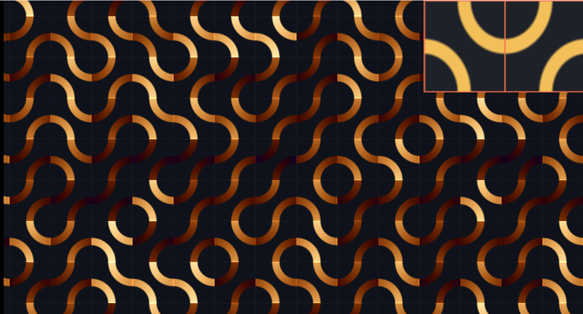

# 13. トルシェタイル — 2 種類を並べるだけで迷路



1 マスに「四分円 2 本」を置き、向きをコイン投げで決める。
それだけで、どこまでも繋がる曲線の網ができます。
右上の枠が、2 種類のタイルそのものです。

ソース : [`shaders/lab/13_truchet.hlsl`](../../shaders/lab/13_truchet.hlsl)

---

## 1. 1 マスの中身

マスの左下と右上の角を中心に、**半径 0.5 の円弧を 2 本**描きます。

```hlsl
float arcA = abs(length(local - float2(-0.5f, -0.5f)) - 0.5f);
float arcB = abs(length(local - float2( 0.5f,  0.5f)) - 0.5f);
float d = min(arcA, arcB);
```

`length(p - 中心) - 0.5` は「半径 0.5 の円周までの符号付き距離」です
（[02 章](02_距離関数で図形を描く.md)）。
`abs` を取ると円周からの距離になり、それが小さいところが線になります。

半径がマスの半分ちょうどなので、**円弧は必ずマスの辺の中点を通ります**。
だから隣のマスの円弧と繋がります。

---

## 2. コインを投げる

```hlsl
float flip = Hash21(cell);

if (flip > 0.5f)
{
    local.x = -local.x;   // 左右反転
}
```

マス番号のハッシュが 0.5 を超えたら、マスの中身を左右反転します。
2 種類のタイルが半々で並ぶことになります。

**反転しても辺の中点は動かない**ので、繋がりは保たれます。
これがトルシェタイルの肝です。

---

## 3. なぜ迷路に見えるのか

タイルの向きはランダムですが、**接続の規則は完全に決まっています**。
どのタイルも辺の中点で必ず繋がるので、線は途切れません。

ランダムなのに繋がっている。
その組み合わせが「意味ありげな迷路」に見せます。

18 世紀のセバスチャン・トルシェ神父が、
正方形タイルの並べ方を研究したのが名前の由来です。

---

## 4. 線に沿った色

```hlsl
float along = (arcA < arcB)
            ? atan2(local.y + 0.5f, local.x + 0.5f)
            : atan2(0.5f - local.y, 0.5f - local.x);
along /= kTau;
```

どちらの円弧に近いかを判定し、その円弧の**中心から見た角度**を取ります。
これを色にすると、線に沿って色が変わり、繋がりが目で追えます。

---

## 5. つまずきやすい点

### 円弧ではなく直線になる

最初、距離をこう書いていました。

```hlsl
float d = abs(abs(local.x + local.y) - 0.5f) * 0.7071f;   // ← 直線になる
```

これは「点から直線までの距離」で、**斜めの線分**が並ぶだけでした。
曲線が欲しいなら、円までの距離を測る必要があります。

見た目が「なんとなくそれらしい」ので、
式を疑わないと気付きにくい間違いです。

### 半径がマスの半分でないと繋がらない

半径 0.5 でなければ、辺の中点を通りません。
0.4 にすると線が切れ、0.6 にすると隣とずれます。

### 反転を「回転」にすると繋がらないことがある

90 度回転でも繋がりますが、180 度回転は反転と同じです。
どの操作なら接続が保たれるかは、タイルの絵によって変わります。

---

## 6. ここから作れるもの

| やりたいこと | 変えるところ |
|------------|------------|
| 太さを変える | `thickness` |
| 3 種類以上のタイル | ハッシュを 3 段階で分ける |
| 配管・回路 | 直線と分岐のタイルを混ぜる |
| 動く迷路 | ハッシュに時間を混ぜる |
| 3D の管 | [11 章](11_レイマーチング.md)の距離関数として使う |
| ドミノ・ペンローズ | 別のタイル規則（非周期タイリング）|

---

## 参照

- [Wikipedia — Truchet tiles](https://en.wikipedia.org/wiki/Truchet_tiles)
- [The Book of Shaders — Patterns](https://thebookofshaders.com/09/)
- Cyril Stanley Smith, "The Tiling Patterns of Sebastien Truchet and the
  Topology of Structural Hierarchy", Leonardo 1987
- [02 距離関数で図形を描く](02_距離関数で図形を描く.md)
