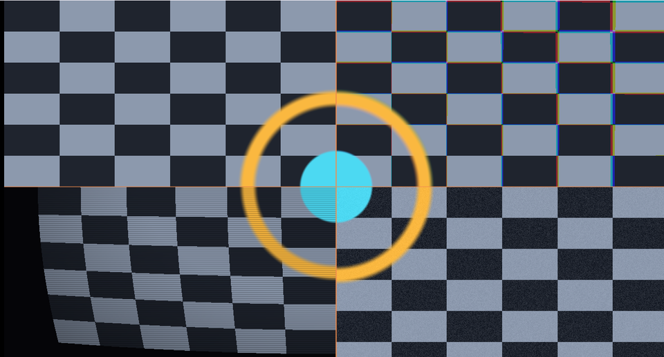

# 14. 画面効果 — 走査線・色収差・歪み・粒子



[25 章](../tutorial/25_ポストプロセス.md)のポストプロセスで使う道具を、
絵を作りながら並べて確かめます。
どれも「**読む位置をずらす**」「**明るさを掛ける**」だけでできています。

ソース : [`shaders/lab/14_effects.hlsl`](../../shaders/lab/14_effects.hlsl)

左上が元の絵、右上が色収差、左下が樽型歪み＋走査線、右下がフィルムグレインです。

---

## 1. 色収差（右上）

レンズは波長ごとに曲がり方が違います。
R と B を中心から**逆向きにずらす**だけで、それらしく見えます。

```hlsl
float2 center = uv - 0.5f;
float  amount = 0.006f * (0.4f + length(center) * 2.0f);

float r = SourceImage(uv + center * amount, t).r;
float g = SourceImage(uv, t).g;
float b = SourceImage(uv - center * amount, t).b;
```

### 中心からの距離に比例させる

`length(center)` を掛けているのが要点です。
実際のレンズも、**中心では色ズレが起きず、周辺ほど大きくなります**。
一律にずらすと「印刷のズレ」に見えて安っぽくなります。

---

## 2. 樽型歪み（左下）

```hlsl
float2 center = (uv - 0.5f) * 2.0f;
float  r2 = dot(center, center);
float2 warped = center * (1.0f + 0.14f * r2) * 0.5f + 0.5f;
```

中心からの距離の**2 乗**で外へ押し出すと、樽型になります。
係数を負にすると糸巻き型（内へ引き込む形）です。

### 範囲外の扱いを決める

```hlsl
if (warped.x < 0.0f || warped.x > 1.0f || ...) { 黒 }
```

歪ませると、元の絵の外を読むことになります。
何を返すか決めておかないと、端の色が伸びたり、
反対側の色が回り込んだりします。

---

## 3. 走査線（左下）

```hlsl
float scan = 0.88f + 0.12f * sin(uv.y * g_resolution.y * 1.6f);
color *= scan;
```

縦方向に細かい明暗を掛けるだけです。

`g_resolution.y` を掛けているので、**画面のピクセル数に合わせた細かさ**になります。
これを固定値にすると、解像度を変えたときに縞の間隔が変わります。

> **1 ピクセルより細かい縞は作らないでください。**
> エイリアシングでモアレが出ます（[24 章](../tutorial/24_ミップマップ.md)）。
> 係数 1.6 は「2 ピクセルに 1 周期強」あたりです。

---

## 4. フィルムグレイン（右下）

```hlsl
float grain = Hash21(uv * g_resolution.xy + frac(t) * 917.0f);

float luminance = dot(color, float3(0.2126f, 0.7152f, 0.0722f));
float amount = 0.16f * (1.0f - luminance);

color += (grain - 0.5f) * amount;
```

### 時間を足すと動く

`frac(t) * 917.0` を座標に足すことで、毎フレーム違う値になります。
`frac` を掛けているのは、時間が大きくなっても
ハッシュの精度が落ちないようにするためです（[15 章](15_ハッシュの精度.md)）。

### 暗い所ほど強く

```hlsl
float amount = 0.16f * (1.0f - luminance);
```

実際のフィルムも、暗部ほど粒子が目立ちます。
一律に足すと、明るい部分が汚れて見えます。

### 輝度の係数

```hlsl
dot(color, float3(0.2126f, 0.7152f, 0.0722f))
```

人間の目は**緑にいちばん敏感**です。この係数は Rec.709 の定義で、
本プロジェクトの測定スクリプトでも同じものを使っています。

---

## 5. つまずきやすい点

### 元の絵を何度も読む

色収差は 3 回、歪みは 1 回。
実際のポストプロセスではテクスチャを読むので、**読む回数がそのまま負荷**です。

### 効果の順序

「歪ませてから走査線」と「走査線を掛けてから歪ませる」では結果が違います。

- 歪み → 走査線 … 走査線はまっすぐ（ブラウン管の走査は歪まない）
- 走査線 → 歪み … 走査線も曲がる

物理的にどちらが正しいかを考えて決めます。

### 掛け算と足し算

- **掛ける** … 暗くする（走査線、ビネット）
- **足す** … 明るくする（グレイン、ブルーム）

足し算で暗くしようとすると、負の値になって色が壊れます。

---

## 6. ここから作れるもの

| やりたいこと | 使うもの |
|------------|---------|
| ブルーム | 明るい所を抽出してぼかす（[25 章](../tutorial/25_ポストプロセス.md)）|
| 被写界深度 | 深度バッファを読んで、ぼかす量を変える |
| モーションブラー | 速度バッファの向きへ何点も読む |
| 色調補正 | 3D の LUT テクスチャを引く |
| グリッチ | 横帯ごとに UV をランダムにずらす |

---

## 参照

- [25 章 ポストプロセス](../tutorial/25_ポストプロセス.md) — 実際のパイプライン
- [Rec. 709 | ITU-R BT.709](https://www.itu.int/rec/R-REC-BT.709) — 輝度の係数
- Jorge Jimenez, "Next Generation Post Processing in Call of Duty:
  Advanced Warfare", SIGGRAPH 2014
- [The Book of Shaders — Image processing](https://thebookofshaders.com/)
