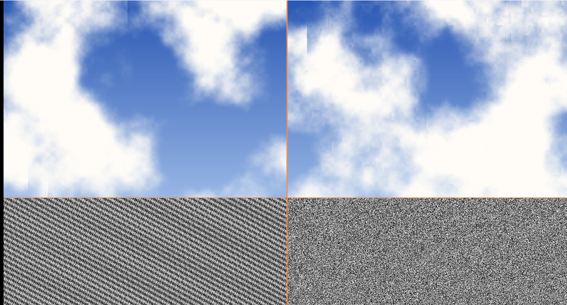

# 15. ハッシュの精度 — 有名な書き方が壊れる場面



**左が「よく見かける書き方」、右が「桁が溢れない書き方」です。**
下半分がハッシュの値そのもの、上半分がそれで作った雲です。

左下に**斜めの織り目**が見えます。これは乱数ではありません。

ソース : [`shaders/lab/15_hash.hlsl`](../../shaders/lab/15_hash.hlsl)

---

## 1. この習作ができた経緯

この習作集を作っている途中、[05 章](05_fBmと雲.md)の雲に
**縦縞**が出ました。最初はノイズの補間を疑い、次に勾配の取り方を疑い、
どちらも違いました。

原因は、その下にあるハッシュ関数でした。

見つけた現象そのものを残しておくほうが価値があると考え、
15 本目の習作として並べています。

---

## 2. よく見かける書き方

```hlsl
float HashBad(float2 p)
{
    return frac(sin(dot(p, float2(12.9898f, 78.233f))) * 43758.5453f);
}
```

インターネット上のシェーダーで最もよく見る形です。
考え方はこうです。

1. `dot` で 2 次元を 1 次元に潰す
2. `sin` で -1〜1 の値にする
3. 大きな数（43758.5453）を掛けて拡大する
4. `frac` で小数部だけ取り出す

「拡大してから小数部を取れば、ぐちゃぐちゃになるだろう」という発想です。

---

## 3. なぜ壊れるのか

**32 bit 浮動小数点の有効桁は約 7 桁**しかありません。

`sin(x)` の結果が例えば `0.7853982` だとします。
これに `43758.5453` を掛けると `34372.09…` になります。

ここで問題が起きます。

| 値 | 整数部 | 使える小数の桁 |
|-----|-------|-------------|
| 0.7853982 | 0 | 7 桁 |
| 34372.09 | 5 桁 | **2 桁** |

掛けた時点で、**小数部の情報がほとんど失われています**。
`frac` で取り出せるのは、残った 2 桁ぶんの飛び飛びの値だけです。

さらに `sin` の引数が大きいと（座標が原点から遠いと）、
`sin` の計算自体の精度も落ちます。
GPU の `sin` は引数を 2π で割った余りにしますが、その割り算でも桁が落ちます。

結果として、**規則的な縞や織り目**が現れます。

---

## 4. 桁が溢れない書き方

```hlsl
float HashGood(float2 p)
{
    float3 p3 = frac(p.xyx * 0.1031f);
    p3 += dot(p3, p3.yzx + 33.33f);
    return frac((p3.x + p3.y) * p3.z);
}
```

Dave Hoskins による書き方です。要点は 1 つです。

**途中の値がずっと 0〜1 付近に留まります。**

- `frac(p * 0.1031)` … いきなり 0〜1 にする
- `dot(p3, p3.yzx + 33.33)` … 足しても 100 程度まで
- `frac(...)` … 最後に小数部

大きな数を掛けないので、有効桁が失われません。
`sin` も使わないので速くもあります。

---

## 5. 画像の読み方

### 下半分 — ハッシュそのもの

1 ピクセルごとにハッシュを引いて、そのまま明るさにしています。

- **左（悪い）** … 斜めの織り目がはっきり見える。値が偏っている
- **右（良い）** … 一様な砂嵐。これが正しい姿

ハッシュを新しく書いたら、**まずこれを画面に出してください。**
規則的な模様が見えたら使えません。

### 上半分 — 雲

同じ fBm を、ハッシュだけ変えて描いています。
座標を大きくずらして（原点から離して）あるので、差が出やすくなっています。

---

## 6. 一般的な教訓

### 浮動小数点の「桁」を意識する

シェーダーでは float32 が既定です。
**大きな数を掛けてから小数部を取る**操作は、どこであっても危険です。

同じ理由で、次のような場面でも精度が問題になります。

| 場面 | 症状 |
|------|------|
| 原点から遠い場所の座標 | 位置がカクつく、Z ファイティング |
| 経過時間を掛け算に使う | 長時間動かすと動きが階段状になる |
| 深度バッファの遠方 | 奥のほうで前後関係が壊れる |

時間については、この習作でも対策しています。

```hlsl
float grain = Hash21(uv * g_resolution.xy + frac(t) * 917.0f);
```

`frac(t)` にすることで、何時間動かしても精度が落ちません
（[14 章](14_画面効果.md)）。

### 「見た目がそれらしい」で止めない

悪いハッシュでも、fBm を通すと**一見それらしい雲**になります。
拡大したり、原点から離したりして初めて破綻します。

土台になる部品ほど、**単体で正しさを確かめる**価値があります。

---

## 7. ここから作れるもの

| やりたいこと | 使うもの |
|------------|---------|
| 3 次元のハッシュ | `Hash31` / `Hash33`（Hoskins の記事にある）|
| もっと質の高い乱数 | PCG などの整数ハッシュ（ビット演算）|
| 再現性のある乱数列 | 種を明示的に渡す |

整数演算が使える環境なら、**ビット演算のハッシュ**のほうが確実です。
浮動小数点の丸めに左右されません。

---

## 参照

- Dave Hoskins, ["Hash without Sine"](https://www.shadertoy.com/view/4djSRW)
  — `HashGood` の出典
- Mark Jarzynski & Marc Olano, "Hash Functions for GPU Rendering",
  JCGT 2020 — 整数ハッシュの比較
- [IEEE 754 単精度](https://en.wikipedia.org/wiki/Single-precision_floating-point_format)
- [04 ノイズ](04_ノイズ.md) — このハッシュを使う側
- [05 fBm と雲](05_fBmと雲.md) — 実際に縞が出たところ
