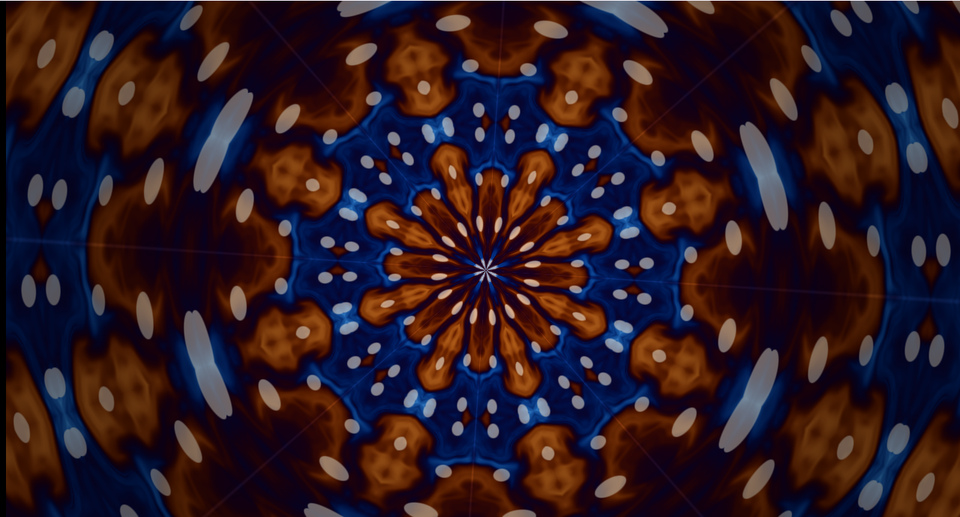

# 16. 万華鏡 — 角度を折り返して鏡を作る



[03 章](03_繰り返しと極座標.md)の「角度を繰り返す」に、
**`abs` を 1 つ足すだけ**。それで鏡映対称になります。

元の模様が何であっても、対称な絵になるのが面白いところです。

ソース : [`shaders/lab/16_kaleidoscope.hlsl`](../../shaders/lab/16_kaleidoscope.hlsl)

---

## 1. 手順

```hlsl
// (1) 極座標へ
float radius = length(p);
float angle  = atan2(p.y, p.x);

// (2) 角度を n 等分して繰り返す
float sectorSize = kTau / kSectors;
float local = angle - sectorSize * floor(angle / sectorSize + 0.5f);

// (3) さらに折り返して鏡にする
local = abs(local);

// (4) 直交座標へ戻す
float2 folded = float2(cos(local), sin(local)) * radius;
```

### (2) の式

```hlsl
angle - sectorSize * floor(angle / sectorSize + 0.5f)
```

これは「`sectorSize` で割った余りを、**-半分〜+半分**の範囲で返す」式です。
`frac` を使う書き方より、区画の中央が 0 になるので扱いやすくなります。

### (3) が万華鏡の肝

| 操作 | 対称性 |
|------|-------|
| 繰り返しだけ | **回転対称**（風車のように同じ向きに並ぶ）|
| 繰り返し ＋ `abs` | **鏡映対称**（本物の万華鏡）|

`abs` を取ると、区画の中央を軸にして左右が折り返されます。
実際の万華鏡が「鏡を 2 枚合わせたもの」であることと対応しています。

---

## 2. 半径方向にも折り返す

```hlsl
float ringIndex = floor(radius / ringSize);
float ringLocal = frac(radius / ringSize);

// 奇数番目の輪は内外を反転させ、継ぎ目を目立たなくする
if (fmod(ringIndex, 2.0f) > 0.5f)
{
    ringLocal = 1.0f - ringLocal;
}
```

角度だけでなく半径も折り返すと、外へ向かって模様が反復します。

**奇数番目を反転させる**のがポイントです。
そのまま繰り返すと、輪の境目で模様が飛びます。
折り返せば、境目で必ず値が一致するので継ぎ目が消えます。

これは「三角波（ping-pong）」と呼ばれる繰り返し方で、
テクスチャのアドレスモード `MIRROR` と同じ考え方です。

---

## 3. 元の模様は何でもよい

```hlsl
float3 SourcePattern(float2 p, float time)
{
    // ここを差し替えれば、見え方がまるごと変わる
}
```

この習作では [07 章](07_ドメインワープ.md)のドメインワープに
小さな円を散らしたものを使っています。

写真でもノイズでも構いません。
**万華鏡の処理は座標の変換だけ**で、模様には一切触れません。

---

## 4. つまずきやすい点

### 区画数が偶数でないと繋がらない

`abs` で折り返すので、**隣り合う区画は必ず鏡像**になります。
一周したときに元へ戻るには、区画数が偶数である必要があります。

奇数にすると、1 か所だけ「鏡像どうしが向かい合う」不自然な継ぎ目ができます。

### 中心が特異点になる

`radius` が 0 に近づくと、角度の変化が無限に速くなります。
中心付近が滲むので、円で隠すか、`radius` に下限を設けます。

### `atan2` の継ぎ目

`-π` と `π` は同じ場所ですが、値は連続していません。
繰り返しの式が正しくても、区画の境界がちょうどそこに来ると継ぎ目が出ます。
本習作では角度に時間を足しているので、継ぎ目が回って目立ちません。

---

## 5. ここから作れるもの

| やりたいこと | 変えるところ |
|------------|------------|
| 区画数を変える | `kSectors`（6 や 12 が定番）|
| 回転させる | `angle += time * k` |
| 元の模様を変える | `SourcePattern` を差し替える |
| 3D の万華鏡 | [11 章](11_レイマーチング.md)で座標を折る |
| 結晶・雪の結晶 | 6 区画＋枝分かれの模様 |

---

## 参照

- [Inigo Quilez — Domain repetition](https://iquilezles.org/articles/sdfrepetition/)
- [The Book of Shaders — Patterns](https://thebookofshaders.com/09/)
- [03 繰り返しと極座標](03_繰り返しと極座標.md)
- [07 ドメインワープ](07_ドメインワープ.md)
