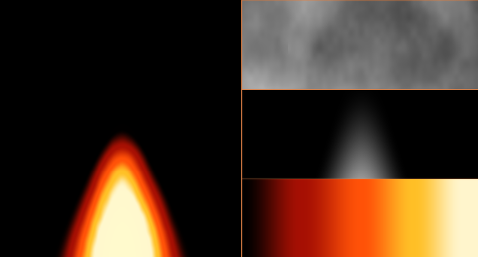

# 17. 炎 — ノイズを上へ流し、色温度で塗る



「下ほど熱い」という 1 つの前提と、上へ流れるノイズ。
それだけで炎に見えます。

右半分は中身を分解したもので、上から
「流れるノイズ」「炎の形」「温度 → 色の対応表」です。

ソース : [`shaders/lab/17_fire.hlsl`](../../shaders/lab/17_fire.hlsl)

---

## 1. 3 つの部品を掛け合わせる

```
温度 = 形 × 減衰 × 揺らぎ
```

```hlsl
float temperature = shape * falloff * (0.55f + 0.95f * turbulence);
```

| 部品 | 役割 |
|------|------|
| **形** | 炎の輪郭。上へ行くほど細い |
| **減衰** | 根元が明るく、先端が暗い |
| **揺らぎ** | ノイズ。炎らしい不定形さ |

3 つとも独立に作れるので、それぞれ単体で確かめられます。
右半分がまさにその「単体表示」です。

---

## 2. 形

```hlsl
float height = saturate(q.y * 0.75f);
float width  = 0.55f * (1.0f - height * 0.75f);
float shape  = smoothstep(width, 0.0f, abs(q.x));
```

高さに応じて幅を細くするだけです。
`smoothstep(width, 0, abs(x))` は「中心で 1、幅の外で 0」を返します。

引数の順序が逆（大きいほうが先）なのに注意してください。
こう書くと、**中心へ向かって増える**マスクになります。

---

## 3. 揺らぎ — 上へ流れるノイズ

```hlsl
float2 flow  = float2(q.x * 1.6f, q.y * 1.1f - t * 1.30f);
float2 flow2 = float2(q.x * 3.1f + 12.0f, q.y * 2.2f - t * 2.10f);

float turbulence = Fbm(flow, 5) * 0.65f + Fbm(flow2, 4) * 0.35f;
```

**座標から時間を引くと上へ動きます。**
足すと下へ動きます。ここは間違えやすいところです。

2 種類の速さを重ねているのが要点です。
1 種類だけだと「模様がそのまま平行移動する」だけで、
炎に見えません。速さの違う成分が混ざると、渦を巻いているように見えます。

`+ 12.0f` は、2 本目に**違う場所のノイズ**を使うためのずらしです。

---

## 4. 先端をちぎる

```hlsl
temperature -= height * height * 0.35f;
```

高さの 2 乗ぶんだけ温度を下げます。
すると先端では、揺らぎが強いところだけが残り、
**炎が千切れて舞い上がる**ように見えます。

これが無いと、炎の輪郭がのっぺりした三角形になります。

---

## 5. 色温度

```hlsl
float3 FireColor(float temperature)
{
    float3 color = lerp(黒,   暗い赤, smoothstep(0.00f, 0.25f, t));
    color = lerp(color, 橙,   smoothstep(0.25f, 0.50f, t));
    color = lerp(color, 黄,   smoothstep(0.50f, 0.72f, t));
    color = lerp(color, 白,   smoothstep(0.72f, 0.92f, t));
    return color;
}
```

黒 → 赤 → 橙 → 黄 → 白。実際の**黒体放射**の順です。
熱いものほど短い波長が強くなるので、最後は白（全波長）になります。

`smoothstep` を重ねると、境目のない連続した対応表になります。
[08 章](08_カラーパレット.md)の `cos` パレットでも作れますが、
「特定の色を必ず通したい」ときは、この段階的な `lerp` のほうが素直です。

---

## 6. つまずきやすい点

### 画面を分割したとき、座標を取り直す

この習作で実際に嵌まりました。

```hlsl
float2 p = ToCenteredUv(uv);   // 画面全体の座標
```

これを使うと、左半分では `p.x` が `-1.78 〜 0` になります。
炎は `p.x == 0` を中心に描くので、**左半分の右端に寄って**しまいました。

分割した領域の中で座標を取り直します。

```hlsl
float2 local = float2(frac(uv.x * 2.0f), uv.y);
p.x = local.x * 2.0f - 1.0f;
p.x *= (g_resolution.x * 0.5f) * g_resolution.w;   // 半分の幅 / 高さ
```

### 揺らぎを足すか掛けるか

```hlsl
temperature = shape * falloff * turbulence;   // 掛ける
temperature = shape * falloff + turbulence;   // 足す
```

**掛ける**と、炎の外では 0 のままなので輪郭が保たれます。
**足す**と、炎の外にもノイズが現れて汚れます。

「形で切り取る」ものは掛ける、と覚えると間違えません。

### 明るすぎて白飛びする

`FireColor` の最後は白なので、温度が 1 を超えると全部白になります。
`saturate` で止めるか、[25 章](../tutorial/25_ポストプロセス.md)の
トーンマッピングを通します。

---

## 7. ここから作れるもの

| やりたいこと | 変えるところ |
|------------|------------|
| 煙 | 色を灰色に、上へ広がる形に |
| 溶岩 | 流れを横に、しきい値で割れ目を作る |
| ろうそく | 形を細く、揺らぎを弱く |
| 爆発 | 中心から外へ流す（極座標）|
| 松明の光 | 炎のまわりに [23 章](23_レンズフレア.md)のハロを足す |

---

## 参照

- [The Book of Shaders — Noise](https://thebookofshaders.com/11/)
- [黒体放射 | Wikipedia](https://ja.wikipedia.org/wiki/黒体放射)
- [05 fBm と雲](05_fBmと雲.md) — 揺らぎの土台
- [08 カラーパレット](08_カラーパレット.md) — 色の作り方の別解
