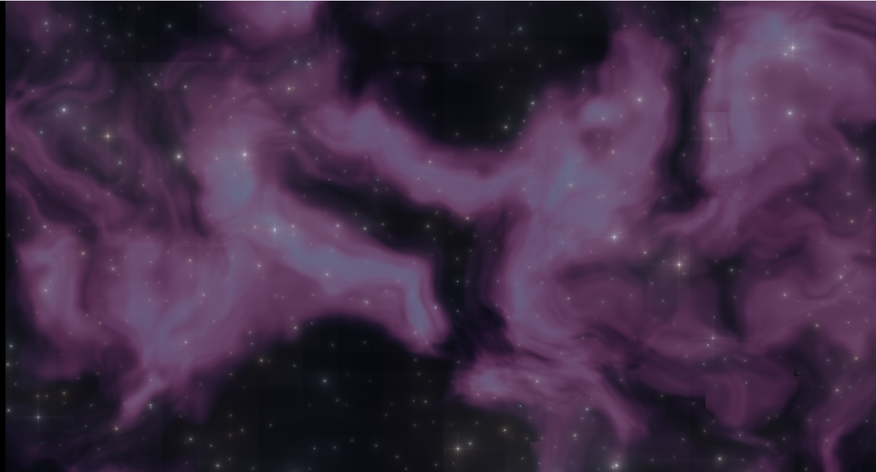

# 18. 星空と星雲 — 部品の組み合わせで 1 枚の絵にする



新しい技法はほとんどありません。
[03 章](03_繰り返しと極座標.md)の繰り返しと
[07 章](07_ドメインワープ.md)のドメインワープを組み合わせただけです。

**部品が揃うと、絵が作れるようになる**という段階を示す習作です。

ソース : [`shaders/lab/18_starfield.hlsl`](../../shaders/lab/18_starfield.hlsl)

---

## 1. 星 — マスに 1 個ずつ置く

```hlsl
float2 cell  = floor(p);
float2 local = frac(p) - 0.5f;

for (int y = -1; y <= 1; ++y)
for (int x = -1; x <= 1; ++x)
{
    float2 seed = Hash22(cell + float2(x, y));
    float2 position = float2(x, y) + (seed - 0.5f) * 0.7f - local;
    float  distance = length(position);
    ...
}
```

[06 章](06_ボロノイ.md)のボロノイと同じ「3×3 を調べる」構造です。
星は光をこぼすので、**隣のマスの星も見る**必要があります。

### 明るさは 1/r

```hlsl
float star = brightness * 0.014f / max(distance, 0.001f);
```

`1/r` は中心が鋭く、裾が長く伸びます。
点光源のにじみ方として素直で、[23 章](23_レンズフレア.md)でも同じ形を使います。

`max(distance, 0.001f)` は 0 除算を避けるためです。
これを忘れると、星の中心で `inf` や `NaN` が出ます。

### 星の数を減らす

```hlsl
if (Hash21(cell + offset + 7.7f) > density)
{
    continue;   // このマスには星を置かない
}
```

全マスに星を置くと、規則正しく並びすぎて不自然です。
**別のハッシュ**で間引きます（同じハッシュを使うと位置と相関します）。

### 3 層重ねる

```hlsl
color += StarLayer(p * 12.0f + 3.0f,  t, 0.45f, 0.55f);   // 細かく暗い
color += StarLayer(p *  7.0f + 17.0f, t, 0.30f, 1.00f);
color += StarLayer(p *  4.0f + 41.0f, t, 0.18f, 1.80f);   // 粗く明るい
```

細かい層ほど数を多く・暗く。これで奥行きが出ます。
`+3.0f` などのずらしは、層どうしで同じ場所に星が重ならないようにするためです。

---

## 2. 星雲 — ドメインワープした fBm

```hlsl
float2 warp = float2(Fbm(p * 1.4f + t * 0.010f, 4),
                     Fbm(p * 1.4f + float2(3.1f, 8.2f) - t * 0.008f, 4));

float nebula = Fbm(p * 1.8f + 2.2f * warp, 5);
float cloud  = smoothstep(0.36f, 0.78f, nebula);
```

[07 章](07_ドメインワープ.md)そのものです。
しきい値より下を切り捨てることで、**黒い宇宙と光る雲**に分かれます。

色は 2 段階で作っています。

```hlsl
float3 nebulaColor = lerp(暗い紫, 明るい桃, cloud);
nebulaColor = lerp(nebulaColor, 青, smoothstep(0.60f, 0.95f, nebula) * 0.7f);
```

濃いところだけ青くすると、**内側が熱く光っている**ように見えます。

---

## 3. 光条（十字の筋）

```hlsl
float cross1 = 0.0035f / max(abs(d.x) * 8.0f + abs(d.y) * 0.25f, 0.001f)
             + 0.0035f / max(abs(d.y) * 8.0f + abs(d.x) * 0.25f, 0.001f);
```

縦と横に細く伸ばした `1/r` を 2 本足すだけです。

カメラの絞り羽根で起きる**回折**を真似ています。
係数 8.0 と 0.25 の比が、筋の細さを決めます。

明るい星（上位 6 %）にだけ付けています。
全部に付けると画面が騒がしくなります。

---

## 4. またたき

```hlsl
float twinkle = 0.65f + 0.35f * sin(time * 2.2f + seed.x * kTau);
```

星ごとに位相をずらすのが要点です。
揃えると、画面全体が一斉に明滅して不自然になります。

`seed.x * kTau` で 0〜2π のばらばらな位相が得られます。

---

## 5. つまずきやすい点

### 星が四角く並ぶ

マスの中心に置いているか、`(seed - 0.5) * 0.7` の係数が小さすぎます。
係数を 1.0 に近づけると散らばりますが、
**マスの外へ出ると 3×3 の前提が崩れます**。0.7 前後が安全です。

### 星雲が明るすぎて星が見えない

しきい値と倍率の調整です。宇宙は基本的に真っ黒であるべきで、
**星雲は「たまに」光っている**くらいが自然です。

### 明るさが 1 を超える

星は `1/r` なので中心で発散します。
最後にトーンマッピングを通しています。

```hlsl
color = color / (1.0f + color);
```

---

## 6. ここから作れるもの

| やりたいこと | 変えるところ |
|------------|------------|
| 流れる星（ワープ）| 星を線分にして、視線方向へ伸ばす |
| 天の川 | 帯状の重み付けを掛ける |
| 惑星 | [11 章](11_レイマーチング.md)の球を置く |
| 星座 | 特定の座標に星を固定し、線で結ぶ |
| 実際の星表 | 座標をテクスチャから読む |

---

## 参照

- [Inigo Quilez — Sphere density](https://iquilezles.org/articles/) — 点光源の減衰
- [03 繰り返しと極座標](03_繰り返しと極座標.md)
- [06 ボロノイ](06_ボロノイ.md) — 3×3 を調べる構造
- [07 ドメインワープ](07_ドメインワープ.md)
