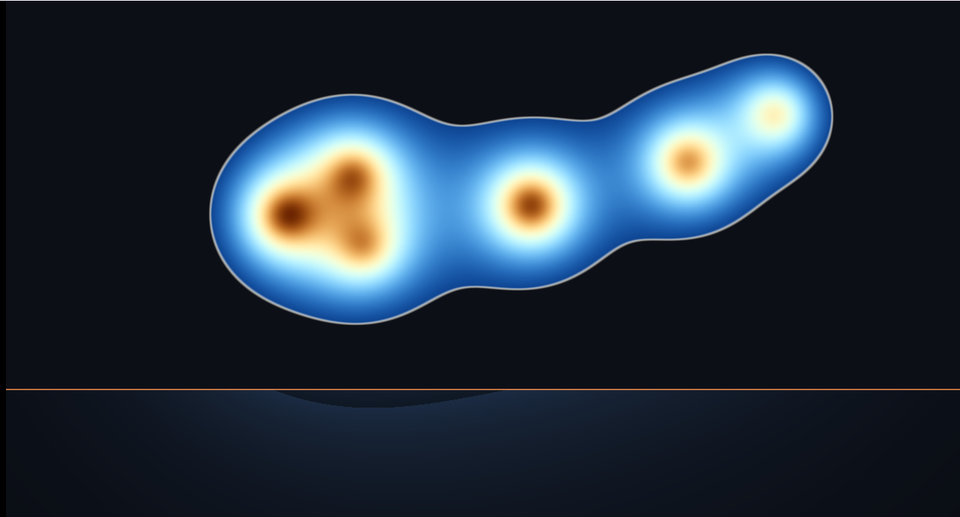

# 19. メタボール — 場を足してからしきい値で切る



図形を足すのではなく、**点のまわりに広がる「影響力」を足します**。
近づいた玉どうしが、水銀のように融合します。

下の帯は「場」そのものを等高線で見せたものです。

ソース : [`shaders/lab/19_metaball.hlsl`](../../shaders/lab/19_metaball.hlsl)

---

## 1. 距離関数との違い

[02 章](02_距離関数で図形を描く.md)では `min` で図形を繋ぎました。
メタボールは考え方が違います。

| | 距離関数 ＋ `min` | メタボール |
|---|-----------------|-----------|
| 足すもの | 距離（**近いほど小さい**）| 場（**近いほど大きい**）|
| 合成 | `min(a, b)` | `a + b` |
| 形 | 接触するまで別々 | **近づくと引き合う** |

「足し算」であることが本質です。
2 つの玉のあいだでは、両方の場が足されて閾値を超えるので、
**接触する前から橋が架かります**。

---

## 2. 場の定義

```hlsl
float Field(float2 p, float2 center, float strength)
{
    float2 d = p - center;
    return strength / (dot(d, d) + 0.02f);
}
```

`1/r²` を使うのが古典的です（Blinn の "blobby model"）。

- 中心で大きく、離れるほど急に小さくなる
- **裾が無限に伸びる**ので、遠くの玉ともわずかに影響し合う

`+ 0.02f` は 0 除算を避けるためです。
この値が「玉の芯の太さ」も決めます。

---

## 3. しきい値で切る

```hlsl
const float threshold = 1.0f;

float edge = fwidth(field);
float mask = smoothstep(threshold - edge, threshold + edge, field);
```

場が 1 を超えたところが「中」です。

### `fwidth` で縁の太さを揃える

場は中心付近で急激に変化し、遠くでは緩やかです。
固定幅でぼかすと、**玉の中心付近だけ縁が細く**なります。

`fwidth(field)` は「隣のピクセルとの差」なので、
それを幅に使えば、どこでも 1 ピクセルぶんの縁になります。
[02 章](02_距離関数で図形を描く.md)の `FillMask` と同じ考え方です。

---

## 4. 等高線で場を見る

下の帯では、しきい値で切らずに場そのものを描いています。

```hlsl
float bands = frac(field * 2.5f);
```

こうすると、**玉と玉のあいだで等高線が繋がっている**のが見えます。
輪郭がどこに引かれるかを、視覚的に確かめられます。

オレンジの線がちょうど `field == 1.0` の等高線で、
上の絵の輪郭と一致します。

---

## 5. つまずきやすい点

### 玉の数だけ計算が増える

距離関数の `min` と違い、**すべての玉を必ず評価**します。
早期打ち切りができません。数十個が実用上の限界です。

多数を扱うなら、空間を分割して近い玉だけ見る工夫が要ります。

### しきい値と強さの関係

```hlsl
strengths[i] = 0.045f + ...;
const float threshold = 1.0f;
```

強さを 2 倍にすると、玉の半径は √2 倍になります（`1/r²` なので）。
**しきい値を下げても同じ効果**なので、どちらか片方だけ触るのが混乱しません。

### 3D では法線が要る

2D なら塗るだけですが、3D では陰影のために法線が必要です。
場の勾配を取れば得られます。

```
法線 = -normalize(∇field)
```

符号が負なのは、**場は内側ほど大きい**（距離関数と逆）ためです。

---

## 6. 距離関数のスムーズ和との違い

[02 章](02_距離関数で図形を描く.md)のスムーズ和も、玉を融合させます。

| | メタボール | スムーズ和 |
|---|-----------|----------|
| 融合の範囲 | **無限**（裾が伸びる）| `k` で指定した範囲だけ |
| 制御 | しにくい | しやすい |
| 距離の正確さ | 距離ではない | 近似的に距離 |
| レイマーチング | 使いにくい | 使える |

**レイマーチングでは距離が必要**なので、スムーズ和のほうが向いています。
2D で塗るだけならメタボールが素直です。

---

## 7. ここから作れるもの

| やりたいこと | 変えるところ |
|------------|------------|
| 3D のメタボール | 場を 3 次元にして、勾配から法線を作る |
| 溶岩ランプ | 玉をゆっくり上下させ、暖色に |
| 液体の落下 | 玉に重力と衝突を与える（CPU 側で）|
| 群れの可視化 | 玉の位置を実データにする |
| 等高線図 | 下の帯の描き方をそのまま使う |

---

## 参照

- James Blinn, "A Generalization of Algebraic Surface Drawing",
  ACM TOG 1982 — メタボール（blobby model）の原典
- [Inigo Quilez — Smooth minimum](https://iquilezles.org/articles/smin/)
  — 距離関数側の解法
- [02 距離関数で図形を描く](02_距離関数で図形を描く.md)
