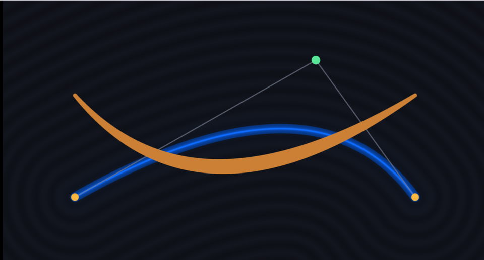

# 20. ベジエ曲線 — 曲線までの距離を解く



2 次ベジエ曲線なら、**点からの最短距離が解析的に求まります**。
距離さえ分かれば、太さも輪郭もにじみも
[02 章](02_距離関数で図形を描く.md)と同じ手が使えます。

青い線が太さ一定、オレンジの線が太さを変えたものです。
背景の同心円が距離場そのものです。

ソース : [`shaders/lab/20_bezier.hlsl`](../../shaders/lab/20_bezier.hlsl)

---

## 1. 2 次ベジエ曲線

制御点 A・B・C に対して

```
P(t) = (1-t)² A + 2(1-t)t B + t² C     （0 ≤ t ≤ 1）
```

A から始まり C で終わり、**B へ引っ張られる**曲線です。
B 自身は通りません。

画面の細い線が制御多角形（A→B→C）、丸が制御点です。

---

## 2. 最短距離は 3 次方程式

点 `pos` から曲線までの距離が最小になる `t` を求めます。

```
d(t) = |P(t) - pos|²
```

これを `t` で微分して 0 とおくと、`t` の **3 次方程式**になります。
3 次までなら解の公式があるので、解析的に解けます。

```hlsl
float h = q * q + 4.0f * p3;   // 判別式

if (h >= 0.0f)  { /* 解が 1 つ : カルダノの公式 */ }
else            { /* 解が 3 つ : 三角関数で解く */ }
```

判別式の符号で場合分けするのが定石です。

- **h ≥ 0** … 実数解が 1 つ。立方根で求まる
- **h < 0** … 実数解が 3 つ。`acos` と `cos` で求まる（三角関数解）

3 つ出た場合は、そのうち最短のものを採ります。

> **3 次ベジエ（制御点 4 つ）は 5 次方程式になり、解の公式がありません。**
> 反復で近似するか、線分に分割して近似します。

### 解を 0〜1 に丸める

```hlsl
float tt = saturate(uv.x + uv.y - kx);
```

方程式の解が 0〜1 の外に出たら、**端点がいちばん近い**という意味です。
`saturate` で丸めるだけで正しい答えになります。

---

## 3. 距離が分かれば何でもできる

### 太さ一定の線

```hlsl
float stroke = 0.035f;
float mask = 1.0f - smoothstep(stroke - fwidth(d), stroke + fwidth(d), d);
```

**太さとは「距離のしきい値」**です。それ以上でも以下でもありません。

### 太さを変える（筆圧）

```hlsl
float u = saturate((p.x + 1.5f) / 3.0f);
float taper = 0.055f * sin(u * kPi);
```

しきい値を場所によって変えるだけです。
オレンジの線が、両端で細く中央で太くなっています。

### にじみ

```hlsl
color += lineColor * 0.012f / max(d, 0.004f) * 0.35f;
```

`1/r` を足すと、線のまわりが光ります（[18 章](18_星空.md)と同じ形）。

### 距離場の可視化

```hlsl
float rings = 0.5f + 0.5f * cos(d * 55.0f);
```

等高線を描くと、距離が正しく求まっていることを目で確認できます。
**新しい距離関数を書いたら、まずこれを出す**のが確実です。

---

## 4. つまずきやすい点

### `b` がゼロになる場合

```hlsl
float2 b = A - 2.0f * B + C;
float kk = 1.0f / max(dot(b, b), 1e-6f);
```

3 点が一直線に等間隔で並ぶと `b` が 0 になり、曲線は直線になります。
このとき `1/dot(b,b)` が発散するので、下限が必要です。

### 立方根の符号

```hlsl
float2 uv = sign(x) * pow(abs(x), 1.0f / 3.0f);
```

HLSL の `pow` は**負の底を扱えません**（`NaN` になります）。
絶対値で計算してから符号を戻します。

### `acos` の引数

```hlsl
acos(clamp(q / (p * z * 2.0f), -1.0f, 1.0f))
```

数値誤差でわずかに ±1 を超えることがあります。
`clamp` を入れないと、境界のピクセルだけ黒い点が出ます。

### 重い

1 ピクセルあたり、平方根・立方根・逆三角関数が走ります。
背景全面に敷くと効きます。実務では
**曲線を線分に分割して距離を測る**近似のほうが速いこともあります。

---

## 5. ここから作れるもの

| やりたいこと | 使うもの |
|------------|---------|
| フォントの描画 | 輪郭を 2 次ベジエで表す（TrueType はまさにこれ）|
| 手書き風の線 | 太さにノイズを混ぜる |
| 破線 | 曲線に沿った位置 `t` で `frac` |
| 矢印・吹き出し | 端点の近くだけ太さを変える |
| 道路・川 | 曲線に沿ってテクスチャを貼る |

---

## 参照

- [Inigo Quilez — Quadratic Bezier SDF](https://iquilezles.org/articles/distfunctions2d/)
  — 本章の実装の出典
- [Inigo Quilez — Cubic Bezier](https://iquilezles.org/articles/bezierbbox/)
- [三次方程式の解の公式 | Wikipedia](https://ja.wikipedia.org/wiki/三次方程式)
- [02 距離関数で図形を描く](02_距離関数で図形を描く.md)
