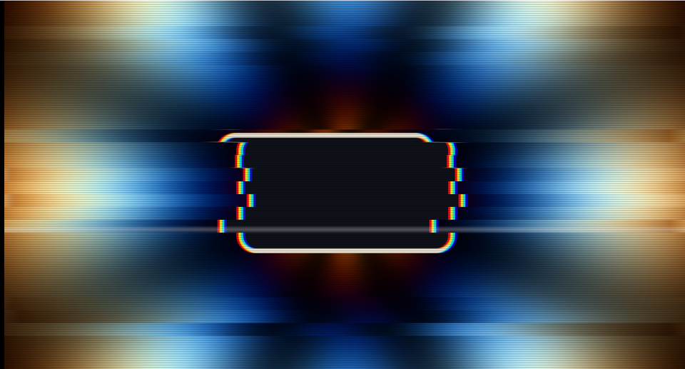

# 21. グリッチ — わざと壊す



ずらす・量子化する・入れ替える。
どれも「読む位置を変える」「値を丸める」だけです。

**肝は時間の扱い**で、毎フレーム変えるとただのノイズになります。

ソース : [`shaders/lab/21_glitch.hlsl`](../../shaders/lab/21_glitch.hlsl)

---

## 1. 時間を階段状にする

```hlsl
float step1 = floor(t * 8.0f);   // 1/8 秒ごとに切り替わる
float step2 = floor(t * 1.7f);   // 約 0.6 秒ごと
```

`floor` を取ることで、時間が**飛び飛びの整数**になります。
これをハッシュに渡せば、その区間のあいだは同じ乱数が返ります。

| 時間の扱い | 見え方 |
|-----------|-------|
| `t` をそのまま | 毎フレーム変わる → **ただの砂嵐** |
| `floor(t * n)` | n 分の 1 秒ごとに切り替わる → **機械が壊れて見える** |

グリッチが「壊れている」と感じられるのは、
**ある状態がしばらく保たれてから、急に別の状態へ飛ぶ**からです。

### 2 つの時間スケール

- `step1`（速い）… ずれ方そのもの
- `step2`（遅い）… 「壊れている時間帯」かどうか

遅いほうで burst を作ると、
**正常 → 壊れる → 正常**という周期が生まれ、リズムが出ます。

```hlsl
float burst = 0.35f + 0.65f * step(0.45f, Hash21(float2(step2, 3.7f)));
```

---

## 2. 横帯ごとにずらす

```hlsl
float bandCount = lerp(12.0f, 44.0f, Hash21(float2(step2, 8.1f)));
float band = floor(uv.y * bandCount);

float seed = Hash21(float2(band, step1));
float amount = (seed > 0.62f) ? (Hash21(float2(band, step1 + 5.0f)) - 0.5f) : 0.0f;

warped.x += amount * 0.20f * burst;
```

アナログ映像の同期ずれを真似ています。

**帯の高さもランダムに変える**のが効きます。
固定だと「規則正しく壊れている」ように見えて嘘くさくなります。

`seed > 0.62` で間引いているのも同じ理由です。
全部の帯をずらすと、ただの歪みになります。

---

## 3. ブロック単位で入れ替える

```hlsl
float2 blockSize = float2(0.10f, 0.055f);
float2 block = floor(uv / blockSize);

if (Hash21(block + step1 * 13.0f) > 0.86f && burst > 0.5f)
{
    warped += (Hash22(block + step1) - 0.5f) * 0.35f;
}
```

デジタル圧縮の破綻（マクロブロックの欠落）に相当します。

`* 13.0f` は、時間と場所を混ぜるための係数です。
これが無いと、隣り合うブロックが同じタイミングで壊れます。

---

## 4. チャンネルをずらす

```hlsl
float r = SourceImage(frac(warped + float2( shift, 0.0f)), t).r;
float g = SourceImage(warped, t).g;
float b = SourceImage(frac(warped + float2(-shift, 0.0f)), t).b;
```

[14 章](14_画面効果.md)の色収差と同じですが、こちらは
**中心からの距離に比例させず、一律に横へずらします**。

レンズの収差ではなく「信号の遅れ」を表現しているので、
一律のほうがそれらしくなります。

---

## 5. 色を段階に丸める

```hlsl
float levels = 5.0f;
color = floor(color * levels + 0.5f) / levels;
```

ビット深度が落ちたときの見え方（ポスタリゼーション）です。
`+ 0.5f` は四捨五入にするためで、無いと全体が暗くなります。

---

## 6. つまずきやすい点

### `frac` で折り返す

```hlsl
warped = frac(warped);
```

ずらすと 0〜1 の外へ出ます。何もしないと、
サンプラーの設定次第で端の色が伸びたり、真っ黒になったりします。

`frac` を通せば反対側から読むので、「送り」らしく見えます。

### 効果を全部同時に掛けない

すべて常時オンにすると、ただ汚い画面になります。
**間引き**と**時間帯**が要点です。

この習作でも最初は控えめすぎて、
撮影したときに「たまたま正常な瞬間」ばかりが写りました。
常時 35 %、burst 時 100 % という形に直しています。

### 元の絵が単調だと分からない

グリッチは「元があるべき姿」との差で認識されます。
**輪郭のはっきりした絵**（この習作では中央の枠）を置くと、
ずれが目で追えるようになります。

---

## 7. ここから作れるもの

| やりたいこと | 変えるところ |
|------------|------------|
| データモッシュ | 前フレームの絵を混ぜる（履歴が要る）|
| VHS | 走査線・色にじみ・上下の揺れ |
| 電波障害 | ノイズを強く、同期ずれを大きく |
| ダメージ表現 | 画面の端だけ壊す |
| 転換演出 | burst を明示的に制御して短時間だけ |

---

## 参照

- [14 画面効果](14_画面効果.md) — 色収差・走査線の基本形
- [The Book of Shaders — Random](https://thebookofshaders.com/10/)
- [floor / frac | Microsoft Learn](https://learn.microsoft.com/en-us/windows/win32/direct3dhlsl/dx-graphics-hlsl-intrinsic-functions)
