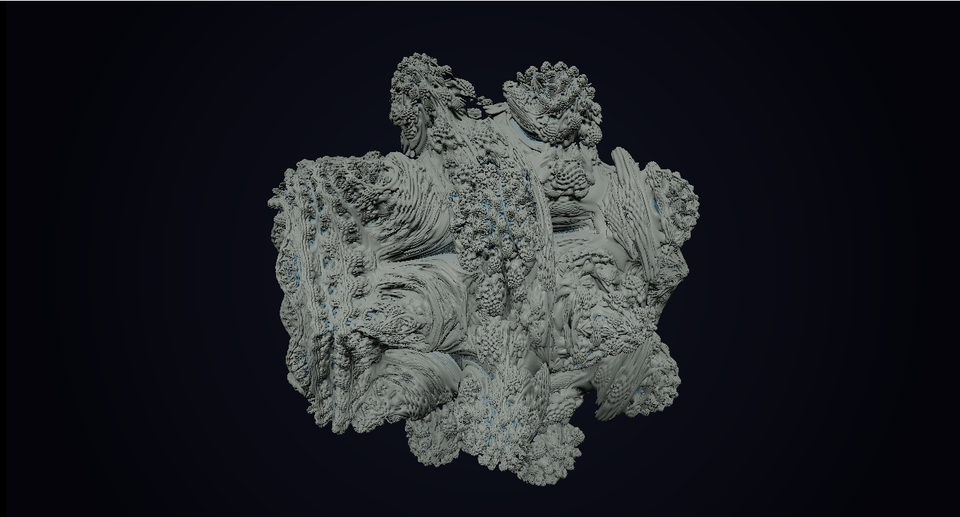

# 22. マンデルバルブ — 3D のフラクタル



[12 章](12_マンデルブロ集合.md)の `z ← z² + c` を 3 次元へ持ち上げ、
[11 章](11_レイマーチング.md)のレイマーチングで見ます。

**「距離を返す関数」さえ作れれば、どんな形でも描ける**という
レイマーチングの強みが、いちばんよく出る例です。

ソース : [`shaders/lab/22_mandelbulb.hlsl`](../../shaders/lab/22_mandelbulb.hlsl)

---

## 1. 複素数の 2 乗を 3 次元へ

2 次元の複素数の 2 乗は、極形式で書くとこうなります。

```
z = r·e^(iθ)  →  z² = r²·e^(i2θ)
```

つまり「**半径を 2 乗、角度を 2 倍**」です。

3 次元には複素数がありませんが、この操作なら真似できます。
球面座標 `(r, θ, φ)` を使い、

```
半径を n 乗、2 つの角度を n 倍
```

とすれば、そのまま持ち上がります。

```hlsl
float theta = acos(clamp(z.z / r, -1.0f, 1.0f));
float phi   = atan2(z.y, z.x);

float zr = pow(r, power);
theta *= power;
phi   *= power;

z = zr * float3(sin(theta) * cos(phi),
                sin(theta) * sin(phi),
                cos(theta));
z += p;
```

`power = 8` が定番です。Daniel White と Paul Nylander が
2009 年に見つけた形で、これがいちばん「有機的」に見えます。

本習作では 6〜9 のあいだをゆっくり動かしています。

---

## 2. 距離の推定値

レイマーチングには距離が要ります。
しかしフラクタルの正確な距離は求まりません。

代わりに使うのが**距離の推定値**（distance estimator）です。

```hlsl
dr = pow(r, power - 1.0f) * power * dr + 1.0f;   // 微分の連鎖

return 0.5f * log(r) * r / dr;
```

これは「反復関数の微分から、面までの距離の下界を見積もる」式です。
正確ではありませんが、**これ以上進んでも突き抜けない**量にはなります。

導出は複素力学系の理論（Douady–Hubbard ポテンシャル）に基づきます。

### 控えめに進む

```hlsl
distance += d * 0.85f;
```

推定値なので、そのまま進むと**まれに突き抜けます**。
0.8〜0.9 を掛けるのが定石です。

小さくすると安全ですが、反復回数が増えて重くなります。

---

## 3. 距離に応じた打ち切り

```hlsl
if (d < 0.0006f * distance)
```

しきい値を**カメラからの距離に比例させて**います。

遠くの物は画面上で小さいので、細かく追う意味がありません。
固定値にすると、遠景で反復回数を無駄に使います。

これは「1 ピクセルが覆う実サイズ」に合わせる考え方で、
レイマーチング全般で使えます。

---

## 4. 軌道トラップで色を付ける

```hlsl
trap = min(trap, r);   // 反復中、原点にいちばん近づいた距離
```

反復のあいだに `z` がどれだけ原点へ近づいたかを覚えておき、
その値を色に使います。

```hlsl
float3 albedo = PaletteWarm(saturate(trap * 1.4f) * 0.8f + 0.1f);
```

**内部構造が表面に浮かび上がります**。
反復回数だけで色を付けると、のっぺりした単色になります。

原点との距離のほかに、
「特定の平面までの距離」「特定の球までの距離」なども使えます
（orbit trap と総称されます）。

---

## 5. つまずきやすい点

### 反復回数と品質

```hlsl
for (int i = 0; i < 8; ++i)
```

8 回でも形はほぼ決まります。増やすと表面のディテールが細かくなりますが、
**1 ピクセルあたりの負荷が反復回数 × マーチング回数**で効いてきます。

### `acos` の引数

```hlsl
acos(clamp(z.z / r, -1.0f, 1.0f))
```

`r` が 0 に近いと `z.z / r` が発散します。
`clamp` が無いと `NaN` が出て、その部分が黒く抜けます。

### 法線の `e`

```hlsl
const float e = 0.0008f;
```

距離の推定値はノイズを含むので、`e` が小さすぎると法線が暴れます。
大きすぎるとディテールが消えます。

[10 章](10_水面.md)と同じ悩みで、
**大きめから始めて少しずつ下げる**のが安全です。

### とにかく重い

1 ピクセルあたり `MapBulb` が
「マーチング 110 回 ＋ 法線 4 回」呼ばれ、
そのそれぞれで 8 回反復します。

1280 × 720 で最悪 **8 億回以上**の反復です。
本習作でも解像度を上げると目に見えて重くなります。

---

## 6. ここから作れるもの

| やりたいこと | 変えるところ |
|------------|------------|
| ジュリア集合の 3D 版 | `z += p` を `z += c`（定数）に |
| メンガーのスポンジ | 距離関数を折り返しで作る |
| クリフォードアトラクタ | 反復式を変える |
| 断面を見る | 平面で切る（`max` で差集合）|
| 環境光遮蔽 | 法線方向へ数点進めて距離を見る |

---

## 参照

- [Daniel White — The Unravelling of the Real 3D Mandelbulb](https://www.skytopia.com/project/fractal/mandelbulb.html)
  — マンデルバルブの発見
- [Inigo Quilez — Distance estimation](https://iquilezles.org/articles/distancefractals/)
  — 距離推定値の導出
- [Syntopia — Distance Estimated 3D Fractals](http://blog.hvidtfeldts.net/index.php/2011/06/distance-estimated-3d-fractals-part-i/)
- [11 レイマーチング](11_レイマーチング.md)
- [12 マンデルブロ集合](12_マンデルブロ集合.md)
