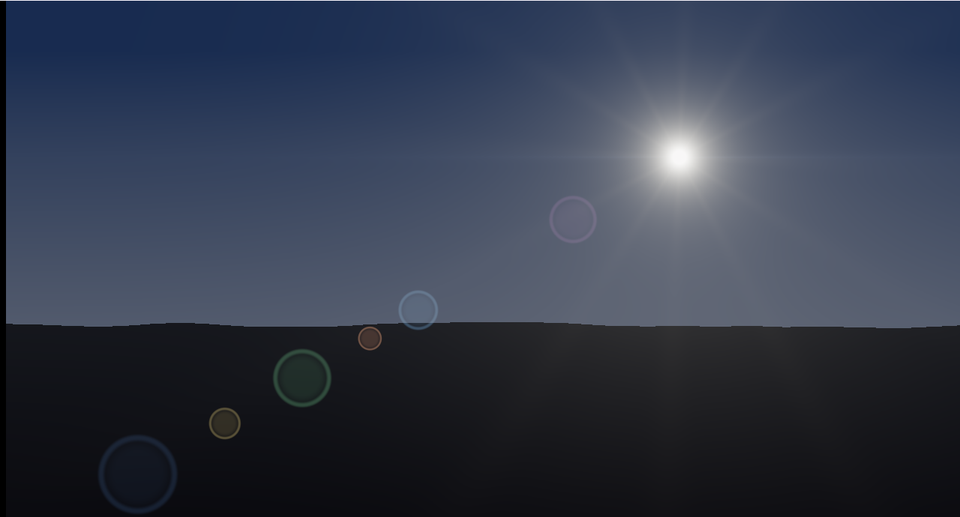

# 23. レンズフレア — 光源の「反対側」に並べる



レンズの中で反射した光が、画面の中心を挟んで**反対側**に像を結びます。
だから「光源の位置を中心で反転させ、その線上に並べる」だけでよいのです。

ソース : [`shaders/lab/23_lensflare.hlsl`](../../shaders/lab/23_lensflare.hlsl)

---

## 1. なぜ「反対側」なのか

レンズは何枚も重なっています。
入ってきた光の一部が、レンズの表面で反射し、
別のレンズでもう一度反射して、センサーへ届きます。

2 回反射した光は**光路が反転**するため、
光源が画面の右上にあれば、その像は左下に現れます。

```hlsl
float2 axis = -sun;   // 中心を挟んで反対側

color += Ghost(p, axis * 0.35f, ...);
color += Ghost(p, axis * 0.60f, ...);
color += Ghost(p, axis * 0.95f, ...);
...
```

**同じ軸の上に、違う倍率で並べる**。これだけです。
倍率が「どのレンズ面で反射したか」に対応します。

倍率を負にすると光源側に出ます（`axis * -0.45f` がそれです）。

---

## 2. ゴーストの形

```hlsl
float3 Ghost(float2 p, float2 center, float size, float3 tint, float intensity)
{
    float d = length(p - center);

    float disc = smoothstep(size, size * 0.55f, d);
    float ring = smoothstep(size * 1.02f, size * 0.92f, d)
               * smoothstep(size * 0.78f, size * 0.90f, d);

    return tint * (disc * 0.35f + ring * 0.9f) * intensity;
}
```

中身が薄く、**縁が明るいリング状**にするのが要点です。
一様な円にすると、ただのシールを貼ったように見えます。

実際のゴーストは絞りの形（六角形・七角形）になりますが、
円でも十分それらしくなります。

色をばらけさせるのも大事です。
レンズのコーティングによって、反射する波長が違うためです。

---

## 3. 光条（アナモルフィック）

```hlsl
float streak = 0.010f / max(abs(toSun.y) * 22.0f + abs(toSun.x) * 0.30f, 0.002f);
color += float3(0.45f, 0.62f, 1.00f) * streak;
```

**横に長く伸びる青い筋**です。
シネマ用のアナモルフィックレンズの特徴で、映画的な印象になります。

`abs(y)` に大きな係数、`abs(x)` に小さな係数を掛けることで、
縦に細く横に長い減衰になります。

---

## 4. 放射状のスパイク

```hlsl
float angle = atan2(toSun.y, toSun.x);
float spikes = pow(0.5f + 0.5f * cos(angle * 12.0f), 6.0f);
float falloff = 0.020f / max(sunDistance, 0.02f);
```

絞り羽根による**回折**です。
角度で振動させ、累乗して尖らせます。

羽根の枚数 n に対して、スパイクは
- n が偶数なら **n 本**
- n が奇数なら **2n 本**

現れます。`cos(angle * 12)` なので 12 本です。

---

## 5. 光源が画面外へ出たら消す

```hlsl
float visibility = smoothstep(1.6f, 1.0f, length(sun));
color = lerp(Background(p, t), color, visibility);
```

実際のレンズフレアは、**光源が画面に入っていないと出ません**。
これを入れないと、光源が画面外にあるのにフレアだけが残り、不自然になります。

本格的な実装では、光源が他の物に隠れているかも調べます
（オクルージョンクエリ、または深度バッファを読む）。

---

## 6. つまずきやすい点

### 足しすぎて白飛びする

ゴースト・光条・スパイク・ハロを全部足すと、簡単に 1 を超えます。
最後にトーンマッピングを通しています。

```hlsl
color = color / (1.0f + color);
```

[25 章](../tutorial/25_ポストプロセス.md)の後処理に載せるなら、
**トーンマッピングの前に足す**のが正解です。

### 縦横比

`ToCenteredUv` は縦を基準にしているので、
`axis` の倍率をそのまま使うと、横長の画面ではゴーストの並びが
画面の端まで届きません。意図した位置に来ないときはここを疑います。

### やりすぎると邪魔になる

レンズフレアは「カメラの欠陥」です。
強くすると、画面の主役が見えなくなります。

映像作品では意図的に強く使うこともありますが、
**既定は控えめ**にしておくのが無難です。

---

## 7. ここから作れるもの

| やりたいこと | 変えるところ |
|------------|------------|
| 絞りの形を六角形に | `Ghost` を [02 章](02_距離関数で図形を描く.md)の多角形 SDF に |
| 光源に追従させる | 3D の光源を画面座標へ射影して `sun` に渡す |
| 遮蔽を考慮する | 深度バッファを読んで `visibility` を掛ける |
| 虹色の縁 | ゴーストの半径を色ごとに少しずらす |
| 汚れたレンズ | ノイズのテクスチャを掛ける |

---

## 参照

- John Chapman, ["Pseudo Lens Flare"](https://john-chapman.github.io/2017/11/05/pseudo-lens-flare.html)
  — 画面座標だけで作る手法
- Matthias Hullin et al., "Physically-Based Real-Time Lens Flare Rendering",
  SIGGRAPH 2011 — レンズ構成から計算する手法
- [25 章 ポストプロセス](../tutorial/25_ポストプロセス.md)
- [18 星空](18_星空.md) — `1/r` によるにじみ
