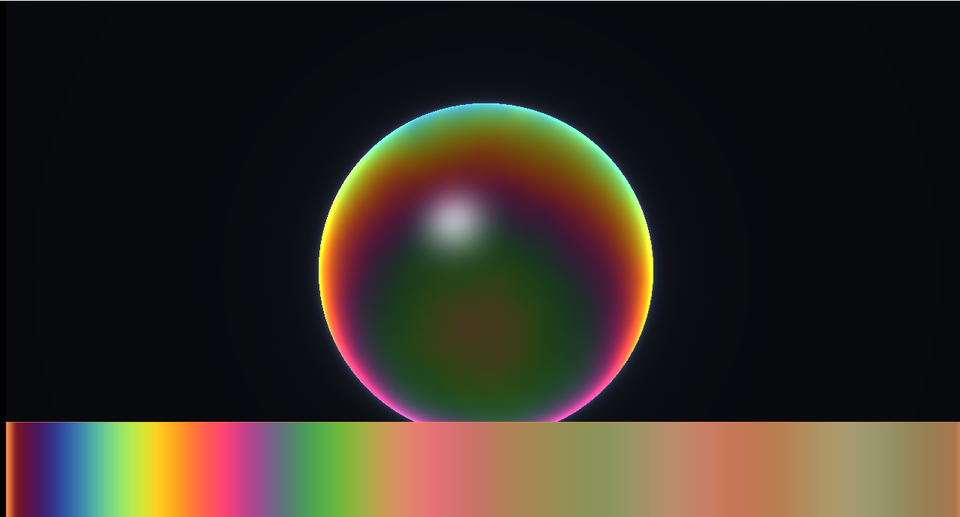

# 24. 薄膜干渉 — シャボン玉の虹色は色素ではない



シャボン玉に色素は入っていません。
**光の波が重なって、打ち消し合ったり強め合ったり**することで色が付きます。

下の帯は「膜の厚みを変えたときの色」です。厚みだけで色が変わります。

ソース : [`shaders/lab/24_thinfilm.hlsl`](../../shaders/lab/24_thinfilm.hlsl)

---

## 1. 何が起きているか

薄い膜に光が当たると、**表と裏の 2 か所で反射**します。

```
        入射光
          ↓
    ─────●───── 表面（1 回目の反射）
         ／
        ／  膜の中（屈折率 n、厚み d）
       ／
    ──●─────── 裏面（2 回目の反射）
```

2 つの反射光が進んだ距離の差（**行路差**）が

- 波長の整数倍 → **強め合う**（その色が明るくなる）
- 半波長ずれる → **打ち消し合う**（その色が消える）

強め合う波長が厚みによって変わるので、虹色に見えます。

---

## 2. 式

```hlsl
float FilmIntensity(float thickness, float ior, float cosTheta, float wavelength)
{
    // スネルの法則から、膜の中での余弦を求める
    float sinTheta2 = (1.0f - cosTheta * cosTheta) / (ior * ior);
    float cosInside = sqrt(max(1.0f - sinTheta2, 0.0f));

    // 行路差（nm 単位）
    float pathDifference = 2.0f * ior * thickness * cosInside;

    // 位相差。片方の反射で π ずれる（固定端反射）ので kPi を足す
    float phase = kTau * pathDifference / wavelength + kPi;

    return 0.5f + 0.5f * cos(phase);
}
```

### 行路差 = 2 · n · d · cos θ'

膜の中を往復するので **2 倍**、屈折率のぶん光路が伸びるので **n 倍**、
斜めに入るほど長くなるので **cos で補正**。

### `+ kPi` を忘れない

屈折率の低い側から高い側へ反射するとき、位相が **π だけ飛びます**
（弦の固定端反射と同じ）。表面ではこれが起き、裏面では起きません。

これを入れないと、**厚みが 0 のときに白く光る**という誤りになります。
実際は厚みが 0 に近づくとシャボン玉は真っ黒になります。

---

## 3. 波長ごとに足し合わせる

```hlsl
for (int i = 0; i < kSamples; ++i)
{
    float wavelength = lerp(390.0f, 720.0f, (i + 0.5f) / kSamples);
    float intensity = FilmIntensity(thickness, ior, cosTheta, wavelength);
    sum += WavelengthToRgb(wavelength) * intensity;
}
```

**ここが「虹色になる」理由の全部**です。

可視光を 24 点に分けて、それぞれの強さを求め、
その波長の色を掛けて足す。RGB の 3 点では足りません。
干渉は波長ごとに細かく変わるので、**分光して計算**する必要があります。

### 波長から RGB へ

`WavelengthToRgb` は CIE の等色関数を区分的に近似したものです。
380 nm（紫）から 780 nm（赤）まで、
紫 → 青 → 水 → 緑 → 黄 → 赤 と変わります。

---

## 4. 厚みの分布

```hlsl
float thickness = 320.0f
                + 260.0f * saturate(0.5f - p.y * 0.8f)      // 重力で下が厚い
                + 90.0f * Fbm(p * 2.6f + 流れ, 4);           // 揺らぎ
```

実際のシャボン玉も、**重力で下へ液が流れて下が厚くなります**。
上のほうが薄くなり、やがて割れます。

単位は **nm（ナノメートル）**です。可視光の波長（390〜720 nm）と
同じ桁でないと干渉が起きません。

---

## 5. つまずきやすい点

### 単位を間違える

厚みを「メートル」や「シェーダーの座標」で書くと、
`pathDifference / wavelength` が桁違いになり、
**単色になる**か**目に見えないほど細かい縞**になります。

nm で統一するのが素直です。

### 波長のサンプル数

3 点（RGB）だと、干渉の細かい変化を拾えません。
色がのっぺりするか、実際には無いはずの色が出ます。

16〜32 点あれば十分です。この習作では 24 点使っています。

### 角度依存を忘れる

`cosTheta` を 1 に固定すると、**正面から見た色しか出ません**。
シャボン玉の縁が別の色になるのは、そこを斜めから見ているからです。

---

## 6. ここから作れるもの

| やりたいこと | 変えるところ |
|------------|------------|
| 油膜 | 厚みを平面に、屈折率を 1.5 前後に |
| 玉虫色の金属 | 金属の上に薄膜を載せる（反射率が変わる）|
| CD・DVD の虹 | 干渉ではなく回折（溝の間隔で決まる）|
| 真珠・貝殻 | 多層膜（層の数だけ足し合わせる）|
| 実際の PBR に組み込む | フレネル項を薄膜干渉に置き換える |

---

## 参照

- Laurent Belcour & Pascal Barla, "A Practical Extension to Microfacet Theory
  for the Modeling of Varying Iridescence", SIGGRAPH 2017
  — PBR に薄膜干渉を組み込む手法
- [薄膜干渉 | Wikipedia](https://ja.wikipedia.org/wiki/薄膜干渉)
- [CIE 等色関数 | CIE](https://cie.co.at/data-tables)
- [08 カラーパレット](08_カラーパレット.md)
