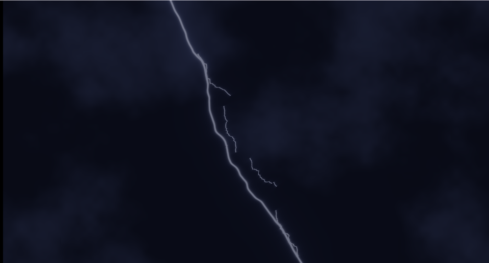

# 25. 稲妻 — まっすぐな線を、ノイズで折り曲げる



稲妻は「**線分までの距離**を、fBm で歪ませたもの」にすぎません。
枝は同じ処理を小さくして重ねます。

ソース : [`shaders/lab/25_lightning.hlsl`](../../shaders/lab/25_lightning.hlsl)

---

## 1. 線を歪ませる

```hlsl
float2 rel = p - a;
float  along = dot(rel, dir) / len;              // 線に沿った位置（0〜1）
float  side  = dot(rel, float2(-dir.y, dir.x));  // 線から離れた距離

// ★ 「横へのずれ」をノイズで作る
float n = 0.0f;
n += (Fbm(float2(along * 3.0f,  seed) + time * 0.9f, 4) - 0.5f) * 1.00f;
n += (Fbm(float2(along * 9.0f,  seed + 5.0f) + time * 1.7f, 3) - 0.5f) * 0.35f;
n += (Fbm(float2(along * 26.0f, seed + 9.0f) + time * 3.1f, 2) - 0.5f) * 0.12f;

side -= n * wobble * envelope;
```

### 入力は `along` だけ

ノイズに渡すのは「**線に沿った位置**」だけです。
`p` そのものを渡すと、線ではなく「面全体」が歪んでしまいます。

1 次元の入力にすることで、**線が 1 本の折れ線として折れ曲がります**。

### 3 段階の細かさ

| 段 | 周波数 | 振幅 | 役割 |
|----|-------|------|------|
| 1 | 3 | 1.00 | 大きな蛇行 |
| 2 | 9 | 0.35 | 中くらいの折れ |
| 3 | 26 | 0.12 | 細かいギザギザ |

[05 章](05_fBmと雲.md)の fBm と同じ「周波数を上げ、振幅を下げる」構造です。

### 両端を固定する

```hlsl
float envelope = sin(saturate(along) * kPi);
```

`sin` は 0 と 1 で 0 になるので、**始点と終点は動きません**。
これが無いと、線の端が指定した場所から外れます。

---

## 2. 線分の外側を減衰させる

```hlsl
float outside = max(max(-along, along - 1.0f), 0.0f);
float d = sqrt(side * side + outside * outside * 4.0f);
```

`along` が 0〜1 の外に出たぶんを、距離に足し込みます。
これで**線分の端で光が止まります**。

`* 4.0f` は「端で急に暗くする」ための係数です。

---

## 3. 明るさは距離の逆数

```hlsl
return thickness / max(d, 0.0008f);
```

`1/r` は中心が鋭く、裾が長く伸びます。
[18 章](18_星空.md)の星、[23 章](23_レンズフレア.md)の光条と同じ形です。

### 芯と暈（かさ）を分ける

```hlsl
float3 core = float3(1.00f, 0.98f, 0.95f) * pow(saturate(glow * 0.55f), 2.2f);
float3 halo = float3(0.35f, 0.45f, 1.00f) * saturate(glow * 0.28f);
```

同じ `glow` を、**累乗して白い芯**と、**そのまま使って青い暈**に分けます。
1 種類だと「ただの光る線」になり、放電に見えません。

---

## 4. 枝

```hlsl
for (int i = 0; i < 4; ++i)
{
    float u = 0.22f + fi * 0.19f;          // 主放電のどこから分かれるか
    float2 start = lerp(top, bottom, u);
    ...
    branches += Bolt(p, start, end, ..., 0.18f, 0.0040f) * 0.7f;
}
```

主放電の途中から分かれ、**短く・細く・暗く**します。
歪みの量（`wobble`）も小さくします。

本物の稲妻は再帰的に枝分かれしますが、
シェーダーでは再帰が使えないので、1 段で止めています。

---

## 5. 明滅 — 時間を階段状に

```hlsl
float period = floor(t * 1.3f);
float local  = frac(t * 1.3f);

float strike = Hash21(float2(period, 2.7f));
float flash  = (strike > 0.18f) ? exp(-local * 4.0f) * ... : 0.18f;

// 一度光ってから、少し遅れてもう一度光る
flash += (strike > 0.55f) ? exp(-abs(local - 0.22f) * 18.0f) * 0.75f : 0.0f;
```

[21 章](21_グリッチ.md)と同じ「`floor` で時間を階段にする」手です。

`exp(-local * k)` で**急に光って、ゆっくり消える**形にします。
2 発目を少し遅らせて足すと、実際の落雷（多重雷撃）に近づきます。

> **資料用に、下限を 0.55 に固定しています。**
>
> ```hlsl
> flash = max(flash, 0.55f);
> ```
>
> 実際の落雷らしさを優先するなら下限は 0 でよいのですが、
> それだと「いつ撮っても放電が見えない」ことになります。
> ここは**見せるための妥協**だと明記しておきます。

---

## 6. つまずきやすい点

### `p` をノイズに渡してしまう

いちばんやりがちな間違いです。線が折れず、画面全体が歪みます。

### 端が動く

`envelope` を忘れると、始点と終点がノイズで動きます。
「雲から地面へ落ちる」ようにしたいなら、端は固定が必要です。

### 明るすぎて全部白くなる

`1/r` は中心で発散します。最後にトーンマッピングを通しています。

```hlsl
color = color / (1.0f + color);
```

---

## 7. ここから作れるもの

| やりたいこと | 変えるところ |
|------------|------------|
| 電気アーク | 2 点間を結び、短く速く |
| 魔法のエフェクト | 色を変え、枝を増やす |
| 血管・稲妻状のひび | 動かさず、枝を再帰的に（CPU で生成）|
| プラズマボール | 中心から放射状に何本も |
| 電線のスパーク | 短い線分＋粒子 |

---

## 参照

- [The Book of Shaders — Noise](https://thebookofshaders.com/11/)
- [05 fBm と雲](05_fBmと雲.md)
- [21 グリッチ](21_グリッチ.md) — 時間を階段状にする話
- [18 星空](18_星空.md) — `1/r` によるにじみ
