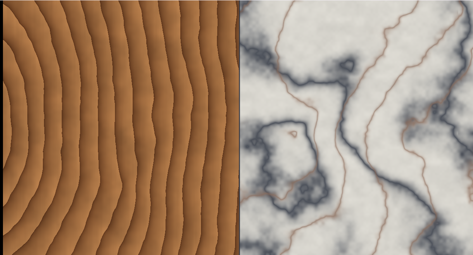

# 26. 木目と大理石 — sin の中にノイズを入れる



どちらも「**規則正しい縞**を**ノイズで乱した**もの」です。
違うのは、縞の形（同心円か直線か）と、乱し方の強さだけ。

ソース : [`shaders/lab/26_woodmarble.hlsl`](../../shaders/lab/26_woodmarble.hlsl)

---

## 1. 共通の型

```
模様 = 縞の関数( 座標 + ノイズ × 強さ )
```

| | 縞の形 | 乱しの強さ |
|---|-------|----------|
| 木目 | 同心円（年輪）| **弱い**（0.95）|
| 大理石 | 直線（脈）| **強い**（6.5）|

弱く乱すと元の縞が残り、強く乱すと渦になります。
**同じ式のパラメータ違い**でしかありません。

---

## 2. 木目

```hlsl
float2 center = float2(-1.15f, 0.10f);
float2 r = q - center;
r.y *= 0.62f;                  // 幹は縦に長いので楕円にする

float radius = length(r);

float distortion = Fbm(q * 1.9f + ..., 5) * 0.95f;
float rings = radius * 7.5f + distortion;
```

### 中心は画面の外に置く

板材は**幹の一部を切り出したもの**なので、
年輪の中心が板の中にあることは多くありません。

中心を画面外に置くと、緩やかに曲がった年輪になります。

### 楕円にする

```hlsl
r.y *= 0.62f;
```

幹は縦に長いので、年輪も縦に伸びた楕円になります。
これが無いと、真円の年輪になって不自然です。

### 年輪の断面

```hlsl
float grain = frac(rings);
grain = pow(grain, 0.45f);
```

年輪は「**急に濃くなり、ゆっくり薄くなる**」非対称な形です
（春材と夏材の違い）。

`frac` で鋸歯を作り、1 より小さい指数で累乗すると、
立ち上がりが急な形に近づきます。

### 導管

```hlsl
float pores = Fbm(float2(q.x * 40.0f, q.y * 2.0f), 3);
```

縦に長く伸ばしたノイズで、木材の細かい筋を作ります。
`x` を 40 倍、`y` を 2 倍と**比を大きく変える**のが要点です。

---

## 3. 大理石

```hlsl
float turbulence = Fbm(q * 1.2f + ..., 6);
float veins = sin((q.x + q.y * 0.35f) * 2.6f + turbulence * 6.5f);
float vein = pow(1.0f - abs(veins), 3.0f);
```

### `sin` の中にノイズを入れる

これが大理石の基本形です。
`sin` の位相をノイズでずらすことで、縞が大きくうねります。

乱しの強さ（`* 6.5f`）を変えると、

| 強さ | 見え方 |
|------|-------|
| 0 | まっすぐな縞 |
| 2 | 波打つ縞 |
| 6.5 | **大理石の脈** |
| 20 | 灰色のもや（乱れすぎ）|

### 脈を細く鋭くする

```hlsl
float vein = pow(1.0f - abs(veins), 3.0f);
```

`abs` を取ると、`sin` が 0 を横切るところが「谷」になります。
`1 - abs` で山に反転し、累乗して細く締めます。

指数を上げるほど細くなります。2 本目の脈は指数 8 でさらに細くしています。

---

## 4. 色

```hlsl
float3 light = float3(0.72f, 0.50f, 0.30f);   // 木の明るいところ
float3 dark  = float3(0.32f, 0.17f, 0.08f);   // 年輪の濃いところ
color = lerp(dark, light, grain);
```

2 色の補間で十分です。
[08 章](08_カラーパレット.md)の cos パレットも使えますが、
**特定の色を必ず出したい**素材では、直接指定するほうが素直です。

---

## 5. つまずきやすい点

### 画面を分割したときの座標

[17 章](17_炎.md)と同じ落とし穴です。
左右に分けるなら、それぞれの中で座標を取り直します。

```hlsl
float2 q = float2((uv.x / 0.5f) * 2.0f - 1.0f, -(uv.y * 2.0f - 1.0f));
q.x *= (g_resolution.x * 0.5f) * g_resolution.w;
```

### 乱しすぎると素材に見えない

木目の乱しを強くすると、大理石になります。
そこからさらに強くすると、ただのノイズになります。

**素材らしさは「規則性が残っている」ことから来ます。**

### タイリングできない

このままでは端が繋がりません。
繰り返し可能にするには、周期的なノイズ（座標を `frac` で折り返してから
ハッシュを引く）が要ります。

---

## 6. ここから作れるもの

| やりたいこと | 変えるところ |
|------------|------------|
| 板目・柾目 | 年輪の中心の位置と楕円率 |
| 節（ふし）| 別の小さい同心円を重ねる |
| 花崗岩 | ボロノイ（[06](06_ボロノイ.md)）で粒を作る |
| 錆 | ノイズのしきい値で剥がれを作る |
| 法線マップも作る | 模様の勾配を法線に（[22 章](../tutorial/22_法線マップ.md)）|

---

## 参照

- Ken Perlin, "An Image Synthesizer", SIGGRAPH 1985
  — 大理石の作例が載っている原典
- [The Book of Shaders — Fractal Brownian Motion](https://thebookofshaders.com/13/)
- [05 fBm と雲](05_fBmと雲.md)
- [07 ドメインワープ](07_ドメインワープ.md) — もっと強く乱す場合
