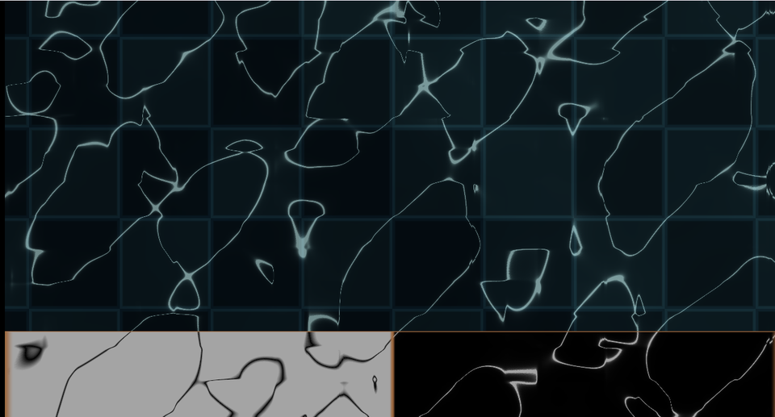

# 27. コースティクス — 水面が光を集めて底に網を描く



プールの底に見える、あの揺れる網目です。
波打つ水面が**レンズの働き**をして、光が集まる場所と散る場所ができます。

下の帯は、左が「面積の伸び縮み」、右が「そこから作った明るさ」です。

ソース : [`shaders/lab/27_caustics.hlsl`](../../shaders/lab/27_caustics.hlsl)

---

## 1. 考え方 — 面積が縮んだところが明るい

水面の小さな正方形を通った光は、屈折して底のどこかに当たります。
そのとき、

- 底で**広がった** → 光が薄まる → 暗い
- 底で**縮んだ** → 光が集まる → **明るい**

つまり「**面積がどれだけ縮んだか**」がそのまま明るさです。

エネルギー保存から来る、素直な考え方です。

---

## 2. 屈折した先を求める

```hlsl
float2 RefractedPoint(float2 p, float time, float depth, float strength)
{
    // 高さの傾き ＝ 水面の法線の傾き
    float2 slope = float2(hx - h, hy - h) / e;

    // 傾いた面を通った光は、傾きの向きへずれて底に当たる
    return p + slope * depth * strength;
}
```

[10 章](10_水面.md)と同じく、高さの差から傾きを求めます。

本来はスネルの法則で屈折角を計算しますが、
**傾きが小さいうちは比例で足ります**。
`strength` が屈折率と深さをまとめた係数です。

---

## 3. 面積の伸び縮み — ヤコビアン

```hlsl
float2 r00 = RefractedPoint(p,                    ...);
float2 r10 = RefractedPoint(p + float2(e, 0.0f),  ...);
float2 r01 = RefractedPoint(p + float2(0.0f, e),  ...);

float2 du = (r10 - r00) / e;
float2 dv = (r01 - r00) / e;
float  area = abs(du.x * dv.y - du.y * dv.x);

float caustic = 1.0f / max(area, 0.02f);
```

隣り合う 3 点が、屈折後にどう動いたかを見ます。

`du` と `dv` が張る平行四辺形の面積が、
**変換後にどれだけ広がったか**を表します。
これがヤコビアン（変換行列の行列式）です。

面積が 1 なら変化なし、0.5 なら半分に縮んで 2 倍明るい。
だから `1 / area` が明るさになります。

### 0 除算を止める

```hlsl
1.0f / max(area, 0.02f)
```

面積がちょうど 0 になる点（焦線そのもの）では、
理論上は明るさが無限大です。下限で止めます。

---

## 4. なぜ「網目」になるのか

面積が 0 になる場所は、水面の**曲率が変わる線**の上に並びます。
その線が閉じた曲線になるので、**網目**に見えます。

数学的にはカタストロフィー理論の「折り目」「尖点」に対応します。
プールの底の模様が、いつも似た形をしているのはそのためです。

---

## 5. つまずきやすい点

### `e` の大きさ

差分の間隔が小さすぎると、水面の細かい成分を拾って
**網目が細かくなりすぎ**、砂嵐のようになります。

この習作でも最初 `e = 0.012`、座標のスケール 2.6 で作ったところ、
網目が細かすぎて水に見えませんでした。
座標を 1.5 に、`e` を 0.020 に広げて落ち着いています。

**「模様の大きさ」は座標のスケールと `e` の両方で決まります。**

### 明るさが飽和する

`1/area` は簡単に 10 や 100 になります。
そのまま出すと真っ白なので、累乗で整えてからトーンマッピングします。

```hlsl
caustic = pow(saturate(caustic * 0.30f), 1.8f);
...
color = color / (1.0f + color * 0.55f);
```

### これは近似である

本物のコースティクスは、
**光線を実際に追跡して底に溜める**（フォトンマッピング）方法で求めます。

この方法は
- 水面が平面であること
- 屈折が小さいこと
- 底が平らであること

を仮定しています。それでも見た目は十分それらしくなります。

---

## 6. ここから作れるもの

| やりたいこと | 変えるところ |
|------------|------------|
| 色収差を入れる | 波長ごとに `strength` を変える |
| 深さで変える | `depth` を場所によって変える |
| 3D のプール | [11 章](11_レイマーチング.md)の床にこの模様を貼る |
| ガラスのコースティクス | 屈折率を上げ、形を球や柱に |
| 実際の光線追跡 | 水面を格子に分け、当たった先で加算する |

---

## 参照

- Juhani Peltonen, ["Caustics"](https://www.shadertoy.com/) — 同種の近似
- Jos Stam, "Random Caustics: Wave Theory and Natural Textures Revisited",
  SIGGRAPH 1996
- [10 水面](10_水面.md) — 高さから傾きを求める話
- [ヤコビ行列 | Wikipedia](https://ja.wikipedia.org/wiki/ヤコビ行列)
