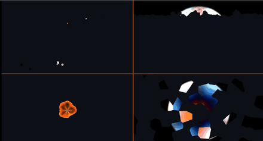

# 28. ディゾルブの作り分け — 模様を変えると消え方が変わる



[26 章](../tutorial/26_ディゾルブ.md)では 3 次元ノイズで物体を溶かしました。
仕組みはそのままに、**模様だけを差し替える**と消え方が全部変わります。

4 分割の左上から時計回りに、ノイズ・高さ・距離・ボロノイです。

ソース : [`shaders/lab/28_dissolve.hlsl`](../../shaders/lab/28_dissolve.hlsl)

---

## 1. 判定はどれも同じ 1 行

```hlsl
float threshold = amount * (1.0f + edgeWidth) - edgeWidth;

if (pattern > threshold) { 描く } else { 消す }
```

3D では `clip()`、ここでは `if` ですが、やっていることは同じです。

| 記号 | 意味 |
|------|------|
| `pattern` | ピクセルごとに決まる 0〜1 の値。**ここだけを差し替える** |
| `amount` | 進み具合。0 で無傷、1 で消滅 |
| `threshold` | この値より `pattern` が小さいピクセルを消す |

**変えるのは `pattern` だけ**です。
消え方の設計は、模様の設計とまったく同じ問題になります。

---

## 2. 4 つの模様

### 左上 : ノイズ — ちぎれるように消える

```hlsl
pattern = Fbm(p * 4.0f, 4);
```

値がばらばらなので、消える場所も散らばります。
26 章で使ったものと同じです。汎用性が高く、迷ったらこれです。

### 右上 : 高さ — 下から溶ける

```hlsl
pattern = p.y * 0.5f + 0.5f;
pattern += (Fbm(p * 6.0f, 3) - 0.5f) * 0.22f;
```

**座標をそのまま模様にすると、方向を持った消え方**になります。
`p.y` を使えば下から、`p.x` を使えば左から溶けます。

2 行目が無いと境目がただの水平線になります。
ノイズを少し足すだけで、燃え広がっているように見えます。

### 左下 : 距離 — 内側から広がる輪

```hlsl
pattern = 1.0f - length(p) * 0.85f;
```

中心が大きい値なので、中心が最後まで残ります。
符号を逆にすれば、外から中心へ閉じていきます。

### 右下 : ボロノイ — 区画ごとに、まとまって消える

```hlsl
float2 cell = floor(p * 4.0f);
// 最近傍のセルを探し、そのセル番号の乱数を pattern にする
pattern = id;
```

**同じセルの中では `pattern` が一定**です。
そのため境目がセルの形に沿い、破片が剥がれ落ちるように見えます。

[06 章](06_ボロノイ.md)の F1 を使いますが、距離ではなく
「どのセルか」だけを使うのが要点です。

---

## 3. 燃え際は「しきい値からの近さ」

```hlsl
float edge = 1.0f - saturate((pattern - threshold) / edgeWidth);
edge = pow(edge, 2.0f);
```

消える寸前のピクセルほど 1 に近くなります。
これを橙色に掛けると、切り口が光ります。

`pow` は縁を細くするためです。指数を上げるほど線が締まります。

---

## 4. つまずきやすい点

### 往復させると、両端で長く止まる

```hlsl
float amount = 0.5f + 0.5f * sin(t);   // 0〜1 を往復
```

`sin` は端で速度が 0 になるので、**無傷の状態と消滅した状態が長く続き**、
肝心の「溶けている途中」がほとんど映りません。

```hlsl
float amount = 0.50f + 0.40f * sin(t * 0.9f);   // 0.10〜0.90
```

範囲を狭めて、端に張り付かないようにしています。
資料用の GIF を撮るときは、この差がそのまま伝わりやすさになります。

### 模様の平均値と `amount` は一致しない

`Fbm` の平均は 0.5 付近ですが、`length(p)` は画面の隅で 1 を超えます。
模様の値域が 0〜1 から外れると、`amount = 0.5` でも
半分消えてくれません。**模様ごとに倍率を合わせる**必要があります。

### 縁の色を、消えた場所にも出してしまう

```hlsl
float inside = smoothstep(0.86f, 0.80f, length(p));
color += 縁の色 * edge * inside;
```

元の絵が透明なところ（この習作では丸の外側）にも `edge` は立ちます。
元の形のマスクを掛けないと、**何も無い空中に光る輪**が出ます。

---

## 5. ここから作れるもの

| やりたいこと | 変えるところ |
|------------|------------|
| 紙が燃える | ノイズ ＋ 縁を橙、外側から内へ |
| 転送・ワープ | 高さ模様を速く、縁を水色に |
| 凍結 | ボロノイ ＋ 縁を白、`amount` を戻して復元 |
| 石化 | ボロノイのセルごとに色を変え、消さずに置換 |
| 傷が塞がる | `amount` を 1 → 0 へ動かす |

---

## 参照

- [26 ディゾルブ](../tutorial/26_ディゾルブ.md) — 3D の物体で同じことをする
- [06 ボロノイ](06_ボロノイ.md) — セル分割
- [05 fBm と雲](05_fBmと雲.md) — ノイズ模様
- [clip 関数 | Microsoft Learn](https://learn.microsoft.com/en-us/windows/win32/direct3dhlsl/dx-graphics-hlsl-clip)
