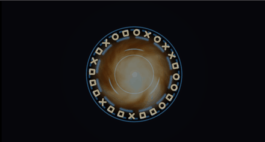

# 30. 魔法陣とポータル — 回る輪を重ねる



輪を何本か重ね、**それぞれ違う速さで回す**だけで、
「動いている装置」に見えます。

新しい理屈はほとんどありません。
[02 章](02_距離関数で図形を描く.md)の距離関数と
[03 章](03_繰り返しと極座標.md)の極座標の組み合わせです。

ソース : [`shaders/lab/30_portal.hlsl`](../../shaders/lab/30_portal.hlsl)

---

## 1. 輪 1 本

```hlsl
float r = length(p);
float band = 1.0f - saturate(abs(r - radius) / thickness);
band = pow(band, 1.6f);
```

[29 章](29_衝撃波.md)のリングと同じ式です。
違うのは半径が時間で変わらないことだけです。

### 刻みを入れる

```hlsl
float angle = atan2(p.y, p.x) / kTau + 0.5f + time * speed;
float cell  = frac(angle * teeth);
float tooth = smoothstep(duty + 0.06f, duty - 0.06f, abs(cell - 0.5f));

return band * tooth;
```

**角度に時間を足すと回ります。** これが回転の全部です。
行列も何も要りません。

`frac(angle * teeth)` で角度を `teeth` 個に区切り、
`duty` で実線部分の太さを決めます。

| 値 | 見え方 |
|----|--------|
| `teeth = 0` | 刻みなしの実線 |
| `teeth = 48`, `duty = 0.30` | 細かい目盛り |
| `teeth = 3`, `duty = 0.16` | 3 本の太い弧 |

---

## 2. 重ねる

```hlsl
rings += Ring(p, 0.64f, 0.012f,  0.0f,  0.00f, 0.00f, t) * 1.0f;
rings += Ring(p, 0.60f, 0.020f, 48.0f,  0.03f, 0.30f, t) * 0.8f;
rings += Ring(p, 0.50f, 0.030f, 12.0f, -0.06f, 0.34f, t) * 0.9f;
rings += Ring(p, 0.34f, 0.014f,  3.0f,  0.11f, 0.16f, t) * 1.1f;
rings += Ring(p, 0.26f, 0.010f,  0.0f,  0.00f, 0.00f, t) * 0.7f;
```

設計の要点は 3 つだけです。

1. **速さを全部変える**。同じだと、ただの 1 枚の絵が回ります
2. **向きを混ぜる**（`speed` が負の輪を入れる）。噛み合って見えます
3. **実線の輪を外周と内周に置く**。全部が刻みだと締まりません

速さは 0.03〜0.11 と、いずれもごく遅い値です。
速く回すほど機械的になり、魔法陣らしさは落ちます。

---

## 3. ルーン

```hlsl
float index = floor(angle * count);
float local = frac(angle * count) - 0.5f;

float2 q = float2(local * (kTau * radius / count), r - radius);
```

**円周に沿った座標系へ移します。**
`q.x` が円周方向、`q.y` が半径方向です。
こうすると、そこから先は普通の 2D 図形として書けます。

```hlsl
float seed = Hash21(float2(index, 7.0f));

if      (seed < 0.33f) { d = 円     }
else if (seed < 0.66f) { d = 四角   }
else                   { d = ×      }
```

`index`（何番目の記号か）から乱数を作り、形を選びます。
**同じ `index` なら必ず同じ形**になるので、回してもちらつきません。

`kTau * radius / count` は「1 区画ぶんの弧の長さ」です。
これを掛けないと、半径によって記号の縦横比が変わります。

---

## 4. 中の渦

```hlsl
float swirl = angle + r * 2.6f - t * 0.9f;
float2 swirled = float2(cos(swirl), sin(swirl)) * r;

float depth = Fbm(swirled * 2.2f + t * 0.12f, 5);
```

**角度に半径を足すと渦**になります。
半径ごとに回転量が変わるので、外側ほどねじれます。

`- t * 0.9f` で全体を回し、`+ t * 0.12f` でノイズ自体もゆっくり動かします。
2 つの時間が違う速さで動いているため、模様が繰り返して見えません。

---

## 5. つまずきやすい点

### `atan2` の切れ目

`atan2` は −π と +π の境目で不連続です。
角度から作った模様には、**そこに 1 本の継ぎ目**が出ます。

`frac(angle * teeth)` の `teeth` が整数なら継ぎ目は模様の区切りと重なり、
目立ちません。**小数にすると継ぎ目がはっきり出ます**。

### 刻みの `smoothstep` の向き

```hlsl
smoothstep(duty + 0.06f, duty - 0.06f, abs(cell - 0.5f));
```

大きいほうを先に書いています。
逆にすると刻みが反転し、隙間だけが光ります。
[17 章](17_炎.md)と同じ間違いです。

### 全部を同じ色にすると平坦になる

輪は暖色、ルーンは明るい黄、中心は水色にしてあります。
**同じ色で塗ると、重なりが見えなくなります。**

---

## 6. ここから作れるもの

| やりたいこと | 変えるところ |
|------------|------------|
| SF の HUD | 色を水色に、`duty` を細く、直線の目盛りを足す |
| 詠唱の展開 | 輪ごとに出現時刻をずらし、半径を伸ばす |
| ポータル | 渦を強く、中心の光を大きく |
| 時計 | `teeth = 12` と `60`、針を `SdSegment` で |
| ローディング表示 | 1 本の輪 ＋ `duty` を時間で動かす |

---

## 参照

- [02 距離関数で図形を描く](02_距離関数で図形を描く.md)
- [03 繰り返しと極座標](03_繰り返しと極座標.md)
- [08 カラーパレット](08_カラーパレット.md)
- [atan2 関数 | Microsoft Learn](https://learn.microsoft.com/en-us/windows/win32/direct3dhlsl/dx-graphics-hlsl-atan2)
