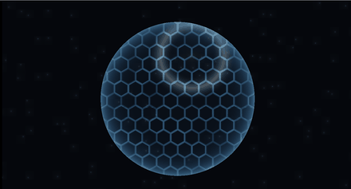

# 31. エネルギーシールド — 縁が光れば、そこに膜がある



透明な球を「ある」と感じさせているのは、**縁の光り方**です。
フレネル 1 つで、ほとんど決まります。

六角セルと着弾の波紋は、そのうえに乗せる味付けです。

ソース : [`shaders/lab/31_shield.hlsl`](../../shaders/lab/31_shield.hlsl)

---

## 1. 球を作る（三角形を使わずに）

```hlsl
float r = length(p);
float z = sqrt(max(radius * radius - r * r, 0.0f)) / radius;
float3 normal = normalize(float3(p / radius, z));
```

円の内側なら、`x² + y² + z² = radius²` から `z` が求まります。
これで**正射影で見た球の法線**が手に入ります。

レイマーチング（[11 章](11_レイマーチング.md)）より遥かに安く、
球 1 個だけならこれで十分です。

---

## 2. フレネル

```hlsl
float3 toEye = float3(0.0f, 0.0f, 1.0f);
float fresnel = pow(1.0f - saturate(dot(normal, toEye)), 3.0f);
```

[22 章](../tutorial/22_法線マップ.md)で使ったものと同じ式です。

- 正面を向いた面（中心）… `dot` が 1 → `fresnel` が 0
- 横を向いた面（縁）　　… `dot` が 0 → `fresnel` が 1

**縁だけが光る**ので、平らな円ではなく球に見えます。
指数を上げるほど光る帯が細くなります。

| 指数 | 見え方 |
|------|--------|
| 1 | 全体がぼんやり光る。膜に見えない |
| 3 | 縁がはっきり出る（この習作）|
| 6 | 輪郭線のように細い |

---

## 3. 六角セル

```hlsl
const float2 kSize = float2(1.0f, 1.7320508f);   // 1, √3

float2 a = (frac(p / kSize)        - 0.5f) * kSize;
float2 b = (frac(p / kSize + 0.5f) - 0.5f) * kSize;

float2 local = (dot(a, a) < dot(b, b)) ? a : b;
```

六角格子は、**半分ずらした 2 つの四角格子を重ね、近いほうを採る**と作れます。
縦横の比が 1 : √3 なのは、正六角形の中心が作る格子の比です。

### 縁までの距離

```hlsl
float2 q = abs(local);
float edge = max(dot(q, float2(1.0f, 1.7320508f) * 0.5f), q.x);
```

六角形は 3 方向の直線で囲まれています。
そのうち一番近いものが縁までの距離です。
`abs` で 6 方向を 3 方向にまとめています。

> **戻り値は 0（中心）〜 0.5（縁）です。1 までは行きません。**
> ここを 1 だと思って `smoothstep(0.86f, 0.99f, edge)` と書き、
> 線が 1 本も出ない状態で悩みました。

---

## 4. 着弾の波紋

```hlsl
float shot  = floor(t / period);   // 何発目か
float local = frac(t / period) * period;   // その発が始まってからの秒数

float2 hit = (Hash22(float2(shot, 5.5f)) - 0.5f) * 1.15f;
```

**`floor` で「何発目か」、`frac` で「その発の経過時間」**に分けます。
発番号から乱数を作るので、毎回違う場所に当たります。

この 2 行は繰り返す VFX すべてで使う型です。

```hlsl
float ripple = 1.0f - saturate(abs(distance - ringRadius) / 0.13f);
ripple = pow(ripple, 2.5f) * exp(-local * 1.8f);
```

リングの作り方は [29 章](29_衝撃波.md)と同じです。
`exp(-local * 1.8f)` で時間とともに消します。

### 波紋はセルの線を光らせる

```hlsl
color += shieldColor * cellEdge * ripple * 2.6f;   // 線が強く光る
color += float3(0.75f, 0.90f, 1.00f) * ripple * 0.85f;   // 波紋そのもの
```

`cellEdge` を掛けたぶんは、**セルの線だけ**が明るくなります。
これがあると「格子状の構造にエネルギーが走った」ように見えます。
波紋だけだと、ただの水面の輪です。

---

## 5. つまずきやすい点

### `fmod` は負の入力で負を返す

```hlsl
float2 a = (fmod(p, kSize) - 0.5f) * kSize;   // ← 左半分・下半分が壊れる
float2 a = (frac(p / kSize) - 0.5f) * kSize;  // ← 常に 0〜1
```

HLSL の `fmod` は C と同じで、符号を被除数に合わせます。
`p` が負になる画面の左下では、格子が崩れました。
**格子を作るときは `frac` を使う**のが安全です。

### 球面に貼ろうとすると極でつぶれる

法線から球面座標（θ, φ）を作ってセルを貼ると、
上下の極で模様が集中してつぶれます。
この習作では正射影の座標をそのまま使い、
縁で伸びるのを「そういうもの」として受け入れています。

### セルの明滅を全部同じ位相にしない

```hlsl
float seed = Hash21(hex.yz);
float pulse = 0.45f + 0.55f * sin(t * 1.6f + seed * kTau);
```

セル番号から位相をずらします。
揃っていると、格子全体が一斉に点滅して安っぽく見えます。

---

## 6. ここから作れるもの

| やりたいこと | 変えるところ |
|------------|------------|
| 割れるシールド | ボロノイ ＋ [28 章](28_ディゾルブの作り分け.md)のディゾルブ |
| バリアの展開 | `radius` を時間で伸ばし、フレネルを強く |
| 泡・シャボン玉 | 色を [24 章](24_薄膜干渉.md)の薄膜干渉に |
| ホログラム | 走査線（[14 章](14_画面効果.md)）を足す |
| 実際の 3D へ | 球のメッシュに貼り、加算合成（[27 章](../tutorial/27_半透明とブレンディング.md)）|

---

## 参照

- [22 法線マップ](../tutorial/22_法線マップ.md) — フレネルの式
- [29 衝撃波](29_衝撃波.md) — リングの作り方
- [06 ボロノイ](06_ボロノイ.md) — 別の格子
- [Inigo Quilez — Hexagonal tiling](https://iquilezles.org/articles/hexagons/)
