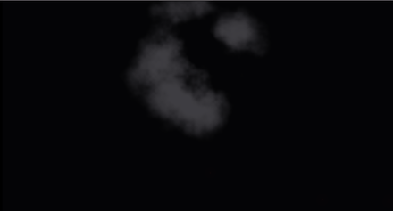
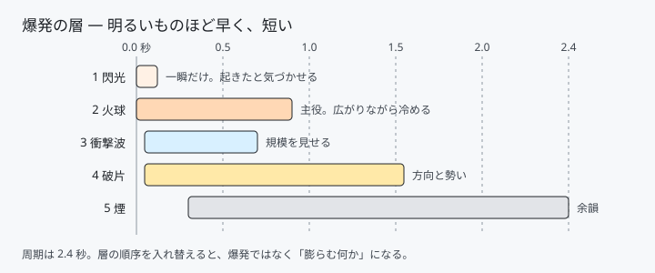

# 32. 爆発 — 時間差で重なる 5 つの層



爆発は「1 つの表現」ではありません。
**出るタイミングと消えるタイミングが違う層**を積み重ねたものです。

どの層をいつ出すか。設計のほとんどはそこにあります。

ソース : [`shaders/lab/32_explosion.hlsl`](../../shaders/lab/32_explosion.hlsl)

---

## 1. 層の時間割

| # | 層 | 出る | 消える | 役割 |
|---|----|------|--------|------|
| 1 | 閃光 | 0.00 秒 | 0.12 秒 | 「起きた」と気づかせる |
| 2 | 火球 | 0.00 秒 | 0.9 秒 | 主役 |
| 3 | 衝撃波 | 0.05 秒 | 0.7 秒 | 規模を見せる |
| 4 | 破片 | 0.05 秒 | 1.6 秒 | 方向と勢い |
| 5 | 煙 | 0.3 秒 | 2.4 秒 | 余韻 |



**明るいものほど早く、短い。**
順番を逆にすると、爆発ではなく「何かが膨らむ」映像になります。

---

## 2. 各層の骨

### 閃光

```hlsl
float flash = exp(-age * 22.0f);
color += float3(1.0f, 0.95f, 0.85f) * flash * 0.022f / max(r, 0.02f);
```

`exp(-age * 大きい数)` で一瞬だけ。
`1 / 距離` は点光源のにじみです。

### 火球

```hlsl
float radius = 0.10f + 0.62f * (1.0f - exp(-age * 3.4f));
```

**`1 - exp(-t)` は「最初は速く、だんだん止まる」動き**です。
等速で広げると風船のようになり、爆発に見えません。

```hlsl
float wobble = Fbm(float2(angle * 2.2f, age * 0.8f) * 2.0f, 4) - 0.5f;
float edge = radius * (1.0f + wobble * 0.55f);
```

**角度をノイズの入力にすると、放射状にちぎれます。**
`age` も入れているので、輪郭が時間とともにうねります。

### 衝撃波

[29 章](29_衝撃波.md)のリングと同じです。ここでは歪ませず、光らせるだけです。

### 破片

```hlsl
float2 position = velocity * age - float2(0.0f, 1.35f) * age * age;
```

高校物理そのままです。
`速度 × 時間 − 重力 × 時間²` で放物線を描きます。

**火球より速い**ことが大事です。同じ速さだと、火球に埋もれて見えません。

### 煙

```hlsl
float rise = smokeAge * 0.30f;
float2 q = (p - float2(0.0f, rise)) * (1.6f - smokeAge * 0.35f);
```

上へ動かし、同時に広げます。
`q` を作るときに **座標を割る（倍率を下げる）と絵は大きく**なります。

---

## 3. 温度から色

```hlsl
float temperature = core * (1.35f - age * 1.15f);
temperature *= 0.70f + 0.60f * Fbm(...);
color += FireColor(temperature) * saturate(1.4f - age * 1.5f);
```

`FireColor` は [17 章](17_炎.md)と同じ黒体放射のテーブルです。
**冷める（温度を下げる）だけで、白 → 黄 → 橙 → 赤 → 黒と進みます。**
色を時間で直接補間するより自然です。

---

## 4. つまずきやすい点

### 煙を「暗い色」にすると消える

最初は `float3(0.14f, 0.14f, 0.16f)` にしていました。
形は正しく出ているのに、**GIF ではほぼ真っ黒**でした。

暗い背景に暗い煙を描くと、当然ながら見えません。
現実の煙は暗くても、絵として見せたいのは形です。

```hlsl
float3 smokeColor = lerp(float3(0.42f, 0.41f, 0.45f),
                         float3(0.95f, 0.48f, 0.18f), warm);
```

3 倍に上げて、ようやく意図どおりになりました。
明るさは「物理的に正しいか」ではなく、**背景との差**で決めます。

### `smoothstep` に掛け算を通すと、しきい値がずれる

```hlsl
float density = Fbm(q * 2.2f, 5);   // 平均およそ 0.48
density *= smoothstep(1.30f, 0.20f, length(q));   // ここで半分近くに下がる
float smoke = smoothstep(0.30f, 0.62f, density);  // ← 下げたぶん、しきい値も下げる
```

減衰を掛けたあとに元のしきい値を使うと、何も残りません。
**マスクを掛けたら、その先のしきい値を必ず見直します。**

### 1 周期のうち、絵が無い時間が長い

火球は 0.9 秒で消えるのに周期が 2.6 秒だと、
半分以上が真っ暗になります。煙を効かせるか、周期を詰めるかです。
ここでは煙を見えるようにしたうえで、2.4 秒に縮めました。

---

## 5. ここから作れるもの

| やりたいこと | 変えるところ |
|------------|------------|
| 花火 | 破片を主役に、色を層ごとに変え、重力を弱く |
| 着弾（土煙）| 火球を小さく、煙を横へ広げる |
| 魔法の爆発 | `FireColor` を [08 章](08_カラーパレット.md)のパレットに |
| 核 | 煙を縦に長く、キノコ型のマスクを掛ける |
| 実際の 3D へ | 板ポリゴンに貼り、加算合成（[27 章](../tutorial/27_半透明とブレンディング.md)）|

---

## 参照

- [17 炎](17_炎.md) — 色温度
- [29 衝撃波](29_衝撃波.md) — リングと歪み
- [05 fBm と雲](05_fBmと雲.md) — 煙と輪郭の乱れ
- [27 半透明とブレンディング](../tutorial/27_半透明とブレンディング.md) — 3D に置くとき
