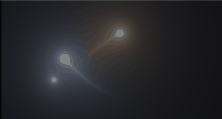

# 33. 軌跡（トレイル）— 過去を記録せず、式で巻き戻す



尾を引く表現は、ふつう「過去の位置を配列に貯める」で作ります。
**動きが式で書けているなら、その必要はありません。**
時間を巻き戻して同じ式を呼べば、過去の位置が出てきます。

ソース : [`shaders/lab/33_trail.hlsl`](../../shaders/lab/33_trail.hlsl)

---

## 1. 位置を式にする

```hlsl
float2 PathPosition(float time, float seed)
{
    float a = time * 1.15f + seed * 2.4f;

    return float2(sin(a * 1.00f) * 1.05f,
                  sin(a * 1.37f + seed) * 0.62f);
}
```

縦横で違う周期の `sin` を使うと、リサージュ図形になります。
**周期の比が単純な整数比でないほど、軌道が閉じにくく**なり、
同じ道をなぞらないので見ていて飽きません。

ここが式で書けていることが、この習作の前提すべてです。

---

## 2. 尾は「過去の点を並べる」

```hlsl
for (int i = 0; i < kSamples; ++i)
{
    float age = (float)i / kSamples;      // 0 = いま、1 = いちばん古い
    float2 past = PathPosition(t - age * span, seed);

    float d = length(p - past);

    float size   = lerp(0.030f, 0.004f, age);   // 古いほど細く
    float bright = pow(1.0f - age, 2.2f);       // 古いほど暗く

    color += tint * (size / max(d, 0.003f)) * bright * 0.042f;
}
```

`t - age * span` が巻き戻しです。
**バッファも、前フレームの情報も要りません。**

| 記号 | 意味 |
|------|------|
| `span` | 何秒ぶんさかのぼるか。尾の長さ |
| `kSamples` | 何点置くか。尾の滑らかさ |
| `size / d` | 点のにじみ。`1/距離` は減衰の定番 |

### この方式の損得

| | 記録する方式 | 式で巻き戻す方式 |
|---|------------|----------------|
| メモリ | 履歴ぶん要る | 要らない |
| 前フレーム依存 | ある | 無い |
| 任意の時刻 | 記録した点だけ | いくらでも細かく |
| 使える条件 | 何にでも | **動きが式で書けるときだけ** |

物理シミュレーションやプレイヤーの操作には使えません。
逆に、決まった動きの演出ならこちらが圧倒的に楽です。

---

## 3. 点の数と重みは連動する

最初は 48 点でした。速く動く区間で**尾が破線**に見えたので 96 点にしたところ、
今度は尾が明るくなりすぎて 1 本の帯になりました。

```hlsl
color += tint * (size / max(d, 0.003f)) * bright * 0.042f;
//                                                 ↑ 96 点なら半分にする
```

**加算で重ねている以上、点を 2 倍にすれば明るさも 2 倍**です。
枚数を変えたら、1 点あたりの重みを同じだけ下げます。

必要な点数は速さで決まります。
「点の間隔 ＝ 速さ × `span` / `kSamples`」が、
点の大きさ `size` より小さくなれば繋がって見えます。

---

## 4. にじみを自前で足す

```hlsl
color += pow(color, 1.6f) * 0.35f;
color = color / (1.0f + color);
```

習作モードは後処理（[25 章](../tutorial/25_ポストプロセス.md)）を通りません。
そこで、明るいところだけを強める簡易ブルームを掛けています。

`pow(color, 1.6f)` は**明るいほど大きく効く**ので、
しきい値を切らずにブルームらしい効果が出ます。
最後の `color / (1 + color)` は Reinhard のトーンマッピングです。

---

## 5. つまずきやすい点

### 尾を長くしすぎると軌道が一周する

`span` が周期に近づくと、尾の先頭が現在位置に追いつき、
輪になって「尾」に見えなくなります。
**1 秒前後が上限**でした。

### `1 / 距離` を素で使うと発散する

```hlsl
size / max(d, 0.003f)
```

`max` を入れないと中心で無限大になり、
HDR でなくても白い正方形が出ます。

### 色を全部同じにしない

```hlsl
float3 tint = PaletteWarm(0.15f + (float)k * 0.28f);
```

3 本とも同じ色だと、重なったときに区別がつきません。
色相をずらすと、交差しても軌跡を目で追えます。

---

## 6. ここから作れるもの

| やりたいこと | 変えるところ |
|------------|------------|
| 剣の残像 | `PathPosition` を円弧に、点ではなく線分を置く |
| 弾道 | 直線 ＋ 重力、`span` を短く |
| 蛍 | `PathPosition` にノイズを足し、明滅させる |
| リボン | 点ではなく、進行方向に垂直な帯を置く |
| 実際の 3D へ | 過去の位置に板ポリゴンを並べ、加算合成 |

---

## 参照

- [08 カラーパレット](08_カラーパレット.md) — 色相のずらし方
- [20 ベジエ曲線](20_ベジエ曲線.md) — 曲線そのものを距離で描く方法
- [25 ポストプロセス](../tutorial/25_ポストプロセス.md) — 本物のブルーム
- [リサージュ曲線 | Wikipedia](https://ja.wikipedia.org/wiki/リサジュー図形)
