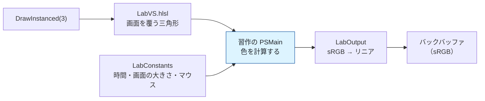

# シェーダー習作集

**シェーダーそのものを学ぶための場所**です。
3D モデルの描画（[tutorial/](../tutorial/)）とは切り離してあり、
**画面いっぱいの三角形 1 枚**にピクセルシェーダーだけを差し替えて絵を描きます。

ピクセルシェーダーが知っているのは「いま塗っているのは画面のどこか」だけです。
そこから何が作れるのかを、1 本ずつ確かめていきます。


---

## 動かし方

```powershell
.\tools\build.ps1
.\build\x64\Debug\DirectX12Dev.exe
```

| キー | 動き |
|------|------|
| `L` | 習作モードの入り切り |
| `→` / `←` | 次の習作 / 前の習作 |
| `1`〜`9`, `0` | 1〜10 番目を直接選ぶ（11 番以降は矢印キーで）|
| `ESC` | 終了 |

習作モードのあいだは 3D シーンをまったく描きません。影も後処理も通しません。

---

## 目次

| # | 習作 | 何が分かるか | ソース |
|---|------|------------|--------|
| 01 | [UV と座標](01_UVと座標.md) | 座標を色にする。すべての出発点 | [01_uv.hlsl](../../shaders/lab/01_uv.hlsl) |
| 02 | [距離関数で図形を描く](02_距離関数で図形を描く.md) | SDF、塗りと輪郭、集合演算 | [02_shapes.hlsl](../../shaders/lab/02_shapes.hlsl) |
| 03 | [繰り返しと極座標](03_繰り返しと極座標.md) | `frac` で座標を折りたたむ | [03_tiling.hlsl](../../shaders/lab/03_tiling.hlsl) |
| 04 | [ノイズ](04_ノイズ.md) | ハッシュ、格子、補間曲線 | [04_noise.hlsl](../../shaders/lab/04_noise.hlsl) |
| 05 | [fBm と雲](05_fBmと雲.md) | 周波数を重ねる。勾配から陰影 | [05_fbm.hlsl](../../shaders/lab/05_fbm.hlsl) |
| 06 | [ボロノイ](06_ボロノイ.md) | 最近傍で塗り分ける。F1 と F2 | [06_voronoi.hlsl](../../shaders/lab/06_voronoi.hlsl) |
| 07 | [ドメインワープ](07_ドメインワープ.md) | 模様ではなく座標を歪ませる | [07_domainwarp.hlsl](../../shaders/lab/07_domainwarp.hlsl) |
| 08 | [カラーパレット](08_カラーパレット.md) | cos 4 本で色の帯を作る | [08_palette.hlsl](../../shaders/lab/08_palette.hlsl) |
| 09 | [プラズマ](09_プラズマ.md) | 波の重ね合わせ | [09_plasma.hlsl](../../shaders/lab/09_plasma.hlsl) |
| 10 | [水面](10_水面.md) | 高さ → 法線 → 反射 | [10_water.hlsl](../../shaders/lab/10_water.hlsl) |
| 11 | [レイマーチング](11_レイマーチング.md) | 三角形なしで 3D を描く | [11_raymarch.hlsl](../../shaders/lab/11_raymarch.hlsl) |
| 12 | [マンデルブロ集合](12_マンデルブロ集合.md) | 漸化式を絵にする | [12_mandelbrot.hlsl](../../shaders/lab/12_mandelbrot.hlsl) |
| 13 | [トルシェタイル](13_トルシェタイル.md) | 2 種類を並べるだけで迷路 | [13_truchet.hlsl](../../shaders/lab/13_truchet.hlsl) |
| 14 | [画面効果](14_画面効果.md) | 走査線・色収差・歪み・粒子 | [14_effects.hlsl](../../shaders/lab/14_effects.hlsl) |
| 15 | [ハッシュの精度](15_ハッシュの精度.md) | 有名な書き方が壊れる場面 | [15_hash.hlsl](../../shaders/lab/15_hash.hlsl) |
| 16 | [万華鏡](16_万華鏡.md) | 角度を折り返して鏡を作る | [16_kaleidoscope.hlsl](../../shaders/lab/16_kaleidoscope.hlsl) |
| 17 | [炎](17_炎.md) | 上へ流れるノイズと色温度 | [17_fire.hlsl](../../shaders/lab/17_fire.hlsl) |
| 18 | [星空と星雲](18_星空.md) | 部品の組み合わせで絵にする | [18_starfield.hlsl](../../shaders/lab/18_starfield.hlsl) |
| 19 | [メタボール](19_メタボール.md) | 場を足してからしきい値で切る | [19_metaball.hlsl](../../shaders/lab/19_metaball.hlsl) |
| 20 | [ベジエ曲線](20_ベジエ曲線.md) | 曲線までの距離を解析的に解く | [20_bezier.hlsl](../../shaders/lab/20_bezier.hlsl) |
| 21 | [グリッチ](21_グリッチ.md) | 時間を階段状にして壊す | [21_glitch.hlsl](../../shaders/lab/21_glitch.hlsl) |
| 22 | [マンデルバルブ](22_マンデルバルブ.md) | 3D フラクタルと距離推定 | [22_mandelbulb.hlsl](../../shaders/lab/22_mandelbulb.hlsl) |
| 23 | [レンズフレア](23_レンズフレア.md) | 光源の反対側に並べる | [23_lensflare.hlsl](../../shaders/lab/23_lensflare.hlsl) |
| 24 | [薄膜干渉](24_薄膜干渉.md) | シャボン玉の虹色は色素ではない | [24_thinfilm.hlsl](../../shaders/lab/24_thinfilm.hlsl) |
| 25 | [稲妻](25_稲妻.md) | 線をノイズで折り曲げる | [25_lightning.hlsl](../../shaders/lab/25_lightning.hlsl) |
| 26 | [木目と大理石](26_木目と大理石.md) | sin の中にノイズを入れる | [26_woodmarble.hlsl](../../shaders/lab/26_woodmarble.hlsl) |
| 27 | [コースティクス](27_コースティクス.md) | 面積の伸び縮みが明るさ | [27_caustics.hlsl](../../shaders/lab/27_caustics.hlsl) |

---

## 全体の仕組み



頂点バッファもテクスチャも使いません
（[23 章](../tutorial/23_スカイボックス.md)の全画面三角形をそのまま流用しています）。

### 共通で渡される値

```hlsl
cbuffer LabConstants : register(b0)
{
    // x = 経過秒、y = 前フレームからの秒、z = 何番目のシェーダーか
    float4 g_time;

    // xy = 画面の大きさ（ピクセル）、zw = その逆数
    float4 g_resolution;

    // xy = マウスの位置（ピクセル）、z = 左ボタン
    float4 g_mouse;
};
```

### 出力は必ず `LabOutput` を通す

```hlsl
return LabOutput(color);
```

習作では「**画面に出したい色**」をそのまま組み立てます。
ところが書き込み先は sRGB のレンダーターゲットで、
GPU が**リニア → sRGB の変換**を掛けてしまいます。

`LabOutput` はその逆を先に通して打ち消します。
これを忘れると、意図した色より明るく・浅く出ます
（[19 章](../tutorial/19_色を正しく扱う_sRGB.md)）。

---

## 道具箱（LabCommon.hlsli）

[`shaders/lab/LabCommon.hlsli`](../../shaders/lab/LabCommon.hlsli) に、
どの習作からも使える部品をまとめてあります。

| 分類 | 関数 | 用途 |
|------|------|------|
| 座標 | `ToCenteredUv` | 中心が原点・上が +Y・縦が -1〜1 |
| 座標 | `ToPixel` | ピクセル座標へ |
| 座標 | `Rotate2D` | 2 次元の回転行列 |
| 乱数 | `Hash21` / `Hash22` | 座標 → 決まった乱数 |
| ノイズ | `ValueNoise` | 格子の乱数をなめらかに繋ぐ |
| ノイズ | `Fbm` | 細かさを変えて重ねる |
| 図形 | `SdCircle` / `SdRoundedBox` / `SdSegment` | 2D の距離関数 |
| 図形 | `FillMask` / `StrokeMask` | 距離 → 塗り / 輪郭 |
| 補助 | `DividerMask` / `FrameMask` | 説明用の仕切り線と枠 |
| 色 | `Palette` / `PaletteWarm` | cos 4 本のパレット |
| 色 | `SrgbToLinear` / `LinearToSrgb` | 色空間の往復 |

---

## 画像を撮り直すには

```powershell
.	ools\capture-shader-lab.ps1
```

アプリを起動し、習作を 1 本ずつ切り替えながら撮影して、
`docs/shader-lab/images/` へ書き出します。一覧シートも作り直します。

Python と Pillow が要ります（`pip install pillow`）。

> **`PrintWindow` は起動直後に不安定です。** 捨てショットで温めてから
> 撮るようにしてあります。省くと最初の数枚が保存されません。

---

## 習作を 1 本足すには

1. `shaders/lab/24_なにか.hlsl` を作り、`PSMain` を書く
2. `src/Graphics/ShaderLabPipeline.cpp` の `kShaderFiles` に 1 行足す
3. ビルドし直す

```cpp
constexpr ShaderEntry kShaderFiles[] = {
    ...
    { L"24_なにか.hlsl",      L"24 なにか" },
};
```

**1 本でも文法エラーがあると起動できません。**
実行時コンパイルなので、間違いは起動時に分かります。

---

## この資料の読み方

各ページは次の形で書いてあります。

- **何ができるか** … 画像 1 枚
- **仕組み** … 中心になる式と、その意味
- **つまずきやすい点** … 実際に嵌まったところ
- **応用** … これを土台に何が作れるか

画像はすべて**本プログラムの実行結果**です。
時間で動く習作は、撮影した瞬間の姿になっています。

---

## 参考にした資料

- [The Book of Shaders](https://thebookofshaders.com/) — 2D シェーダーの入門書
- [Inigo Quilez のサイト](https://iquilezles.org/articles/) — 距離関数、パレット、
  レイマーチングの一次資料
- [Shadertoy](https://www.shadertoy.com/) — 作例の宝庫
- Dave Hoskins, ["Hash without Sine"](https://www.shadertoy.com/view/4djSRW)
  — 桁溢れしないハッシュ
- [HLSL 組み込み関数 | Microsoft Learn](https://learn.microsoft.com/en-us/windows/win32/direct3dhlsl/dx-graphics-hlsl-intrinsic-functions)
