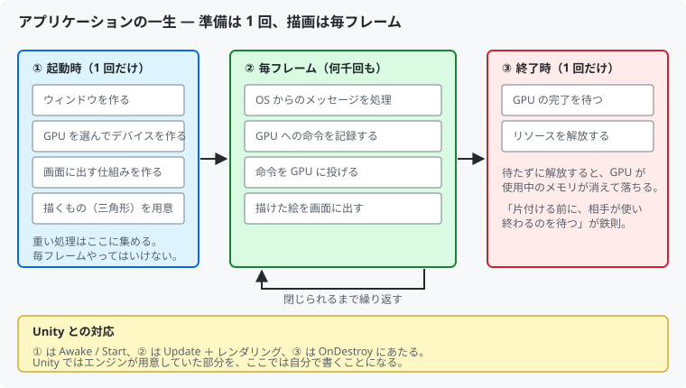

# 01. プログラムの全体像と main 関数

最初に「このプログラムが全体として何をしているのか」を押さえます。
個々の DirectX の API は次の章から見ていくので、ここでは地図だけ作ります。

---

## 1. Unity では見えていなかったもの

Unity でキューブを 1 個置いてゲームを再生すると、絵が出ます。
そのとき裏側では、おおよそ次のことが起きています。

1. ウィンドウ（描画結果を映す枠）が作られる
2. GPU が選ばれ、GPU を操作するためのオブジェクトが作られる
3. 毎フレーム、GPU に「これを描け」という命令が送られる
4. 描き終わった絵が画面に表示される
5. アプリを閉じるとき、GPU の処理を待ってから後片付けされる

**Unity はこの 1〜5 を全部やってくれていました。**
DirectX 12 を直接使うということは、この 1〜5 を自分で書くということです。

このプロジェクトの `main` 関数は、まさにこの流れをそのまま書いたものです。

---

## 2. アプリケーションの一生



大事なのは **「1 回だけやること」と「毎フレームやること」を分ける** という点です。

- GPU オブジェクトの生成やシェーダーのコンパイルは**重い**ので、起動時に 1 回だけ
- 毎フレームやるのは「命令を記録して投げる」だけ

Unity で言えば `Start()` と `Update()` の使い分けと同じ考え方です。
`Update()` の中で `Resources.Load()` を毎回呼んだら重い、というのと同じ話です。

---

## 3. main 関数を読む

実際のコードは [`src/main.cpp`](../../src/main.cpp) です。
コメントを外すと、驚くほど短いことが分かります。

```cpp
int main()
{
    SetupConsole();

    try
    {
        // ① 起動時の準備
        dx12::Window window;
        window.Create(kWindowTitle, kInitialWidth, kInitialHeight);

        dx12::Renderer renderer;
        renderer.Initialize(window.Handle(), kInitialWidth, kInitialHeight);

        window.SetResizeCallback([&renderer](uint32_t width, uint32_t height) {
            renderer.Resize(width, height);
        });

        // ② 毎フレームの処理
        while (window.ProcessMessages())
        {
            renderer.Render();
        }

        // ③ 終了処理
        renderer.WaitForGpu();
        return 0;
    }
    catch (const std::exception& e)
    {
        // エラー処理（後述）
    }
}
```

### `Window` と `Renderer` の 2 つだけ

登場人物は 2 つです。

| クラス | 役割 | DirectX を知っているか |
|--------|------|---------------------|
| `Window` | ウィンドウを作り、OS からのメッセージを処理する | **知らない** |
| `Renderer` | DirectX 12 の一切を担当し、1 フレーム描く | 知っている |

`Window` があえて DirectX を知らないのは、
**「絵を描く紙」と「絵の描き方」を分けておく**ためです。
描画方法を変えてもウィンドウ側は書き換えずに済みます。

### while ループが「ゲームループ」

```cpp
while (window.ProcessMessages())
{
    renderer.Render();
}
```

この 4 行がゲームループです。Unity の `Update()` が
毎フレーム呼ばれていたのと同じことを、ここでは自分で回しています。

`ProcessMessages()` が `false` を返すと（＝ウィンドウが閉じられると）
ループを抜けます。

---

## 4. なぜ `WinMain` ではなく `main` なのか

Windows の GUI アプリは普通 `WinMain` から始まります。
このプロジェクトが `main` なのは、**コンソールウィンドウを開くため**です。

リンカの「サブシステム」を `Console` に設定しているので、
アプリを起動するとウィンドウとは別に黒いコンソールが開き、
`printf` 的なログがそこに流れます。

```
[INFO ] ウィンドウを生成しました (1280 x 720)
[INFO ] 使用する GPU : NVIDIA GeForce RTX 4070 Ti (VRAM 11994 MB)
[INFO ] D3D12 デバイスを生成しました。
...
```

学習中は「どこまで進んだか」が目で見えるのが重要なので、
あえてこの構成にしています。

> 製品として配布するときは、サブシステムを `Windows` に変えて
> エントリポイントを `wWinMain` にします。コンソールが開かなくなります。

---

## 5. エラー処理の考え方

DirectX の API は、ほぼすべての関数が `HRESULT` という戻り値を返します。
成功か失敗かを表す 32bit の値です。

```cpp
HRESULT hr = device->CreateCommandQueue(&desc, IID_PPV_ARGS(&queue));
if (FAILED(hr)) { /* 失敗 */ }
```

初期化では、この種の呼び出しが**数十回連続します**。
毎回 `if` を書くと、本来のコードが埋もれてしまいます。

そこで本プロジェクトでは `DX_CHECK` というマクロで包み、
失敗したら例外を投げるようにしています。

```cpp
DX_CHECK(device->CreateCommandQueue(&desc, IID_PPV_ARGS(&queue)));
```

失敗すると、**どの式が・どのファイルの何行目で失敗したか**を含む
例外が投げられ、`main` の `catch` まで一気に飛びます。

```
DirectX API 呼び出しに失敗しました。
  式        : device->CreateCommandQueue(&desc, IID_PPV_ARGS(&queue))
  場所      : CommandQueue.cpp(42)
  HRESULT   : 0x887A0005
```

> `FAILED(hr)` を使うこと。`hr != S_OK` で判定してはいけません。
> 成功を表す値は `S_OK` 以外にも存在します。
> （出典: [HRESULT | Microsoft Learn](https://learn.microsoft.com/openspecs/windows_protocols/ms-dtyp/a9046ed2-bfb2-4d56-a719-2824afce59ac)）

---

## 6. この章のまとめ

- プログラムは「起動時の準備」「毎フレームの処理」「終了処理」の 3 つに分かれる
- 重い処理は起動時に寄せる。毎フレームは命令を投げるだけ
- 登場人物は `Window`（DirectX を知らない）と `Renderer`（DirectX 担当）の 2 つ
- `while (ProcessMessages()) { Render(); }` がゲームループ
- `HRESULT` は `DX_CHECK` で例外にまとめ、`main` で受ける

次の章では、いちばん外側にある `Window` から見ていきます。

---

## この章で参照した資料

- [Direct3D 12 プログラミングガイド | Microsoft Learn](https://learn.microsoft.com/windows/win32/direct3d12/directx-12-programming-guide)
- [HRESULT | Microsoft Learn](https://learn.microsoft.com/openspecs/windows_protocols/ms-dtyp/a9046ed2-bfb2-4d56-a719-2824afce59ac)
- [DirectX-Graphics-Samples（公式サンプル）](https://github.com/microsoft/DirectX-Graphics-Samples) — 全体構成の参考

図はすべて本リポジトリで作成したものです（[../assets/](../assets/)）。
