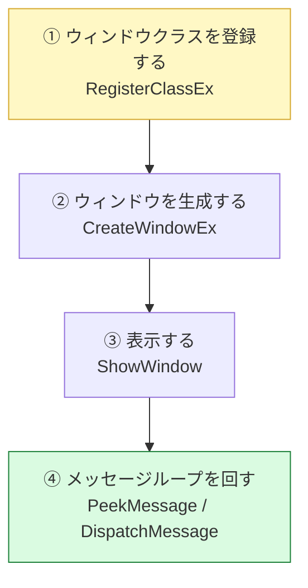
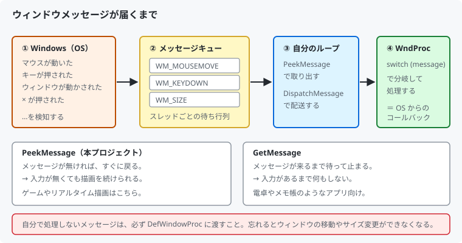
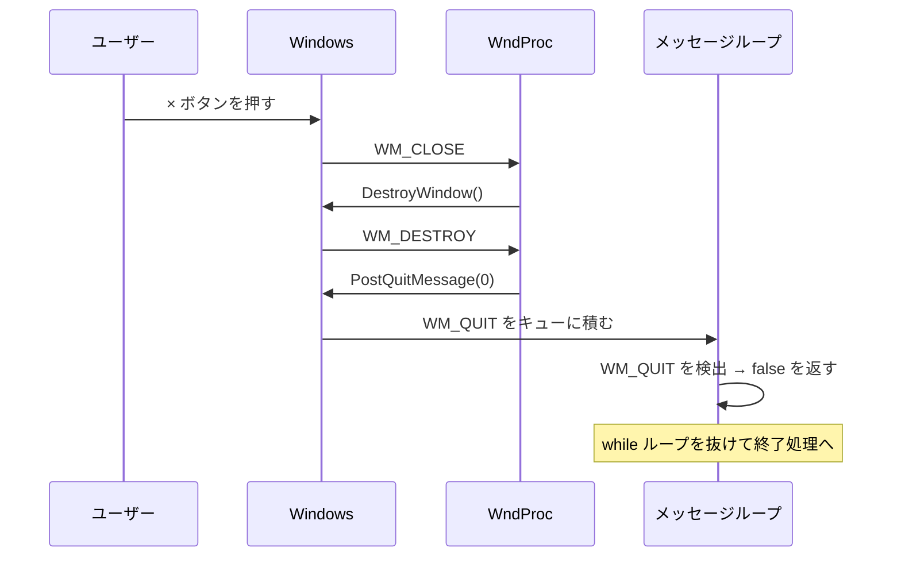
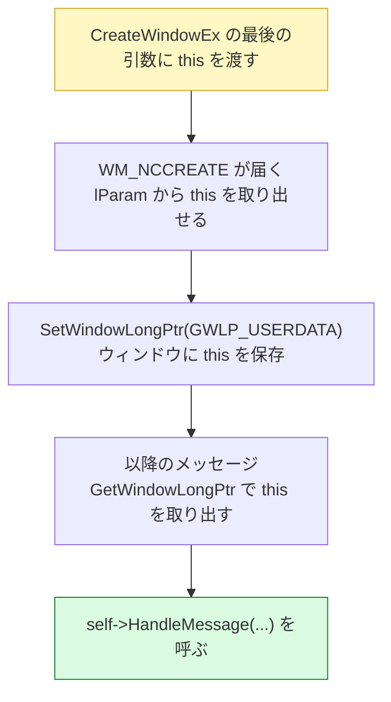

# 02. ウィンドウを作る

DirectX の話に入る前に、まず絵を映す「枠」を用意します。
この章は DirectX ではなく **Win32 API** の話です。

対応するコードは [`src/App/Window.h`](../../src/App/Window.h) /
[`src/App/Window.cpp`](../../src/App/Window.cpp) です。

---

## 1. ウィンドウを作る 3 ステップ

Windows でウィンドウを出すには、次の順に進めます。



### ① ウィンドウクラスの登録

「ウィンドウクラス」は、**ウィンドウの設計図**です。
C++ の `class` とは無関係で、Win32 独自の用語です。

```cpp
WNDCLASSEXW windowClass = {};
windowClass.cbSize        = sizeof(WNDCLASSEXW);
windowClass.style         = CS_HREDRAW | CS_VREDRAW | CS_OWNDC;
windowClass.lpfnWndProc   = StaticWindowProc;   // ← メッセージ処理関数
windowClass.hInstance     = m_instance;
windowClass.hCursor       = ::LoadCursorW(nullptr, IDC_ARROW);
windowClass.lpszClassName = kWindowClassName;
windowClass.hbrBackground = nullptr;            // ← 背景を塗らせない

::RegisterClassExW(&windowClass);
```

**`hbrBackground` を `nullptr` にしている理由**

普通のアプリは OS に背景を塗ってもらいますが、
このプロジェクトは毎フレーム DirectX が画面全体を塗り替えます。
OS にも塗らせると二重に描くことになり、ちらつきの原因になるだけです。

### ② ウィンドウの生成

```cpp
RECT windowRect = { 0, 0, 1280, 720 };
::AdjustWindowRect(&windowRect, WS_OVERLAPPEDWINDOW, FALSE);
```

**`AdjustWindowRect` が要る理由**

`CreateWindowEx` に渡すサイズは「タイトルバーや枠を含んだ外形サイズ」です。
しかし欲しいのは「絵を描ける範囲（クライアント領域）が 1280×720」です。

これを忘れると、**枠のぶんだけ描画領域が小さくなります**。
`AdjustWindowRect` は、希望のクライアント領域から必要な外形サイズを逆算してくれます。

```cpp
m_hwnd = ::CreateWindowExW(
    0, kWindowClassName, title.c_str(), WS_OVERLAPPEDWINDOW,
    CW_USEDEFAULT, CW_USEDEFAULT,       // 表示位置は OS におまかせ
    adjustedWidth, adjustedHeight,
    nullptr, nullptr, m_instance,
    this);                              // ← ここが後で効いてくる
```

戻り値の `HWND` が「ウィンドウのハンドル」です。
以降、このウィンドウを指すときは常にこの値を使います。
DirectX にも「どのウィンドウに表示するか」としてこの `HWND` を渡します。

---

## 2. メッセージループ — Windows アプリの心臓部

Windows では、マウスやキーの入力、ウィンドウの移動、閉じるボタンなど
**あらゆる出来事が「メッセージ」としてアプリに届きます**。



コードにするとこうです。

```cpp
bool Window::ProcessMessages()
{
    MSG message = {};

    while (::PeekMessageW(&message, nullptr, 0, 0, PM_REMOVE))
    {
        if (message.message == WM_QUIT)
        {
            m_shouldClose = true;
            return false;      // ← ループを抜ける合図
        }

        ::TranslateMessage(&message);
        ::DispatchMessageW(&message);   // ← WndProc が呼ばれる
    }

    return !m_shouldClose;
}
```

### `PeekMessage` と `GetMessage` の違い

ここが**ゲームと普通のアプリの分かれ目**です。

| | 動作 | 向いている用途 |
|--|------|--------------|
| `GetMessage` | メッセージが来るまで**待って止まる** | メモ帳、電卓 |
| `PeekMessage` | 無ければ**すぐ戻る** | ゲーム、リアルタイム描画 |

ゲームは「入力が無くても毎フレーム描き続ける」必要があります。
`GetMessage` で止まってしまうと、マウスを動かさない限り
画面が更新されなくなってしまいます。

> `PM_REMOVE` は「取り出したメッセージをキューから消す」指定です。
> `PM_NOREMOVE` にすると覗くだけで消えないため、無限ループになります。

### `WM_QUIT` だけ特別扱いする理由

`WM_QUIT` は「ウィンドウ宛て」ではなく「**スレッド宛て**」に届く特別なメッセージです。
`DispatchMessage` してもウィンドウプロシージャには渡らないので、
ループの中で自分で判定する必要があります。

---

## 3. ウィンドウプロシージャ — メッセージを処理する関数

`DispatchMessage` が呼ぶのが、登録しておいた `StaticWindowProc` です。

```cpp
LRESULT Window::HandleMessage(HWND hwnd, UINT message, WPARAM wParam, LPARAM lParam)
{
    switch (message)
    {
    case WM_CLOSE:              // × が押された
        ::DestroyWindow(hwnd);
        return 0;

    case WM_DESTROY:            // ウィンドウが壊された
        m_hwnd = nullptr;
        ::PostQuitMessage(0);   // ← WM_QUIT を積む
        return 0;

    case WM_SIZE:               // サイズが変わった
        // 新しいサイズを取り出して通知する
        return 0;

    // ...
    }

    // 処理しないものは必ず OS の既定処理へ渡す
    return ::DefWindowProcW(hwnd, message, wParam, lParam);
}
```

### 終了までの流れ



`WM_CLOSE` → `WM_DESTROY` → `WM_QUIT` と 3 段階になっているのは、
「閉じてよいか確認する」「本当に壊す」「アプリを終える」を
分けて扱えるようにするためです。
たとえば「保存しますか？」を出したいなら `WM_CLOSE` で止められます。

> **`DefWindowProc` を忘れないこと。**
> 自分で処理しないメッセージを OS に渡さないと、
> ウィンドウの移動やサイズ変更ができなくなります。

---

## 4. C++ のクラスと Win32 をつなぐ

ここは初見だと必ず引っかかる部分です。

**問題:** `lpfnWndProc` に渡せるのは**関数ポインタ**だけです。
C++ の非静的メンバ関数は暗黙の `this` を必要とするため、渡せません。

**解決:** `static` 関数を登録し、その中で `this` を取り戻します。



```cpp
LRESULT CALLBACK Window::StaticWindowProc(HWND hwnd, UINT message,
                                          WPARAM wParam, LPARAM lParam)
{
    if (message == WM_NCCREATE)
    {
        const auto* cs = reinterpret_cast<CREATESTRUCTW*>(lParam);
        auto* self = static_cast<Window*>(cs->lpCreateParams);
        ::SetWindowLongPtrW(hwnd, GWLP_USERDATA, reinterpret_cast<LONG_PTR>(self));
        self->m_hwnd = hwnd;
    }

    auto* self = reinterpret_cast<Window*>(::GetWindowLongPtrW(hwnd, GWLP_USERDATA));
    if (self != nullptr)
    {
        return self->HandleMessage(hwnd, message, wParam, lParam);
    }
    return ::DefWindowProcW(hwnd, message, wParam, lParam);
}
```

`GWLP_USERDATA` は「ウィンドウごとに 1 個ぶんのポインタを置ける領域」です。
Win32 と C++ をつなぐ定番の手法なので、パターンとして覚えてしまって構いません。

> `HandleMessage` が `hwnd` を引数で受け取っているのは、
> `WM_DESTROY` 以降 `m_hwnd` を `nullptr` にするためです。
> 破棄後にも `WM_NCDESTROY` が届くので、そこで `nullptr` を
> `DefWindowProc` に渡さないようにしています。

---

## 5. サイズ変更を外へ伝える

ウィンドウのサイズが変わったら、DirectX 側もバッファを作り直す必要があります。
しかし `Window` に DirectX を触らせたくありません。

そこで**コールバック**で通知します。

```cpp
// Window.h
using ResizeCallback = std::function<void(uint32_t width, uint32_t height)>;
void SetResizeCallback(ResizeCallback callback);

// main.cpp — ここで初めて Window と Renderer が結び付く
window.SetResizeCallback([&renderer](uint32_t width, uint32_t height) {
    renderer.Resize(width, height);
});
```

これで `Window` は `Renderer` の存在を知らないままで済みます。
Unity で言えば `UnityEvent` で疎結合にするのと同じ発想です。

**最小化への対応も必要です。**
最小化するとサイズが 0×0 になります。
0 サイズでスワップチェーンを作り直すとエラーになるため、無視します。

```cpp
if (wParam == SIZE_MINIMIZED) { return 0; }
if (newWidth == 0 || newHeight == 0) { return 0; }
```

---

## 6. この章のまとめ

- ウィンドウは「クラスを登録 → 生成 → 表示 → メッセージループ」の順で作る
- `AdjustWindowRect` を使わないと描画領域が枠のぶん小さくなる
- ゲームでは `GetMessage` ではなく **`PeekMessage`** を使う
- `WM_QUIT` はスレッド宛てなので、ループの中で自分で判定する
- 処理しないメッセージは必ず `DefWindowProc` へ渡す
- `GWLP_USERDATA` で `static` 関数から `this` を取り戻す
- DirectX への通知はコールバックにして、依存を一方向に保つ

次の章から、いよいよ DirectX 12 の初期化に入ります。

---

## この章で参照した資料

- [ウィンドウの作成 | Microsoft Learn](https://learn.microsoft.com/windows/win32/learnwin32/creating-a-window)
- [メッセージとメッセージキュー | Microsoft Learn](https://learn.microsoft.com/windows/win32/winmsg/about-messages-and-message-queues)
- [WNDCLASSEXW 構造体 | Microsoft Learn](https://learn.microsoft.com/windows/win32/api/winuser/ns-winuser-wndclassexw)
- [AdjustWindowRect 関数 | Microsoft Learn](https://learn.microsoft.com/windows/win32/api/winuser/nf-winuser-adjustwindowrect)
- [PeekMessageW 関数 | Microsoft Learn](https://learn.microsoft.com/windows/win32/api/winuser/nf-winuser-peekmessagew)
- [ウィンドウプロシージャで状態を管理する | Microsoft Learn](https://learn.microsoft.com/windows/win32/learnwin32/managing-application-state-)

図はすべて本リポジトリで作成したものです（[../assets/](../assets/)）。
