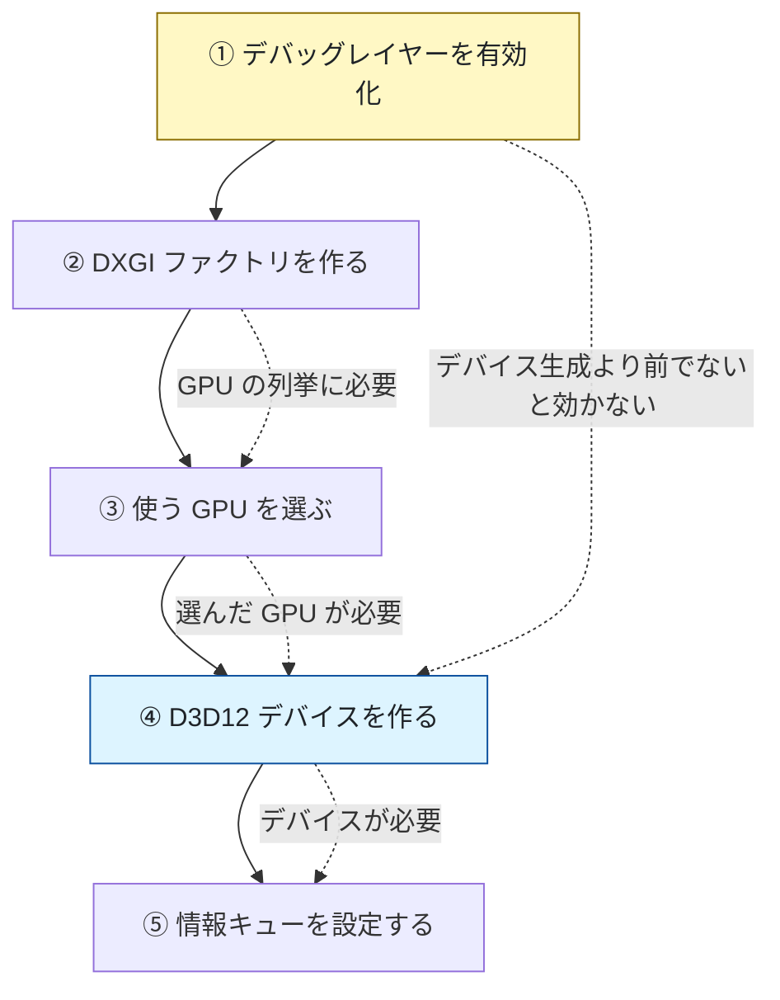
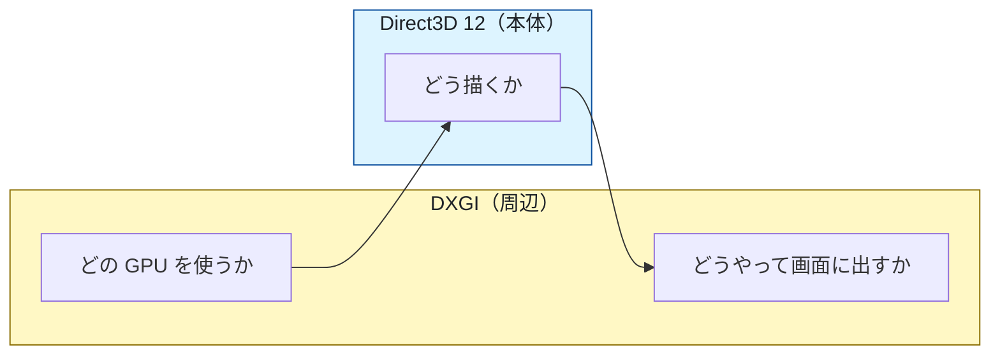

# 03. DirectX 12 の初期化

ウィンドウができたので、次は GPU を使う準備をします。
対応するコードは [`src/Graphics/GraphicsDevice.h`](../../src/Graphics/GraphicsDevice.h) /
[`.cpp`](../../src/Graphics/GraphicsDevice.cpp) です。

---

## 1. まず知っておくこと：DirectX 11 と 12 の違い

DirectX 12 は「11 の新しい版」ではありません。**設計思想が別物**です。

| | DirectX 11 | DirectX 12 |
|--|-----------|-----------|
| 命令の実行 | 呼んだら即実行（に見える） | 記録してから、まとめて投入 |
| メモリ管理 | ドライバが自動 | 開発者が明示 |
| GPU との同期 | ドライバが自動 | 開発者が明示 |
| リソースの状態管理 | ドライバが自動 | 開発者が明示 |
| 難易度 | 低い | 高い |

DirectX 12 は「速くなった API」ではなく、
**ドライバがやっていた仕事を開発者に移した API** です。

これから覚える概念の多くは「ドライバから引き継いだ仕事」だと思うと納得しやすくなります。
Unity が隠していた部分を、さらにもう一段深く自分で書く、という位置づけです。

> 出典: [DirectX 11 から 12 への重要な変更点 | Microsoft Learn](https://learn.microsoft.com/windows/win32/direct3d12/important-changes-from-directx-11-to-directx-12)

---

## 2. 初期化の順序

順序には必然性があります。**この順でないと動きません。**



---

## 3. ① デバッグレイヤー — 最初に有効にする

**DirectX 12 学習で最も重要な機能です。**

DirectX 12 は性能最優先の API なので、既定では
**間違った使い方をしても何も言わずに壊れた絵を出すか、いきなり落ちます**。

デバッグレイヤーを有効にすると、API の誤用を検査して
具体的なエラーメッセージを出してくれます。

```cpp
#if defined(_DEBUG)
    ComPtr<ID3D12Debug> debugController;
    if (SUCCEEDED(::D3D12GetDebugInterface(IID_PPV_ARGS(&debugController))))
    {
        debugController->EnableDebugLayer();
    }
#endif
```

### なぜデバイス生成より前なのか

デバッグレイヤーは
**「デバイス生成時に、検証機能付きの実装に差し替える」**
という仕組みで動きます。
デバイスを作った後に有効化しても、そのデバイスは通常版のままです。

### 有効にならないとき

Windows のオプション機能に **Graphics Tools** が入っていないと失敗します。

```
設定 → システム → オプション機能 → 機能を追加 → "Graphics Tools"
```

起動時のログに次の行が出ていれば有効です。

```
[INFO ] デバッグレイヤーを有効化しました（Debug ビルド）。
```

> Release ビルドでは有効にしません。**非常に低速**なためです。

---

## 4. ②③ DXGI と GPU の選択

### DXGI とは

Direct3D とは別に存在する、**GPU と画面まわりの共通基盤**です。



「描く」のが Direct3D、「画面に出す」のが DXGI と覚えると整理できます。

### GPU（アダプタ）を選ぶ

ノート PC などには **CPU 内蔵 GPU** と **専用 GPU** の両方があります。
何も考えずに 0 番を選ぶと、低性能な内蔵 GPU に当たることがあります。

```cpp
m_factory->EnumAdapterByGpuPreference(
    index,
    DXGI_GPU_PREFERENCE_HIGH_PERFORMANCE,   // 高性能な GPU から順に返す
    IID_PPV_ARGS(&adapter));
```

さらに「本当にそのGPUで D3D12 デバイスを作れるか」を試し打ちします。

```cpp
// 第 4 引数に nullptr を渡すと、実際には作らずに「作れるか」だけ調べられる
if (SUCCEEDED(::D3D12CreateDevice(adapter.Get(), D3D_FEATURE_LEVEL_11_0,
                                  __uuidof(ID3D12Device), nullptr)))
{
    m_adapter = adapter;   // これを採用
}
```

起動ログで実際に選ばれた GPU を確認できます。

```
[INFO ] 使用する GPU : NVIDIA GeForce RTX 4070 Ti (VRAM 11994 MB)
```

---

## 5. ④ デバイス — すべての起点

```cpp
DX_CHECK(::D3D12CreateDevice(m_adapter.Get(), D3D_FEATURE_LEVEL_11_0,
                             IID_PPV_ARGS(&m_device)));
```

`ID3D12Device` は、選んだ GPU を操作するための本体です。
**`CreateXxx` という名前の生成関数は、ほぼ全部これが持っています。**

```cpp
device->CreateCommandQueue(...);
device->CreateDescriptorHeap(...);
device->CreateCommittedResource(...);
device->CreateGraphicsPipelineState(...);
```

**DirectX 12 のあらゆる処理はデバイスから始まる**、と覚えてください。

### 機能レベル `D3D_FEATURE_LEVEL_11_0` について

「DirectX 12 なのに 11_0 でいいの？」と思うところですが、
**API のバージョン**と **GPU の機能世代**は別物です。

DirectX 12 は API の設計（仕事の分け方）が新しいのであって、
最新の GPU 機能を必須にしているわけではありません。
`11_0` にしておけば対応 GPU の幅が広がり、三角形を描くには十分です。

---

## 6. ⑤ 情報キュー — エラーで止める

これを設定しないと、エラーは出力ウィンドウに流れるだけで実行が続きます。
その結果、**原因の場所ではなく、はるか後の別の場所でクラッシュ**します。

```cpp
ComPtr<ID3D12InfoQueue> infoQueue;
if (SUCCEEDED(m_device.As(&infoQueue)))
{
    infoQueue->SetBreakOnSeverity(D3D12_MESSAGE_SEVERITY_CORRUPTION, TRUE);
    infoQueue->SetBreakOnSeverity(D3D12_MESSAGE_SEVERITY_ERROR, TRUE);
    infoQueue->SetBreakOnSeverity(D3D12_MESSAGE_SEVERITY_WARNING, FALSE);
}
```

こうしておくと、**問題を起こした API 呼び出しでその場でデバッガが止まります**。
デバッグ効率がまるで変わるので、必ず設定してください。

> 警告 (`WARNING`) で止めない設定にしているのは、
> 学習中に止まりすぎて進めなくなるのを避けるためです。

---

## 7. COM と ComPtr

DirectX のオブジェクトは `new` では作りません。
**COM（Component Object Model）** という仕組みで参照カウント管理されています。


`Release()` を呼び忘れるとメモリリークします。
そこで **`ComPtr`**（`Microsoft::WRL::ComPtr`）というスマートポインタを使います。
`std::unique_ptr` の COM 版だと思ってください。

```cpp
ComPtr<ID3D12Device> m_device;   // デストラクタで自動的に Release される
```

| 書き方 | 意味 |
|--------|------|
| `ptr.Get()` | 生ポインタを取り出す（所有権は移動しない） |
| `&ptr` | 受け取り用。中身を解放してからアドレスを渡す |
| `ptr.As(&other)` | 別のインターフェースに問い合わせる（`QueryInterface`） |

### `IID_PPV_ARGS` とは

```cpp
device->CreateCommandQueue(&desc, IID_PPV_ARGS(&m_commandQueue));
```

これは

```cpp
__uuidof(ID3D12CommandQueue), reinterpret_cast<void**>(&m_commandQueue)
```

を安全に一度に書くためのマクロです。
型と GUID がずれる書き間違いを防げるので、COM の生成では常にこれを使います。

---

## 8. この章のまとめ

- DirectX 12 は「ドライバの仕事を開発者に移した API」
- **デバッグレイヤーはデバイス生成より前に有効化する**。学習の必須装備
- DXGI が「GPU 選択と画面表示」、Direct3D が「描画」
- 高性能 GPU を明示的に選ぶ。試し打ちで実際に使えるか確認する
- `ID3D12Device` がすべての `CreateXxx` の起点
- 情報キューで `ERROR` 以上を止めると、原因の場所でデバッガが止まる
- COM オブジェクトは `ComPtr` で持つ。`IID_PPV_ARGS` で生成する

次は「描いた絵を画面に出す仕組み」を作ります。

---

## この章で参照した資料

- [Direct3D 12 プログラミングガイド | Microsoft Learn](https://learn.microsoft.com/windows/win32/direct3d12/directx-12-programming-guide)
- [DirectX 11 から 12 への重要な変更点 | Microsoft Learn](https://learn.microsoft.com/windows/win32/direct3d12/important-changes-from-directx-11-to-directx-12)
- [D3D12CreateDevice 関数 | Microsoft Learn](https://learn.microsoft.com/windows/win32/api/d3d12/nf-d3d12-d3d12createdevice)
- [デバッグレイヤー | Microsoft Learn](https://learn.microsoft.com/windows/win32/direct3d12/understanding-the-d3d12-debug-layer)
- [IDXGIFactory6::EnumAdapterByGpuPreference | Microsoft Learn](https://learn.microsoft.com/windows/win32/api/dxgi1_6/nf-dxgi1_6-idxgifactory6-enumadapterbygpupreference)
- [COM インターフェイスとは | Microsoft Learn](https://learn.microsoft.com/windows/win32/learnwin32/what-is-a-com-interface-)
- [ComPtr クラス | Microsoft Learn](https://learn.microsoft.com/cpp/cppcx/wrl/comptr-class)

図はすべて本リポジトリで作成したものです（[../assets/](../assets/)）。
