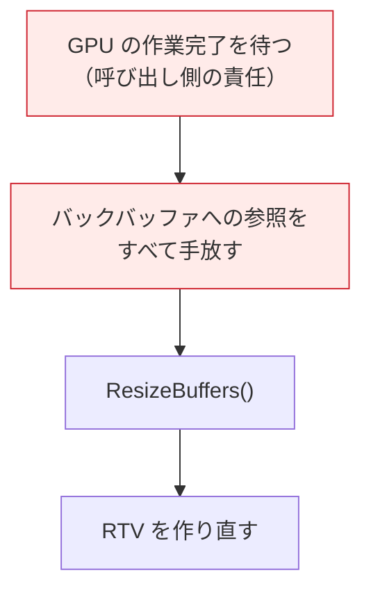

# 04. 画面に出す仕組み

デバイスができたので、次は「描いた絵を画面に映す」仕組みを作ります。
対応するコードは [`src/Graphics/SwapChain.h`](../../src/Graphics/SwapChain.h) /
[`.cpp`](../../src/Graphics/SwapChain.cpp) です。

---

## 1. スワップチェーン — 表と裏を入れ替える


**なぜ 2 枚必要なのか**

1 枚しかないと「今まさに表示中の絵に、上書きしながら描く」ことになります。
描きかけの状態がそのまま画面に出るため、
画面の上半分は新しい絵・下半分は古い絵、といった裂け目（ティアリング）や
ちらつきが発生します。

裏で完成させてから一気に入れ替えれば、常に完成品だけが見えます。
Unity では意識しませんでしたが、エンジンが同じことをやっていました。

---

## 2. 生成時の注目点

```cpp
DXGI_SWAP_CHAIN_DESC1 swapChainDesc = {};
swapChainDesc.Width       = width;
swapChainDesc.Height      = height;
swapChainDesc.Format      = DXGI_FORMAT_R8G8B8A8_UNORM;
swapChainDesc.SampleDesc.Count = 1;                          // MSAA なし
swapChainDesc.BufferUsage = DXGI_USAGE_RENDER_TARGET_OUTPUT;
swapChainDesc.BufferCount = 2;                               // ダブルバッファ
swapChainDesc.SwapEffect  = DXGI_SWAP_EFFECT_FLIP_DISCARD;
```

### ★ 第 1 引数がデバイスではなく「コマンドキュー」

```cpp
factory->CreateSwapChainForHwnd(
    commandQueue,   // ← DirectX 11 まではデバイスを渡していた
    hwnd, &swapChainDesc, nullptr, nullptr, &swapChain1);
```

**この一点に DirectX 12 の思想がよく表れています。**

DXGI は「どのキューの処理が終わったら表示してよいか」を知る必要があります。
DirectX 11 まではドライバが暗黙に管理していましたが、
DirectX 12 では明示的にキューを渡します。

### `FLIP_DISCARD` について

| 方式 | 説明 |
|------|------|
| `FLIP_DISCARD` | ポインタを差し替える。コピー不要で高速。**DX12 の推奨**（本実装） |
| `FLIP_SEQUENTIAL` | 同上だが内容を保持する（部分更新向け） |
| `DISCARD` / `SEQUENTIAL` | DX11 以前の古い方式。**DX12 では使用不可** |

`DISCARD` は「表示後に古い内容を保持しない」＝
毎フレーム画面全体を描き直す前提、という意味です。

> `SampleDesc.Count` は必ず 1 にします。
> FLIP 系では MSAA 付きバックバッファを直接作れない決まりだからです。
> 出典: [DXGI フリップモデル | Microsoft Learn](https://learn.microsoft.com/windows/win32/direct3ddxgi/dxgi-flip-model)

### Alt + Enter を無効にする

```cpp
factory->MakeWindowAssociation(hwnd, DXGI_MWA_NO_ALT_ENTER);
```

DXGI は既定で Alt+Enter を横取りして勝手にフルスクリーンにします。
その際スワップチェーンが作り直されるため、対応していないと壊れます。
学習中は無効にしておくのが安全です。

---

## 3. ディスクリプタ — DirectX 12 の要

ここが DirectX 12 で最初の山場です。

**GPU に「このメモリを描画先として使え」と伝えるとき、
C++ のポインタを直接渡すことはできません。**
GPU が理解できる形式の「リソースの説明書」を作って渡します。

| 用語 | 意味 |
|------|------|
| **ディスクリプタ** | リソース 1 個ぶんの説明書。どのアドレスに・どんな形式で・どういう用途で使うか |
| **ディスクリプタヒープ** | 説明書を並べて置く**配列** |
| **RTV** (Render Target View) | 「このリソースを描画先として見る」ためのディスクリプタ |


### N 番目の位置の求め方

```cpp
D3D12_CPU_DESCRIPTOR_HANDLE handle = heap->GetCPUDescriptorHandleForHeapStart();
handle.ptr += descriptorSize * N;
```

配列の添字計算と同じです。ただし **`descriptorSize` をハードコードしてはいけません**。

```cpp
m_rtvDescriptorSize = device->GetDescriptorHandleIncrementSize(
    D3D12_DESCRIPTOR_HEAP_TYPE_RTV);
```

1 個のバイト数は GPU の世代・ベンダーによって異なります（32 だったり 64 だったり）。
実行時に取得しないと、別の GPU で壊れます。

### CPU ハンドルと GPU ハンドル

同じディスクリプタを指していても、**値はまったく別物**です。

| | 用途 |
|--|------|
| `D3D12_CPU_DESCRIPTOR_HANDLE` | CPU が説明書を**書き込む**ための住所 |
| `D3D12_GPU_DESCRIPTOR_HANDLE` | GPU が説明書を**読む**ための住所 |

RTV の設定は CPU 側で行うので、この章では CPU ハンドルだけ使います。
（GPU ハンドルは [09 章](09_テクスチャを貼る.md) で登場します）

### ヒープの種類は混ぜられない

ディスクリプタヒープは**種類ごとに分ける決まり**です。
RTV 用ヒープに DSV や CBV を混ぜて置くことはできません。

| 種類 | 用途 | この後どこで使うか |
|------|------|------------------|
| RTV | 描画先 | この章 |
| DSV | 深度バッファ | [08 章](08_奥行きを正しくする.md) |
| CBV / SRV / UAV | シェーダーが読むもの | [09 章](09_テクスチャを貼る.md) |

---

## 4. バックバッファと RTV を結び付ける

```cpp
D3D12_CPU_DESCRIPTOR_HANDLE rtvHandle = m_rtvHeap->GetCPUDescriptorHandleForHeapStart();

for (uint32_t i = 0; i < kBackBufferCount; ++i)
{
    // スワップチェーンが確保したバッファを「借りる」
    DX_CHECK(m_swapChain->GetBuffer(i, IID_PPV_ARGS(&m_backBuffers[i])));

    // 説明書をヒープの i 番目に書き込む
    device->CreateRenderTargetView(m_backBuffers[i].Get(), nullptr, rtvHandle);

    rtvHandle.ptr += m_rtvDescriptorSize;
}
```

バックバッファは自分で作るのではなく、
**スワップチェーンが確保したものを借りる**点に注意してください。

---

## 5. 表示とバッファ番号

```cpp
void SwapChain::Present(bool enableVSync)
{
    const UINT syncInterval = enableVSync ? 1 : 0;
    DX_CHECK(m_swapChain->Present(syncInterval, 0));

    // 次に描くバッファ番号を DXGI に問い合わせる
    m_currentBackBufferIndex = m_swapChain->GetCurrentBackBufferIndex();
}
```

### `syncInterval` の意味

| 値 | 動作 |
|----|------|
| 1 | モニタのリフレッシュに同期する（垂直同期あり） |
| 0 | 待たない。fps は上がるがティアリングが起きうる |

### ★ 番号は自分で計算しない

```cpp
// 悪い例
m_currentBackBufferIndex = (m_currentBackBufferIndex + 1) % 2;

// 正しい
m_currentBackBufferIndex = m_swapChain->GetCurrentBackBufferIndex();
```

大抵は同じ結果になりますが、DXGI 側の都合で番号の進み方が変わる場合があります。
必ず問い合わせてください。

---

## 6. リサイズへの対応

ウィンドウサイズが変わったらバッファを作り直します。
**手順を守らないと必ず失敗します。**



```cpp
for (auto& backBuffer : m_backBuffers)
{
    backBuffer.Reset();   // 参照カウントを減らす
}

DX_CHECK(m_swapChain->ResizeBuffers(kBackBufferCount, width, height, kBackBufferFormat, 0));
CreateRenderTargetViews(device);
```

参照が 1 つでも残っていると `ResizeBuffers` は
`DXGI_ERROR_INVALID_CALL` で失敗します。

---

## 7. この章のまとめ

- スワップチェーンは「表示中の絵」と「裏で描く絵」を入れ替える仕組み
- 生成時に渡すのは**デバイスではなくコマンドキュー**
- `FLIP_DISCARD` を使う（DX11 以前の方式は使えない）
- **ディスクリプタ**はリソースの説明書、**ヒープ**はその配列
- ディスクリプタのサイズは実行時に取得する。ハードコード禁止
- CPU ハンドルと GPU ハンドルは別物
- バッファ番号は `GetCurrentBackBufferIndex()` に問い合わせる
- リサイズ時は「GPU を待つ → 参照を手放す → 作り直す」

次は GPU に命令を送る仕組みです。

---

## この章で参照した資料

- [DXGI フリップモデル | Microsoft Learn](https://learn.microsoft.com/windows/win32/direct3ddxgi/dxgi-flip-model)
- [IDXGIFactory2::CreateSwapChainForHwnd | Microsoft Learn](https://learn.microsoft.com/windows/win32/api/dxgi1_2/nf-dxgi1_2-idxgifactory2-createswapchainforhwnd)
- [DXGI_SWAP_CHAIN_DESC1 構造体 | Microsoft Learn](https://learn.microsoft.com/windows/win32/api/dxgi1_2/ns-dxgi1_2-dxgi_swap_chain_desc1)
- [リソースバインディング（ディスクリプタ） | Microsoft Learn](https://learn.microsoft.com/windows/win32/direct3d12/resource-binding)
- [ディスクリプタヒープ | Microsoft Learn](https://learn.microsoft.com/windows/win32/direct3d12/descriptor-heaps)

図はすべて本リポジトリで作成したものです（[../assets/](../assets/)）。
