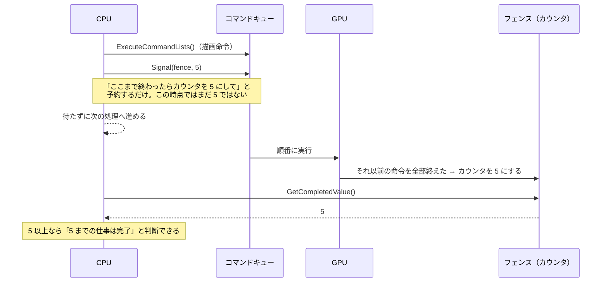
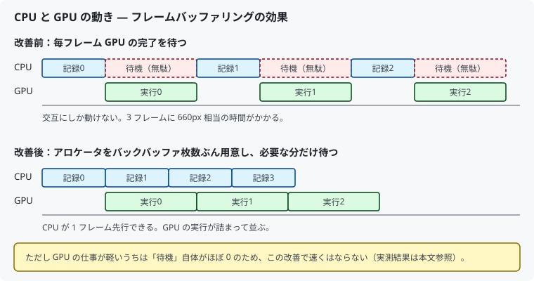

# 05. GPU への命令と同期

DirectX 12 でいちばん重要な考え方が出てきます。
対応するコードは [`src/Graphics/CommandQueue.h`](../../src/Graphics/CommandQueue.h) /
[`.cpp`](../../src/Graphics/CommandQueue.cpp) です。

---

## 1. GPU には「直接」命令できない

Unity で `Graphics.DrawMesh()` を呼ぶと、その場で描かれる感覚がありました。
DirectX 12 では違います。**3 段階を踏みます。**


```cpp
commandList->Reset(allocator, nullptr);         // 記録開始
  commandList->ClearRenderTargetView(...);      // ← まだ何も起きない
  commandList->DrawInstanced(...);              // ← まだ何も起きない
commandList->Close();                           // 記録終了

commandQueue->ExecuteCommandLists(1, lists);    // ← ここで GPU が動き始める
                                                //    ただし完了は待たない
```

**`DrawInstanced` を呼んだ時点で GPU は 1 ミリも動いていません。**
「あとで GPU にやらせること」をメモしているだけです。

`ExecuteCommandLists` も**即座に戻ります**。
CPU は GPU の完了を待たず、次のフレームの準備を進められます。
これが DirectX 12 が速い理由です。

---

## 2. ペンとノート — コマンドリストとアロケータ

登場人物が 2 つあって紛らわしいので、たとえで整理します。

| オブジェクト | たとえ | 役割 |
|------------|--------|------|
| コマンドリスト | **ペン** | 命令を書き込む道具 |
| コマンドアロケータ | **ノート** | 書き込まれた命令が実際に載るメモリ |

```cpp
device->CreateCommandAllocator(D3D12_COMMAND_LIST_TYPE_DIRECT, IID_PPV_ARGS(&allocator));
device->CreateCommandList(0, D3D12_COMMAND_LIST_TYPE_DIRECT,
                          allocator.Get(), nullptr, IID_PPV_ARGS(&commandList));
commandList->Close();   // ← 生成直後は「開いた」状態なので、いったん閉じる
```

> `CreateCommandList` で作った直後のリストは**記録中の状態**です。
> `Render()` の先頭で毎回 `Reset()` を呼ぶので、
> 生成時に一度 `Close()` して状態を揃えておきます。忘れると 1 フレーム目で落ちます。

### いちばん重要な制約

> **アロケータの `Reset()` は、そのノートに書かれた命令を
> GPU が実行し終えた後でなければ呼べません。**

実行中のノートを消しゴムで消すようなもので、GPU がクラッシュします。

**この制約こそが、次に出てくるフェンスが必要な理由です。**

---

## 3. フェンス — GPU の「番号札」

CPU と GPU は別々に動いています。
「GPU がどこまで終わったか」を知る手段が必要です。

**フェンスは、CPU と GPU が共有する 64bit のカウンタ**です。実体はそれだけです。



**番号札**だと思ってください。
GPU の仕事に番号を振り、「何番まで終わった？」と聞けるようにする仕組みです。

```cpp
uint64_t CommandQueue::Signal()
{
    const uint64_t fenceValue = ++m_nextFenceValue;
    DX_CHECK(m_commandQueue->Signal(m_fence.Get(), fenceValue));
    return fenceValue;
}
```

### 待ち方は 2 通り

```cpp
// (a) ビジーループ — CPU を 100% 使い切る。やってはいけない
while (fence->GetCompletedValue() < value) {}

// (b) イベントで待つ — OS にスレッドを寝かせてもらう（本実装）
fence->SetEventOnCompletion(value, hEvent);
::WaitForSingleObject(hEvent, INFINITE);
```

イベントで待てば、待っている間 CPU を他の処理に譲れます。

```cpp
void CommandQueue::WaitForFenceValue(uint64_t fenceValue)
{
    // すでに追い越していれば待つ必要はない（この早期リターンが性能上とても重要）
    if (m_fence->GetCompletedValue() >= fenceValue) { return; }

    DX_CHECK(m_fence->SetEventOnCompletion(fenceValue, m_fenceEvent));
    ::WaitForSingleObject(m_fenceEvent, INFINITE);
}
```

---

## 4. 素朴な方法とその問題

いちばん簡単なのは「毎フレーム、GPU が全部終わるまで待つ」です。
確実に動きます。しかし――



上段のように **CPU と GPU が交互にしか動きません**。
せっかく非同期にできる API なのに、その利点を捨てています。

### 解決：フレームバッファリング

**ノート（アロケータ）をバックバッファの枚数ぶん用意します。**

```cpp
std::array<ComPtr<ID3D12CommandAllocator>, SwapChain::kBackBufferCount> m_commandAllocators;
std::array<uint64_t, SwapChain::kBackBufferCount> m_frameFenceValues = {};
```

```cpp
// フレーム先頭：これから使うノートが空くのを待つ（全部ではない）
const uint32_t frameIndex = m_swapChain.CurrentBackBufferIndex();
m_commandQueue.WaitForFenceValue(m_frameFenceValues[frameIndex]);

// ... 記録・実行・Present ...

// フレーム末尾：完了印を「予約」するだけで待たない
m_frameFenceValues[frameIndex] = m_commandQueue.Signal();
```

GPU がノート 0 を実行している間に、CPU はノート 1 へ書き込めます。

> **`frameIndex` は `Present()` の前に取得してください。**
> `Present()` を呼ぶとバックバッファ番号が変わるため、
> 後で取ると「使ったのとは別の欄」にフェンス値を書いてしまいます。

---

## 5. 実測してみた結果

**この段階では速くなりませんでした。**

| 実装 | 平均フレーム時間 | FPS |
|------|----------------|-----|
| 毎フレーム全体待ち | 約 0.26〜0.29 ms | 約 3,500〜4,000 |
| フレームバッファリング | 約 0.27〜0.34 ms | 約 3,000〜3,700 |

（測定環境: RTX 4070 Ti / x64 Debug / VSync オフ。
[参考文献](../misc/参考文献.md#測定環境) 参照）

理由は単純で、**描いているのが三角形数枚だけなので GPU の仕事が軽すぎる**からです。
待ち時間がそもそも存在しないので、待たなくしても速くなりません。
むしろフェンス値の記録・比較のぶん、わずかに不利になります。

### では、なぜ今やるのか

1. **後から入れ替えるのが難しい構造だから**
   アロケータの数とフェンスの持ち方は描画ループの土台です。
   モデルやテクスチャを増やしてから直すより、今のうちに正しい形にしておくほうが安全です。

2. **「効果が出ない実験」も学習の成果だから**
   最適化は「効くはずだ」ではなく「測って確かめる」ものです。
   このプロジェクトでは、この計測結果もそのまま資料に残しています。

---

## 6. この章のまとめ

- GPU への命令は「記録 → 投入 → 実行」の 3 段階。呼んだ時点では動かない
- コマンドリストが「ペン」、アロケータが「ノート」
- **アロケータの `Reset` は GPU の実行完了後でなければならない**
- フェンスは CPU と GPU が共有する番号札
- 待つときはビジーループではなくイベントで待つ
- アロケータをバックバッファ枚数ぶん用意すると CPU が先行できる
- ただし今の負荷では速くならない。**最適化は測ってから判断する**

次はいよいよ三角形を描きます。

---

## この章で参照した資料

- [ユーザーモードヒープの同期（フェンス） | Microsoft Learn](https://learn.microsoft.com/windows/win32/direct3d12/user-mode-heap-synchronization)
- [ID3D12Fence インターフェイス | Microsoft Learn](https://learn.microsoft.com/windows/win32/api/d3d12/nn-d3d12-id3d12fence)
- [コマンドキューとコマンドリスト | Microsoft Learn](https://learn.microsoft.com/windows/win32/direct3d12/recording-command-lists-and-bundles)
- [ID3D12CommandAllocator::Reset | Microsoft Learn](https://learn.microsoft.com/windows/win32/api/d3d12/nf-d3d12-id3d12commandallocator-reset) — Reset の前提条件
- [DirectX-Graphics-Samples](https://github.com/microsoft/DirectX-Graphics-Samples) — フレームバッファリングの構成の参考

計測値は本リポジトリで測定したものです。図はすべて本リポジトリで作成しています。
