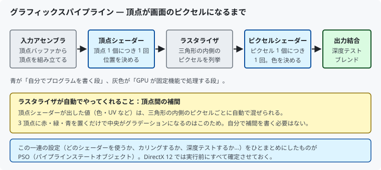
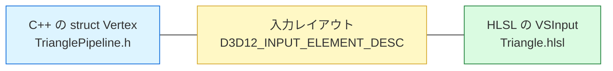

# 06. 三角形を描く

準備が整ったので、実際に絵を出します。
対応するコードは [`src/Graphics/TrianglePipeline.h`](../../src/Graphics/TrianglePipeline.h) /
[`.cpp`](../../src/Graphics/TrianglePipeline.cpp)、
シェーダーは [`shaders/Triangle.hlsl`](../../shaders/Triangle.hlsl) です。

---

## 1. GPU の中で起きること



Unity で「シェーダー」と言われていたものは、
この図の**青い 2 つの段**に自分でプログラムを書くことを指しています。

灰色の段（ラスタライザなど）は GPU が固定機能で処理するので、
プログラムは書けませんが、**設定は変えられます**（カリングの有無など）。

---

## 2. NDC — 座標の決まりごと

シェーダーが最終的に出力する座標系です。


**画面の解像度に関係なく、常に -1〜+1 です。**
1280×720 でも 3840×2160 でも同じ座標で書けます。

この章ではまだ座標変換をしないので、頂点にこの範囲の値を直接書きます。

---

## 3. 頂点データ

```cpp
struct Vertex
{
    float position[3];   // x, y, z
    float color[4];      // r, g, b, a
};

constexpr Vertex kTriangleVertices[] = {
    { {  0.0f,  0.5f, 0.0f }, { 1.0f, 0.0f, 0.0f, 1.0f } },   // 上　: 赤
    { {  0.5f, -0.5f, 0.0f }, { 0.0f, 1.0f, 0.0f, 1.0f } },   // 右下: 緑
    { { -0.5f, -0.5f, 0.0f }, { 0.0f, 0.0f, 1.0f, 1.0f } },   // 左下: 青
};
```

### ★ 頂点を並べる順番が重要

DirectX の既定では **時計回りに見える面が「表」** です。
「上 → 右下 → 左下」は画面上で時計回りなので、表向きになります。

逆順にすると裏面と判定され、**背面カリングで消えます**。
「三角形が出ない」ときの定番の原因です。

> 切り分け方法: ラスタライザ設定を一時的に
> `D3D12_CULL_MODE_NONE` にして表示されるなら、原因は並び順です。

---

## 4. 3 か所を一致させる

DirectX 12 で最も嵌まるポイントです。



```cpp
// メモリ配置
//   オフセット  0 〜 11 : position[3]  (float 3 個 = 12 バイト)
//   オフセット 12 〜 27 : color[4]     (float 4 個 = 16 バイト)

const D3D12_INPUT_ELEMENT_DESC inputElements[] = {
    { "POSITION", 0, DXGI_FORMAT_R32G32B32_FLOAT,    0,  0, ... },
    { "COLOR",    0, DXGI_FORMAT_R32G32B32A32_FLOAT, 0, 12, ... },
};
```

```hlsl
struct VSInput
{
    float3 position : POSITION;   // ← R32G32B32 と対応
    float4 color    : COLOR;      // ← R32G32B32A32 と対応
};
```

**`"POSITION"` や `"COLOR"` は「セマンティクス」と呼ばれる目印**で、
C++ とシェーダーをつなぐ接着剤です。

3 か所のどれかがずれると、頂点が明後日の方向に飛んだり色が壊れたりします。
**しかもコンパイルエラーにはなりません。**

---

## 5. シェーダーを読む

```hlsl
VSOutput VSMain(VSInput input)
{
    VSOutput output;
    output.position = float4(input.position, 1.0f);
    output.color    = input.color;
    return output;
}

float4 PSMain(VSOutput input) : SV_TARGET
{
    return input.color;
}
```

### `SV_` の意味

`SV_POSITION` の `SV_` は **System Value**（システム値）の略で、
GPU が特別扱いする値であることを示します。

| セマンティクス | 意味 |
|--------------|------|
| `SV_POSITION` | ラスタライズに使う座標。頂点シェーダーの出力に**必須**、`float4` 必須 |
| `SV_TARGET` | レンダーターゲットへ書き込む色 |

### なぜ `w = 1.0` を足すのか

3D では座標を 4 成分 `(x, y, z, w)` の**同次座標**で扱います。

- `w` があることで、**平行移動も行列の掛け算だけで表せる**
  （3×3 行列では回転と拡大縮小しか表せません）
- `w` は透視投影で使う割り算の分母でもある

GPU はラスタライズ前に `x, y, z` を `w` で割ります（透視除算）。
今回は透視投影しないので `w = 1.0` のままです。

### 色の補間は自動

3 頂点に赤・緑・青を置くだけで中央がグラデーションになるのは、
**ラスタライザが頂点間を自動で線形補間する**からです。
自分で補間のコードを書く必要はありません。

---

## 6. ルートシグネチャ — シェーダーの引数リスト

シェーダーが外部から受け取るものの一覧表です。**関数の引数リスト**に相当します。

この章の三角形は外部入力が一切ないので「空のルートシグネチャ」になりますが、
**省略はできません**。必ず作ります。

```cpp
D3D12_ROOT_SIGNATURE_DESC rootSignatureDesc = {};
rootSignatureDesc.NumParameters = 0;
rootSignatureDesc.Flags = D3D12_ROOT_SIGNATURE_FLAG_ALLOW_INPUT_ASSEMBLER_INPUT_LAYOUT;
```

> `ALLOW_INPUT_ASSEMBLER_INPUT_LAYOUT` は
> 「頂点バッファから入力レイアウト経由で頂点を読む」ことを許可するフラグです。
> 付け忘れると PSO の生成でエラーになります。

---

## 7. PSO — 描画設定の全部入りパック

**DirectX 12 の大きな設計思想が現れる部分です。**

PSO（Pipeline State Object）は、描画に関わる設定を 1 つに固めたものです。

- どのシェーダーを使うか
- 頂点データのメモリ配置（入力レイアウト）
- 裏面を描くか（ラスタライザ設定）
- 色をどう合成するか（ブレンド設定）
- 深度テストをするか
- 出力先の形式

### なぜ 1 つに固めるのか

DirectX 11 では設定を 1 つずつ変えていました。
GPU は組み合わせが確定するまで最適な機械語を生成できず、
**描画命令の直前に慌てて変換**していました。これが実行中のカクつきの原因でした。

DirectX 12 では組み合わせを事前に確定させるので、
GPU 用コードの生成を**読み込み時**に済ませられます。
実行時は PSO を差し替えるだけです。

### 嵌まりやすい設定

```cpp
psoDesc.SampleMask = UINT_MAX;   // ← 0 のままだと何も描画されない
```

構造体をゼロ初期化したまま設定を忘れると `SampleMask = 0` になり、
全ピクセルが破棄されます。有名な落とし穴です。

---

## 8. 頂点バッファを GPU に置く

```cpp
D3D12_HEAP_PROPERTIES heapProperties = {};
heapProperties.Type = D3D12_HEAP_TYPE_UPLOAD;   // CPU から書けるメモリ
```

### ヒープの種類

| 種類 | CPU から書ける | GPU アクセス | 用途 |
|------|--------------|------------|------|
| `DEFAULT` | ✗ | 最速 | 変化しないデータ（本来はこちら） |
| `UPLOAD` | ○ | やや遅い | 毎フレーム更新するデータ |
| `READBACK` | ○（読み） | — | GPU の結果を CPU へ戻す |

**動かない三角形の頂点は `DEFAULT` に置くのが定石です。**
本プロジェクトも現在は `DEFAULT` ヒープに置いています。

```cpp
m_vertexBuffer = upload::CreateBufferWithData(
    device, commandQueue, kTriangleVertices, vertexBufferSize,
    D3D12_RESOURCE_STATE_VERTEX_AND_CONSTANT_BUFFER);
```

ただし `DEFAULT` に置くには
「UPLOAD バッファを作る → コピー命令を記録 → 実行 → 完了を待つ」
という手順が必要です。この転送の仕組みは
[09 章](09_テクスチャを貼る.md#2-ステージング転送--directx-12-最頻出のパターン)
で詳しく説明します。

> 学習の順序としては、まず `UPLOAD` に直接置いて動かし、
> テクスチャで転送を学んでから `DEFAULT` へ移しました。
> 「まず動かす → 仕組みを理解する → 正しい形に直す」という進め方です。

---

## 9. 描画命令を記録する

```cpp
commandList->SetPipelineState(m_pipelineState.Get());
commandList->SetGraphicsRootSignature(m_rootSignature.Get());
commandList->IASetPrimitiveTopology(D3D_PRIMITIVE_TOPOLOGY_TRIANGLELIST);
commandList->IASetVertexBuffers(0, 1, &m_vertexBufferView);
commandList->DrawInstanced(3, 1, 0, 0);
```

### `DrawInstanced` という名前について

DirectX 12 に「非インスタンス版の Draw」は存在しません。
インスタンス数 1 なら普通の描画です。
インスタンス描画が特別なものではなくなった、という位置づけです。

### ★ 毎フレーム設定し直す必要がある

コマンドリストは `Reset` するたびに**設定が全て初期状態に戻ります**。
「初期化時に一度設定すれば OK」ではありません。

- ビューポート / シザー矩形
- レンダーターゲット
- PSO / ルートシグネチャ
- 頂点バッファ / プリミティブトポロジ

### ビューポートとシザー矩形は両方必須

似ていますが役割が違います。

| | 役割 |
|--|------|
| ビューポート | 座標**変換**（NDC → ピクセル座標） |
| シザー矩形 | **切り抜き**（この矩形の外を捨てる） |

**シザー矩形を設定し忘れると（全て 0 のままだと）1 ピクセルも描画されません。**
「画面が真っ黒」の定番の原因です。

---

## 10. この章のまとめ

- GPU の処理は「入力アセンブラ → 頂点シェーダー → ラスタライザ → ピクセルシェーダー → 出力結合」
- NDC は解像度に依存しない -1〜+1 の座標系
- 頂点の並び順が逆だと背面カリングで消える
- **C++ の struct・入力レイアウト・HLSL の 3 か所を一致させる**（エラーにならない罠）
- 色の補間はラスタライザが自動でやる
- ルートシグネチャは空でも必ず作る
- PSO は設定を事前に固めることで実行時のカクつきを無くす仕組み
- 頂点は本来 `DEFAULT` ヒープ。今は簡単のため `UPLOAD`
- **ビューポートとシザー矩形は両方必須**

次は、この三角形を動かします。

---

## この章で参照した資料

- [グラフィックスパイプライン | Microsoft Learn](https://learn.microsoft.com/windows/win32/direct3d11/overviews-direct3d-11-graphics-pipeline)
- [パイプラインステートオブジェクト | Microsoft Learn](https://learn.microsoft.com/windows/win32/direct3d12/managing-graphics-pipeline-state-in-direct3d-12)
- [ルートシグネチャ | Microsoft Learn](https://learn.microsoft.com/windows/win32/direct3d12/root-signatures)
- [D3D12_GRAPHICS_PIPELINE_STATE_DESC | Microsoft Learn](https://learn.microsoft.com/windows/win32/api/d3d12/ns-d3d12-d3d12_graphics_pipeline_state_desc)
- [セマンティクス | Microsoft Learn](https://learn.microsoft.com/windows/win32/direct3dhlsl/dx-graphics-hlsl-semantics)
- [メモリ管理（ヒープの種類） | Microsoft Learn](https://learn.microsoft.com/windows/win32/direct3d12/memory-management)
- [D3D12HelloTriangle（公式サンプル）](https://github.com/microsoft/DirectX-Graphics-Samples/tree/master/Samples/Desktop/D3D12HelloTriangle)
- [A trip through the Graphics Pipeline 2011](https://fgiesen.wordpress.com/2011/07/09/a-trip-through-the-graphics-pipeline-2011-index/) — パイプライン内部の挙動

図はすべて本リポジトリで作成したものです（[../assets/](../assets/)）。
