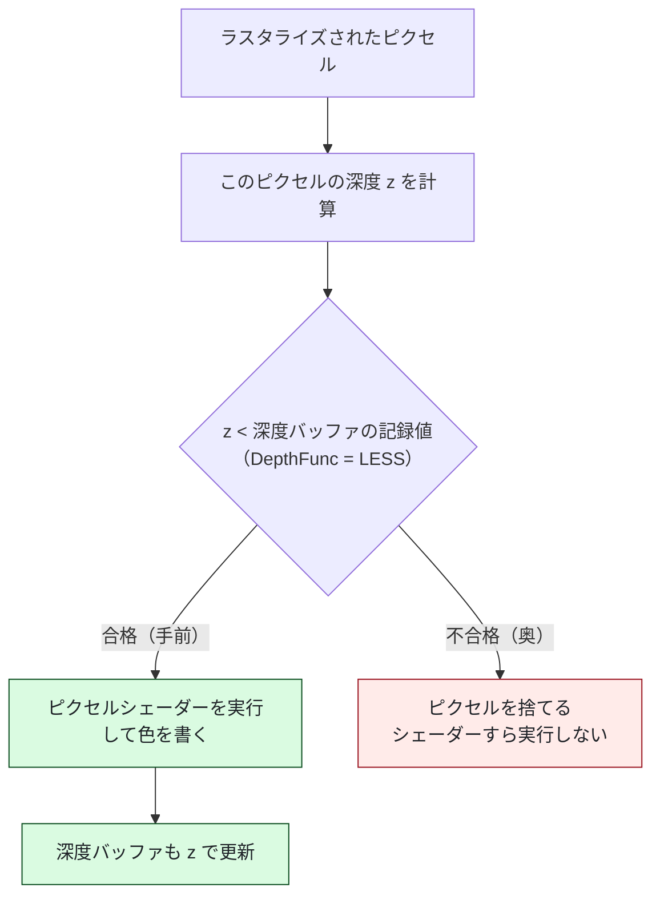

# 08. 奥行きを正しくする：深度バッファ

物体が複数あるとき、前後関係を正しく見せる仕組みです。
対応するコードは [`src/Graphics/DepthBuffer.h`](../../src/Graphics/DepthBuffer.h) /
[`.cpp`](../../src/Graphics/DepthBuffer.cpp) です。

---

## 1. 何が問題なのか

深度バッファが無いと、**あとから描いたものが必ず手前に見えます**。


右の「深度テストなし」では、いちばん奥にあるはずの赤が
最後に描かれたせいで手前の青・緑を上書きしています。

3D の世界では「奥にある壁」を後から描いただけで
手前のキャラクターが消えてしまい、破綻します。

Unity では気にしたことがなかったはずですが、
エンジンが深度バッファを用意してくれていました。

---

## 2. 深度バッファとは

**画面のピクセル 1 個につき「そこに描かれている物の奥行き」を記録した画像**です。

色を記録するレンダーターゲットと縦横のサイズが同じで、
中身が「色」ではなく「奥行き」になったもの、と考えると分かりやすいです。

GPU はピクセルを塗る直前に、次の判定（**深度テスト**）を自動で行います。



その結果、**描く順番に関係なく前後関係が正しくなります**。

---

## 3. 速度のためでもある

奥にあると分かったピクセルは、**ピクセルシェーダーを実行せずに捨てられます**
（Early-Z）。

手前の物体を先に描くほど無駄な処理が減るため、
実際のゲームでは「おおまかに手前から順に描く」最適化がよく行われます。

深度テストは「正しく見せる」だけでなく「速くする」機能でもあります。

---

## 4. 作り方

### フォーマットの選択

| 形式 | 内容 |
|------|------|
| `DXGI_FORMAT_D32_FLOAT` | 32bit 浮動小数点。精度が高い（**本実装**） |
| `DXGI_FORMAT_D24_UNORM_S8_UINT` | 24bit 深度 ＋ 8bit ステンシル |
| `DXGI_FORMAT_D16_UNORM` | 16bit。精度は低いが省メモリ |

ステンシル（型抜きなどに使う付加情報）は使わないので、深度だけの形式にしています。

### DEFAULT ヒープに置く

深度バッファは CPU から読み書きしません。GPU が書いて GPU が読むだけです。
そのため GPU 専用の最速メモリに置きます。

```cpp
D3D12_RESOURCE_DESC textureDesc = {};
textureDesc.Dimension = D3D12_RESOURCE_DIMENSION_TEXTURE2D;
textureDesc.Format    = DXGI_FORMAT_D32_FLOAT;
textureDesc.Flags     = D3D12_RESOURCE_FLAG_ALLOW_DEPTH_STENCIL;   // ★ 必須
```

> `ALLOW_DEPTH_STENCIL` を忘れると
> 「深度バッファとしては使えないリソース」になり、DSV の作成で失敗します。

### 最適化されたクリア値

```cpp
D3D12_CLEAR_VALUE clearValue = {};
clearValue.Format             = DXGI_FORMAT_D32_FLOAT;
clearValue.DepthStencil.Depth = 1.0f;
```

「このリソースはほぼ必ずこの値でクリアされます」と事前に宣言すると、
GPU がその値に特化した高速なクリアを使えます。

**宣言した値と、実際に `ClearDepthStencilView` へ渡す値が食い違うと**
デバッグレイヤーが警告を出し、最適化も効きません。

### DSV 用ヒープは別に作る

ディスクリプタヒープは種類ごとに分ける決まりなので、
RTV 用ヒープには置けません。

```cpp
D3D12_DESCRIPTOR_HEAP_DESC dsvHeapDesc = {};
dsvHeapDesc.Type           = D3D12_DESCRIPTOR_HEAP_TYPE_DSV;
dsvHeapDesc.NumDescriptors = 1;
```

---

## 5. PSO の設定

```cpp
depthStencilDesc.DepthEnable    = TRUE;
depthStencilDesc.DepthWriteMask = D3D12_DEPTH_WRITE_MASK_ALL;
depthStencilDesc.DepthFunc      = D3D12_COMPARISON_FUNC_LESS;

psoDesc.DSVFormat = DepthBuffer::kFormat;   // ← 実際の形式と一致必須
```

### `DepthFunc = LESS` の意味

深度は **手前が 0.0、奥が 1.0** です。
したがって「値が小さい方が手前」＝ `LESS` で手前が勝つ、という関係になります。

| 値 | 意味 |
|----|------|
| `LESS` | 新しい方が小さい（手前）なら合格。最も一般的 |
| `LESS_EQUAL` | 同じ深度も合格。同じ位置に重ね描きするとき |
| `ALWAYS` | 常に合格。実質的に深度テスト無効 |

### `DepthWriteMask` を `ZERO` にする場面

「奥行きは見るが記録しない」動作になります。
**半透明物体で使います。**
半透明は後ろが透けて見えるため、深度を書き込むと
後から描く物体が消えてしまうからです。

---

## 6. 毎フレームのクリアを忘れない

**色のクリアと同じくらい重要です。**

```cpp
m_commandList->ClearDepthStencilView(
    dsvHandle, D3D12_CLEAR_FLAG_DEPTH, DepthBuffer::kClearDepth, 0, 0, nullptr);
```

忘れると前フレームの深度が残り、2 フレーム目以降で
「何も描かれない」「ちらつく」といった症状になります。

一番奥の値 (1.0) で埋めることで、
これから描くものが必ず「記録済みより手前」と判定されます。

---

## 7. なぜ深度バッファは 1 枚でよいのか

バックバッファは 2 枚、コマンドアロケータも 2 個、定数バッファも 2 面でした。
**深度バッファだけは 1 枚**です。

理由は、深度バッファが**フレームをまたいで内容を持ち越さない**からです。
毎フレーム先頭でクリアするので、前のフレームの内容は要りません。

コマンドキューは 1 本なので、フレーム N の深度書き込みが完了してから
フレーム N+1 のクリアが実行されます。競合は起きません。

## 8. バリアが要らない理由

深度バッファは常に `D3D12_RESOURCE_STATE_DEPTH_WRITE` のまま使い続けるので、
状態遷移が発生せず、リソースバリアが不要です。

バックバッファが毎フレーム `PRESENT ⇄ RENDER_TARGET` を往復するのとは対照的です。

> 深度を後からテクスチャとして読みたくなったときだけ、
> `DEPTH_READ` / `PIXEL_SHADER_RESOURCE` への遷移が必要になります。

---

## 9. 動作を確認する

本プロジェクトでは、頂点配列をわざと **「手前 → 奥」の順** に並べています。
GPU は配列順に描くので、**奥の三角形を最後に描く**ことになります。

深度テストが無ければ破綻する最悪の順序です。
それでも正しく見えることが、深度テストが効いている証拠になります。

**自分で確かめる方法:**
`MeshPipeline.cpp` の `depthStencilDesc.DepthEnable` を
一時的に `FALSE` にして実行してみてください。
上の図の右側のように、赤が手前の青・緑を上書きするようになります。

---

## 10. この章のまとめ

- 深度バッファが無いと「あとから描いたものが必ず手前」になる
- ピクセルごとに奥行きを記録し、塗る直前に比較する（深度テスト）
- 深度は**手前が 0.0、奥が 1.0**。だから `LESS` で手前が勝つ
- 奥のピクセルはシェーダーすら実行されない（Early-Z）＝ 速度にも効く
- `ALLOW_DEPTH_STENCIL` フラグと `DSVFormat` の一致が必須
- **毎フレームのクリアを忘れない**
- 深度バッファは 1 枚でよい。状態を変えないのでバリアも不要

次は、面に模様を貼ります。

---

## この章で参照した資料

- [深度ステンシルビュー | Microsoft Learn](https://learn.microsoft.com/windows/win32/direct3d12/depth-stencil-view--dsv-)
- [D3D12_DEPTH_STENCIL_DESC | Microsoft Learn](https://learn.microsoft.com/windows/win32/api/d3d12/ns-d3d12-d3d12_depth_stencil_desc)
- [D3D12_CLEAR_VALUE | Microsoft Learn](https://learn.microsoft.com/windows/win32/api/d3d12/ns-d3d12-d3d12_clear_value)
- [出力結合ステージ | Microsoft Learn](https://learn.microsoft.com/windows/win32/direct3d11/d3d10-graphics-programming-guide-output-merger-stage)
- Real-Time Rendering (4th Edition) — 深度テストと Early-Z の理論
- Frank D. Luna『Introduction to 3D Game Programming with DirectX 12』— 深度バッファの実装

図はすべて本リポジトリで作成したものです（[../assets/](../assets/)）。
